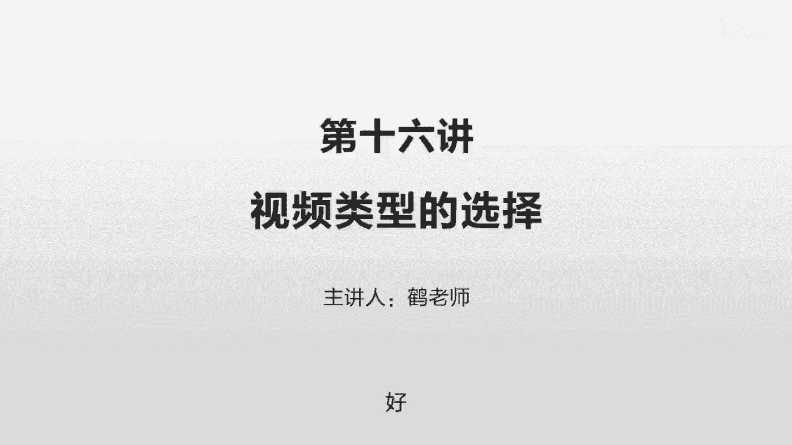
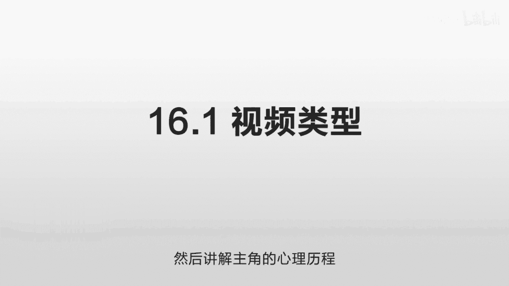
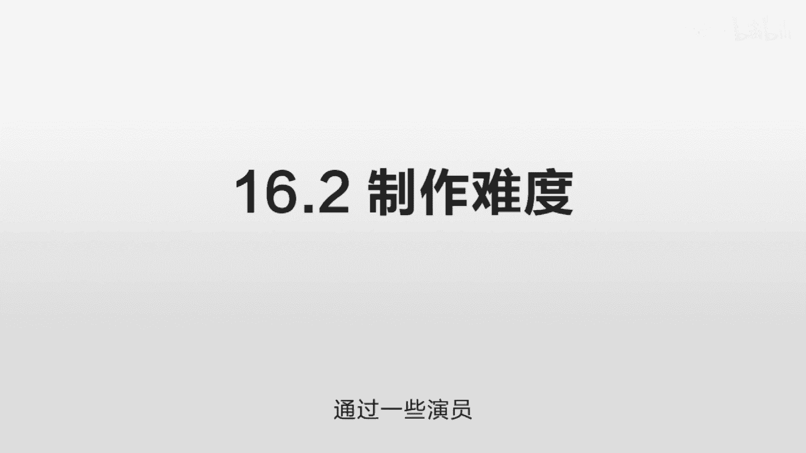
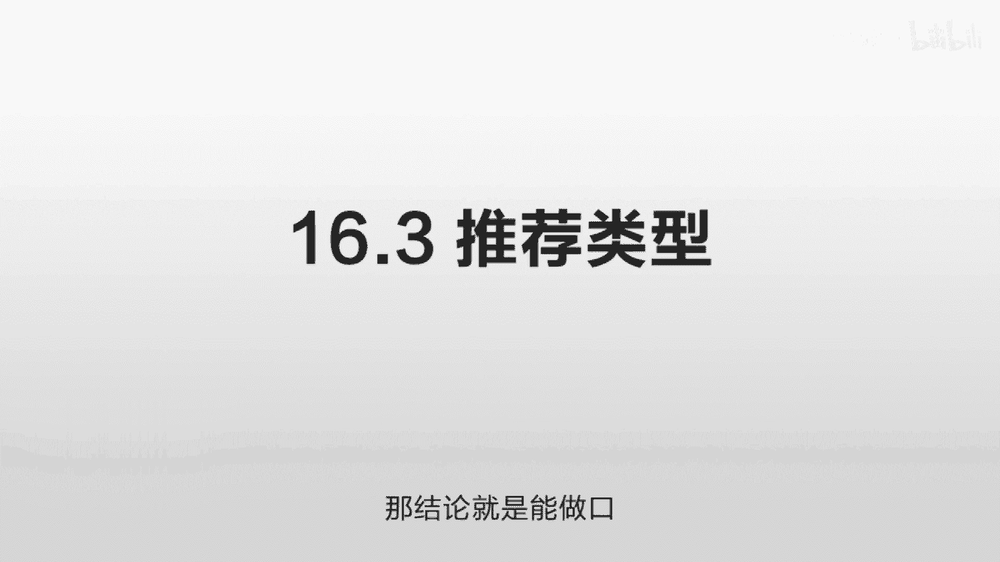
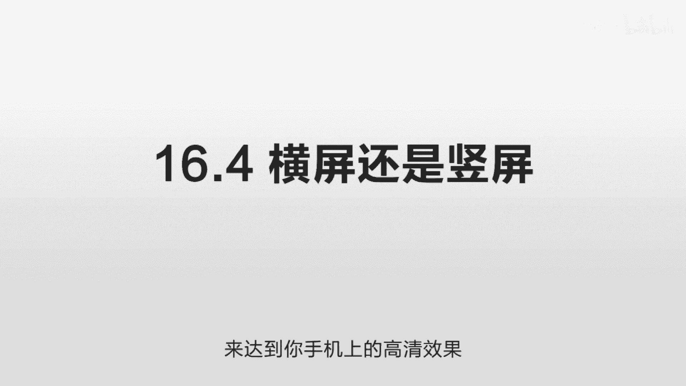

# 抖音运营从0~1全攻略【基础入门篇】B站最良心的最新2024抖音运营起号版全套教程（新媒体运营精华版） - P23：14-第16讲：视频类型的选择 - 人生不复制 - BV1yWHKeMEud

好这一节我们讲一下这个视频类型的选择，首先我们讲第一个就是视频的类型一共有哪些，第一种呢是图文配合，就是那几个图片，然后配上文字，然后它会有一些自动的音乐，然后你加上去。

它可能会根据你的自动的卡点来展示一些东西，或者说你拍一段特别简单的视频，然后里面放一些文字，它有一些电视台，它就采用这样的方式，他比如楼市有一个什么样大的新闻，然后他就简单的拍了一段那个楼房的东西。

然后呢把这个长长的那个新闻给放到上面去，让用户去读，然后配上一段很雄浑的音乐，大概就是这样的，这个制作成本很低的，等于是最初级的一类叫图文的配合，那么还有一类呢叫剪辑解说，就是他的声音是出镜的。

就整个的声音是由他来配的，他来讲解，但是画面是采用其他的素材来拼接而成的，一个非常经典的例子呢，就是毒舌电影，他会几分钟之内就给你讲清楚，一个电影它会分成三段，一段的话可能是两到3分钟。

那这样的话你花个七到8分钟的话，就可以把一个两到三个小时的一个电影看完，他会反复精简他的这个稿件，然后每一个可以独立成章，然后把这些电影的画面剪切在一起，那还有一些财经的号，他也采用这样的方式。

比如他讲这个GDP的这些增长的时候，他也会用一些图或者用一些动画，然后来配合给他讲某一个经济学的话题，讲到人口迁徙，讲到城市的变迁，讲到房屋的情况，讲到房价的情况，讲到GDP的变动。

有些财经号它也采用了这样的剪辑解说的方式，就是它本身来讲解这个经济学的话题，但是他不出镜，然后呢他用了很多一些素材和片段放在里面，拼接起来密密麻麻的，那这样的话。

这些快速闪动的这些画面可以吸引到人的眼球，一会切换一个画面，一会切换一个画面，比如他讲这个楼房的时候，他可能会有一个快的一个镜头的快进，然后人在那边快速的移动，然后这些光影的变化非常的快。

好像从早上到晚上啊，瞬间一天就过去了，这样的感觉，他讲这个火车站的时候呢，人流也是非常的大，就搞一个这样的画面放进去啊，他讲这个GDP的变动的时候，可能放一个动画，每个国家的GDP上下这种浮动。

或者说他讲到这个金融战争的时候啊，用了一些华尔街之狼里面的一些片段，或者用了一些索罗斯的这些演讲的片段，把这些东西全部都拼合起来，密密麻麻，这个叫剪辑解说，还有一个就是真人口播，你在抖音里面。

可以看到大量这种真人口播的类型，他坐在镜头前面，有的是正着对着镜头，有的是斜着对着镜头，有的好像是跟旁边的人在讲话，但有的好像是在一个采访的感觉，而共同的特点呢就是这个人在镜头面前独白啊，在抖音。

你可以看到有大量这样的真人口播的一些账号，在各个领域都会有，还有一个就是剧情系列，就包括一些情节剧啊，啊他拍了一个小短片，讲了一个什么样的小故事啊，或者拍了一个搞笑剧啊，夫妻之间啊。

还有一些像美食节目啊，像李子柒这样的呀，你看上去他是一个美食节目，实际它是一个剧情，他从最开始的这个播种到采摘，然后再到这个制作的过程，它实际上是一步一步的推进的，那还有很多这些做美食的也都是这样的。

但有些情感号他也采用这样的剧情，讲述了一个小故事，屏幕前的观众可以跟着这个主角的感受去走，然后讲解这个主角的心理历程。

类似这样的都是剧情系列，那么现在我们讲第二点就是他们的制作难度，这个图文的制作难度是最低的，几乎是个人你就可以上手嘛，也就放几个照片放进去吧，放一段音乐进去，你用那个剪映的话，它里面有无数的音乐可以选。

照片的话，你挑几张它还可以自动卡点，非常非常的傻瓜，非常非常的简单，剪辑解说呢看你要做什么样的程度的，你要是做一个相对简单一点的，就几个画面的切换，这个不难，它本质上就是一个升级版的一个图文。

但是你如果要做好的话，非常非常难，难到什么程度呢，我讲一下这个毒舌电影啊，这有一篇文章专门写过这个公司，你去打开他的账号，它就是一个讲电影的一个电影，用三段给他讲清楚，每一段独立成章，看上去非常的简单。

但实际上这是一个很庞大的正规军，他他的正职员工有大概170多人，他的实习生有200多人，其中专职做内容的员工有100多人，就这么庞大的一个体系来，支撑出来这么一个精品的内容，这种剪辑制作就是配音嘛。

把这个画面拼接在一起，它到底难在哪，为什么需要这么多的人，答案是在别人看不到的地方，注意不到的地方，使劲的下功夫，简单来说就是反复的捶打，持续输出一种标准，并且持续追求更高的标准，他们举了一个例子。

一条2分钟的视频，他光是文字的脚本需要打磨十几遍甚至几十遍，就这个话外音他是怎么去配的，怎么讲解这个东西的，2分钟他要把这个东西说清楚，既不多也不少，恰到好处地抓到你的兴奋点，很多时候他们那公司的人。

早上起来看那个公司群，发现两三点的时候，都有同事去发这个脚本的这个修订版，那有的时候甚至已经到了第80~90版，经常是为了一个稿子的这个修改意见，反复的去讨论，反复的去修改。

而他们在制作过程当中要求也非常严格，比如说这个语句到这里就停了，为什么你的镜头还多了一秒，他们对这种细节非常非常的在意，就因为在12分钟的这个视频里面，一秒钟的画面出现问题。

就会给观众带来非常不好的体验，这个非常非常关键，那么你要做这样的东西呢，你需要知道怎么写这个脚本，写这个分镜头，你还要懂得这个视频的剪辑，懂得这个配音，让他对文字和画面做到统一才行。

就是看上去是一个非常简单的一个东西，实际上它每一个环节都要求非常非常高，而且你还会遇到审查的问题，就这些东西你觉得你自己做的特别好，比如说这个毒舌电影，原电影是可以播放，没问题，但是你放抖音上就不行啊。

因为有一些他的审核机制非常的严格，就同样的一句话，在电视上是可以播的，但抖音上确实不行，那你要反复的推敲这个点，你知道他这个界限到底是在哪里，你需要找到这个合适的画面，合适的角度，合适的尺度。

哪怕你不做电影，做其他的东西，你需要大量的素材，比如说很多财经的账户，他用了很多很多这种画面，可能是3~5秒钟就切换一下，切换一下，切换一下，非常快的速度，那这样的话你就需要大量的视频进来。

这样的话就可能涉及一个侵权的问题，素材你怎么去找到这么大量的素材，然后每一个的话怎么去恰到好处的去，匹配你的内容，你的画面和画面如何衔接，画面和声音如何衔接，你讲的这个东西用哪个画面会更好。

反反复复画面卡在哪一个地方比较好，看上去非常简单，但你要做好的话就很难，它就像那个航空发动机一样，它原理非常非常简单，但你真正能做出来的没有几个国家，因为他的要求太苛刻了，那么比这个更难的是什么呢。

更难的是这种情节剧，就像那种李子柒这样的，你看上去非常的简单，实际它每一个画面都是精心制作的，你比如说你用不同的相机拍，你这个色温要调一致，你要是没有学过的话，你不知道你比如说这个录音。

他往里面那个倒酒啊，或者采摘的时候，这种声音如何恰到好处的抓到这个用户的耳朵，你没学过，你也不知道，你就拿这个相机一拍，同样东西一拍就砸掉了剧情号，如果你想做好的话，难度比这种剪辑解说还要大几个级别。

因为剪辑解说是别人拍好的东西，你拿过来用，这东西已经拍好了，但这种情节剧，这种剧情系列的连拍，连制作这个环节都要你自己去做的，你等于又往前又延伸了两个环节，他等于说他的拍摄很难，演员很难剪辑。

很难后期很难录音，很难，每一个环节都足以让你学习几个月，才可以达到一个熟练的程度，所以你不要相信那种什么影视剪辑，一周之内就可以学会那种谎言，你如果没有这种影视基础，那你要做到这种感觉的话。

你是完全做不好的，就这个东西如果你想赚钱，如果你想抓住用户的眼球，你必须得超过你的同行的水平啊，你几个月的话只能是满足一个基本的需求，你不可能做出一个非常精彩的东西，这个东西不精彩。

你就不用做了一个东西，它的环节越复杂，它失败的概率就越高，比如说你拍一个东西，你去拍摄嘛对吧，我问你知不知道什么叫越轴，你看你不知道，你不知道你就可能会犯错误，你犯错误，你的逻辑。

这个镜头的逻辑语言就可能会出问题，这用户理解了之后发现诶，这怎么回事，这好像好像哪个地方不太对，更进一步呢，你不会用一个机器去拍摄，你可能用两到三个机器去拍摄，来达到一个更好的效果。

更丰富的素材来剪切对吧，当你不同的这些器材怎么去调色温，这是最基础的一个东西，你调的色温不一样的话，用户看起来就很奇怪，因为同样一个场景，一会儿蓝，一会儿黄，这个画面的颜色不统一，感觉很奇怪。

就算你全部都拍好了，前面那坑你全部都避过去了，好同样的素材你怎么剪辑来制造这种共感，来达到你要的这种效果，你知道这个剪剪辑是一个专门的艺术的，你同样的素材你分给不同的团队去剪辑，价格不一样的。

从3000到3万到10万的都有，就是把这些素材去拼合起来，就这一个剪辑，就这么一个环节，水平可以相差几十倍，价格也可以相差几十倍，好你拍好了之后，你也剪辑好了之后，你怎么调色。

你调色怎么来表达你的这个情绪，色彩是有情绪的，要和你的剧情相匹配的，你仔细观察很多你喜欢的剧情号，他每一个都会有自己独特的一个色彩风格，来配合他当前的这个主题的，你没有留意过，不代表它不存在。

这是一个很基础的东西，就所有的东西，其实都需要花大量的时间去研究的，你没有做精，你就很容易踩到坑，你每个都学个7788，你就做不出来这种精彩的东西，它的难度极其极其大。

那么我们再讲一下这个真人口播的难度，这个几乎是最简单的了，他就是你对着这个镜头说话，然后你拿一个好一点的器材，拿一个好一点的这个录音设备，把这个东西给录下来，然后剪辑一下，如果你当时说话不是很流畅的话。

你可以把中间那个停顿的地方给剪掉，那这样的话显得尽量紧凑一点，比如说这个难度从低到高，最低的是这种图文自动生成的，稍微难一点的是这种真人口播的，因为你需要拍摄嘛，你后期需要剪辑一下。

再难一点的是这种剪辑加解说，因为你要做好的话，你需要在这个剪辑上花很大的功夫，最难最难最难的是这种情节剧，拍一个这样的剧情系列。

通过一些演员来表达你要表达的东西，好讲完了这个制作的难度，我们讲第三点就是推荐类型，就我们推荐你用什么样子的，我们一个一个来讲哈，首先是这个图文，这个难度非常非常低，非常非常简单，你随便找一个人。

你可能给了几分钟的时间，他可能就已经会了是吧，你看上去非常的酷炫，但实际上是千篇一律啊，因为每个人都这么酷炫，你觉得特别特别好看，特别特别有意思，只是因为你不了解它这个背后的这个制作过程。

你不了解这个东西有多普遍，你没有从这个用户的观感去出发，你只是觉得诶你没有见过这个东西做出来，你自己觉得挺好，但做这个东西我们要从用户的角度去考虑啊，要怎么做出一个让他觉得很好的东西，很兴奋的东西。

没有见过的东西，这个图文呢因为它的难度很低，所以他就会成为抖音的打击对象，什么意思呢，就任何有利益的地方就会有犯规，这个抖音呢在很多人看来，他就是一个娱乐的地方，去刷各种视频的地方。

但这是一个观众的角度啊，但你从一个这个经营者的角度来看，这是一个巨大的金矿啊，就是说谁能够看到我的视频，谁能够通过这些流量占到这些流量的红利，把东西给卖出去，谁就可以赚到大钱，你有钱的地方就会有犯规啊。

其中的一个犯规方式，就是我能不能采用一个非常非常简单的方式，来批量生成大量的账户，比如说我注册100个账户，然后每个账户里面，我定期会上传很多很多东西啊，一天可以上传两到三个啊。

每一个的制作方式都非常的简单，就是一些图片，然后加上一些文字，然后配上一些音乐，我可以批量去生成很多很多东西，这样的结果就是什么，这样的结果就是在抖音看来，大量的内容都是这种低质量的。

而且他为了推销他的东西，他为了占据你的时间，他的低质量的东西越来越多，所以这个一定不是抖音想看到的，他一定希望他自己的生态越来越好，高质量的东西越来越多，低质量只是作为一个门槛，就是你不会做。

哎我让你学一下而已，但你要想通过这个去赚钱，你说你生成大量这样的账户，你来占我的这个便宜，这个是不行的，这个是他严厉打击的对象，他之前出了一个相关的说明，就是要来打击这种最简单的这种，图文的配合的方式。

所谓的打击呢就是不给你流量，流量非常非常少，就在他看来，你个人娱乐一下，可以是吧，你拍几个什么出去玩的这些照片，拍几个的亲戚朋友的照片，你咔咔咔这样切换一下，放点音乐，自娱自乐就行了。

所以这个图文类型是我们最不推荐的，剪辑解说和这种剧情系列，几乎是走到了另外一个反面，就他特别特别难，你做好的话特别特别难，你需要在每一个细节需要精心的控制，每一个环节，你需要做到非常非常精。

才能出一个精品，只有精品才可以吸引人，才有价值，你不精的话没必要做的，那我们的结论就是口播，把口播作为第一位，做任何行业优先的考虑口播，因为任何一个行业，你都是这个行业的专家，你都比其他人更懂这个行业。

那么你就可以把你的知识点浓缩成一分钟，或者2分钟的这样的视频去讲给大家听，抖音是可以识别出来一个单独的人脸的，他认为口播类型是一个高质量的，你如果需要更高质量的呢，就加一些图片，加一些视频。

它几乎是一个进可攻，退可守的一个方案，制作成本不高，远远低于那些情节剧，低于那些剪辑解说，但是又可以提供足够的价值，传递足够多的信息，让用户有足够多的收获，但这个并不是百分之百，这个取决于你自己。

就是你自己，如果有这种拍摄的经验，那你可以尝试一下拍这个剧情剧，或者说你对这个剪辑非常非常清楚，你只是不清楚怎么来做抖音，那么你也可以尝试做一些这个剪辑解说，而且这个真人口播还有一个好处是什么呢。

人格化就是我们人是很讨厌和机器打交道的，很多时候你买一个东西，并不是因为这个东西有多好，而是因为你相信卖这个东西的人，比如说你买一个保险吗，不其实大家买的保险都一样，你为什么在他这买啊。

因为觉得这个人挺实在的，他不太会坑你，我工作中跟别人打交道也一样，而这个真人口播给对方，传达的一个隐性的一个信息，就是我是一个活生生的人，我是一个有血有肉的人，有温度，有感情的人，我在解说这个东西没错。

但是我是在一个真人的角度在解说，你可以看到我的脸，你可以看到我的表情，看到我的动作，我给你一种更加真实可信的感觉，但有的时候像老师在讲解一些内容，有的时候像朋友之间在相互交流，会给人一种亲近感。

这种亲近感非常非常重要，所以我们的建议就是，无论你在任何一个行业，优先考虑真人口播，就你真的觉得这个方式特别特别有问题，你真的接受不了这个方式，或者你语言表达能力特别特别差，在镜头面前一见镜头就紧张。

怎么都克服不了，在这种情况完全没有办法克服的情况，你再去考虑其他的方式，而且就算你遇到这样的问题，他实际也有很多折中的解决办法，比如说有一些虚拟的一些头像，就在录的时候可以把你的头像给换成一个卡通。

那这样的话只用你的声音，那你就不会那么紧张，你这样的话给用户的是一个虚拟的卡通形象，虽然不像一个真人那么真实，但是也比没有好，还有一种做这个吃货的这种评测的这种博主诶，有的人很有意思。

他戴了一个黑色的口罩，但那个口罩呢和别的口罩不一样，它有一个大嘴巴，里面是个红色大嘴巴，他说话的时候，这个嘴巴一张一张一张的，感觉像一个小丑一样，这样的话你只能看到他的上半部分脸。

同时这个口罩还有一个戏剧性，诶这个也是一个变种，也很有意思，他强化了你的一个IP形象，同时不会把你百分之百的，所有的形象暴露给大家，还有一些如果你真的完全不想出镜，也有这样的一个类型，就是你低头拍摄。

有一些人，比如说他专门做这种揭秘的类型，他戴一个口罩，戴一个大眼镜，他就把它做了一个很神秘的感觉，那么说话的时候，他的手在那边1。1。1点的，实际上他可能是在读他已经写好的稿。

那这样的话他就完全没有压力吧，怎么你给人的感觉，他虽然我看不到你的脸，虽然看不到你的表情，但是你的动作告诉我，你在不停的说这个东西也是一个不错的选择，只有在这些选择都不行，都有问题的情况之下。

才应该考虑其他的方式，就这种真人口播是一个性价比最高的方式，批量可以制作出来大量的精品内容，制作成本很低，制作效果很好，传播效果也非常的好，信任度也非常的高，并不比那些剧情类的或者解说类的要差。

另外这种剧情类，还有这种解说类，都面临很尴尬的情况，就是他的变现，你知道他们不是以一个真人的角度，来和你交流的，就是我来解说这个电影，不知道这个哥们儿背后到底是谁啊，你看不到他的脸，产生不了这样信任。

它对你来说是一个账号，是一个公司，就好像你关注某一个公众号一样，你觉得这个公众号里写的东西特别好，但它不是一个个人的公众号，它是一个某某公司的公众号，他写了一些相关的文章啊，你只会觉得他的质量很高。

但你没有觉得他是一个活生生的人，在这个场景之下，他推荐东西就可能会出问题，用户会觉得是机器给他推的，就好像算法给他推的一样，你打开淘宝随时可以给你推荐一些东西，但这种东西你通常不会买。

因为你没有产生信任，那淘宝对你来说就是一个软件，就是一个公司，公司根据你的需求，推的是一个冷冰冰的一个东西，我需要一个人对着我说，对着镜头说，我要看清楚你的脸，看清楚你的五官，你的表情，你的热情洋溢。

通过这个画面传递给我，让我感受到，然后我才觉得你的产品有温度，这时候转化才会有效果呀，你像很多这种那种剧情耗子，尤其是搞笑的耗子，非常非常不挣钱，那你的流量会非常非常大，但是你就是不挣钱。

因为你给用户的感觉就是一个搞笑的IP，拍摄也花了很多精力，制作也花了很多精力，传播效果也非常非常好，就是变现特别差，而有些甚至做到这种千万大号的，他又回归到一个教你怎么做短视频，这么一个路子。

就他的这个账号很难去变现，所以他就切换一个路子，我做出了一个这么大的一个账号，你要想做跟我的一样的，我可以教你怎么做，他都做到千万了，他又再过来教你这个东西，只说明一个问题，他不挣钱呀。

你做到这么大的账号，做到千万级别也没有什么用，因为变现有问题，你的最终目的是变现，所以又回归到这个口播的方式，它完美地传达出一个信任感，他可以很好地传递出这种信息的干货。

可以很好的和观众进行面对面的沟通，可以很好的来推荐一些产品，可以很好的去带货，那结论就是能做口播。

尽量做口播，尽量做口播好，第四个问题，我们讲一个细节，就是应该横屏还是竖屏的啊，我们的回答是竖屏，任何时候能做竖屏，就不要做横屏，我们要回答一个原问题，就是为什么会有竖屏和横屏啊。

因为你最开始接触到的这些电脑，电视机都是横屏的，这个时候如果一个拍电影的，他去拍一个竖屏的，那么在你的电脑或者电视上播放就会出问题，所以不是说这些制作的，它乐意把它做成这种横屏的，也不是说这种横屏的。

一定会在各个方面会优于这种竖屏的，而是说你接触到的媒介都是横屏的，受限于这个媒介，它没有办法拍竖屏的，很多人接触抖音之后，发现有些情节剧啊，他通过这个竖屏拍摄也挺好的，也可以展现的非常的不错。

只是拍摄逻辑有些差异，但展示是完全没问题的，也就横屏和竖屏的选择不是取决于你的内容，而是取决于你的介质是通过什么东西看的，你通过手机看的，没有人会把它旋转90度再看，虽然非常非常简单。

但是用户非常非常懒，很多时候它甚至简单到，你把这个手机稍微调转一下，它就可以自动的给你播放横屏全屏，但有的人就是懒得转一下，尤其刷抖音，当大家都是竖屏的时候，你突然来一个横屏的，你就很吃亏。

因为你上面和下面都空白了，随着竖屏的介质越来越多，竖屏一定是将来的一个趋势，也有越来越多的一些精品的内容，是通过竖屏来呈现的，包括一些电影，在不远的将来一定会有竖屏的电影，其实你想一想很有意思。

但我们大家看的全都是横屏的电影，所有的东西都按横屏的逻辑去拍的，突然有一天有一个专门针对这种抖音，针对快手的这样的一个电影公司来拍了个电影，讲了某一个故事，完全是竖屏，你会觉得哎很有意思啊啊。

就像现在一些达人拍的这种情节剧，但是比那个要精致很多很多，就给人一种完全不一样的感觉，那竖屏是将来的趋势，只要你的手机是这样握持的，它就一定是以竖屏为主，能竖屏就尽量不要横屏，你拍了竖屏之后。

你可以把它切为横屏啊，就如果你真的需要的话，你像我的这个账户，我基本上都是竖屏拍摄的，但是呢我在一些头条上我是横屏去拍摄的，不是说我横屏拍摄啊，是我把竖屏的给稍微做了一下，把它剪切成横屏。

因为你拿这些相机器材去拍摄的时候，它就留出了足够的清晰度，这样的话你把它稍微放大一点，把它加宽一点，它就可以变成一个横屏了，非常好，而且你这个竖屏变横屏的话，这个横屏只占中间的那么一点点。

它不会有明显的这个清晰度的下降，但如果你拍的是横屏的，然后你把它截成这个竖屏，以现在这个手机的分辨率，如果你不是以那种极度清晰的格式来拍摄的话，就一定会显得画质有明显的下降，所以无论是从这个趋势来讲。

还是从这种可以扩展的角度来讲，都是竖屏比横屏要好，它完美的占据了这个画面，完美地传达出来了你想表达的各种细节，最少他也比这个横屏的感觉要震撼，同样的内容，你去看这个竖屏跟横屏完全是不一样的。

很多人他习惯横屏，只是因为他沿用了电视的习惯，他没有意识到，当越来越多的人用竖屏的时候，这个一定是一个未来的趋势，而且这个拍摄也其实非常的简单，就用一个L型的一个支架就行，然后把这个相机竖过来拍就好了。

那成本几乎都是零的，好的，我们总结一下，一共讲了四点，第一个视频的类型，我们讲了四个，一个是图文配合，就几个图片配上一些音乐，配上一些文字，非常非常简单的这种，还有一个是剪辑解说。

就像那种毒舌电影或者一些财经节目，他给你讲的时候配上了一些数字啊，配上的一些画面在里面，还有一个是真人口播啊，就是对着镜头来讲这些内容，或者是一个采访者的角度来讲，还有一个就是剧情系列。

就是你看到的各种情节剧啊，各种搞笑剧啊，甚至一些美食类的节目啊，像李子柒这样的都属于剧情系列的，那么第二个我们讲了制作难度，那么图文的难度是最低的，剧情系列是最高的，极难极难。

你要在每一个环节把握的非常非常好才行，剪辑解说呢会比剧情类的简单一点，但是如果你想做的非常精，非常好的话，你依然需要大量的素材来做剪切，你需要在这个声音和画面之间配合的恰到好处，实际也非常非常难。

而真人口播这种类型，就仅仅比这种图文要难了一点点，他要做的就是你在拍摄的时候，把这个器材给准备好，把这个声音这些该设置的都设置好，然后剪切的时候把你的废话剪切掉就行了，甚至都不需要配背景音乐。

那么第三个我们讲的推荐的类型，那么就是能做这种真人口播的，尽量做这种真人口播图文是直接放弃的，因为他是算法打击的对象，他很容易出现很多劣质的内容，就最开始他没有这些这么这么多内容的时候。

他鼓励大家来生成内容的时候，他是欢迎的，但是发展到一定程度之后，这种低成本的一定是要被淘汰的，总的方向一定是质量越来越高的，而这种剪辑解说，还有这种剧情系列，制作难度特别特别大，你要做成一个很优秀的。

需要极度的消耗时间，而且最大的问题在于它变现非常差，因为他没有一个真人的IP，他给人的感觉是一个冷冰冰的，你和他中间隔了一个东西，这个就很奇怪，你经常看某个情节剧，然后突然出来一个人说我来带货。

你只能觉得这个人是他公司的，你也觉得他的这个东西做的很好，但这两者之间并没有一个强关联，第四个我们讲了竖屏还是横屏，答案是竖屏，能竖屏就不要改横屏，因为有两个好处，一个是竖屏是未来的趋势。

它占了足够的空间，给人足够的这个冲击力，另外一个方面就是竖屏，改横屏很容易，只要你的清晰度足够，你把它剪切一下，横屏播放是不会出现明显的质量下降的，因为横屏的话，它几乎只占了你这个屏幕的1/3。

所以它的扩展空间也非常的大，而如果你拍的是横屏，你要把它改为竖屏的话就很麻烦，也就是说它要以1/3的画面，来达到你手机上的高清效果。

这个就很难很难。