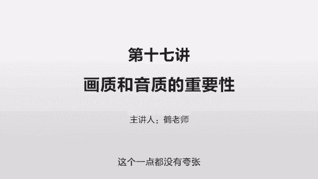
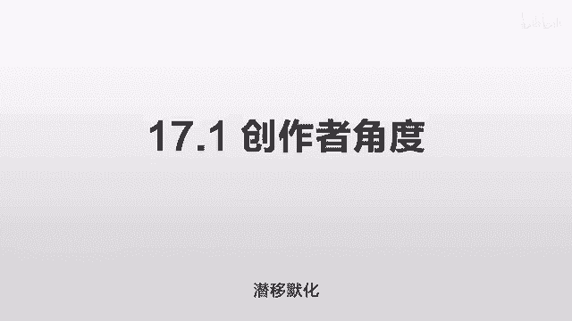
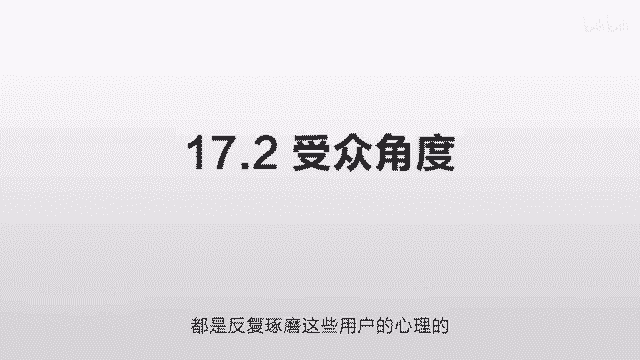
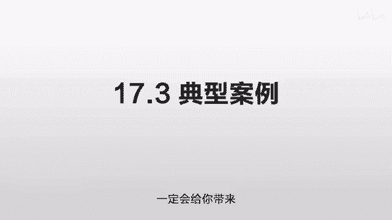

# 抖音运营从0~1全攻略【基础入门篇】B站最良心的最新2024抖音运营起号版全套教程（新媒体运营精华版） - P24：15-第17讲：画质和音质的重要性 - 人生不复制 - BV1yWHKeMEud

好了这节我们讲一下这个画质和音质的重要性，为什么要把这个画质和音质的重要性，作为一个单独的一节来讲呢，因为它实在太重要太重要了，如果只是在之前的某一节里面提了一下，大家只是觉得它重要。

但是还没有那么重要，但实际上它的重要性，甚至远远超过你内容本身的重要性，这个一点都没有夸张。

我们先从第一个角度，创作者的角度来讲，你买过那种奢侈品吧，那种名牌的包包，那种名牌的表，那你去买奢侈品的时候，他就是一个富丽堂皇的一个装修，在一个最好的地段做的最好的装修，而过得非常漂亮。

这些营业员啊非常尊敬你的感觉，一丝不苟的来给你做讲解，服务态度也非常非常好，请问这些能不能提升它的产品质量，答案是不能啊，它的包包是什么样子，就是什么样的，他的表该是什么样，就是什么样子的。

但是它可以通过这个东西让你产生一种信任，产生一种仪式感，这种仪式感是和它的内容相匹配的，这两者其实都是产品的一部分密不可分的，你的包包如果是摆到地上卖，那个感觉马上就不对了，买到了一个名表。

拿一个塑料袋给你装的，带回家了，没有人可以接受这个，我就宁愿多花一些钱去买一个精致的包装，在包装上花很多很多钱，这个就是用户对仪式感的需求，尽管你去问他，他没有人承认，他会告诉你，我就喜欢这个包。

我就喜欢这个表，但实际上这种仪式感，它深入到每一个用户的骨髓了，很多时候，这些成功的商人都非常在乎这种仪式感，那比如说你去了一个很有名的饭店，他为什么要这么在乎装修啊，就它并不能提升你的饭的味道啊。

但是你在这边吃饭，会让你感觉这个饭的味道更好，在你经过这个饭店的时候，他可以第一时间最快的速度传达出来，他的这个饭店要表达什么东西，它可以快速的从同行当中脱颖而出，快速的占据你的大脑，快速吸引你的眼球。

这些东西都没有直接和产品相关，但是都会给用户产生一种潜意识，这种潜意识可以促进用户的转化，你想告诉这个用户，你的厨房很干净，你不用直接告诉他，你也不用跟他说，你只需要把这个后厨给做成这种透明的。

它经过的时候一看哇这么干净，这么多人穿戴整齐，戴着口罩操作一丝不苟，他就会对你的产品产生信任，他会打上几个标签，干净有品位，时尚就是触达用户的渠道，本身就是产品的一部分，这是一个更广义的产品。

你像很多微商，他们在做的时候，他们为什么要拿豪车去拍啊，就坐在豪车里去给你指点人生啊，他就为了提升转化率啊，同样一个道理，你坐在豪车里，跟不坐在豪车里去跟你的受众讲的话，它的转化率是不一样的。

你坐在豪车里，他就觉得你很有钱，他就觉得你说的很有道理，不然你怎么会挣这么多钱呢，所以在很多行业做的非常成功的人，他们都极度的重视这个仪式感，你去观察任何一个行业做的非常好的，你包括你去看一个网站，诶。

为什么这个网站你觉得他很高大上啊，因为他在UI上花了很多时间和精力啊，他雇了很多顶级的人来做一些设计，就是让你觉得他高大上啊，短视频行业也是同理啊，画质和音质不是目的，而是手段，我不是为了让画质好而好。

不是为了让音质好而好，而是为了吸引你的用户，让他第一时间觉得你的东西特别好，潜移默化。

这个就是我们要讲的第二点，受众的角度，我们从那个受众的角度来看，一个好的画质音质和一个很差的画质，音质到底有什么区别，同样两个电影一个是蓝光的，一个是标清的，你会看哪个，你一定会看蓝光的。

尽管任何一个用户都会告诉你，我看内容内容最重要，内容得有干货最重要，但这里面就有一个悖论，你在看之前，你不知道它的内容是不是干货呀，那么你要先判断，而你的判断方式，其中最重要的一个参考因素就是画质。

就好像你去一个饭店吃饭，你问任何一个吃饭的人，他都说味道是第一位的，当然是味道第一位了，它好吃吗，不然你装修再好有什么用，可问题在于你去之前，你根本不知道它好不好吃啊，你只能看他的装修是不是用心。

是不是精致，后厨是不是干净，这些信息有没有传达过来，尽管这些参数都达标的不一定好吃，但是它大概率代表了一个趋势，用户会相信这个短视频也是一样，这个蓝光的并不一定比这个标清的一定要好。

有很多视频它就是标签的，就是拿手机拍的质量也非常非常好，但是不重要，我们讨论的是同样的内容之下，你用蓝光的一定会比用这个标清的转化率要高，他要在同一个参考系上来做对比的。

很多时候用户是不知道自己需要什么的，你问他，他只能从这个结果去倒推，但是他们会被这些东西操纵，但是他们却不自知，所以做这个东西一定要站到这个受众，真正需要的角度，就是他真正潜意识里他对什么东西感兴趣。

站在这个角度去做，你比如舌尖上的中国，他就是拍各地的美食嘛，各地的好吃的东西好了，我现在告诉你，如果把舌尖上的中国的配音给去掉，就那个男性的配音给去掉，这画面就感觉差了一点，好像少了一点灵魂。

就好像那个牛排烤好了，忘记撒胡椒了，或者说这个桂花糖藕做好了，忘记上面撒糖浆了，这么一个感觉缺了点什么东西，你把这个有磁性的男生给换成另外一个人，普通人来读，就感觉马上不对了。

虽然吃的东西还是那些吃的东西，它不影响你拍摄的这个味道，但是给观众的感觉不一样，那再进一步呢，你如果不用这些高清的摄影器材去拍摄，你不用这么多的机位去拍摄，你就拿个手机那么晃晃晃拍，那就让自己家里做饭。

炒菜油烟咣咣咣的拿个手机在那拍两下，然后发出来了，去拍同一个大厨，你和舌尖上中国去拍同一个大厨做的东西，那感觉又不一样了，因为画面降低了，再进一步呢声音也有问题，比如他切一个菜那种清脆的声音。

比如说打一个年糕那种啪啪啪的那种打击声，我下锅炒一个菜那种身临其境那种炒菜的声音，这些都要用很高的音质来表现出来，在舌尖上的中国火之前，这些东西地方各个地方都有啊，但为什么你不感兴趣呢。

那是因为别人拍的不吸引你啊，不是说舌尖上的中国拍的时候它的味道才好，而是说他一直都这么好，但是他没有有效的传递给你，所以我们一定要向这些优秀的这些产品来学习，怎么把一个同样质量的东西。

把它包装的更好一点，传递给用户，这个包装是非常非常重要的，就一定要站在用户的角度，受众的角度，这些顶尖的营销大师，都是反复琢磨这些用户的心理的。

那第三个我们来讲一些典型的案例，你给我讲了这么多东西，我也知道这个很重要，但我想知道这个东西在数据上到底有多重要，你告诉我非常非常重要，能不能拿数据来证明一下，可以我观察到一个账号是一个律师的账号。

他又是来讲解各种法律知识的，他的这个账号做了很长时间，很早就开始做，但是一直都不火，直到最近几个月才开始火，而火的一个关键点，就是它采用了一个更好的拍摄方式，更好的音效把它传递给用户。

他现在粉丝非常非常多，都是最近几个月涨的达到了800多万，但是你看他早期的这个视频啊，他的点赞量只有几百个，就你很难想象说一个800多万的一个博主，他的点赞量只有几百个啊，这个就是真实存在的。

这个是他早期做的，所以他当时做了很久都没有火，那你看他当时怎么做的呢，拿手机拍，那可是一个致命的问题，绝对不要拿手机拍，而且每次的清晰度不一样，光线不一样，角度不一样，但有一样是确定都是画质非常非常差。

音质也非常非常差，有的时候你甚至听不清楚，而且还有一点更致命的，他早期的他甚至没有加文字上去，这个时候用户就会遇到一个问题，就是他需要屏气凝神，来听这个人到底讲了什么东西，因为没有蚊子来辅助他判断。

他需要花精力花时间，而一旦你让用户花精力花时间，一个产品就已经输了，因为用户他的时间非常的宝贵，他在千千万万个让他感兴趣的视频里面相互挑，他看不看，你对他来说一点影响都没有。

他为什么要在那么多精彩的视频当中停下来，人家有文字，你没有文字，人家拍摄的精致，你拍摄的不精致，人家声音非常的好，你的声音非常的一般，甚至有点听不清楚，然后这个时候他要屏气凝神来听你讲什么呢。

他为什么要这么做呢，所以他早期做了很多这样的，完全火不起来，而且他之前讲的一些东西也过于冗长，就是有很多的废话，没有经过一些精简，所以这个也是一个表达方式的一些缺陷，但是我们观察哈，从某一天之后。

他突然改了一个方式，据我观察是很多这样的律师事务所，都找一个类似的一个拍摄机构来批量的制作，因为我看他的视频上面有一个标号，比如说几几几几几几类似的，其他的一些律师也有这样的标号。

他可能是专门找了个公司来批量制作的内容，可能是他自己来讲，那批量录很多条，一天放出一条大概这么一个方式哎，从那个时候开始，他的粉丝量就开始涨，而且越涨越快，越涨越快。

而这些由第三方公司做出来的这种视频呢，就非常的整齐，他有统一的风格，然后他把那些文字全部都打在这个屏幕上，这样你看的话就不会那么累，录音的效果也非常的好，也非常的清晰，他在录的时候呢也穿了一身正装啊。

传递出一个这个律师的感觉，带来的就是粉丝的暴涨，不是涨啊，是暴涨，但是你观察他之前和之后啊，早期和现在其实就是从某一天开始，切换了一个展示风格，就用了更好的画面，更好的音质，更好的仪式感。

穿一身正装来给用户去讲，同样的东西马上就不一样了，知识储量是没有办法变的，之前和之后他都是这么多知识储量，这些东西是完全一样的，完完全全一样，也就是说产品是完完全全一样，采用两个不同的方式。

一个完全没有人买，无人问津，另外一个是排成长队，销量爆棚，这个就是仪式感的作用，你可以去翻看一下他的这个非常非常典型，非常非常有代表性，如果你还对这个画质和音质的重要性存疑的话。

你觉得我这就拿手机拍一下就行了，我不想学那么复杂了，我将就下就行了，你好好看看这个例子，好好的看一看，你看他之前做了多少视频，一个都没火起来，到现在800多万粉了，之前的还是几百的点赞。

但他现在只要发一个，可能就是几万十几万甚至几10万的点赞，这个就是差别就一定要看，一定要对比来震撼到你，你才会笃信这个事情，你才会真的愿意为这个东西去花时间，也才会真正的给你带来效果。

这是为什么我们要把这个单独作为一节来讲，单独的反复强调，反复强调好的，我们总结一下这一节课，实际的目的就是再强调一遍，这个画质和音质到底有多重要，不是一点点，是极度极度极度重要。

一定要舍得为他花大量的时间，在这个包装上，一定要舍得花成本，你才能真正的去打动用户，这种包装这种方式，这种表现手法就是产品的一部分，它和你的内容一样重要，甚至比你的内容本身还要重要。

那么第一点是创作者的角度，任何时候，你要比观众自己本身都更要了解他们需要什么，你要重视这个仪式感，通过这个仪式感，把你要表达的东西快速的传递给他，第二个受众的角度，其实受众。

他们自己是不知道自己喜欢什么东西的，他们被操控却丝毫没有察觉，你问他们的意见，他们一定会告诉你，内容是第一位的，但这个悖论连他自己都没有意识到，就是在你不了解内容的时候，你怎么知道哪个内容是好的呢。

你了解的话就得通过渠道，渠道的话就是内容的一部分啊，一个蓝光的一个标签的，一定会看蓝光的，第三我就举了一个典型的例子，你就一定去看一下他的这个账户，你看一下这个前后的差别到底有多大，几百倍。

几千倍的播放量的差异，同一个人讲同一个内容，同样的知识储量，同样的类似的话题，一个就是死活就火不起来，另外一个就是疯狂的涨粉，这个就是区别，这一集没有什么干货，就是反复强调一点，单独把他列出来讲。

单独的强调，希望一定要把这一块重视起来，你比如说我自己，我当时在这个画这个音上花了很多时间，画质我用了我目前能找到的最好的相机，然后最好的镜头来反复的调试，拍完之后呢，我在pr里面调色。

那我专门去搜了一下，怎么去调色来达到一个和别人不一样的效果，同时比较清晰来传达出我这种感觉，录音的话，我最开始是用一个roll的话筒，但是我发现即使把这个话筒伸到我面前，效果比我想的还是差了一点。

所以我就用了舒尔MV88，然后把它放到一个IPHONE的手机上，然后E波来录音，后期再合成，合成的时候再把声音再稍微处理一下，使它显得更加好听一些，这些都是细节，我舍得为他花很多的时间。

就是我知道这个结果，一定会给你带来非常丰厚的回报。

