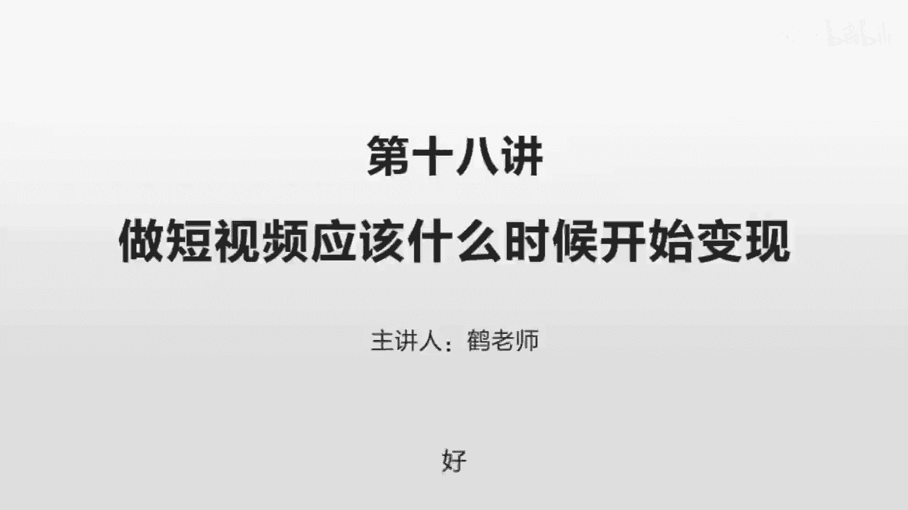
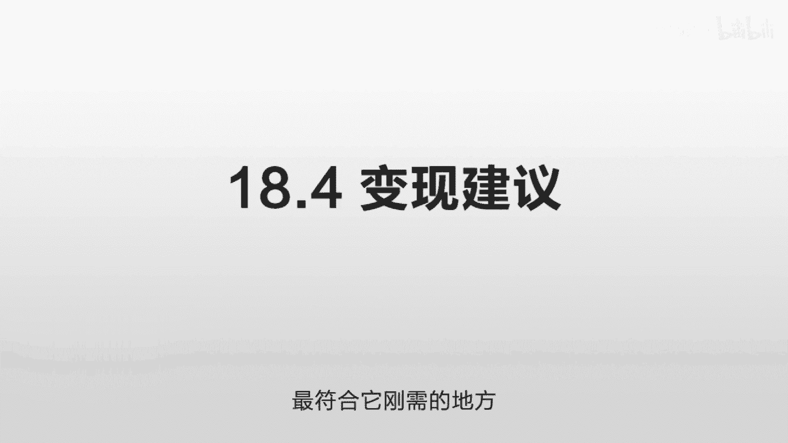

# 抖音运营从0~1全攻略【基础入门篇】B站最良心的最新2024抖音运营起号版全套教程（新媒体运营精华版） - P25：16-第18讲：做短视频应该什么时候开始变现 - 人生不复制 - BV1yWHKeMEud

好这一节我们讲一下做短视频的一些变现问题，首先我们讲第一个就是变现的时机，什么时候应该变现呀，越快越好，就你产品准备好了，随时都可以变现，你甚至刚开始做的时候就可以直接变现。

但是很多人可能有些特殊的考虑啊，比如说我想先打造一个IP出来，打造了IP，有了一定粉丝之后，我再去变现，这个也可以，也没有问题，但是要注意一点，就是我们之前讲过的，什么时候变现的效果最好呢。

就是你涨粉最快的时候，你比如说你现在只有1万的粉丝，然后你突然有一个东西爆掉了，播放量非常非常大，有疯狂的有人去加你，然后你一天涨了有10万粉，在这个时候他在涨粉的时候，如果看到了你推荐的东西。

或者说你挂的一些商品，这个时候他的转化率是最高的，而一旦你这10万的粉丝已经成为了你的粉丝，然后你这段时间没有东西爆掉，然后涨粉不温不火，那这个时候变现效果就很差。

就是说这10万的粉丝更多的是一个数字的象征，我们之前讲过嘛，这个是一个公寓流量，公寓流量就是说这些人他只是看过你的东西，他只是之前觉得你的东西好而已，只是你在他的关注列表里面而已。

但是你的新的东西他能不能看得到，不取决于你，取决于这个平台，取决于你的内容质量，平台觉得你足够好，才去把你推给他们，所以你一定要在这个平台，觉得你的内容特别特别好，疯狂的把你推给用户的时候。

啪把这个产品加上，这时候转化是特别特别好的，所以如果没有说，一定要打造一个特别特别好的IP，到了一定程度之后再开始变现，或者说开始这个变现都没有想好的情况之下，最好是一开始做的话。

就直接把你的产品挂上去，这样的话你涨一点粉，马上就可以看到这个变形效果，非常的直接，记住一个重点啊，就一定要在涨粉最猛的时候，这个时候疯狂的去变现，第二我们讲一下这个变现的方式，变现的方式有很多嘛。

我们先讲一些最常见的方式，就是挂小黄车嘛，就卖东西嘛，就是你基本认证一下，现在好像要交一个500块钱的一个保证金，好像就可以了，你就可以去卖东西了，就像我自己，我现在是卖这个经济学的教程。

因为东西非常的相关，你发的东西是讲经济学的，然后发了之后呢，他觉得你这一段讲的不错，下面就会有一个小黄车哎，它的完整版的教程，很多用户就直接点进去买，这个购买流程也非常非常的顺畅，非常非常好。

这是一个非常直接的一个方式，你知道这个转化只要多一步，它的转化率就会直线下降，就是坠崖式的下降，你想象不到的往下跌，那么之前我的这个转化是，通过我把课程给放到小额托上。

就微信公众号上把用户引到微信公众号上，然后让他在公众号上去下单，这个时候转化路径就多了很多，首先这个人得看到我的视频，看到视频之后他还觉得好，他得关注我，关注我了之后，他还得看到我的首页。

还得刚好在那么多东西之间看到我的这个签名，写了课程，在公号，他还得再打开他的微信去搜一下这个名字，搜到之后打开，然后再看，发现原来还有一个课程，再去看课程，再去觉得好，再去转化，效率低了十倍。

有特别特别长的一个路径，特别特别容易流失客户，但如果你直接挂一个小黄车，直接卖你的这个知识类的这个课程，虚拟的这种产品的话，这转化率就提升了很多很多，就当然你也可以去卖一些其他东西，比如说你带一些书啊。

带一些货呀这些东西，但一定要和你的内容相关，只是我自己觉得，这种知识变现是一个未来的趋势，因为它没有库存啊，你带的很多货，你要么是提成不够高，你要说你自己去卖的话，又会有大量的库存。

但这个教程这个东西是一个一旦你一次性做好，它就边际成本为零，你就不需要去管它了，你就需要源源不断的去发一些高质量的内容，来吸引他过来，然后他觉得你的内容不错之后，他就会购买，然后你的这些知识的产品呢。

你持续的更新就好了，就可以达到一个非常良性的循环，你不需要在这些购买环节太多的消耗你的精力，你只要把这个精力放到这个制作环节，放到这个传播的环节，把内容做好，自然而然就可以变现。

这是一个非常基础的一个变现方式，还有一个呢就是直播之前我们讲过，就是你有一定粉丝之后，你可以来做这个直播，而且这个直播的这个粉丝的粘性，会比视频的粉丝粘性要高很多，因为这是两个不同的产品方式。

视频他只是说看到了你录的东西，而直播的话他是看到你一个活生生的人，这两个忠诚度是不一样的，但这两个方式各有优劣，我们之前讲过啊，就如果你有时间，如果你有精力，你也可以采用这个视频直播来变现的方式。

那直播是可以打赏的呀，他们如果喜欢你的话，他们会在这个直播间里给你打赏，那么提问的话你也可以收费啊，那比如说你可以把这个用户设置为不同的级别，只有到达某一定级别之后，你才会去回答一些问题，这个也可以呀。

但这个前提是你要对他产生一个信任度，他觉得你是一个kl，这不就是意见领袖，他觉得你是一个头部的IP，他比较相信的一个博主，就是你要有一定知名度，有一定的信任度之后，你可以采用这个方式来变现。

那么还可以采用这个直播导读的方式，只要你有一定的知名度啊，只要你的直播间的粉丝越来越多，那就会有人为了宣传他的东西去给你打赏，他打赏的目的呢，就是为了让更多的你的用户来关注他，来帮助他来变现。

这都是一些合作的方式，都可以去尝试，你可以先看一下你行业的那些做的比较好的人，他们是怎么直播的，他们直播的时候呢啊大概一场能拿多少钱，通过直播还有哪些可以扩展的变现方式，都可以了解一下。

还有一些变方式呢，就是把它引向你的私域，之前我们讲过这个公寓跟私域嘛，其中有一个很重要的一个操作，就是把公寓的流量引向你的私域，把湖里的鱼，海里的鱼弄到你们家池塘里面养着。

这样的话它就永远是你的资源了啊，比如有人去做一些问答，比如他开一个自己的知识星球，他加了你微信之后呢，他可以买你的知识星球里面的东西，你可以回答他的问题，你也可以直接去做一个微信群。

来做一些某一些知识的一些分享，你当然也可以在直播的时候来提一下，你有一些这样的产品啊，让他们可以来购买，或者说购买你的这些东西之后啊，你才去回答他们的一些问题，有很多的方式都是可以尝试的。

非常非常灵活的，还有一个方式就是你可以接广告，等你粉丝到了一定程度之后，会有广告商自动来找你，那么你可以根据这些需求，你开通星图啊，或者你线下接单都可以，但接广告注意一点哈，你就什么样的容易接到广告。

我们之前为什么要单独去讲，这个画质和音质的重要性呢，就有一个朋友给我举了一个例子，就也是一个抖音的朋友，我们在交流的时候，他是参照了我的这个拍摄方式，他也提升了他的这个拍摄效果，以前他是拿手机拍的。

后来他拿那个单反来拍的，然后他在跟我交流的时候，他就说我感受到的最明显的一点就是，我换了拍摄器材之后，广告多起来了，就之前他讲同样的内容，可能也有人想找他做广告，但你一个人拿个手机在那拍晃晃晃的。

你这个东西交给客户或他也不太好交代，或者说你这个传播效果，总是觉得有点很奇怪的感觉，你知道吗，那你如果换成一个单反，哎，这画质明显有提升诶，这个就感觉逼格就起来了，很有品位，像电视台的这个采访一样。

哎这个人在这很平静的去讲一个东西，哎，提到你的产品再配上一些动画，非常非常酷，效果是直线飙升的，就接广告也是一个很好的方式，现在我们讲第三点就是变现的效果，我们刚才讲了这种不同的变现方式。

但是那是一个非常抽象的环节，我们想知道它的具体的变现效果是怎么样的，我们给一个具体的数据吧，一般来讲，比如你抖音里面如果有100万的粉丝，那么你接一个广告通常的价格是多少呢，1万一个300万的粉丝呢。

接一个广告同样是3万，价格上下可能会有些波动，取决于你的内容，就你的内容和你的行业如果是相关的高质量的，你这个价格可能会更高一点，比如你400万的粉丝，你一个广告要收5万，你自己可以决定嘛。

只要你持续的涨粉，就很容易有人会来找到你，要了解一些基本的价格，就会比较好谈，就广告啊，有的时候是有返点的，有的时候没有返点的，什么意思呢，客户可能觉得你这个平台挺不错，他想在你这边做广告。

但是他自己呢可能不会来找你，他会找一个中间商呃，找广告公司，这个公司来找你，这个公司在做的时候呢，他就希望说能不能给他一点返点，就打一个折扣，但那个折扣是打给他的啊，这个也取决于你的话语权。

就是如果你是一个客户，非常非常想在你这边做广告的一个人，那你的话语权可以强一点，你可以告诉他没有返点啊，如果你特别想做这个生意，你觉得少赚一点无所谓，或者优惠一点，大家长期合作也行啊。

一般都是10%左右的一个返点哦，讲完这个广告，我们讲这个直播100万粉丝的话，你这个直播一场直播能拿多少钱，这个差别就很大了，一般来说从几百到几千啊都有，这个取决于你的这个个人的能力。

那只是一个大概的范围，那还有一个是小黄车的这个方式，这个主要是卖一些知识类的产品，这个也是上下波动比较大，但是他是一个转化非常好的一个产品，你要说100万粉丝，然后你去卖一个你的健身课啊。

或者卖你的英语课的话，你只要持续更新，然后每一个视频大概有一些不错的点赞量，有不错的这种播放量，比如说几10万的这种播放量的话，一个月几万到十几万的话，这个都是很正常的，但前提是你得持续更新。

持续提供高质量的内容，他看了这个给他提供帮助的，他想得到更多的帮助，想得到更多的知识，他会去买你的东西，这个你持续做的话，甚至会比你一个月接几个广告，这个收入还要高很多。

那么还有一个就是私欲的这个变现方式，就是你把他引到你的粉丝群里面，在粉丝群通过这个粉丝群的方式来变现，这个就无限可能了，就取决于你的这个产品，还有你这个运营的能力，这个可能又是单独的一门课。

怎么去提高这个客单价呀，怎么去激发这个用户的消费能力啊，怎么去更多的满有他们的需求，开发一些高客单的产品呀，这里面就有很多的门道，但这里面的空间也是最大的，就我目前知道的就有一些讲解股票的这些人。

他们在直播的时候，很多人挣的是这开户的钱，就是我去给你推荐开户的地方，这样的话你一旦开户的话，你以后的炒股的这些钱啊，我每一笔钱都是有分成的，这样的话他就可以把这个直播，这个一次性的行为。

变成一个源源不断的一个收入的行为，他不停的直播，不停的直播，不停的积累这些用户，这些用户将来都是要炒股的啊，源源不断的会有钱，他那边会源源不断的收到钱，这是个变现方式啊，还有一些比如说他卖房子的。

你像有些房产中介，他可能一个月能卖出一两套就不错了，但有的时候他做了一个房产的号，专门去讲解各种房产的知识，他给人一个很好的一个信任感，很多用户觉得哎这个小伙子不错啊，相信你，我在你这买房。

有的甚至一个月可以卖20~30套房，一套房挣个两到3万块钱，一个月挣个五六十万，这个在之前是不可想象的，这个空间非常非常大，取决于你的行业和你的变现方式和你的思路，这个的话尽量去研究你的竞争对手。

他们做什么的，你尽量先跟上，他们没做什么的，你想一想能不能把他这个空白给填补一下，第四点，我们讲一下这个变现的一些建议，就我自己的感觉，就是和那些刚需有关的变现非常非常好。

比如说我们拿这个性别来做划分哈，女性的这些用户一般就是情感课卖的会好一点，男性的一般就是这种理财课呀，房产课呀卖的会好一点，另外这种刚需的这种技能培训课，也会卖的非常非常不错。

就他想学一个东西来提升他的能力，来赚到更多的钱啊，比如他想学一些英语来提高英语的水平，来换一个更好的工作，或者他想学一些销售，提高自己的销售水平，赚更多的钱，这些东西都是刚需，你帮他赚到更多的钱。

给他带来更大的价值，他会更容易买这些课，那你比如说这种英语老师，美术老师这些本质上就是属于知识类的啊，你可以直接做一些课，挂小黄车卖，你也可以把它转化为你的私欲啊，给予你的这个IP的信任度来变现。

这个变现方式就非常的多了，那么你在日常更新的时候呢，你这个内容啊不一定要有多专业，比如说你是个英语老师，并不是说你在这个英语的专业度上，比其他老师都要好，而是说你可以把你的知识更好的传达给对方。

这个传达的能力才是第一位的，那你如果是一个微商，或者说这种保险代理人，这个逻辑也是差不多的，你建立一个自己的IP，通过这种系统的这种内容的分发，来找到潜在的用户，你通过讲解一些行业的干货。

通过讲解一些行业的坑来建立一个人设，让他相信你，让他觉得你讲的非常有道理，他在这个行业就愿意去听你讲，或者他愿意跟你混，加入你的团队，你通过各种包装来达到这样的一个目的，那还有各种。

比如说做批发的那种商家也是同理啊，也是通过你建立一个人设，然后借助这个系统的力量来让他帮助你，找到这些潜在的用户，这些毛细血管的抵达，如果你不采用这么一个高效的方式，他是极度极度耗能的。

而一旦你创造了一些优质的内容，你就可以借助这个系统精准的到达，用户数量并不重要，精准度才是第一位的，你通过创造一个好的人设产品，通过这个系统分发到你的用户，通过屏幕把你要表达的东西表达出去。

建立一个自己的私域流量，基于这些流量尝试各种变现方式，基本都是这么一个思路，我总结一下，一共讲了四点，第一个是变现时机，那变现时机最好的时候就是涨粉最快的时候，当然你这个产品如果做好的话。

你刚开始做的话也可以直接把它挂上去，但是效果最好的时候是涨粉最快的时候，所以可能的话在你快速涨粉之前，就把这个产品给做好，放在那，第二变现方式，我们讲了好几个，一个是小黄车，你就直接卖东西，一个是直播。

通过直播里面也还有好几个细分的方式，另外呢你可以接广告或者更深一点，私域流量变现，你把它导到你的私域流量，导到你的微信群里面去，尝试线下的变现方式，第三个我们讲了一个变现效果。

就是广告的话差不多是100万，粉丝收费是1万，这个是确定的，直播的话就不一定嘛，粉丝的话从几百到几千到几万都有，那么思域更是很难确定了，取决于你的这个行业，第四我们给出一些变性建议。

就是跟刚需有关的变现会比较好，你无论从事任何一个行业，你都尽量去找到这个行业最符合他刚需的地方。

