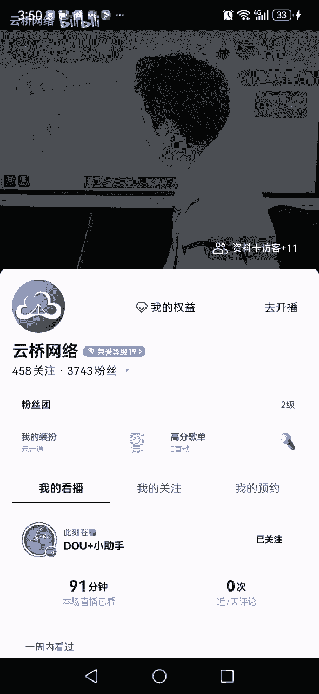
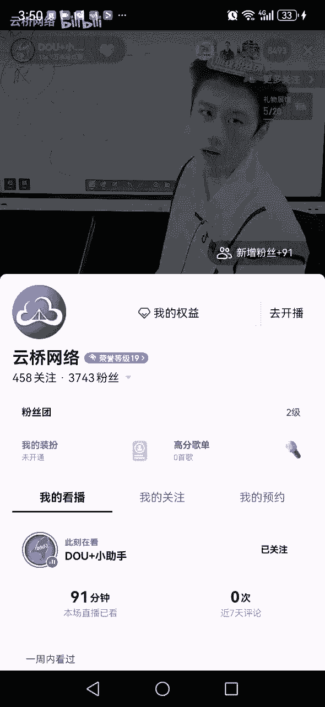
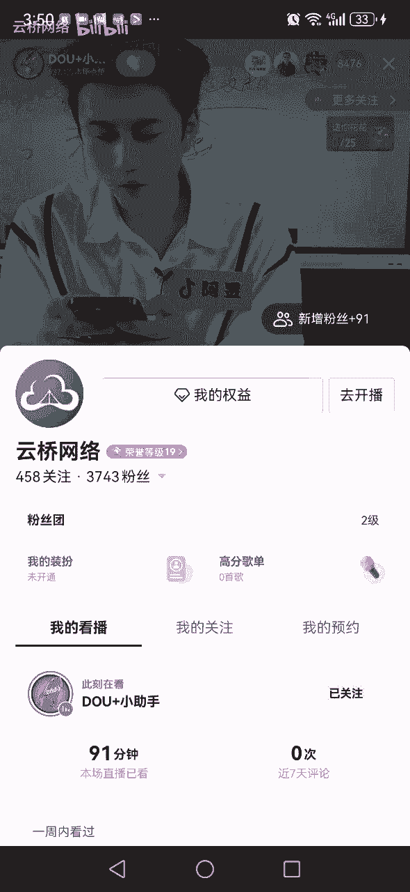
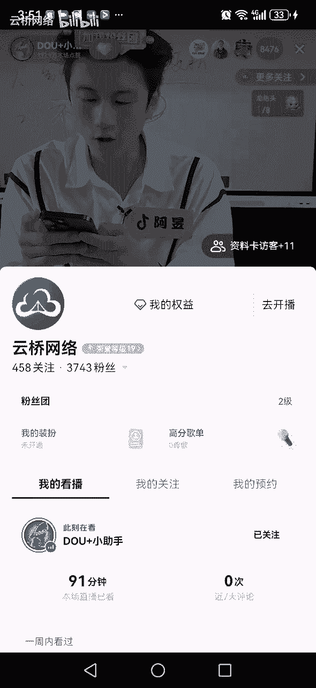
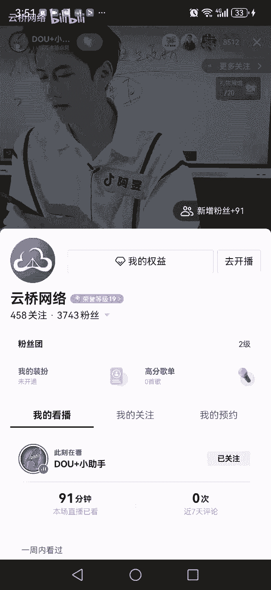

# 抖音运营起号变现方法及注意要点官方直播回放-阿昱老师讲解 - P1：SVID_20240430_151628_1 - 云桥网络 - BV1vJ4m1E7nQ

同学们没关注我们抖音官方的关注一下，这里是抖音官方最大的直播讲堂，关注下倒计时用的中上波福利，同学们啊，543212，给咱先上个黄金三秒，抓紧时间截图，五秒钟结束时间，非常重要的学习资料。

用方向几个小点不给大家消除了，54321好，再给大家上一个挂小螺栓的数量限制，和粉丝相关，抓紧时间截图，54321好，最后一个给大家上一个主播剑姬，抓紧时间，九个方向不对，大家想说，54321好。

截到了吗，截到了，我们向上拉嗯，来朋友们收到了吗，收到哪一个拿走了，感谢各位，接下来的时间，我们来讲讲正确起号，同学们啊，首先抖音账号，咱们大家都有没有有没有抖音账号都有吧，好拿过来一个抖音账号。

同学们，我们现在要做这个账号，我先说好了啊，咱现在不是说娱乐，不是说随便玩儿玩儿玩儿都会玩对吧，你们可能比阿玉老师还会玩，但现在我们来讲讲讲的是，怎么通过这个号来做抖音，来把抖音做起来，然后兑现好。

既然是做账号来吧，现在我们直播间，你现在手里那个账号，同学们是不是已经发过了一些视频，发没发过，是不是用了好几年了，好几年了，是不是是不是拿这个号，平常一直拿它来刷抖音的，是不是好。

那么这个时间有人就想说，阿玉老师啊，这个号是不是得换一个，是不是不用这个号好一些对吧，哎然后这个时间网络上的大主播说了，那就不说了，噗说这个直播间的宝妈们啊，你们听好了，问问题，现在有多少人是这样的。

来试试吧，好动作是这样的，好来听好了，你们这样，你们发视频播放量只要低于300的，现在发视频低于300的，把账号注销掉，重新换号，为什么要换号呢，我告诉你，因为你现在发视频，只要播放量低于300的。

你的账号权重有问题，你账号可以说是废了，你现在赶紧换号，赶紧换号，好多宝妈说，老师啊妈呀，号废了呀，行行行，号废了，让行换号注销，注销了，谁干了他干了，今天阿玉老师告诉各位同学们，在咱们抖音号废了。

就这么地拿这个号刷刷抖音，用了好几年，发了几个视频号就废了，怎么号怎么着了，号感冒了，号发烧了好啦，肚子嘶，号哪疼啊，号定疼啊，号腰疼啊，号废了，同学们号就废了，号号有废了吗，没有号没废哈尔废了。

同学们都不到，号废了，同学们这个号能不能用，这个号完全能用，老师啊，这个号健康吗，号没费吧，哎答案是健康，同学们啊，号能用，但是这里我说一下，如果你要用这个号，同学们接下来的时间，我们要做的事情。

同学们干嘛跟跟之前就不一样了，来吧，那老师，那这个号我应该做什么事儿，好，大主播又说了，说你应该去养号，来直播间，大家把养号扣起来，听过没是吧，这事你肯定听过，老师我听说做抖音得养号啊，怎么养。

浩老师我没听过，你没听过是吧，来我告诉你，大主播又来画了，说家人们感谢你们光临大主播的直播间，大主播我呀，我手里面七八个账号都火了，都是大主播，都是啥，都是粉丝们高的号，我就是天天养号。

老师你咋养的号啊，大主播你咋养的号啊，大主播说了，说我呀，每天我会安排好几个助理拿我的这个抖音号，天天刷抖音，天天点赞，天天去给人家评论，天天去给人家直播间，天天去送礼物，天天去亮灯牌，天天去刷礼物。

说你现在如果想把账号养起来，你也得给他什么刷抖音，拿着它去看直播，拿着它去送灯牌，你看评论区是的，我也天天这么干，哎呦我的妈呀，我为啥要讲这个，因为好多小白都是同学们，很多很多同学们。

咱们直播间水平有高的水平，也有很低的，同学们，我不能不讲啊，同学们，你现在正在天天都被骗的，同学们，你给骗子一个愣一个愣的，有个大姐和我说，阿宇老师，我光刷礼物，我都充了好几千块钱了。

我说你最后的结果是啥呢，你发没发现，留着还不行，招牌为啥同学们，因为养号是个假的，养号是个坑，大家把坑这个字括起来吧，养号是个坑，同学们浪费我们大家的时间，那老师，那么你现在想做抖音。

那我老师我现在要干嘛，同学们来，我来告诉你，你现在你这个号不用养号，不用去刷抖音，不用去乱七八糟，去怎么养号，刷礼物，同学们都不用，你现在就记住了这些事儿啊，好好听啊，首先这个账号同学们啊。

你可能也关注过一些人，你可能也有一点点粉丝，你可能也发过一些作品，你现在只需要干一个事情什么呢，关注不用管，关注不用管，同学们，你也不用去怎么轻取取关不用啊，同学们随便就关注，不影响粉丝，需要清理吗。

有人说老师我粉丝有一些熟人，我粉丝有一些家里人来，谁的粉丝里面有熟人家里人，你知道网上有一个说法是什么呢，啊网上有一个说法说你们做抖音啊，你们就把熟人拉黑了，不然的话熟人影响你的流量。

你的流你你抖音号干不起来，于是乎有的人把熟人就拉黑了，干了没干了，他干了，我就纳了闷儿，同学们，你说你做个抖音，你说你把你二舅哥拉黑了，大舅妈拉黑了二表弟，拉黑了三大姑七大姨，把对面全拉黑，同学们。

我是你，我要是你222表姨还是二表哥，我心寻思，你怎么还能把我拉黑，你干不起来，抖音赖我赖我啥事，同学们用不用拉黑，不用不用去清理粉丝，你现在只需要做一件事情，同学们什么呢，把之前乱发的作品处理掉来。

大家把处理两个字扣起来啊，处理掉以前乱发的作品处理好，老师啊怎么处理，同学们好好听，这个处理是这样的，同学们啊，这个处理是这样的，你不是发了很多条视频吗，这些视频不是乱发的吗，好两个方式啊。

方式一我给这些视频干嘛，私密隐藏，第二个我删除，好学们好，现在问题又来了，阿玉老师，我要问你个问题，他们说能不能大量隐藏，大量隐藏号就废了，是吗，大量隐藏号就废了，号就限流了，没事。

大量隐藏可以号又废了，你这号是什么号，你这号玻璃呀，号废了，这么脆弱，老师他们还说了，不能删除号也废了，哎呀我的妈呀，你这个号人，你这号是塑料泡沫吧，同学们，你是什么号，你这是啊。

我他妈动不动就号号就不能碰，这碰了就废，碰就废啊，就你这号你想想同学们大主播说的话，大主播说号删除就废了，哎我问你个问题，你是抖音领导啊，你说你在安排规则的时候，你这么说的，来以后啊，谁发作品。

谁删除谁的号就废了，不会吧，我就问你想咱用正常的逻辑规则不是这样的吧，所以同学们，你想想你之前听了很多很多课，你如果听完之后，你不去思考，你真的被带跑偏了，你现在思考思考，你会发现哦，还真是这，同样的。

你想想啊是吧，所以说同学们，你被忽悠来忽悠去，你会发现你咱自个儿脑子废了是吧，所以说隐藏也没事，删除也没事，同学们啊，问题都不大，跟个人习惯有关系，你喜欢隐藏就隐藏，你喜欢删除删除没什么提出，兄弟们。

那接下来时间同学们这个号终于搞定了，这个号是OK了，同学们，我们大家都在同一起跑线上对吧，号OK了，那么现在我们来教大家如何来做这个号，如何起号来，同学们首先问你一个问题，同学们，你说现在如果要做账号。

同学们，我们大多数人同学们你是怎么想的，有没有人是这么想的啊，我还问你了啊，好多人是这么想的，说阿月老师啊，我做账号，我的想法，我的认知哈，我的理解是我通过发抖音发抖音，然后呢争取把这个抖音拍的好一些。

流量大一些，然后呢把粉丝量涨起来，如果粉丝量能涨到几万十几万啊，粉丝要多一些，然后我就能去带带货，我就能去开开直播，我就能去赚赚钱，谁是这么想的，是哪个是很多人都这么想，对不对，同学们哎，我觉得这么想。

同学们，这是一个正常，就是你你对抖音大多数人这样的理解很正常，因为大多数人都是想理解，同学们这样理解，对不对，同学们对，但是但是听好了啊，但是有问题啥问题，同学们第一个问题，你发作品流量，多吗不多吧。

现在可不是以前以前随手一拍，播放量几万几10万，现在什么几万粉丝，什么十几万粉丝在赚钱哦，你等到十几万粉丝，几万粉丝再准备再赚钱，那只能和你说再见，为啥同学们现在在抖音，涨几万，粉丝涨十几万粉丝。

同学们简不简单，太难了，大家把太难了，扣起来，我们算笔账，我们直播间现在每天有没有不涨粉的，每天都不怎么涨粉丝，打一个不涨粉丝，打个打个一，我们算笔账，一个月，咱们说每天涨十个粉丝，30天300个粉丝。

这还是每天能涨粉丝啊，每天涨十个粉丝，一个月涨3万个粉丝，十个月3000个粉丝，一年你撑死一年，咱们涨个4000粉丝，等到你想你，你的想法是等到我5万粉丝，10万粉丝，20万粉丝，30万粉丝，我在变现。

这个时间还掉粉丝对吧，对，咱们什么时候掉粉丝呀，你说那你这个号你做完，你还得给你儿子做，你儿子做完给孙子做，等到孙子辈，他那个时候就可以考虑变现了，同学们，你想想同学们，你想想你现在做抖音。

如果你是这个思路，那基本上你现在跟抖音就是拜拜了，你就是来跟着玩几个月你就放弃了，因为你不可能把抖音干起来的，理清楚思路了吗，所以说我们直播现在做抖音什么思路，不要等到粉丝量多。

多到几万几10万就变现对吧，同学们，我们现在做抖音一定要有一个什么思路，低粉变现，大家把低粉电线复习了，这是现在抖音的是吧，情况低粉变现，聪明人一定是低粉变现，而不是说等到高粉丝再变现，低粉变现。

那怎么能做到低粉变现，同学们来吧，如果你想在抖音低粉变现啥低粉，比方说艾米老师能不能有的账号，能不能2000粉丝就能变现，能啊，有很多账号2000粉丝，3000粉丝，1000粉丝就能变现，同学们。

所以说如果你想现在在抖音拿到结果，同学们什么很重要啊，因为有的账号真的得需要10万粉丝，20万粉丝的变现，但是有的账号3000粉丝，2000粉丝，5000粉丝就能变现，所以这个时间同学们大家要考虑问题。

你和大多数人，你们之间同学们从哪儿就开始不一样了，从你做抖音的第一步，因为大多数人都知道做抖音的第一步是什么，来你决定要做抖音，你的第一步是干嘛，是不是上来先发视频，不是上来先直播吗，不是上来先起名字。

不是上来先选赛道对吧，哎所以说你上来先选赛道，这个时间直播间8000多人，每个人选的都不太一样，这个时间选对了，你选的赛道支持第一粉丝变现，那就行，有你就会有可能有结果，你选的赛道不支持一份变现。

那么你就拿不到结果，所以说我在我在平常我讲课的时候，有很多人让阿宇老师给他看号，我一看这个定位，同学们，我就明显能知道，这个人就永远就几乎不可能把抖音做起来，同学们真的因为有的地位能看到。

未能看到他的标准线是多少，有的赛道他真的需要10万粉丝，5万粉丝，3万粉丝才有机会变现的，但是有的定位不需要那么高，好吧，同学们所说，做抖音现在什么很重要，来选择很重要，这个时间选错了，有的人买课报班。

老师们推荐你做了这个，做了那个做了这个的完蛋了，对吧好，那么这里呢阿玉老师给大家讲一讲，所以说现在做抖音，同学们怎么来做账号，来第一步正确旗号，第一步要找准定位啊，找准定位，找准方向，方向不对。

努力白费，同学们找准方向，那么这个方向该怎么选择，同学们这个方向一定要结合自身，一定要结合自身，要做个人IP，一定要结合自身，做个人IP才有机会低粉变现，个人IP，同学们啊一定是这样的。

结合自身做个人IP，同学们好，这是第一个，这是未来抖音的大方向，个人IP啥叫个人IP，同学们，就是把你这个人的某一面拍到抖音某一面，比方说阿月老师，我今年46岁，我单身46年，这这46年我没有结婚。

没有找老伴儿，我一个人我就喜欢一个人生活好，我就把我这一个人独居单身这么多年，我的我每天在家里怎么生活的，我拍到抖音，同学们看没有老师，那这样的话怎么能低很变现呢，咱举个例子啊，这是举个例子啊，对对吧。

那微信收款发视频发视频发视频，同学们哎，慢慢慢慢的，我的播放量有个三千五千六千一万，三千六千一万2万，同学们哎，我把粉丝涨到了2000粉丝，那么这个时间同学们我就可以一边拍我的生活，一边卖卖货。

发发短视频给我们分享，分享衣服，分享分享产品，分享分享，我每天吃什么，穿什么用什么，同学们，这个世界是这样的，这个逻辑我觉得能理解吗，明白了明白，而不是大多数人想的说，阿玉老师，我得把10万粉丝。

20万粉丝，30万粉丝，我得接广告，兄弟们，现在接广告，现在整个的整整体单量一年不如一年，为什么，同学们就是因为现在涨粉丝的难度越来越大，同学们能理解吧，哎这是我们说的。

所以你现在你看刚才阿玉要举个例子吧，四十六四十六岁单身，咱举这个例子，老师我我不是，我是35岁，有老公，还有两个孩子，同样的老师，我不是，我是27岁，现在在外地打工对吧，一样的老师，我不是我56岁。

我现在孙子都有了，我在家里带孙子也是一样的，同学们是不是我们直播间对吧，阿伟老师，我不是，我今年66岁了，我怎么也是一样的，同学们好，这是我说的，做抖音要找准方向，同学们要找准定位，你知道在抖音。

同学们，我最怕啥呢，最怕有的朋友们太单纯，太单纯，就容易干嘛呢，就容易上当，咱说上当，说不好听点叫上当，说好听点叫跟风，啥叫跟风，我给你模仿一段，同学们啊，家人们，今天我给你们报个喜。

我做抖音才做了一个月，我这个号一个月，你知道吗，我变现了六位数，哎呀妈呀，太开心了，家人们，你知道这样的视频评论区都在干嘛呢，主播主播带带我，主播主播，我能跟你学习吗，还有的人开直播发视频。

说来直播间有没有宝妈现在不上班了，在家里带娃的，有没有，我告诉你，你现在记住了，抖音的风口是，抖音风口就是他必须做啊，谁现在做谁就能拿到，结果晚了，完蛋了，你就错过了风口是吧，抓住的不是吗。

有的人就这样，最后五个名额2900，哎呀妈呀，你着那个急呀，哎呦，我的妈呀，一个劲儿蜂拥而上是吧，老师没抢到，熟不熟悉，此时此刻你不觉得很熟悉吗是吧，那这样的模仿在抖音，你没有见过第二个人，为啥同学们。

我是打工人，我在这官方这边打工的同学们，我卖我，我在这打工，我现在在官方直播间给大家平常心在讲课，同学们是不是，所以说我们大家同学们，你要明白问题啊，我想告诉各位什么呢，你做抖音。

同学们不是说人家讲的方向不好，只是你现在做抖音，一定不要听乱七八糟的人怎么怎么怎么诱惑你，你要结合你自身到底行不行啊对吧，你到底能不能做，你到底可以吗，你花这个钱能可能你得这样想，每个人挣钱不容易。

咱家里都不是很富裕对吧，同学们，有的人还相互通过抖音翻身呢，来接下来时间，当你的赛道定位，选完了之后还要干嘛，来好好听，我来说一下，同学们啊，我给你的建议啥呢，我给你的建议是。

同学们不要把鸡蛋放在一个篮子里，不要把鸡蛋放在一个篮子里，这样这样的啊，听好了，有人说，老师我也不知道我现在选的定位到底行不行，好没关系，同学们做好两手准备，做好两手准备，同学们好吧，啥叫两手准备。

同学们来吧，我们大家把两手准备勾起来，说白了就多号来做，多号来做，多号来做，我要准备两个账号，两个账号，甚至说三个账号，这两个账号同学们很重要，真的两个账号啊，现在抖音上了，你们发没发现。

现在做抖音和之前不一样，之前做抖音老师们怎么讲课，听说过一句话吗，一机一号看了之前老师们都这么讲课，一级一号一部手机，一个账号多一个不行，什么俩都俩账号，俩手机对吧，什么你要做3号仨手机。

但是在我这里我告诉你，抖音支持一机多号，抖音是支持的，同学们没问题的对吧，谁告诉你一个人一个号，谁告诉你一机一号，同学们啊，一个人四个号不行，同学们行啊对吧，怎么怎么不行。

同学们是不是自己的思路要打开对吧，很多问题是可以解决的对吧，同学们好，这个我不多说了，自己先掌握这个知识，接下来时间讲一个重点，就是做抖音最难的事情，第一是定位问题，第二个难事情，第二个困难是什么呢。

同学们告诉我啊，别急，一会教你怎么有多个账号，别急，先把这个逻辑先跟着我捋完之后，我再把每一个细节给你们展开讲来，当你的定位搞定之后，下面困难的事情是什么呢，当定位有了以后，鲨鱼老师。

我想在抖音分发一下，发一下我的这个宝妈的生活，举例子，当你的定位有了之后，下面该干嘛了，下面应该想尽办法干嘛呢，我要做，量对吧，想尽办法做流量，同学们哎这个同学们老难了，这个难啊。

有大多数的人放弃做抖音了，原因是啥呢，原因是一直一直卡在这个环节，同学们，对不对啊，这个环节如果你搞定了，下一步就是变现是吧，所以说做流量怎么做，朋友们有没有说老师我不太会的，不会做。

来我教你学会这个啊，现在做抖音做了和之前不一样，同学们一定不一样，之前做流量之前做抖音记住了，我们和现在做真的是不一样的，首先做流量两个方式，第一个叫做发作品，对不对，那第二个呢同学们驻留着两个方式。

第一个叫发作品，第二个叫什么，开直播是吧，这两个方式都能够都能够做流量，也都支持零粉丝开播，零粉丝发作品对吧，都支持零粉丝好，现在问题来了，这两个分别怎么搞，对我们来说一下，你看过去的抖音是开直播。

是粉丝多再开是吧，同学们过去抖音是开直播，就是直播带货直播打pk，这是过去抖音，但现在不是了，现在抖音打pk的账号没有以前那么多了，带货的账号，同学们没有以前那么好做了，你们有没有听说过这样的话。

有没有听说过，真的是真实话，是真的好，那么一会呢咱们再说下，咱们一会再说开直播的事，有想学的吗，想学留个想学啊，要是没有想学的，一会咱就不讲了，等于重点讲这个了好吧，如果有想学一会讲啊。

好先讲一下发作品，因为绝大多数人啊，同学们，我们现在呢可能都是因为这个问题啊，把自己难住了，发作品，为什么呢，因为很多人发作品怎么样，哎没有流量，咱们说没有流量，简单讲就没有播放，没有播放，播放量太少。

很多人说老师我总卡在几百三五百，播放量总卡在几百，有没有卡在几百的，卡在几百的同学打一个卡在啊，同学们打一个赞好不好，那么这里呢我说一下啊，这里说一下最早的时候，咱们早期咱过去过去发作品。

我们的核心逻辑是什么呢，是出爆款，是吧，是出爆款，这是过去的核心逻辑，老师现在现在也是这个逻辑，也现在不是出爆款吗，现在也是没错，但是现在出爆款和过去出爆款同学们它不一样，过去出爆款容易对吧。

真的是很容易，没有那么难，但现在爆款咱们说爆款就是几10万，几百万，几千万，现在你看这个数字对吧，太难有几个，就咱们直播间有几个能现在只有几个，就这两天天天爆款的，没有吧，很少评论区说。

评论区说刚才刚刚看到一个评论区说阿宇老师，我寄离爆款就差个万了好吧，那我说一下，现在做抖音爆款，我们还是要争的，我们还是要追求的，但是但是有一个问题，如果你一直追求不到怎么办对吧。

所以说我们要做一个这个这个提前准备，怎么样呢，现在发作品，同学们，我们跟之前不太一样的点在于，之前是求质不求量，之前是求质不求量，什么叫求质不求量，之前说什么哦，你时间不是那么多，是不是好。

你这样你呀三天五天拍一条就行啊，就拍一条，不着急不着急，你不用发太多，三五天一条，这一条你争取把质量拉到最高，哎争取到好吧就行了，这些人的抖音是求质不求量吧，不用发太多，一条一条慢慢发不着急。

三五天一条就可以，但现在是不是现在不是，现在不是了，现在是噗，你不光得保质，你还得保量，同学们对吧，现在是保质又保量，同学们，你质保不起来，但是你亮得给我站起来，如果你现在说老师啊，什么叫质，同学们。

你的播放量上不去，那么你就把把量把数量提起来，你的播放量上不去，你就把数量拉起来，这个是现在，因为你要这么想，如果你播放量上不去，你还数量少，五天一条播放量300完了。

你算算你怎么可能把抖音干起来呢是吧，那为什么你的播放量上不去呢，因为你质量不行，大白话讲你拍的不好，那拍的不好怎么办，你五六天一条就能拍好吗，不是对吧，咱大家要考虑问题。

现在质量不是说给你个三五天就能搞定的，同学们，是不是现在怎么能把质量拉起来，同学们一定是干嘛，把自己的执行力拉满，把自己的动手能力给他拉满，练会通过练习不断的练对吧，不断的优化，不断的找到网感。

不断的尝试试错，慢慢的流量才可能拉起来，所以说2024年，现在发作品应该是个什么逻辑，同学们第一个要什么，要多发，要持续，要稳定更新啊，要稳定更新，同学们好吧，记笔记了，多发持续稳定更新。

这是2024年，现在做抖音的逻辑，跟上了，没跟上，大更新了，好第二，刚才有个粉丝说啊，于老师啊，我有个问题，为什么那个刘德华人人家人家一个月才一条，为什么叨叨老师一条都没发，500万粉丝量。

看到一个弹幕，问你个问题啊，太有水准了，我问你个问题啊，人家是咱就不是华仔啊，这都不用说，咱就说刀郎老师吧，人家是刀郎老师，人家是刀郎，不是大哥，我问问你是什么狼啊，你和人家比，你是人家是明星名人度。

2002年的第一都都多少年了，22年过去了，都22年，同学们，我那个你是啥都懂呀，老师还是哎咱们小杨哥怎么一个，你今儿发一条小杨哥，你是啥哥你嘶这这这话说的就没有用的，哎呀和人家比下去了，咱是小白。

咱说了，现在咱哥讲的是小白怎么做，你要不是小白，你是个大V，你爱咋发咋发，好像没人管你，你给我挣到钱，我觉得你不发不行对吧，同学们是这个理，不别说大灰狼，什么屎壳郎的呦，天呐你真是来第二个发作品要多发。

要是我说你这小杨哥，你傻哥，他来了句，我是铁锅，我是八哥来，接下来就像我们说现在做抖音，我们要多发，持续稳定更新，第二个我们我们现在做抖音，不要盖垂直，老师啊，你怎么和我讲，你怎么和我听的不一样。

他们讲的是错的等等，不要太垂直，什么叫不要太垂直，同学们啊，有的人发抖音怎么发啊，老师啊，他们说了嗯，每天发抖音啊，得是同样的场景，得得发的是同样的内容里聊的是同样的事对吧，啥叫垂直，同学们。

大家听课说了对吧，你听课学习了，老师们怎么跟你讲，你拍的是美食，一直美食，你拍的是减肥生活，一直减肥生活。

你拍的是三农生活，一直都是你拍的是什么对吧。

知道垂直的吧，好但是今天阿月视频讲的课，我们说不要太垂直对吧，太对太垂直，会把自己的流量自己就自己限制住了，好老师啊，我还是不明白来吧，我们来给大家找一个账号，找一个账号，同学们这个账号看完之后。

同学们你就明白了什么叫不要猜取值来看好了，现在各位啊。

左上角没有关注我们抖音官方的关注，关注亮一亮灯牌，感谢各位来看一个账号啊。

看这个账号他发过什么视频呢，来第一个伴侣生气情感类的情感，第二个大学如何创业创业，第三个卖货，第四个卖货卖什么货呢，化妆品化妆品对吧，同学们爱，然后呢，这个是什么，属于美容对吧，这属于减肥，这属于面膜。

这属于鸡汤，这属于你看抖音创业，这属于恋爱对吧，予观后感，北庄创业同学们是吧，属于创业的美妆吐槽，考研家庭穿搭会，穿搭情感创业美容护肤啥，有老师啊，他好乱啊，他不他评论区说好乱啊，老师啊，他这个号不行。

好乱啊，不是不是不是你做抖音哦，你的不赚，你每天发抖音播放量七八十两三百，人家乱，人家每条视频几百万的流量，那3万4万赞，3万赞，5000赞，3万赞，4万赞，9000赞，2万赞，同学们。

老师怎么你和我怎么和我听到的不一样呢，我说了，你之前的逻辑是错的，现在都什么年代，同学们抖音，咱们现在都说了，流量不好做，不能太垂直，这个好兄弟们来好好听一下，那老师，那他是什么逻辑，怎么听不懂呢。

告诉你，首先他这个账号你说垂直吗，也垂直，你说不垂直吗，也不怎么垂直，它垂直什么呢，它不垂直是内容，它的内容不是很垂直，同意吗，同意不同意，他又聊了穿搭，又聊了减肥，又聊了鸡汤，又聊了情感，又聊了恋爱。

又聊了创业，又聊了护肤，又聊了美容，又聊了化妆品，它垂直吗，它内容不垂直啊，什么都有，但是他什么垂直，你仔细想想，他有没有聊退休生活，她有没有聊孕妈妈，她有没有聊母婴，没有聊，他有没有聊40岁的女人。

怎么怎么地，他有没有聊50岁的男人，怎么怎么地没有聊，他聊的这些话题都是什么样的人，爱看的，同学们，我们经过分析发现他聊的内容都是什么呢，都是20岁到35岁之间的女性喜欢的话题，他人群垂直。

同学们把人群垂直握起来对吧，你看这样多好，你这样的话你就有很多很多内容可以拍了，在我们直播间怎么说的啊，于老师啊，他们说聊创业就得一直聊创业，他们说聊美容就一直聊美容，他们说聊护肤得一直拍护肤。

他们说聊啥就一直聊啥，你有那么多素材可聊吗，有那么多话可聊去吗，有吗，你就发个十条，20条你就没什么话说了，没那么多流，没有那么多素材了，发没发现同学们，所以你要把你的内容展开，没有展开你就能够有是吧。

高亮高产的能力，你就有东西，你就你就太多东西可以拍了，真的我都有，你看咱们直播间一个老师，我每天都愁的不知道发什么，而人家是我太多东西可发了，只是我现在没时间拍而已，我有的是东西可发，你俩不一样。

我今天讲的课，同学们很很很有价值，很重要，打开了很多人做抖音的思路，真的同学们好好想想，所以这么做，他的流量会越来越大的，而且未来的变现价值会越来越高了，这样子你打开不行吗，对吧，要守正出奇。

所以这个账号每天涨粉特别快，这是现在抖音的趋势，现在抖音的趋势，我今天讲的所有的课，阿里老师讲课都是什么，跟着抖音的趋势来讲课，同学们抖音变课也会变好，这三个不要太垂直，第三个第三个同学们对吧。

那么第三个是你现在如果说要做抖音，刚才说了发作品发发发发发，你信不信，有的人也跟他这么干，说阿迪老师我也这么发，我也聊聊情感，我也聊聊婚姻，我也聊聊这个怎么怎么地，你发你信不信，有的人把内容打开了。

但是你的流量还上不去，那是为什么，同学们，来来来，那是为什么说个不好听的啊，同样的词给你人家300万500万的播放量，你300多500多的播放量好，这个时间你就知道了，啥问题呢，执行力的问题对吧。

哎但是同学们看这些事我们都得解决了，我们在最后聊执行力，同学们，为啥我没有上来就教你怎么拍视频。