# 抖音运营起号变现方法及注意要点官方直播回放-阿昱老师讲解 - P2：SVID_20240430_151628_2 - 云桥网络 - BV1vJ4m1E7nQ

那白费力气，同学们，我累够呛，我嗓子喊哑了，我教不会你们，因为你做的东西思路不知道不对呀，你思路对了，你逻辑对了，你跟着阿根上阿玉老师的思路了，你这逻辑OK了，然后执行力只要能够提高起来。

抖音就能有结果，真的好笑吗，是不是你看做大脑OK了，动手能力再提升一提升，你就OK，你如果思路错了，你这边再怎么地没用了，好来评论区还说了，老师什么叫执行力，执行力的意思是我让你去做一件事情。

你能不能做好，这片是我让你拍个视频，你能不能拍好，我让你直播一场，你能不能播好对吧，执行力做事的能力，同学们就是我们直播现在接下来的时间，我们就开始干嘛呢，开始解决三个来执行力的问题。

来大家把执行力三个字勾起来好，那么执行力朋友们，我给大家讲讲发作品需要有什么执行力，首先在抖音，大家记住一句话，抖音的作品对吧，那花样百出，什么样的作品都有，所以说我们大家在执行的时候。

说白了在拍视频的时候，在制作的时候，在输出的时候，我们一定要找出来我们自己的短板是什么对吧，我们要取长补短，同学们哎如果你的短板是是吧，比方说阿育老师，如果你让我面对镜头去说话去表达，我真不行。

那你就千万不要面对镜头去说话，表达，能理解我意思吗，哎那有说阿玉老师，我就我就是爱说话，爱表达，爱讲话，那么你就一定要爱说话，爱表达，爱讲话，拍口播，所以说在抖音，我们要发作品。

首先先要考虑好我要用用什么样的形式去输出，那就把形式勾起来了是吧，你比方说常见的形式有很多种，比如说口播，比方说VLOG，什么叫VLOG，记录生活对吧，比方说配音，你要说亲子对话对话，比如说采访。

是剧情，等等等等等，等，来NN个这些做的形式，你就要考虑考虑，你觉得什么形式，你不能做什么形式，你是OK的，对吧好，那我们挨个捋捋哈，我们挨个说口播，口播来认为自己行的。

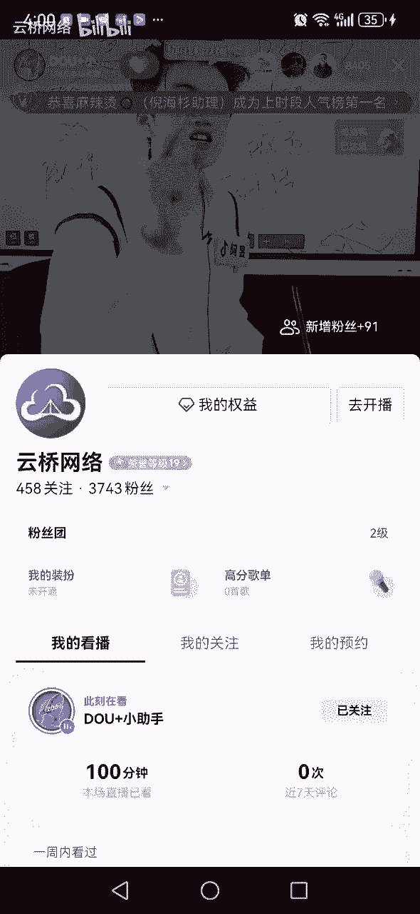

你给我打个行，认为自己不行的，给我打一个不行好。

评论区说老师啥叫口播呀，来啥叫口播。

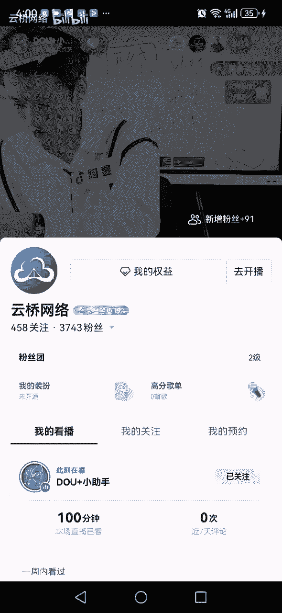

看好了，发现了吗，现在发视频根本不涨粉丝，就算你的流量多也不涨粉丝，为什么，因为现在抖音用户他宁愿点赞评论，转发收藏，他都不爱点关注，所以说2024年想看抖音呀，靠一看到了没有。

口播就是要跟阿玉老师一样，面对镜头，叭叭叭叭的通过嘴，观众只能看到你的脸，通过嘴巴去输出，谁行谁行，谁不行，告诉我你看他们去说，你看老师我太行了，哎呦我的妈呀好，那我们就以口播举个例子啊。

老师怎么能知道自己行不行呢，好那首先你要知道口播对什么要求高，口播对什么要求高，口播对表达能力要求高，对镜头感要求高，对表现力要求高，对情绪要求高，你要是老师，我面对镜头，我能把我的情绪哈。

我能把我的表情里咔，我能表达出来，那你就行，这里面只要有一个不行的，不要去拍口播，因为你拍不火的，因为你拍不爆的是吧，你真的不要去拍，那你就往下走对吧，来试试VLOG是拼音，记住你的生活呀。

记住你的素材呀，然后去加一些你想说的话，同学们好吧，所以说我们大家同学们通过这个例子，同学们想要告诉你的什么啊，想告诉各位，像我们直播间很多人现在做抖音，同学们，你没有考虑这么多。

你只是听了每个某个老师让你干嘛，你就干嘛，那不行啊，你要考虑一个问题，你是是你在做抖音，不是我在帮你做，是你在做，你最了解你自己了，OK吗，同学们，OK打个OK好的，那接下来的时间啊，这是形式，好。

老师啊，你帮我选个形式，我不能帮你选，因为我不了解你，不认识你同学是不是自己选个形式好，那形式搞定之后呢，接下来时间开始干嘛呢，开始输出制作对吧，那么制作我们要干嘛，我们有几个点。

比方说第一个选题我就快速讲了记笔技巧了，选题对吧，哎选题第二个拍摄，第三个剪辑，这里面拍摄和剪辑真的不难，真的不难，同学们真的是可以通过个把月练会的，因为他要求不高的好吧。

同学们这里面强调一个强调一个四个字叫做，黄金三秒，大家把黄金三秒裹起来，拍摄剪辑的时候，同学们注意了，你的视频开头的前三秒钟很重要，开头如果拍不好，整条视频流量最差，开头拍好了，整条视频才有机会爆。

所以我要把精力爸就是你的脑子，一定要像我这个视频怎么弄，开灯开灯怎么弄怎么弄，一定上不去，跟我一样，怎么就开头怎么弄好吧，然后第四个第四个第四个是什么，告诉我第四个答案，还有一个文案。

这里面最难的是啥呢，最难的其实还不是拍摄剪辑，最难的是选题文案，选题文案这两个是最难的，因为这两个是要干嘛，动脑子想想想，我要找，我想与你到处搜集，到处找，但是拍摄剪辑这个真的是可以练的。

同学们真的是个把月真的就能练会的，有的人他拍的并不咋地，但是他真的是爆了，为什么呢，选题好，文案好，所以你你只拍不好，剪辑不好，但是这两个好，他能把这个盖过，那把这个盖过好吧，同学们什么新闻啊。

你今天发视频，你到底要说个啥对吧，你到底要聊什么，到底要表达什么，你像我们直播间有人说，老师啊，对于我来说文案简单啊，我就去抖音找找文案的啊，有的人拍抖音文案录制女人呐，对自己一定要好一点，人生啊。

不过就是这么1万3000来天对吧，同学们这样的文案没有人看，不是随便找段话给我们上上课，灌灌鸡汤，同学们，2024年励志鸡汤文案已经没有什么，太多人爱看了，什么人生格言啊，同学们什么人生意义。

这些文案已经过时了，能理解吗，大家关心的问题，同学们不是这些了，关心的问题是她，你们说一个女人，她关上关心的是婚姻，婆媳关系，亲子教育，家庭矛盾，女性独立，女性情感，女性什么成长，关心这些男人关系对吧。

没人关心是怎么和对吧，怎么怎么怎么怎么创业，怎么赚钱是吧，同学们人性的秘密对吧，酒桌文化等等等，同学们是这些同志们，而你呢你拍视频啊，人生如意啊，人生没有不努力的，人生跟咸鱼没区别。

这些话同学们10年之前就传遍大江南北了，你到现在还这么发，所以你和我说，阿玉老师，我的文案啊简单，同学们，你是简单，但是你简单的文案火不了什么对吧，这个文案同学们不是那么随便的，就就OK的好。

我们刚才讲了很多很多特别干货特别干货，同学们是不是，这也比你，你知道我们直播间有一些朋友们去听课，去学习，去一些直播间，这些直播间主播根本都不露面，根本都不露脸，但是他他是怎么直播，他就拿个手机。

拿个手机来看好了，他这样说，家人们，今天我教你五招，教你五招快速上热门的方法来，第一招打开抖音，在后台，在后台设置，把你的流量开关打开，第二招发抖音，不要点开加号键发，点开加号键发不火。

我教你如何正确发抖音，第三章，我来我来告诉你，你的账号有哪个地方要打开，你就不服了，但很多人喜欢听这样的课，听什么，听一招上热门的课，听流量开关的课，听流量密码的课，直播间好几千人的群，都把我气的呀。

都嘎嘎的给我气的，这节课听完以后感觉特别爽，感觉特别幸运啊，终于老师你太厉害了，原来我不上热门，是因为我不知道有开关啊，一个月以后别说一个月了，半个月以后别说半个月，一个周以后你就能反应过来，我被骗了。

不用一个招，你就发现没，所以有人找我啊，于老师，你能不能告诉我流量开关在哪里开，找到我这了，给我气的呀，开啥开关，煤气开关是有，还上了热门开关，同学们，你摸摸你透底有没有对吧，你哪有开关。

你要是开关开火了，真火了，同学们，你就有意思来，那接下来时间同学们我们就往下讲看，刚才说出了对吧，你一个视频这么拍好，那么拍完之后就能火吗，不可能是吧，你还得拍还得拍还得拍，那么现在的抖音和过去不一样。

过去抖音基本上30条就能干嘛呢，播放量就能起飞，就就能有很高很高流量30条，而现在的同学们30条不够的，30条不够的，同学们好吧，你最低最低同学们，你也给个100条，100条什么真的100条好吧。

当然当然这是一个平均线，平均线，你说大多数人看嘛，有的人天赋或者说基础的能力强一点，有的人弱一点对吧，平均100条，同学们，但是这里面如果你的进步快，你够努力对吧，你够你够坚持，比如说你经常学习好吧。

你可能50天是吧，你有可能把播放量拉起来好，什么叫拉起来，同学们把播放量能拉到大几千大大几千上万，这是我们所有小白小白，我们的目标，小白的目标，同学们让，好吧，同学们小白目标一定是这样。

这是一个最起码的做抖音的线，最起码的线达到这个线之后呢，我们就可以考虑下一步了，达不到对吧，你就得努力，同学们好，那么这个事情什么十个粉丝1万播放量怎么样，优秀对吧，但是同学们，咱说归说啊，咱们得说好。

你的播放量得分清什么播放量，你的流量是什么，因为在抖音流量分两种，一种叫做精准流量，第二种叫做泛流量，什么叫精准流浪，什么叫泛流浪，同学们听好了，我给你举个简单的例子，今天阿育老师出门上班，我一出门哇。

下这么大雨，掏起手机录个抖音，哎呀家人们北京下大雨了哎呦，然后我发布了这么个视频，突然跑了九九十万播放量，一直在跑，跑了90多万的播放量，请问大家这个播放量能挣钱吗，我跑了这么多的播放量。

抖音能给咱钱吗，抖音能给咱钱吗，不能是吧，为啥不能，这个叫这个90多万也好，100多万也好，你们记住了，他是什么泛流量，啥叫泛流量，同学们，人家不是说因为你这小伙子，因为你这个人不是冲你来的。

而是冲这个雨来的，你明天你发你，你明天再发个视频，你就会发现播放量没了，所以泛流量的这个这个这个为什么泛流量不好，因为来的快，走得快，不持不长，久不持久，不属于你的，他只是刷到你了。

正好他和你是一个地区的，哎发现哎呦，下下雨了，然后评论区哦，好大雨怎么滴，哎，划走了，他对你他刷到你，他都记不住你的账号名字，他的他根本对你根本留下不来印象，看到没有，为什么，那那那有什么用途性呢。

是不是总不能你你卖鱼吧，你挂个小黄车来，一号链接一级雨，2号链接二级雨就不可能不行，是不是就是同学们看精准流量才是王道对吧，同学们好。

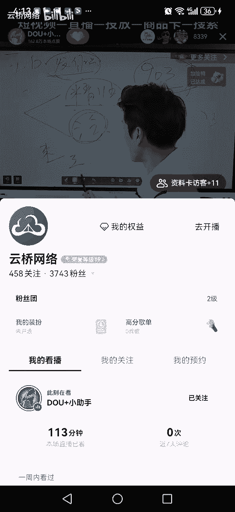

这个就明白了吗，明白大明白，那么阿玉老师再问你一个问题，同学们，如果说今天今天啊你发视频是你自己讲。

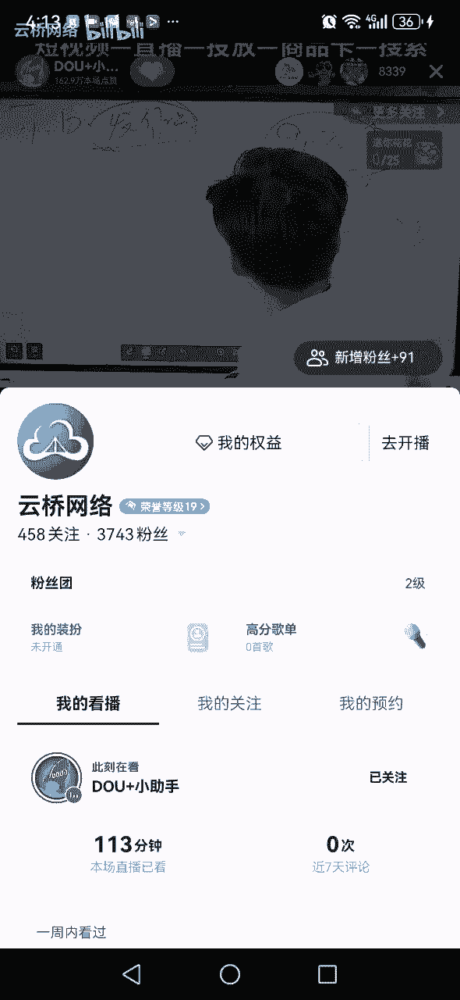

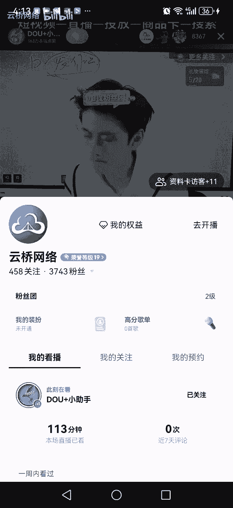

你自己讲你的故事。

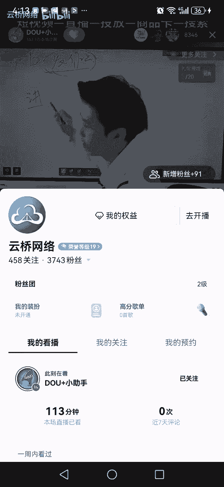

讲你这30多年。

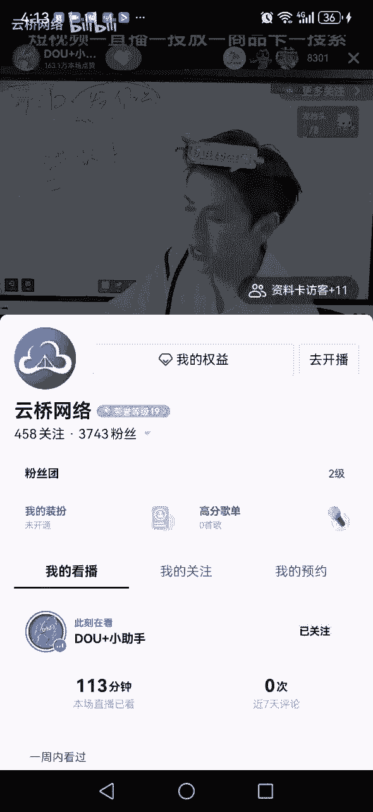

遭遇的不幸对吧。

历经的辛苦，这个视频突然爆了300万播放量。

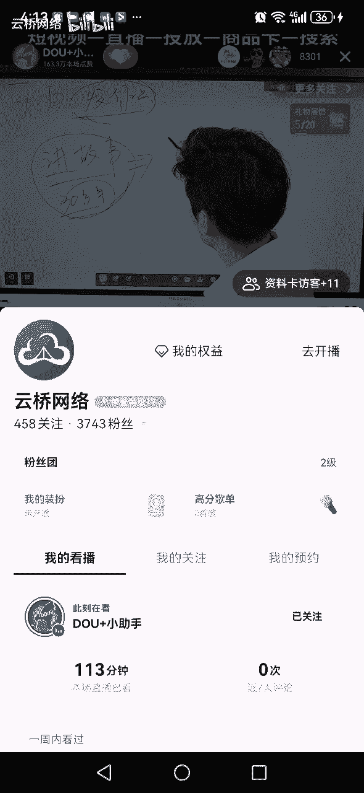

朋友们，这个播放量是不是精准流量嗯。

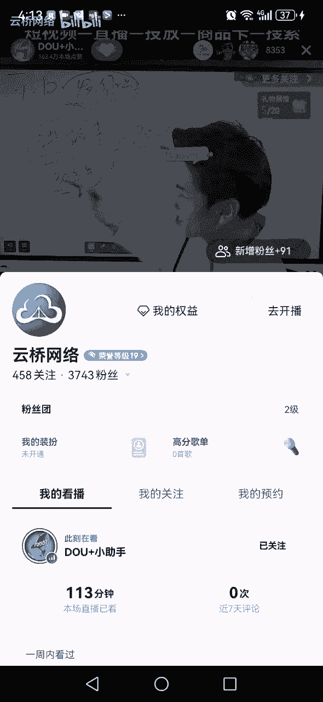

好答案是这个播放量是精准的，为什么，因为他们是听了你的故事，他们是听了你这个你这个很不容易哇，这个女人不容易啊，这个女人叫小娟姐对吧，阿姨小娟，你真不容易，真真好，太太励志了，哎呦我要跟他学习。

我如果发生这种事，我真的坚持不下来，太优秀了，这叫精准流，让大家崇拜你，大家喜欢，大家觉得你人不错好，那么现在问题来了，问题来了，如果未来咱们直播间8000多人，人人每个人同时咱们都遇到了这个情况。

请问你的，如果是你，你下一步会干嘛，如果是你，你是他，你下一步会干嘛，这个时间考验考验我们大家的认知逻辑，看看你们的逻辑，你下一步如果你是他，你下一步干嘛，看评论区，看评论区。

同学们看看他们那个答案是啥，现在是抖音官方直播间左上角点关注，点关注，加双击，点点赞，点点赞，感谢各位各位来，忘记的事，下一步干嘛，同学们告诉我啊，好我们直播间大多数人回复的没毛病对吧，同学们哎。

没毛病，大家都说了，老师我啊，我如果是这个小娟姐，我一定开直播来同意开直播吗，我觉得这个这个回复无可厚非，同意对吧，对他一直不对，为什么对啊，因为你视频爆了，你开直播就会有人刷到你视频的。

说哎呦小鸡进步如炎阳，还直播呢，我去看看吧是吧，你直播间还能接流量接流对吧，同学们好，但是但是我们直播间有人说，老师播啥呀，来如果你是娟儿姐，你播啥，你视频拍的是你在讲你的故事，讲你的经历。

讲你这30多年多么不容易，多么辛苦，但是你依然的义无反顾的为这个家庭付出努力，为这个家庭你付出你的一切，你很励志，你播什么，同学们，难道说你开直播唱歌吗，难道说你开直播跳舞吗，难道说你开直播。

你秀秀颜值吗，打pk吗对吧，开直播干嘛，一定是继续边干活边直播，因为大家是认为你很不容易啊，你很辛苦啊，然后去你直播间发现你还在干活，还在对吧，做家务做做饭还在辛苦。

这个时间是不是会有人视频没关注你的人，在直播间关注你，然后你边直边干活，边直播，你就可以聊一聊对吧，你没有家庭，这个情况是这样的，同学们这样子，如果你说老师我特别能说，那你不用边干活。

你就开直播坐在这儿对吧，同学们来找一个角度去讲你的故事，但是同学们相信阿育老师，绝大多数的人口才不好，你口才不好，你不要开直播，欢迎大家，我就是那个叫娟姐，不要这样的，朋友们，你这样子根本不行不行。

是不是想想是不是同学们，你这样子根本不行，因为大多数干嘛，你口才不好啊，你你你说什么呀，欢迎大家，我的小娟姐，太感谢，谢谢诶，谢谢小心心谢谢，很尴尬，同学们，是不是你还不如擦桌子擦汗擦干活。

欢迎各位同学们啊，这是不是欢迎大家，我是小娟姐，我在洗衣服呢，是的哎哟直播间这么多人呐，感谢大家，感谢大家啊，你看，说学会了吗，是不是思路明白了对吧，你看着很搞笑，但这是实话对吧好。

那开直播只是是开直播，你看你的视频拍的是你，你在讲你的故事，讲你这么多年的经历，你突然火了，你开直播好，除了开直播以外，什么也不干吗，不我们要明白一个问题，这视频爆了，他不是一直爆。

他可能三天以后五天以后他就不爆了，他的流量就不跑了，有可能吗，同学们是不是有可能吧，哎这个视频爆了以后，可能三天以后，五天以后视频的流量就不跑了，不跑了，朋友们，你直播间还有人吗。

直播间有可能就没有人了，那你可能就火一个周，直播间这一个周人气高几百人，但是一个周过去之后呢，直播间慢慢慢慢热度下去了，视频慢慢慢慢，那咋办，有没有什么好的办法解决，哎就这个时间同学们大家记住了啊。

这个时间你不光要开直播，开直播只是你要做的事情的其中一件事情，其中之一对吧，那么你还要干嘛，同学们，我们还要干其他事情干嘛呢，同学们，这个事情这个视频我在讲故事，讲我这30多年我的付出，我的努力。

我的辛苦，我为这个家，我为这个家庭，我遭的罪对吧，我很不容易，然后报好，报了之后，下一步同学们在第二天。

第三天。

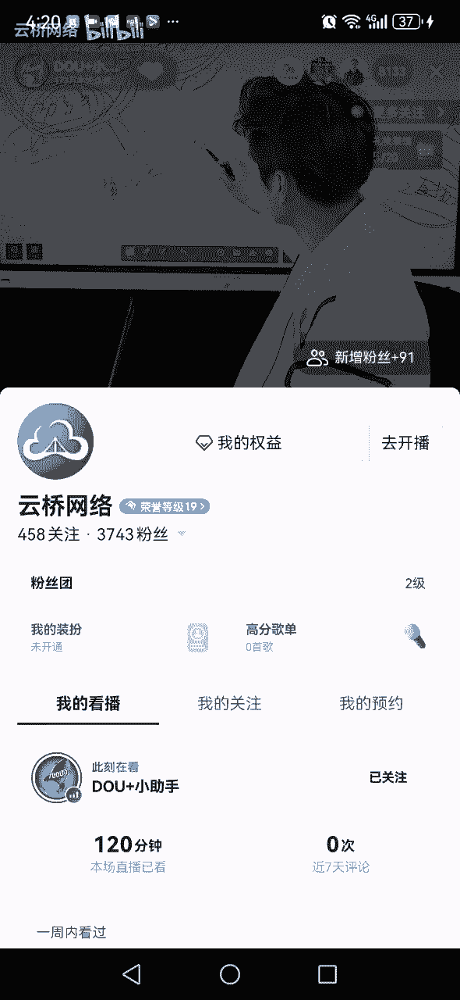

第四天，每一天都要继续发作品来，大家继续发，扣下来继续发，就着这个热度继续发，发什么，同学们，请问大家发什么啊，发什么随便发，不不不能随便发，如果你随便发，完蛋对，还是继续拍你每天干活，拍你每天做家务。

拍你每天做饭，拍你每天洗衣服，还是继续，只是你每只是你可能昨天穿的是白色的衣服，今天穿的是黄色的衣服，对不对，同学们还是继续聊故事，继续说你这么多年你的感悟还是继续。

只是你做那个你那个视频的画面可能变了，衣服可能换了，可能本来第三秒是洗衣服，今天的第三秒是擦桌子对吧，在哪呢，你听到我了吗，同学们，老师为啥这样呀，那这不跟昨天的差太多吗，是要的就是差不太多。

要是差多了，有没有可能你差不多之后，昨天播放量300万，今天播不让3000了，后天播放量500了，什么你不能差太多，你就得跟跟昨天差不多，那老师，那那那有人看腻了，记住了，你才300万的播放量。

在抖音有6亿78亿用户，有的是人没刷到过你，你要做的是让除了这300万以外的人再刷到，你再把这帮人打动了，这帮人是1000万，再把小明了吧，通过三个视频让这1000万人打动了啊，这思路有没有学会的。

跟人家安卓学会的，在哪一个学会了是吧，让更多的人知道你这故事，你这多厉害，完了吗，没完，这个时间同学们直播是不是要一直开着对吧，视频要一直发着，同学们好，我问个问题啊，我再问个问题，看你们的思路啊。

我讲的课后真的真的是直播间，你们真的是以后真的是有的很多，很多很多人去学，学生能带来很多价值的，我再问你个问题，这个小娟姐说，阿宇老师，我连续播了一个周，连续发了这几条视频。

播放量平均都在100万200万300万，流量很好，直播间都是几百人，老师我发现一个问题，我我赚钱赚的不多，直播呢有人刷礼物，但是刷的也不多，不赚钱咋办，下一步如果你是他，你会怎么办，如果你是他。

你会怎么办，对吧，你看咱做狗的同学们，你问题来了，流量流量有了视频，视频录了，就是直播，直播也有人气了，下一步抓紧时间看吧，有人说打pk咱记住了，你做抖音，不要轻易选择，打pk这条路，听懂了没有。

打pk这个路不要轻易选择，但它不适合我们绝大多数的普通老百姓，别碰我，别说话，什么是打pk，打pk不知道家人们没有票了，家人上票了，来人拿根吓我一跳，还剩200分，对面打不过我们了，打这个就这个啊。

还上礼物，上礼物，快上就打pk，咱不轻易打pk，同学们不要给我刷礼物，不要刷礼物，同学们听课就好了，不用刷礼物啊，这里是官方直播间，好吧，哎咱不打pk吧，打pk这东西非常非常伤人，设，来把商人设扣下来。

什么叫商人社恐，兄弟们，你看你看看妈呀，多么不容易，多么辛苦，多么励志，多么对吧，善良多么好的一个女人，你可倒好，你前期给你包装的人设是这样的人设对吧，不容易辛苦，怎么怎么滴，你可能好火了以后你飘了。

你搁直播间来，家人们上上人票了啊，你不会觉得有点不好吗，有点冲突了吗是吗，同学们，你不觉得有点不好吗，所以说你要明白一个问题，大家此时此刻很相信你，很信任你，很对就很你很对，你有共鸣，共情对吧。

这个时间你要利用大家的信任，你帮我们去干嘛呢，去，大家把带货两个字合起来是吧，带货今天录个视频，家人们，我是小娟妈哈，今天给大家分享一个录视频，带货可以啊对吧，你带货这东西我们家里煮果真的有需要。

我还相信你，那我真的是愿意在你这买的是吧，同学们啊，你能理解吗，说是带货是我们大家一定要敢带的货，一定要敢带货，你要是连货都不敢带，你这个账号，同学们现在就没有意思，没意思，没有价值，同学们广告。

你这个事情接不了广告，是不是，所以说带货怎么带货，同学们没有团队，没有团队，最好不要直播带货，没有团队最好不要直播带货，没有经验，没有团队，咱不要直播带货，直播还是做人气，直播还是吸粉丝。

直播还是在在让大家去喜欢，你看你直播去看你去聊对吧，带货一定是考虑干嘛，视频带货来直播间把视频带货火起来，视频去带货好吧，哎一天一个产品，两天一个产品对吧，这样子这个思路好吧，同学们好。

那么这个带货一定是卖什么，卖什么货，同学们，请问大家，这个货卖什么，一定是要卖，你通过这个视频，通过直播间，通过这个这个这个这个账号，你的跟你要根据你吸引的人群来带货，直播间把人群扣起来。

你吸引的是宝妈，你就卖一些宝妈会买的东西，你吸引的是什么人，你就要卖什么产品，根据人群来带货，你要看看你这账号涨的粉丝呀，你的播放量呀都是什么，男的女的，老的少的对吧，结合这个来带货，OK吧，同学们好。

这里面同学们有两个点没没具体展开讲，现在展开讲好吧，这里面有两个点没具体展开讲，我教教你刚才具体讲，刚才讲的细的是怎么拍视频，怎么去发作品，怎么能造，怎么能火对吧，刚才讲的是这个。

接下来时间讲两个一怎么直播，二怎么带货，有没有不会的，不会现在学以后学晚了，等到机会给到你了，你再学晚了，你要怎么，各位是不是晚了，同学们，机会来临的时候要抓住来，不会直播，不会直播的，不会带货的好吧。

各用10分钟给大家讲讲，学会它啊，花10分钟学会它好吧，这两个是分开的，这两个是分开的，怎么直播，怎么带货。

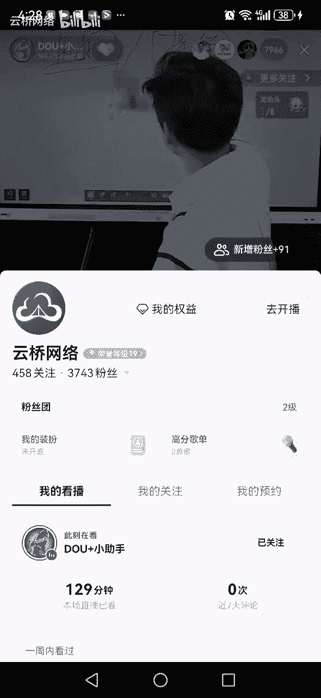

直播对吧，我们说了，咱也咱不是，咱不是通过直播来带货，咱是通过直播来做流量，涨粉丝，接流量带货。

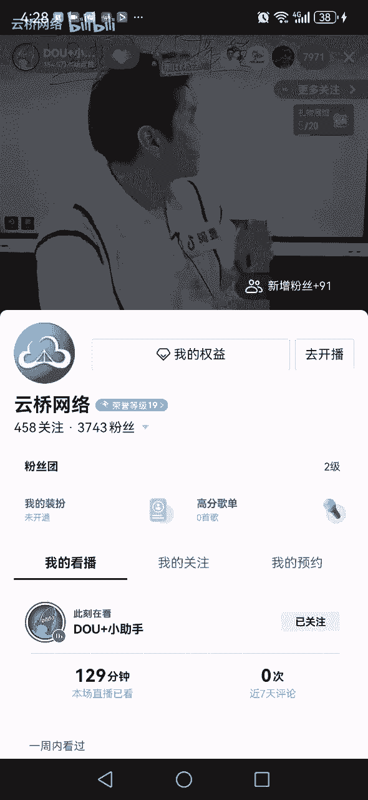

咱说的是短视频带货对吧，同学们好，这两个来教你现在学会。

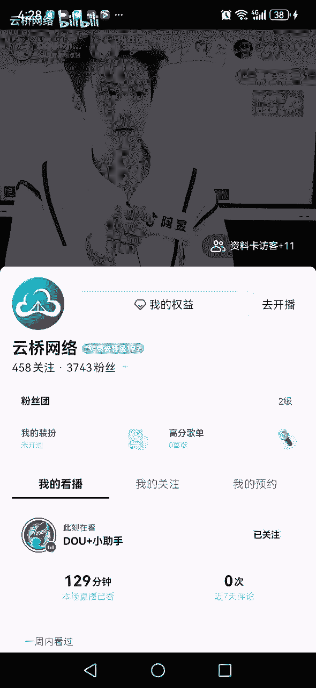

现在学好吧，讲之前给大家安排一波福利资料啊，同学们，你会发现我今天讲的很卖力的好兄弟，希望你们能学会这个左上角没有关注我们，官方关注一下，亮一个灯牌点赞，同学们点赞，现在安排个福利倒计时5分钟。

54321好，给大家上一个小风车，挂车的一个数量限制，跟粉丝相关，五秒钟结束时间，5431好，再拿上一个不能触碰的红线，一共八个方向，全平台任何地方都不可以触碰，抓紧时间一定。

这个是非常非常重要的学习资料，抓紧时间截图，五秒钟，截图时间，54321好，再给大家上一个咱们商家选品的考虑因素，抓紧时间截图了，54321好，都截到了吗，截到了我们小散了，来朋友们收到了吗。

收到打一个收到，感谢各位，今天的时间我们来讲一下怎么直播。

怎么带货，同学们好好听好吧，这个直播是这样的啊。

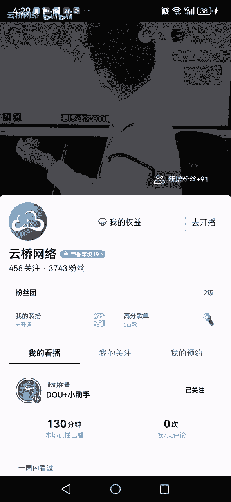

好兄弟们，这个直播我们大家不要考虑太多，你像我们直播间很多粉丝这么想的说，阿玉老师啊，听说直播得有设备，直播得有什么什么团队，直播得花钱不直播，不要太多设备，直播不用花钱，直播一个手机就在家里面就可以。

一部手机就在家里面直播，同学们，对不对好，那么这个直播同学们，他是许他是不是你们想象的，拿个手机开播就有人气，不对吧，我给我粉丝们讲一句话，我说如果你现在想搞直播，阿玉老师，说实话，同学们。

比方说你视频爆了，你直播间确实首播，第一场可能人数都是几百人对吧，但是如果你视频不报你粉丝不多，你开直播，我问你100个人，啧啧容易吗，你视频不报你粉丝量不多，你右上角想做到100个人容易吗。

不容易对吧，挺难的，所以说同学们在抖音网上的主播怎么说，网上的主播说说家人们，我的账号就是零粉丝开播的，我首播就破百人了，我为啥破百人呢，因为我用了八个步骤，七个流程，三个方法，两个秘诀，一个流量密码。

今天我把这八个步骤，七个流程，三个三个环节，一个密码，我分享给你们，你们按照我这套词，你们也可能把直播间起飞，起飞了吗，同学们这么容易飞吗，同学们啊，你缺的是八个流程吗，七个步骤吗，三个密码吗。

两个开关吗，一个一，给评论区呼吁的够呛，你把评论区的老师给被被惠子够呛，哎呀妈呀，一个劲儿记笔记，八个步骤，六个流程，七个G，七个方法是三个换环节的，哎哟天呐，气死我了，都一个个的。

真的不知道是什么鬼对吧，同学们，这些都是假的，我告诉你，这些都是假的，根本就不是，我不信，如果有这么固定的词固定的话，这个话谁灭谁火，谁夺谁上人，同学们，这个抖音太简单了，你们都不用上班了。

你们就在家里面拿着稿，今天啊开播了啊，首先八个步骤，第一步，第二步，三个留省队，你这还还还用上班，同学们，你随手一嘟一捏，就所以说我给大家讲一下，听好了，我给我的粉丝们怎么讲课，我说你们记住了。

你们做抖音，你们开直播前期不要听他们瞎说啊，什么前七场啊，什么前前七场前十场啊，说你播不起来号就废了啊，说首播必须得冲到百日，同学们买对吧，假的记住了，小白们，咱们直播间新人们记住了。

咱们开播前期就应该评论区说这句话，老师我不抗忽悠咋办，给自己两巴掌，不抗忽悠是谁，不抗忽悠就自己呀，把你的逻辑底层逻辑，你你你点一点的，你给他摸透了啊，同学们，他不抗忽悠，说是不抗忽悠还是钱多。

不抗忽悠来前期开直播直播间，大家都记住了啊，你就是几个人，你就应该几个人，几个人争吵，什么鬼啊，零人这么长，除非你是五个人，八个人，那不正常，你找我，我帮你找官方对吧，你是你零个人几个正常。

你别给我耍小诗，我怎么右上角显示个三负七负八，那那确实不太对劲，同学们，那你是你是用的是盗版抖音开直播对吧，因为没有负数，同学们怎么还能该抖音人啊，哎呀妈呀，还该账还欠账了，你，所以说啊大家记住了。

前期开直播没有人正常老师啊，他们来了就跑是啊，不跑干嘛呀，你在直播间说的话都谁能听见，你自己开直播，你都尴尬的慌，你都没词儿，你都不知道播啥，你都不知道干嘛，都想问谁在你直播带你听，除非他认识你是吧。

那老师那怎么办，来我来教你好，首先如果你要搞直播，刚刚说了对吧，我再说一遍啊，开直播要考虑自己，你自己口才行不行，你有没有那么多话要讲因果，有没有那么多话题要说对吧，你表达表现力这些你行吗。

你只要说一句，老师我不太行对吧，那么你记住了，你不要，为什么开播，欢迎大家来到我的直播间，晚上好，老铁们，换一个，你就歇歇歇歇啊，你搁那欢迎大家来不一，那天有个粉丝让我去看他直播这一场直播，光说啥了。

哎让让我看他直播地上直播，欢迎大家哈喽，欢迎各位欢迎豆豆，欢迎漂泊的狼，欢迎燕，欢迎小女子穿搭，你这是欢迎直播间，你这还你一进来就滑，啥话不说，光欢迎去了，播了一个小时，从头到尾一直在怀疑一个同学们。

你到底说点别的词啊，要不就hello了，就感谢了，就仨字儿，就仨话，哈哈喽，感谢欢迎完了，你这迎宾直播间对吧，好兄弟们，所以说你只要口才表达话题没话的，同学们啊，你不要在直播间搁这纯搁这尬聊。

咱这叫尬聊，别再说老师怀疑你在模仿我，你真这样啊，哎呀妈呀，太人才了啊，不愧是你抖音的人才，不愧是抖音记录美好生活，你可算是来了，我给你们讲一下，同学们，那那老师那该怎么办该怎么办，我说了。

不要尬聊的意思是不要人，你本来就没还，你本来比我大就笨，本来口才就不行，本来表现力就弱，那你就不要让别人一直盯着你的脸，你干嘛呢，你一定要找件事边做什么事边直播，刚才说了对吧，要干边干活边直播。

那你开直播洗衣服吧，欢迎大家来到直播间，呼啊感谢大家啊，我是那个紫兰姐，欢迎各位来我直播间，你看来家人们有没有叫你看你是吧，我举一个最简单最简单的例子洗衣服对吧，吃吧我去欢迎各位来到直播间啊。

哎这是咱们东北的大酱菜啊，你们你们诶对，就这意思啊，这意思是吧，OK这时候开直播，同学们开直播也要找到自己的短板扇啊，同学们好。

