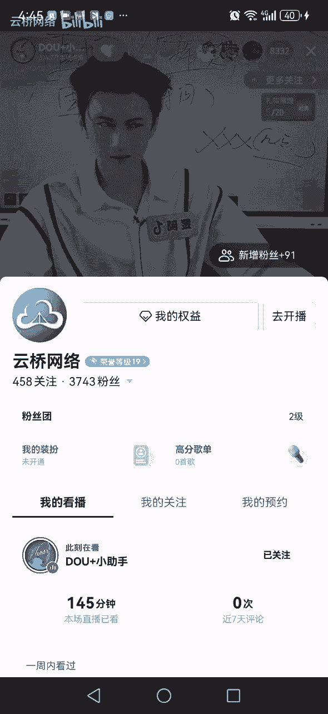
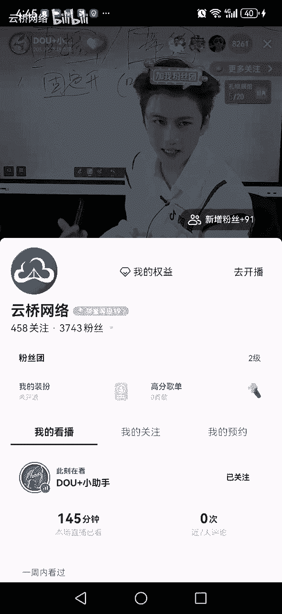
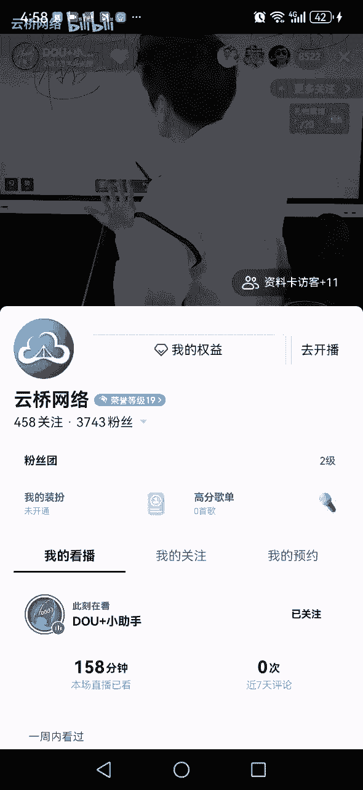

# 抖音运营起号变现方法及注意要点官方直播回放-阿昱老师讲解 - P3：SVID_20240430_151628_3 - 云桥网络 - BV1vJ4m1E7nQ

接下来时间我们再往下走，怎么播怎么播，同学们是吧，这个播同学们注意了，你知道我们直播间有的人开直播，开播了，开播以后呢，怎么没有人来呢，人呢没有人来呢，哎不播了，有个人开直播，播了5分钟。

播10分钟下播跟我说，没有人不下播，老师干啥呀，同学们，今天我告诉你啊，记住了啊，开直播大家必须记住一点，直播间，你开播以后，你不要给我等人，不要等人啊，什么叫等人啊，开直播搁这等着还不来人呢。

人呢不要等对吧，你不要管右上角它显示的是零是一是二是几，别管这个，哪怕他是负数，你该咋地咋地，该咋播咋播，你就播你就得了，老师啊，那没有人播，给谁看呀，同学们，谁告诉你没有人的，你就好比说我现在来。

现在我直播间你看到这显示多少，我右上角这显示多少，告诉我8000来人对吧，8000多，同学们，我给你们讲一下，我直播间除了这8000人以外，我直播间还有300个人在哪，在我直播间的门口。

通过猫眼在看阿宇老师直播，不信哈，呃现在请问谁在我直播间门口请进，不要逼我动手请进，请进，不要逼我啊，我一会儿动手容易，那啥啊，进来了，刚才谁在门口的走进，那同学们就这意思是吧。

所以所以说我们大家要知道一个问题啊，因为在抖音直播间，你看你现在在开直播，直播间有很多人刷到你来回的流动，门口是有流动的人的，你直播间不说话，什么也不干，你就在等着人，人家不进啊，煮了你这显示零人。

所以你开直播一定是不要管，右上角几个人该怎么播怎么播，同学们能明白吗，明白大家一个明白啊，老师他们真来了，真来了，来保镖呢，呵呵来就来吧，兄们还真来了，这是他们又不会吃，咱们来，咱们接着说是吧。

好说开直播，开直播是这样的，同学们，那怎么开播才对，同学们啊，开直播咱们是有什么，咱是有逻辑的，不是随随便便的，开直播，来几个放几个点，第一个开直播不能随便开直播，不能随意开直播啊，什么叫随便开直播。

今天播一会啊，明天不播了，后天播一会儿，晚上再播一会儿，第二天早上再播一会，那不行，那开直播应该怎么播，同学们来吧，几个几个关键啊，大家把关键两个字合起来啊，几个核心，几个关键。

第一个同学们开直播要干嘛呢，要固定，要固定开直播啊，要固定，什么叫固定，同学们啊，固定固定开直播的意思是什么，是如果你要开播，同学们怎么样，你不能今天早上播，明天晚上播，后天下午播。

你要固定你的开播时间，固定你的开播时间好，讲到开播时间了，现在啊，咱们统计一下直播间谁的抖音名是这么写的，看好了，特别特别厉害，谁的人谁谁的抖音号是这样的，某某某几点几点直播，你是这样的，你给我打个一。

给我打个，我，同学们看评论区，好看没问题啊，于是乎你就能看到各种各样的奇葩搞笑的点来，比方说啊这个朋友老师啊，我在中午的12：45分开播，差一分也不行，现在是12。44分，还差一分钟，我就要开播了。

还差五秒四秒三秒二秒一秒开播，怎么着，差一分怎么地啊，时辰不对，不伤人是吗，来我们再来看下面的啊，你看这个朋友诶，你看这个老师，我是怡芳姐，我首播5月6号下午02：26一芳姐，找的哪个大师啊。

给你算的呀，前两天我刷抖音刷到一个直播间，你知道这个直播间干嘛的吗，大师直播间，哎我笑坏了哈，这个直播间是这样的，大师戴个帽子，整个那个墨镜呢，这边还没没没，这边是黑的，这边是白的，来请上麦啊。

哦叫小兰姐是吧，小兰姐呃，今年芳龄多少啊，62哦啊不能叫芳龄了，那就贵庚了啊，呃属什么的啊，家里几口人啊，孩子多大啊，好来嗯，多出来什么节啊，小兰姐小兰姐啊，你适合在下午03：48分开直播啊，走吧。

不是你要结婚吗，啊你要结婚吗，心脏不是你要结婚吗，同学们，你至不至于啊，还找人算点，真是我是被你打败了，算那个点好使啊，啊看的1分1秒怎么给你发火箭。

那个呢，54321到点了，开播，哎呀气死我了，不要刷礼物，同学们啊，别搁那刷保证谢谢，不要刷保证，谢谢谢来吧，你接着说啊，所以说我们开直播，同学们时间时间时间有老师啊。

他们说开直播的时间不能再整点，他们说不能再整点儿，为啥呢，你得整点啊，大主播的开播的时间，大主播人家就是整点开直播，8。9。10。11点啊，大主播多整点，咱们再整点直播，那就完蛋了，那咱干嘛，咱就是吧。

咱那个那个那个咱抢不过人家，人家开播再开播，咱能抢得过吗，咱错错错开，他们避一避，听过这个吗，听过打听过这个全网都这么说的，所以你看你看我们直播间，好多人开直播的时间点，他们没有整点的，他们绝对是3。

26，4。38，5。43对吧好，那么是这样的吗，今天阿育老师告诉你答案是啥，答案是抖音的流量机制，它是赛马机制，什么叫赛马机制，同级别同级别的直播间去比赛，同级同级别的直播间互相有竞争，什么叫同级别啊。

你是万人主播，你跟外人主播比，你是10万加主播，你是跟10万加主播比，你是千人主播，你是跟8000主播比，能理解吗，你俩直播间的流量级别一样，你俩互相去比，所以头部的跟头部比，腰部主播跟腰部比，同学们。

那我问你个问题，好，人家头部主播整点直播，你和我说阿玉老师，我要不要避一避，怎么滴，你也同步的呀，啊咱是哪个部，咱不清楚吗，同学们告诉我是哪个部，你还和头部的多，你还说老师我我我我我不跟头部抢了吧。

你是哪个部的，是腰部吗，你连腰部都不算腰，下面是在下面点对吧，这边就不太不太好讲，再往下讲什么东西，腿部咱这腿部都算不上直播，现在个人都没有，咱就往下点，下面是哪儿了，下面就是脚臭脚丫子了对吧。

脚丫子不来，有人说老师脚丫子都不算，那咱就脚趾盖布了，脚趾盖不算，那就没步了，同学们就没了对吧，脚底板布了，就你还搁那老师头部主播开播了，我也我就不开播了吧，我怕影响不是影响我，你俩都不觉。

互相都不是一个级别，你还躲一躲了，给直播间有事笑抽了是一哈哈哈，我没往下讲来，接下来时间我们就往下讲啊，那开直播除了啊除了这个开播的时间以外，还有什么是关键，同学们来直播的场次，对直播场次。

同学们直播场次，直播间你要开播，老师能不能这样，就是我今天早上播一场，播完之后我去吃个饭，然后我再播，播完之后我中午吃了个饭，我下午再播下，播完之后晚上吃个饭，晚上再播，能不能这样。

同学们能不能动不动就开会播，动不动开会播能不能学，答案是不能开播的场次啊，同学们，咱们说好了，如果你一天开多场直播，多场直播会怎么样，会导致一个问题，就是直播间流量就来的人啊，来的人越来越不精准。

不精准会导致啥呢，来了就走，来了就走，你不管怎么播，来了就走，能理解吗，所以开直播的场次，每天你就一到两场，最多的一般就是一场直播，联系好的可以两场，一般就一场，同学们这跟上了吗，跟上了跟上了啊。

好这个场次说完之后呢，哎每场得播几个小时，同学们来，那请问大家每场得播几个小时，网上有人说了，说开直播啊，一场得播三个小时，说三个小时你下直播是最好的，因为三个小时抖音是最喜欢的是吗，同学们哦。

你开直播播了一个小时，直播间一个人没有，你再播一个点，一个人没有，你播三点直播间一个人没有哦，你播三个点哦，抖音喜欢你，抖音是没什么喜欢的吧，同学们，抖音喜欢你对吧，你连个人都没有。

所以说这个开直播的这个时长我们先说好了，第一个太久没必要，特别是咱们这种小白太久没必要，太短也不行，因为太短了，抖音不愿意哎，开短抖音还不愿意，那请大家多短抖音就不愿意了，知不知道10分钟半个点一个点。

同学们猜猜啊，新人各位，这里是抖音，刚刚直播间左上角没有关注官方，同学们关注一下，亮一个灯牌啊，我是阿玉老师点赞，感谢各位，欢迎各位今天来听我的课，同学们，我是阿玉，这是我的名字，阿玉来对。

这这里呢我回复一下啊，太短不行，那多短不能少于多短，同学们来吧，我说一下，如果你是一个老主播，播了很多很多场了对吧，30分钟，是你的最低30分钟，如果你是一个新主播，才播了几天，几场十来场好吧。

45分钟，记不记得我们记住了，打一个记住了对吧，好阿里老师给个建议啊，我们一般来说提倡大家播够一个小时，过一个小时，同学们好吧好，这是开播的时长，那接下来时间有一个问题，同学们好好听。

就是直播间开播以后，人气流量怎么就能够1。1。1点的往上走，同学们，你看我们官方直播间，他右上角他稳定吗，他不稳定，他一会高一会低，一会高一会低，你翻翻下来，你们看着一会儿高，一会儿低哦。

直播间人怎么能往上走，什么是关键好，有的主播这么说，他们说直播间人多之后呢，大家要给你点赞，点赞越多，直播间会被加热，直播间上人就越多，点赞越多，直播间会被加热，上人就越多哦，那到底会不会呢。

同学们点赞一个直播间，点赞多了以后，直播间会不会被加热，人气会不会变多，老师不知道啊，不知道咱来看看呀，同学们来直播间，我们一起看看啊，现在双击123456左上角点赞，现在是214万好吧。

现在直播间的人气是8100人，来同学们一起点赞，一起点赞，一起点边点赞边告诉我直播间的人会不会变多，变多了没有，自己看看，同学们再看看你边点赞，咱们每个人在点赞点赞点赞右上角这个位置。

同学们人他变多了吗，仔细看自己看我们五秒钟之后，大家看结果好吧，直播间点赞多了，这么多人在点赞，咱们现在有8000人对吧，这么多人在点赞，人会变多吗，好五四看结果了，321来告诉我读没读，刚开播了。

啊多了，老师妈呀，刚才是888888千一，现在是八千八千三百八八千三百七八千多的，多了好多人啊，好，那能说明直播间哦，点赞能加热，然后就能上人了，是不是阿宇老师告诉各位错，错我回答错误不对，哪错了。

来听好了啊，首先刚才直播间我们大家一起来点赞，直播间人变多了没，确实变多了，但变多了是不是因为点赞变多了，答案是不是想不到吧，不是为啥，不是来请听好，因为直播间听好了，同学们直播间的数据。

抖音划分了两种，第一种叫做底层数据，也叫核心数据，第二种叫浅层数据，也叫互动数据，什么是浅层数据，点赞评论，送灯牌，送礼物，这些叫浅层数据，也叫互动数据，包括分享，这些都叫浅层数据。

那浅层数据咱比方说点赞吧对吧，点赞抖音是5分钟，对直播间统计，赛马5分钟，赛马5分钟比赛，5分钟比赛，这这5分钟你的点赞，比方说获得了二二十万，好比同领域的直播间要高，那么这个时间抖音就按照一定的比例。

也给你流量，同学们，刚才你给我点赞完之后，咱们过了5分钟没有啊，阿贝尔是顶多过了一分钟让你看人气，说这个时间人不是因为点赞上的，那是怎么上的，同学们，诶，那是因为阿玉老师刚才我抛了一个话题。

我说咱们一起来看看，点赞多了，人气会不会变高，此时此刻，我们直播间所有人的注意力都在看右上角，你们大家都被我是吧拉起了好奇心好，你好奇我好奇都好奇，好奇就不想着离开，好奇就会有了停留直播间吧。

停留不起来，一个直播间停留变高了，直播间立马人多了，我讲得很卖力，同学们，我希望你能明白，所以一个直播间的核心，一个直播间的人到底能不能上得去，为什么今天阿玉老师直播间人气这么高，8500人消费。

就是因为停留好对吧，同学们停留好直播间人气一直在咔咔咔咔看，跟上了吗，跟上打都跟上了，学会了是吧，好那么接下来时间完了吗，美版同学们重点在下面，同学们重点在哪，同学们来吧，那么阿宇老师问一个问题。

同学们如果你想在抖音开直播，同学们，你知不知道开直播之前就是一个直播间，需要准备什么，然后才能开播，需要准备啥才能开直播，同学们知不知道，来我来告诉你一个直播间需要准备什么，才能开直播。

同学们把阿玉老师讲的每一点都要记下来，这些东西都记好了，你再能开播，要不然不行好吧，好兄弟们，讲之前安排一波福利兹啊，左上角没关注，关注一下，亮一个灯牌啊，这里是抖音官方，我是阿宇老师，倒计10分钟。

54321先给大家上一课，如何写视频标题，争取开头黄金三秒给大家五秒钟时间，抓紧时间，结果倒计时，54321再给大家上一个抖音的万能爆款，开头标题，想知道怎么写标题的，抓紧时间截图吗，给大家再抽时间。

倒计时54321，最后再给大家上一个抖音的385法则，给大家五秒钟时间截图，倒计时54321，好，记好了吗，记好了，我们下菜了，来朋友们收到了吗，收到打一个收到，感谢各位，接下来这几天我来说一下啊。

如果你要在抖音开直播。

你要在开播前准备啥呢，同学们啊好好听，首先大多数人在抖音准备开播了，他会准备什么呢，同学们大多数人准备的这个啊，有人说老师啊，开直播，我听说得买吗，得买设备，来，谁买了，咋买了，前两天有个粉丝找我。

阿玉老师啊，我给你说说我都买了啥啊，我买了三个支架，买了两个补光灯，买了三个麦克风，我还买了一个散热器，我还买了这个一个绿幕，我还买了这个啊，一个投影仪，不是大哥，你要开超市啊，啊买个三个支架。

八个投影，122个，两个两个灯光的，又是六个六个麦克风，好像你得卖呀，同学们是不是你买这老些啊，我就问你在直播，你去卖啊，是怎么滴的，你买这些老师啊，哎呀那他说这个好，他说那个好，他说这个指甲好使。

他那个指甲好使，他说这个风好使，这个麦好使，他说这个光好使，那光我就买呗，哎呦我的妈呀，这条件家里这条件趁着这个条件对吧，甚至有的人干嘛呢，还有说老师啊，我不一样，我还买了直播稿，我还买了直播词。

我还买了直播话术，我还买了本书，价值60来块钱吧，然后有的人开始了开直播开播，唉今天是有底气了，有稿了，开播，欢迎大家走进我的直播间，感谢抖音这个TV，感谢各位领导，感谢各位TV，感谢这个值资产早念的。

感谢那个TV相亲怎么滴，中奖了，你啊啊中彩票了，让你过来，获奖感言的给他进来，制定之后讲了20分钟，全是感谢词，感谢谁能给他感谢感谢感谢爹，感谢妈们，你们下感谢感谢，说啥搁这这个这整的现在啊对吧。

开直播先不着急买设备，买啥呀，不着急买设备，对不对，先干嘛，同学们先把你的直播间搭建一下，让大家把搭建扣起来对吧，先搭建直播间，哎你搭建直播间，举个例子，什么叫搭建直播间，同学们比方说对吧。

哎这个场景的选择，背景的选择，同学们是不是对吧，哎直播的角度，同学们是不是哎包括灯光对吧，比如说啊老师我家我们家，我们家这个时间灯光光线好差，那这个时间买个灯光是吧，老师啊，我们家这个啊有点吵。

哎买个麦克风对吧，是这样，缺啥买啥，而不是一下买齐了，再不是缺啥，买啥不着急，因为有东西啊，你买回家之后你用不上，就比方说有的人买声卡用不上，两年前我就买了，我就试两次，再也没使，为啥麻烦我天天得调。

天天得得得得拿出来查线，查线又得连电脑天天得弄，我就试两次，废话还不让我退，说是什么下面有划痕，气死我了，哎呀一个月工资都给我攒起来了对吧，就那个意思，同学们，咱们直播间有好多人买的东西。

你想想你都用不上，就搁在家里就放那了是吧，同学们，所以缺啥买啥，这是我送给那些没开过直播，或者还没有买东西的人，你听我的建议，我的忠告给你记住，同学们，然后搭建完直播间对吧，把灯光啊，背景啊。

场景啊搭建呀，搞定完之后呢，下一步怎么样，下一步你可以干嘛，为了防止你翻车，试播一下哎，直播间把试播过起来，因为咱们抖音有那个什么试播功能，好的试播功能，大家把试播勾起来，什么叫试播。

为什么老师为啥试播呀，你是让我练练话吗，练练词吧，不是试播，是为什么，有的人开直播也不试播，弄好了就播了，播着播着就听那个声音，我转圈了，转圈了啊，来电话了喂，怎么样直播呢啊电话一挂。

直播间本来好不容易20个人全跑没了，能接电话吗，朋友们一共就一个手机，直播呢，还接到电话了，还有的人播着播着咔咔咔咔播一会儿就没电了，播着播着网络就不行了，播着播着哎呦，什么屎拿着就造这个事。

所以说为了避免翻车，你可以试播一下对吧，整个A没问题，好开播，同学们是不是同学们哎，这是为了不让你去练话术，不是让你去练口才，而是让你去调试整个直播间，把整个直播间0~1跑顺了，然后我们搞播。

我们就开始开播好吧，同学们，老师啊，能试播几次，无限次啊，怎么试播，抖音有那个试播功能啊，试播的时候的只有你自己想让谁看，让谁看，他不推流的，同学们明白了吧，好直播完之后呢，然后下面开始准备干嘛。

开始准备直播，但是呢基于我们是小白，所以开播以前我们要做一件事情来告诉我，开播以前要做什么事，知道吗，现在各位，这里是抖音官方直播间，左上角没点关注，朋友们左上角点波关注好吧，然后亮一亮灯牌。

点赞点赞啊，这里是抖音官方直播间，我是阿宇老师，开播以前干嘛上厕所，怎么滴就憋不住了，就非得说这个话是吧，上厕所就好比那天有人说，老师啊，我看你播了这么久也没去趟厕所，你是怎么解决的，我说我用瓶子。

你肯定不知道我这直播间怪就净味，现在呵呵嘿，你怎么憋的，同学们，我怎么解决，我怎么能当你面啊，好开播以前干嘛，开播以前要学会预热，开播前几个小时要学会预热，来直播间把预热扣起来是吧，什么叫预热。

那天有个粉丝，我说的是预热，你说他听的啥呢，他听了一个，这叫热身啊，开播以前老师我听你的，我开播以前我这样子，不是你得是打拳击呀，啊你开播以前你这样子，你这样子，咱说的预热是干嘛呀，是让你去发抖音。

同学们来，大家把发抖音发作品扣起来，发抖音，什么叫发抖音，这个不用我说了吧是吧，这个你要是不知道的话，你可以睡觉了啊，到晚上五点了已经睡觉吧对吧，发作品发作品，然后呢告诉大家对吧，写好预告时间。

今天晚上八点钟，叭叭叭叭叭叭，我要开直播，怎么滴，是不是这个对你直播间有一条不够两条，两条不够三条啊，没问题啊是吧，这根上了没预告，预热完预告完了，然后下面才能开播好，那讲到开播了，我问个问题啊。

开播你你你你你在抖音开直播好，你点击开播键，请问大家是开播以后立刻就有人，还是等会儿开播以后，是立刻抖音就推流，还是要等一会儿，是立刻打，立刻是等会打开，等会，谢谢各位，左上角没点关注，点关注哈。

灯牌没亮，同学们亮一亮好吧，点点赞，讲完这一分钟啊，于老师给他上资料，菲利克大多数人都是两个字，等会我说为啥等会儿啊，他老师啊不得审核吗，他们说发，他们说那个开直播啊，是先审核，审核完之后呢。

审核个几分钟，然后抖音才会给我们直播间推流，大家都这么想的，是不是，于是乎有很多人在抖音开直播模仿一下哈，鼓足了勇气准备直播，开播，呼呼呼开播了，这会儿抖音还没推流呢，正在审核呢，呼呼呼呼呼，沉住气。

没什么大不了的，哪个报纸跟你说的，开播以后要等会儿再推流，要等审核啊，哪家报纸告诉你的同学们，你搁那出，你呜呜啥，你呜呼呜呼半天，你呜呜呜，我告诉各位同学们，你听好了，在抖音开直播，他跟发作品他不一样。

你说发作品你发了以后，抖音先审核再推流，那是对的，为什么呢，你发作品你给抖音提交的是一个成品，你拍好了给他了，你不用改了对吧，你开直播他不是一个结果，你开直播开播了以后，你要实时的一个小时。

要一个劲的在直播间输出呢，同学们对不对，你可倒好兄弟，开直播之前我都开了，播以后播不着急，赶紧不着急，播，搁那呜呜呜，你问我啥，我跟着练功呢，搁这是吧，开直播抖音是怎么样。

抖音是你开播以后同时推流加审核同时进行，你比如说现在我都在抖音，官方这直播了三个点了，我请问大家这三个点的同学们，这这现在都已经播了三个点了，这个时间有没有抖音的审核在审核我，我现在还有啊，我说个脏话。

立马就把我带走了，同学们是不是，所以说他不是说啊，先审先审核，再对一流，不是同学们开播以后赶紧的，该说话说话，该进入状态，进入状态，同学们听懂了吗，懂了懂了，同学们是不是好，然后开直播以后。

赶紧的直播对吧，同学们好，你要你最起码你得播够一个小时，好吧，然后开播一个小时，下播以后做什么，下播以后做什么，下播以后就做一件事情，下播以后就做一个师，同学们什么想想啊，现在各位。

这里是抖音官方直播间，我是阿宇老师，左上角啊，没有关注我们的官方的，关注一下，亮一个灯牌，同学们点赞，然后呢呃这段时间我就要休息，同学们，然后呢有请我们的康康老师来讲课，同学们好。

休息之前我来给大家回复一下，下播以后一定要做一件事情复盘，同学们，大家把复盘扣起来好吧，然后呢一时间我就休息了，同学们，短视频也好，不要走看，同学们有请我们的康康老师继续给大家讲课啊，同学们来上个资料。

54321来给大家上一个直播，竞技想开播，但不知道有时间，给大家两条时间倒计时，54321，抓紧时间截图了，54321，想要的抓紧时间截图，嗯嗯倒计时54321，最后给大家上一个抖音的万能爆款。

开通标题，想要做标题的却不知道怎么做的，抓紧时间截图给大家秒钟时间，倒计时54321，好加油吧，这样我们就要下课了，来吧小伙伴们啊，下菜了，来所有小伙伴们，欢迎大家来到官方直播间，是康康来认识的。

敲名字哈哈，看有多少小伙伴是认识我的啊，我问一下四位同学，有没有小伙伴说康康我来到抖音了，我想赚钱，结果呢我感觉我好像做了俩月，仨月。

