# 拼多多10月最新付费推广开车方法，解剖底层逻辑快速上手。拼多多运营基础实操教学。 - P1 - 老头电商-干货分享 - BV1xkmPYmEtn

开店不开车，流量少一半。但凡你在拼多开店呢是不可能不去做付费推广的。你只要明白一点，你不给拼多花钱，他就不会给你流量的。为了商家更好的花钱，拼多多他一直都在更新它的推广，不会让你们觉得开车很复杂。

所以现在你只要学会怎么调整出价和日限额，这两个数据就能够去开好一家拼多多店铺了。那么像极速起量和全居优选起量呢，其实本质它也就是提高出价，你不会玩的，我们这个可以考虑不去开。但有的就说了。

那这两个数据我看着都头晕，不知道从哪方面开始下手，那下面我就实操教你们一套非常实用的开车方法。首先我们说到出价这一块，前期我们可以猥琐发育，就是先低出烧不动再提高。如果是投餐比的话，你可以先高出。

如果烧不动再降低，每次降5%到10%，然后你逐步提高，直到烧动为止。如果说你的出价已经很高了，还是烧不动。比如说你的利润只有10块，你已经出到20%了，还烧不动，那我建议重新上链。

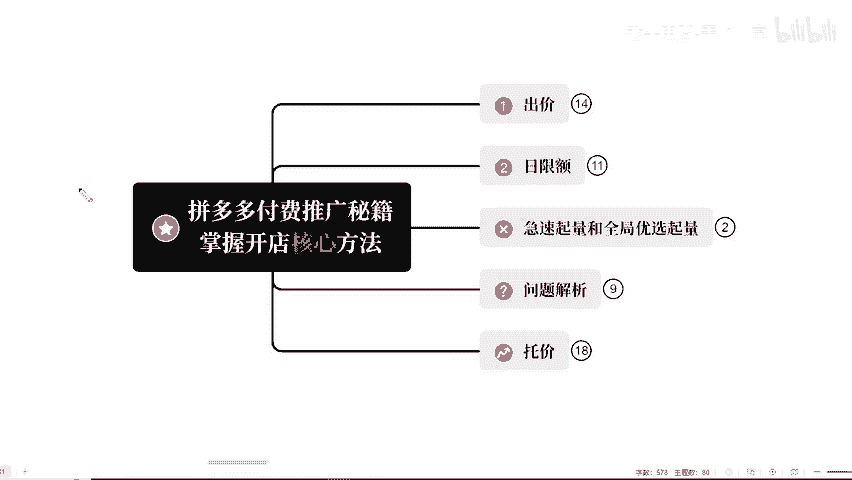

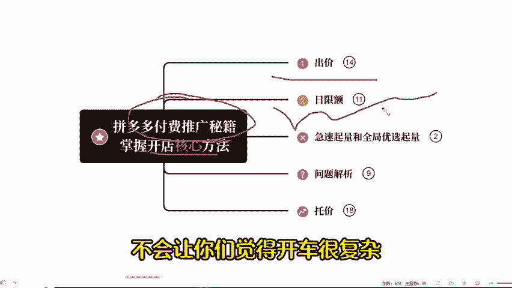

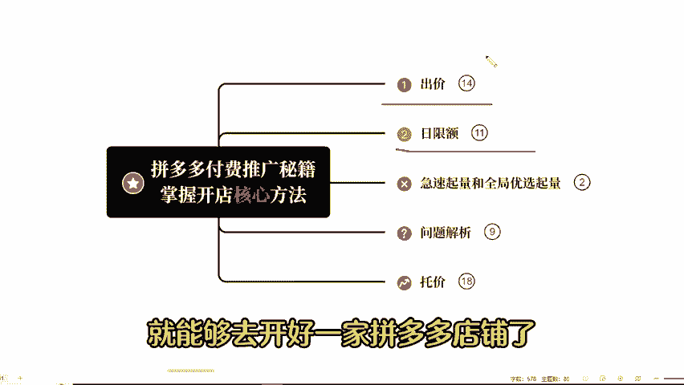

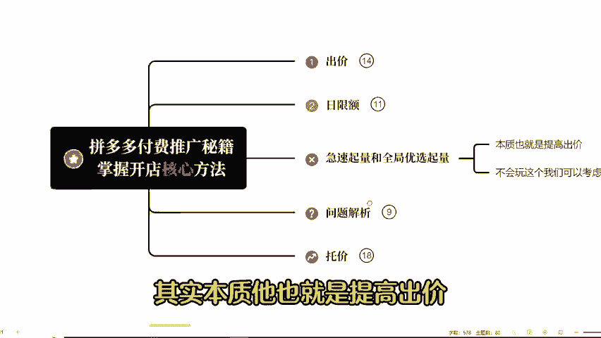

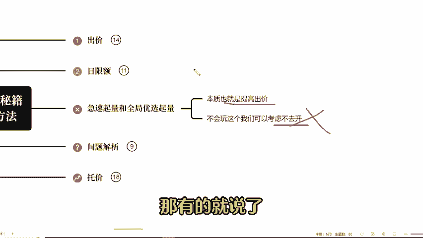

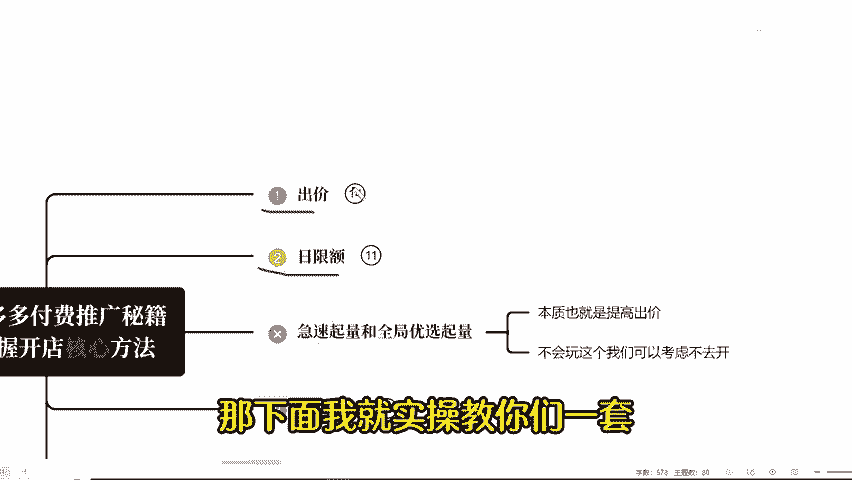

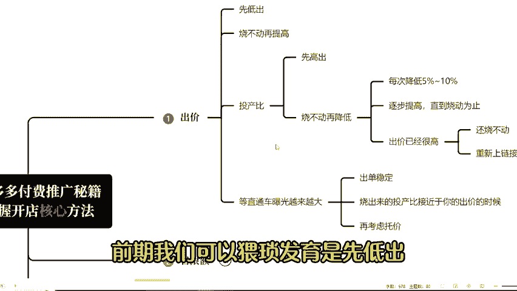

要切合实际来嘛，你二0才能烧多，而你利润只有10块，那你后其实很难优化到盈利的，前期就按照我说的低出，然后你再逐步提高，逐步的曝光稳定下来越来越大，出单稳定，并且呢烧出的投产比接近于你的出价的时候。

这个时候你再考虑去脱价。接着我们再去研究日限额，日限额这一块呢？只有一个条件，那就是只能逐步的增加，只能加不能将什么意思呢？就是如果说你想要获得稳定的流量，那你就源源不断的给拼多多增加余额。

或者说你降低了你的余额，那你的流量也会跟着下降。原则上我们的日线额只增加不下降。或者说你后期能让它维持一个稳定也是可以的。那么我们可以看到就直通车前期呢像出价，比如说你是三稍到不够理想，那你可以到2。

92。82。7，这样子总之不要亏的太多。像日限额呢，你第一天可以100，第二天可以200，或者说你前两天资金100，后两天是200，这样也是可以的。整体算。

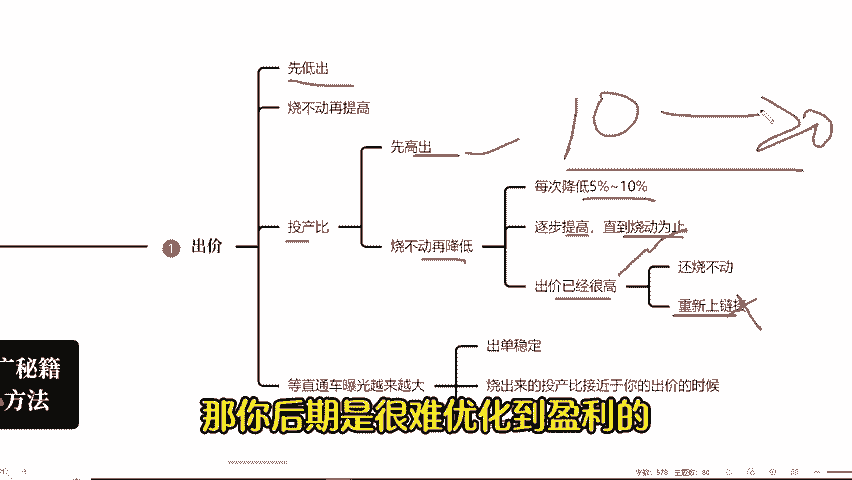

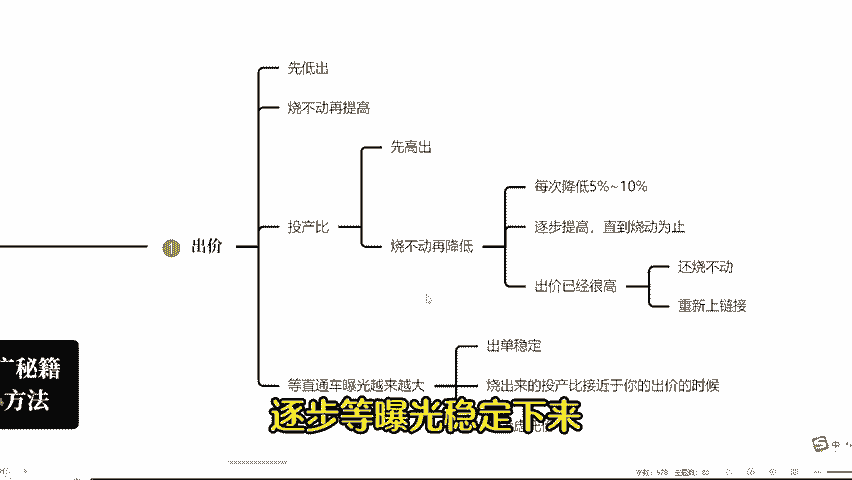

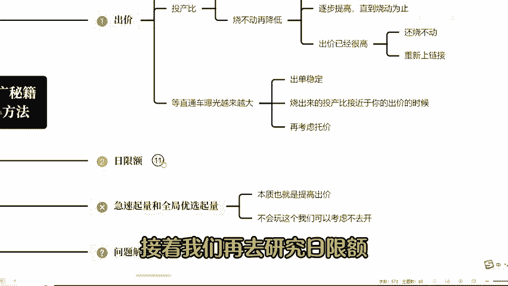

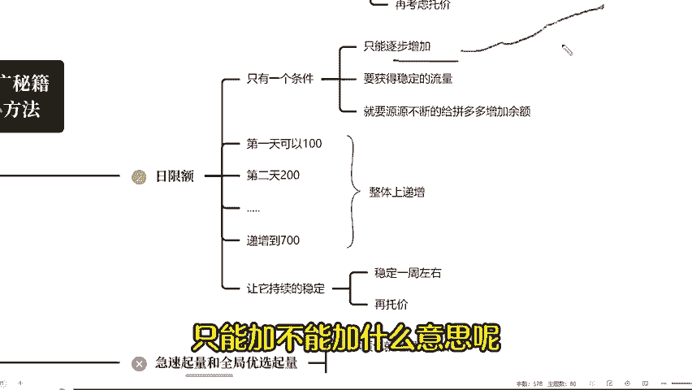

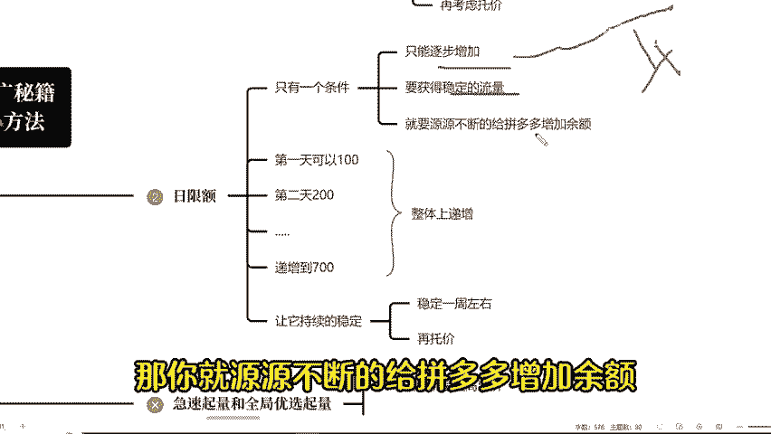

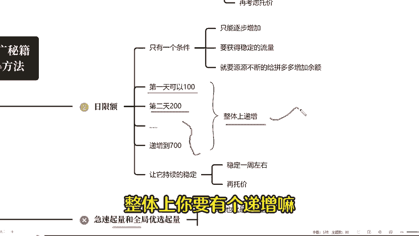

有一个递增嘛，比如说你递增到700或者800了，你觉得不少了，那你可以持续的让它稳定下来，大概稳定一周的时间左右再去拖价。大概的一个思路我们有所了解了。那接着我们再讲讲我们会遇到的直通车方面的问题。

有的链接呢基本上会跑不动，那我们就考虑去更换链接就好了。有的链接我们直通车会烧的很快。那这个时候我们应该怎么办呢？主要分为这种情况，微亏消耗快，保本消耗快，还有巨亏消耗快，盈利消耗快呢。

这个就不用我去教你了吧。首先呢如果你是在微亏或者保本的状态下消耗比较快。那比如说你的300日限额到上午11点就消耗完了，12点就消耗完了。那前提是你不能亏太多或者是保本啊，比如说你的五的保本投产。

它跑出来是4，那我建议呢你每天去降低一个直通车的出价，0。1到0。2的样子，并且呢增加限额或者是不动，至少你的限额不能减少，为什么呢？你的消耗未快，就说明你的直通车的权重高呀。

这个时候你降低直通车出价是没有任何问题的这个时候。

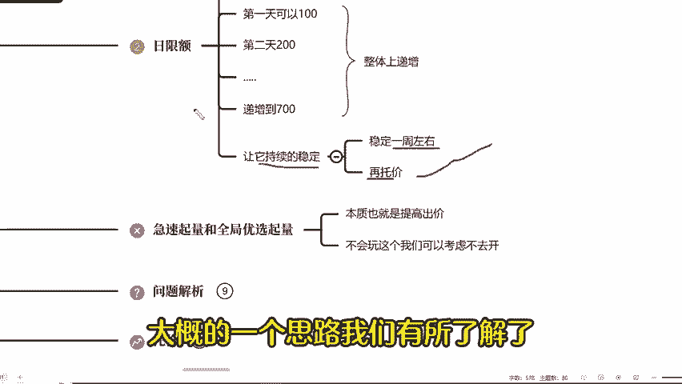

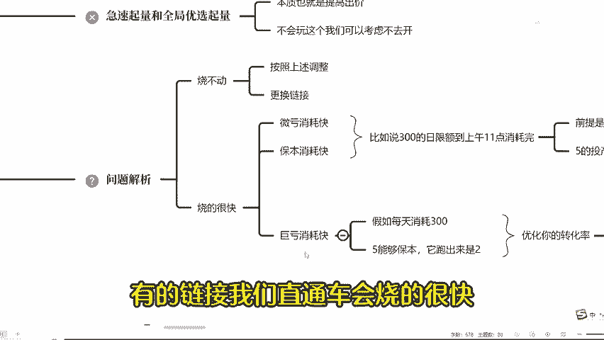

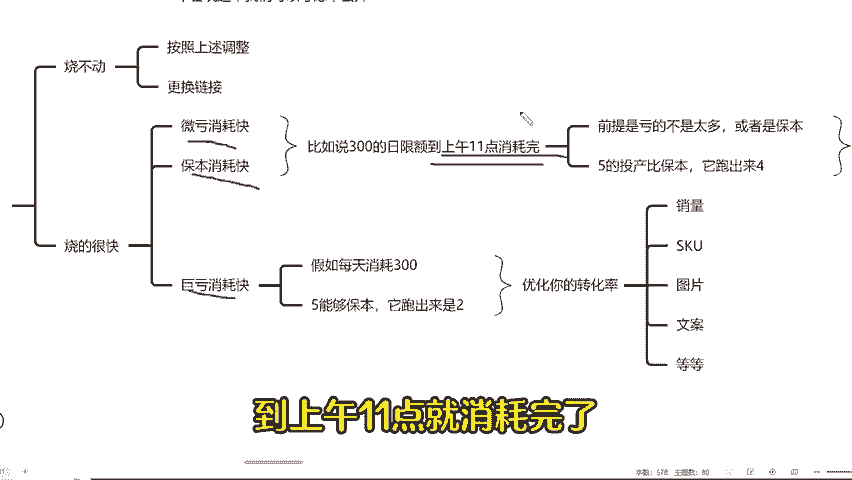

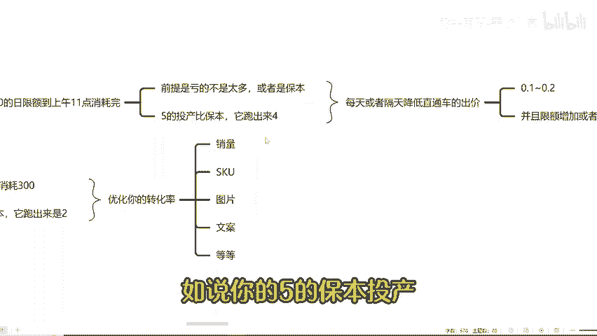

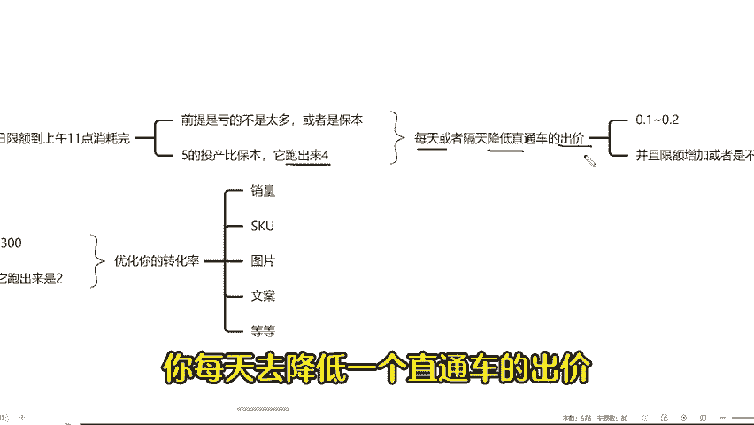

去降低直动车出价是没有任何问题的。所以降低出价的投产，比你提高或者你是成交出价的那你就降低出价就O了。再一个就是巨亏消耗的呢。那这个就说呢，你如果说你的五人保本，它跑出来是2，你需要怎么去做呢？

那你就只能去优化你的转化率了，因为转化率太低啊，如果说你每天销耗300块，原来的转化率是5%，你可以把它提到10%，那你就可以达到盈利的状态。这个时候你再去优化转化率就可以了。转化率包括什么呢？

销量SQ图片你的文案等等这些东西都是需要你去优化你的链接的，实在不会优化的，我建议你放弃，因为五的保本跑出来2，到后期你是很难盈利的那最后我们聊一下怎么去托价。那首先我们必须要知道什么是托价。

托价就是降低花费，那我们知道平台呢它有盈利的，实际上呢我们去托价就是和平台的一次对抗，平台通过什么盈利呢？通过单笔成交花费，对不对？你成交单它就有一笔扣费，然后通过日性额的盈利嘛，还有你的日性额比较多。

花费比较多，它的。

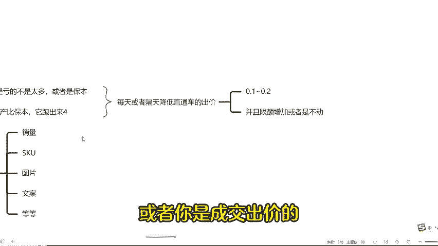

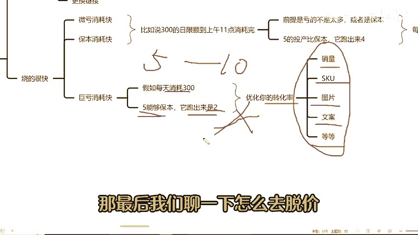

力也会比较多，这个时候你就要降低花费，减少给平台的投入。那么你就是跟平台的一次对抗，对不对？那我们就必须要知道价，它要拖什么方面。那么我们主要就是拖单笔成交花费，而不是日限额，你要拖日限额。

那么你的流量就会下降。好了，那我们看一下托价的原则是什么？那就是拖单笔成交花费。拖的意思就是拖拖拉拉的拖啊，所以是温水煮青蛙，整个过程你一定要慢，有三个原则就是第一个就是你有一定的消耗才能拖价。

比如说我每年消耗100块，我们能拖价吗？拖不了。那我每天消耗200块，你能拖价吗？也拖不了。那么至少要消300块以上才能拖价。再有一个就是有一定订单量才能拖价。这个你可以理解为你有消它就有订单。

你的销售额越高，并且成一个上升的趋势，拖价它才会容易成功。再一个就是数据稳定才能脱价，什么叫数据稳定呢？就是你的点击率转化率，你的订单量，你的投产比它都比较稳定，而且是相对稳定。

因为我们开直通车要做一次拉升。在这个拉升的过程中，你的数据会越来越稳定稳定。

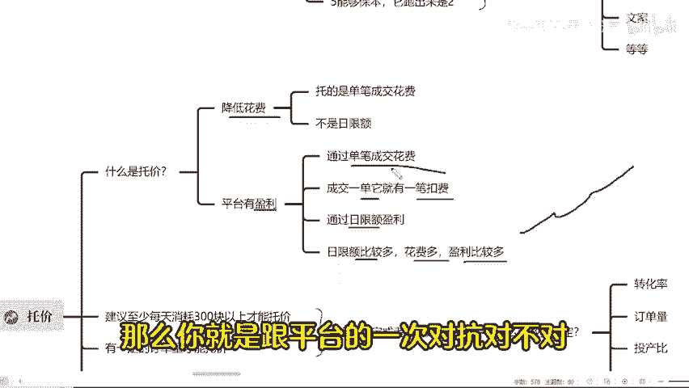

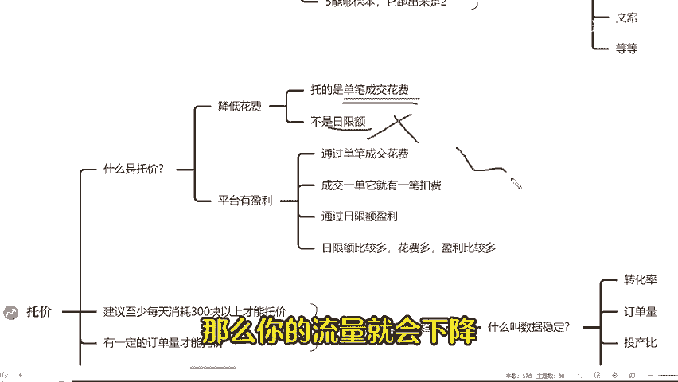

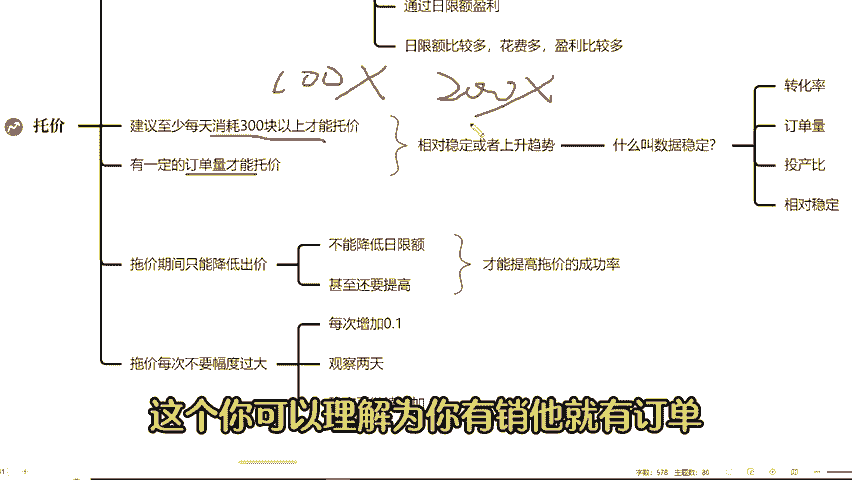

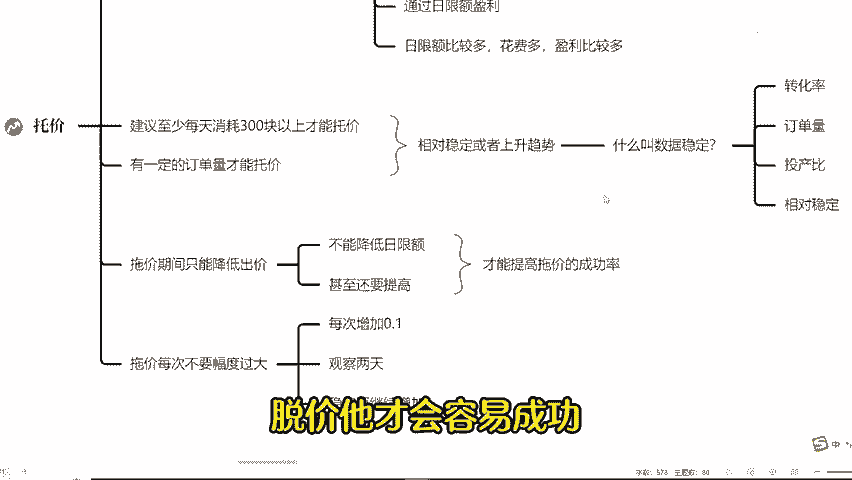

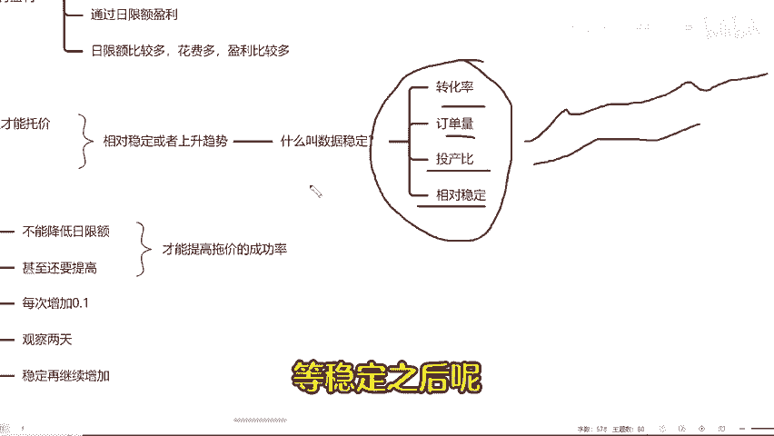

之后呢再托价，你的投资里面就会接近你的真实投产。你再看你的点击率曲线，它也是会一直上升的。并且不在上升之后，你再托价。再一个原则就是托价期间，它只能降低出价，日性额它是不能降低的。

你甚至要提高这样才能提高托价的成功率。而且托价你不要每次幅度过大啊。比如说我原来的投产。5、你再想提高到5。1，观察两天没问题，你再提高到5。2，观察两天又没问题，这样的一个整体的微调。

你这个样子操作才可以。如果说你操作过级，很容易就断流了。好了，学习更多运营知识，可以关注我。

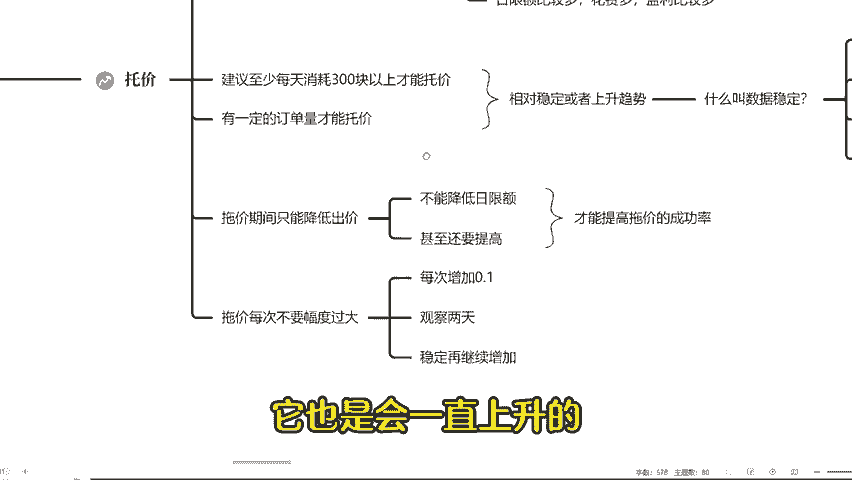

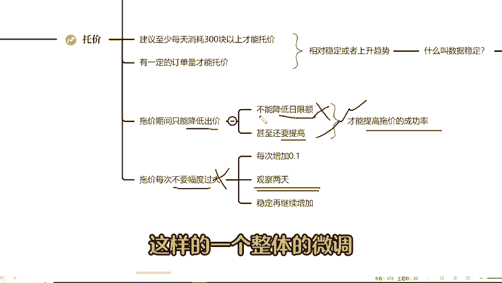

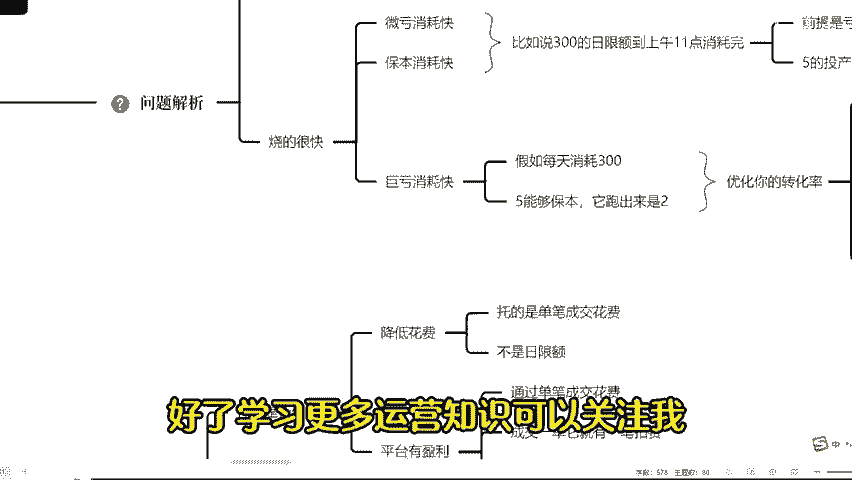