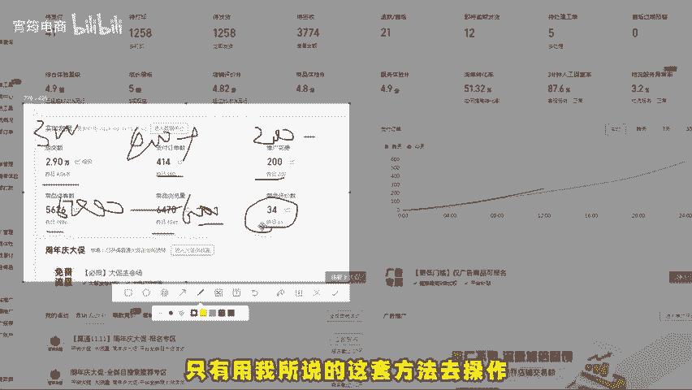
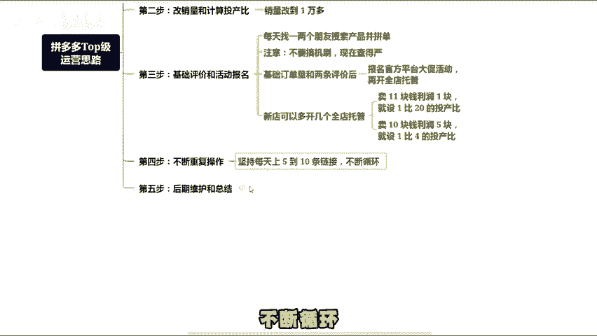
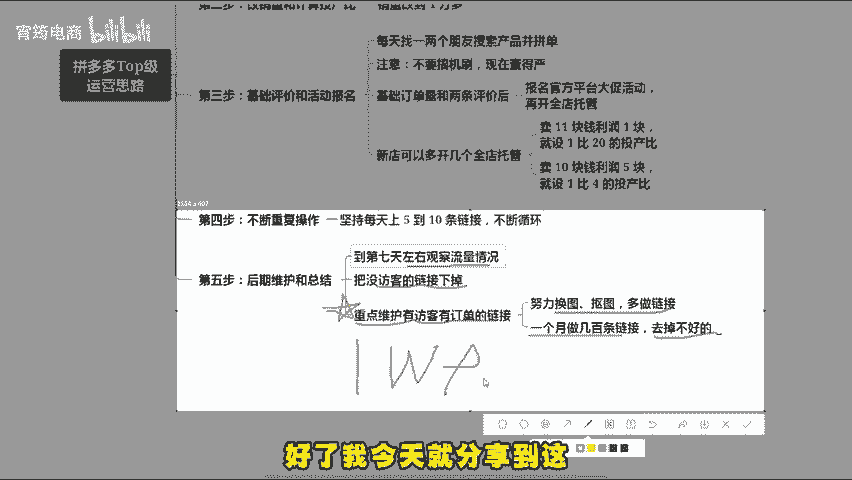
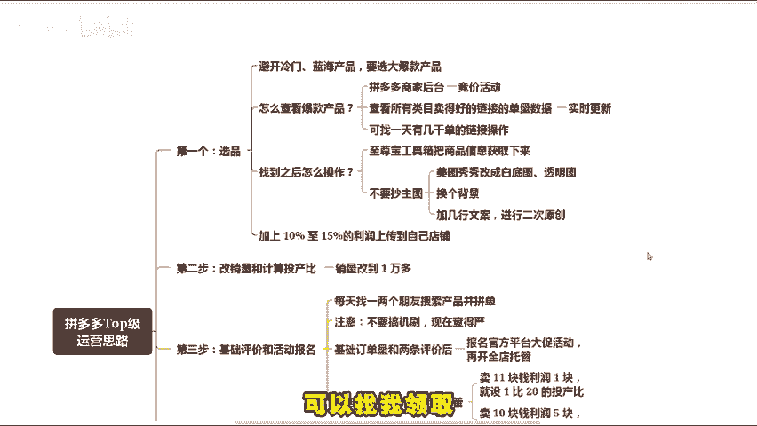

# 拼多多top级运营思路，直接干到上百单（拼多多开店 ｜ 拼多多运营 ｜ 拼多多新手 ｜ 拼多多实操 ｜ 拼多多干货） - P1 - 宵筠电商 - BV1jBm5YcENf

许多人开了拼多多店铺，却不知如何运营。搞到最后没流量，没单量。今天我就用几分钟的时间为大家详细讲解。无论是新手还是老手，都建议花些时间耐心听完这个视频。2024年只要用我所说的这套方法去操作。

才能让你的店铺在盈利的情况下发展起来。做拼多多千万不要做货损，也不要搞亏测玩法，我把它分为5个步骤，让你一个简单的开店思路，七分靠选品，三分靠运营。那第一步就是要注重选品。

做拼多多不要像淘宝那样选冷门蓝海产品，而是要选大爆款产品，这是两个平台的重要区别。那如何选行业爆款呢，拼多多有个竞价活动，这里面有所有类目卖得好的链接的单量数据是实时更新的，可找一天有几千单的链接操作。

只要行业热门有数据，就证明平台和买家喜欢，比如选中一个爆款产品，可用至尊宝工具箱把商品信息扒下来，但注意不要全抄主图，可以通过美图秀秀改成白底图透明图换个背景加几行文案进行二次元。

原创这样平台去重功能就不会打击，也更容易做出自己的特色主图。然后加上10%至15%的利润，上传到自己的店铺。第二步，改销量和计算投产品，链接上架后呢进行核心操作，把销量改到1万多，具体改销量的方法。

因时间有限，不详细讲解，不懂呢，可以找我拿文档。第三步，基础评价和活动报名，链接布局好后呢，每天找一两个朋友搜索产品并拼单，不要搞机商，现在查的很严，有了基础订单量和两条评价后，报名官方平台大促活动。

再开全店托管，新店可多开几条全店托管，设置利润一半归平台，一半归自己的投产品。比如说卖11块钱利润是1块，就设一比20的投产品，卖10块钱，利润5块，就设置1比4的投产品。第四步，不断重复操作。

按照前面的方式，坚持每天上5到10条链接不断循环。第五步就是后期维护和总结，到第7天左右观察流量情况，把。

给访客的链接下掉，重点维护有访客有订单的链接，只要努力换图，抠图，多做链接，一个月做几百条链接，去掉不好的勤奋一点，一个月能有万把块收入，但关键要有执行力，想挣钱就得行动起来。好了，我今天就分享到这。

如果你看完有不懂的地方，可以随时来找我，也可以向我提问。同时我也准备了拼多多各个类目的实操文档，以及最新玩法的拆解步骤，可以找我领取。最后就助所有商家朋友都能够早日报单。

