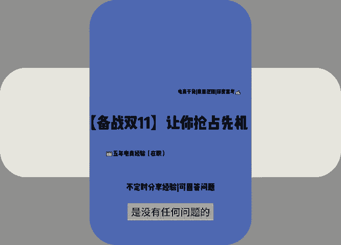
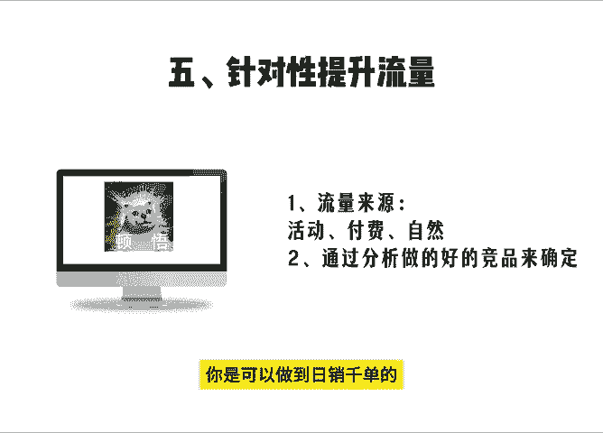

# 拼多多【备战双11】让你抢占先机，快速起店思路 - P1 - 拼多多顶梁柱 - BV17BmNYuEq7

🎼拼多做店铺呢没有思路是不行的，又快到了电商双十一了。每年的这个时候的想要爆单其实是很容易的。但也不是说双十一期件随便上一个品就能够卖个一两千0单的。那么从现在开始，你就布局以及去运营你的店铺了。

现在跟着我的做店方法和思路来，双十一期件卖个1000单是没有任何问题了。首先第一个就是产品的上架了，一般上新5个链接，那么如果你是非标品，那么就上5个不同款式链接，价格统一风格统一就可以了。

那如果说你是标品呢，介议呢把同一个链接进行裂变，那所谓的裂变呢就是标题不一样，赌图文案不一样，SKU不一样，价格也不一样。同样的不知道怎么去做链接的，那些都太基础了，我就不怎么一一去讲了。

可以找我拿文单和套用实操的。接着我们就是怎么去提高我们店铺的权重了。说白了提高权重就是让平台知道有你这个商家知道你卖什么产品的，这样才会给你流量。如果说你的老店有一定的权重是可以跳。😡。

🎼这一步骤的，而我们一般店铺的权重分为两个方面，一个就是店铺的DSR，另一个就是店铺成级了。什么是店铺DSR呢？就是近30天内有50条有效的评价就可以做出来了。这个一般的话就是通过多多进宝来进行操作的。

其他方法也是有的。之前视频都有详细讲解，这里就不做过多赘述了。一般做50到100的样子，尽量多做一点吧。因为有的评价可能是出不来的。大概一周之内是可以出DSR评分的。这时间段呢我们还可以接着做。

就是拉升我们店铺的成绩了。新点的话，我们只要考虑做到三成级就可以了。三代高也是没有任何意义的。因为店铺层级只是决定了我们的流量上线，不做肯定是没有流量的。店铺成绩呢。

我们可以通过拍大单的方式来进期提升方法很多啊，可以通过多多果园或者中中村，要不也可以通过朋友找你分享链接进店，把这个5个链接对应的，每个三0总共就1500，对不对？原则上一个大单。

我们不超过2000就可以了。按照这个操作，一周的时间，为什么？🎼做一周呢，目的就是为了提高店铺的成级和店铺的坑采，以便我们二阶段的直通车能够轻松的跑得动。那么接着就是测试链接了，确定我们的主推款。

做拼多多店铺呢不要想着每条链接都能做报一个店铺有一个链接就非常不错了，怎么去测呢？我们可以通过直通车去测试的，直接5个链接，按照最佳投产比去设置就可以了。我们可以通过这个表格来快速算出我们的投产品。

同时呢我给他们提上21365这个活动，并且要打开评价有礼金和评价有礼金的短信通知，接着你要去做的就是观察数据啊，其实这个是最简单的，你要看哪个数据能跑得动，或者说哪个数据烧钱烧的快。

那么这个链接就可以作为你的主推链接的。那么有了主推链接，我们遇到了第一个问题，可能就是二阶段断牛了。没有关系的，你其实只要去做一个线性的递增，大概就是这样子的，这个拉伸是怎么拉伸呢？就很简单。

就是说你提示日限额需要的事。今天比昨天的销售额多，明天比今年的销售更多，至少要拉。🎼一周的时间，在第二周的时候，你可以做到稳定。那么拉伸的步骤是怎么样呢？就是今天限额100，明天限额200。

后提限额300，等到500以后，你就可以感到差不多了。那么接着我们每天限额500到第二周呢，就不会在递增限额了。但系统自动商，你会发现越烧越快。这时候你在考虑去托价。当然你想起爆一个产品。

不是仅仅靠直通车就能实现了。我们同时也要针对自己的产品分析自己的产品流量来源。一般流量渠道也就分为三个部分，活动流量付费流量以及自然流量，这些我们都会以通过自己分析好的竞品来确定的。

假设我们发现竞品是通过活动配车占大部分流量，但我们就要看它具体参加哪一部分活动。是五84还是大促，或者说是限时秒杀，这些我们都可以通过第三方工具去了解的。知道这些你就知道产品该通过哪些活动进行爆发了。

所以只要了解了拼多多做定的底层逻辑，也是可以做到日销签单的，学习更多运营之时，可以关注我。

