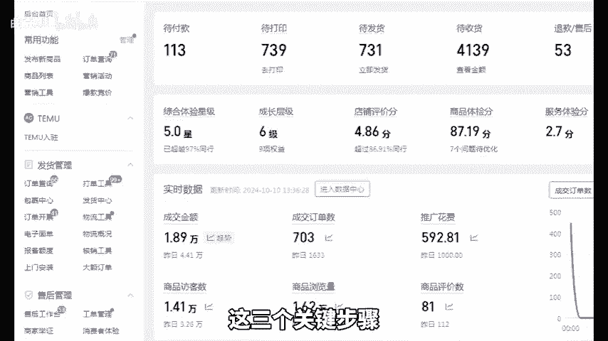
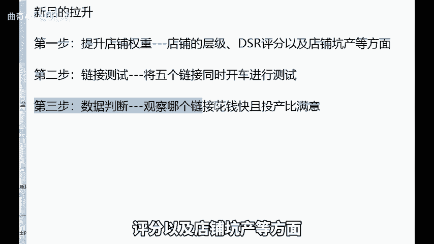
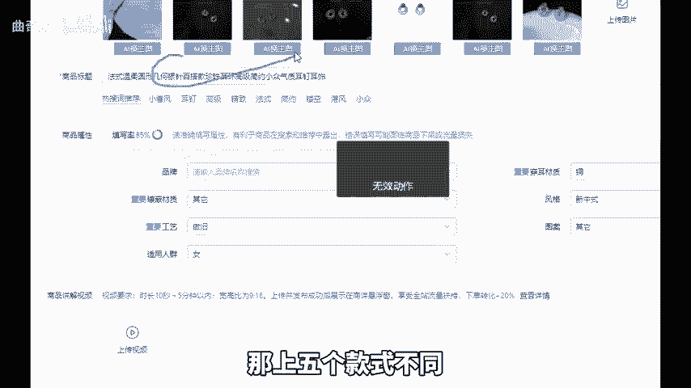
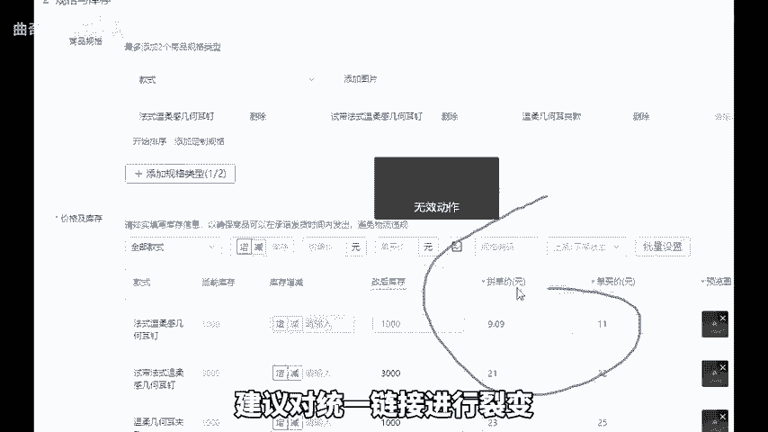
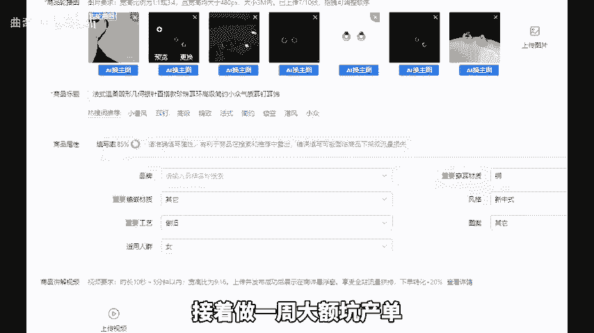
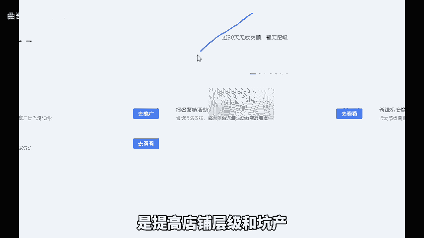
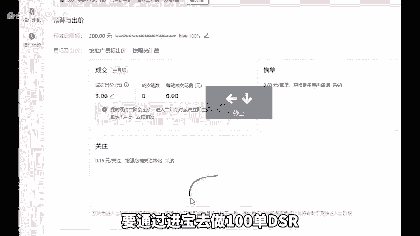
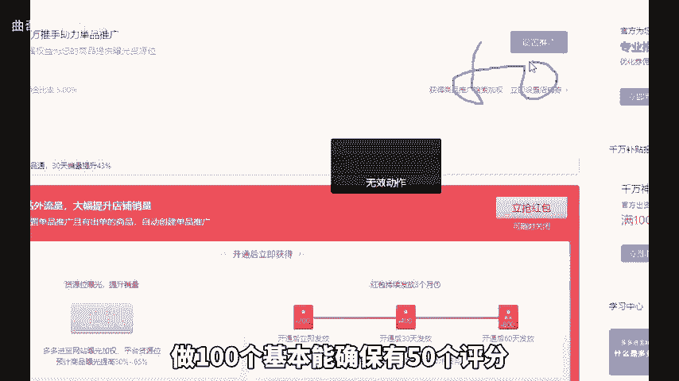
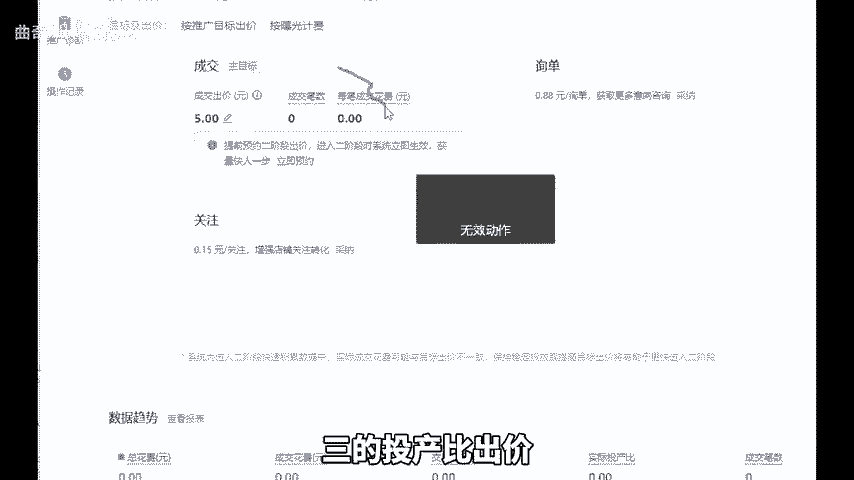
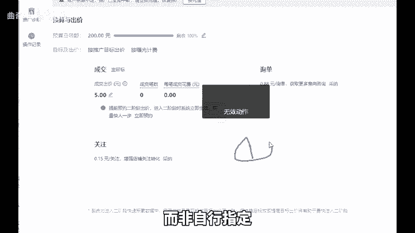

# 拼多多一个新品的拉升必须做好这三个关键步骤，才有爆单的可能！ - P1 - 曲奇All - BV1AMmLY6EVn

拼多多一个新品的拉伸通常分为三步。然而，很多商家朋友常常忽略掉了这三个关键步骤。第一步是提升店铺权重，这一步至关重要，因为缺少它可能导致直通车开不动。

所谓店铺权重就是店铺的层级DSR评分以及店铺坑产等方面。首先我们上新5个链接。如果你是非标品那上5个款式不同，但价格段和风格统一的链接，如果是标品，建议对同一链接进行裂变。

就是用不同标题主图文案SQU以及价格。接着做一周大额坑产单，可以直接分享链接找人进店。5个链接每个下单300，总共1500单个大单不超过2000即可，这样做的目的是提高店铺层级和坑产。

以便第二阶段直通车能轻松跑动。同时在这一周要通过进宝去做100单DSR。因为可能会有部分不出评，做100个基本能确保有50个评分。第二步，测试链接，将5个链接同时开车以利润出价。

鉴于打造的评利润是50%，就可以按照三的投产比。

出价提报活动21365，同时打开评价有礼金和短信通知。借着第三步数据判断，这一步较为简单，观察哪个链接花钱快，且投产比满意即可作为主推。如果链接跑得快，且在第二阶段没有断流，就可以对其进行拉升。

拉升的方式就是逐步提高日限额。比如今天限额100半天烧完，那明天200后天300到500后可保持每天500的限额，让系统自动烧，此时会发现烧的越来越快，再考虑拖价，但需要注意的是。

打造链接时要多做一周坑产，且务必测试链接，主推款一定要由系统找出，而非自行指定。好，今天的分享就到这里，还有不懂的，可以后台找我，不知为你解答，还给你分享一份我整理的店铺综合云包。

