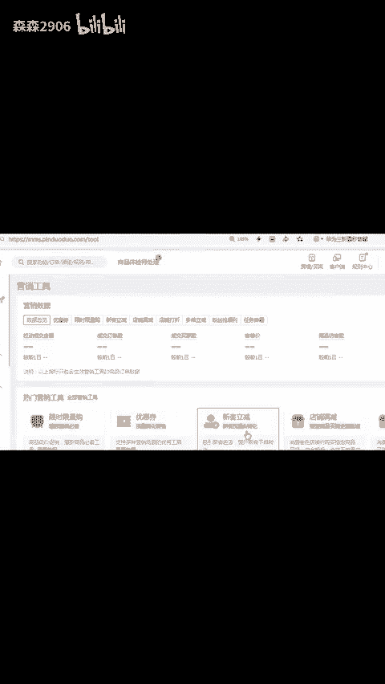
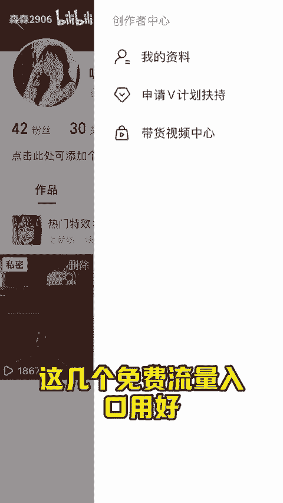

# 拼多多一个星期卖一单怎么回事 - P1 - 森森2906 - BV119bwe1Enj

每天一个一营小就行。拼多多店铺一个星期只卖了一单，怎么回事？店铺访客就十几个，还卖了一单，你就拖着乐趣吧。那怎么增加店铺访客呢？店铺访客少，是因为你不懂运营，但是我可以告诉你几个免费的流量入口。

只要你流量好了，新手自然一周访客也能破钱。首先是首页推荐的流量续航活动无需比价无需审核，原价就能报名。在后台是找不到的，需要打开活动详情页面，把这个活动id啊改成21967。

还有省钱月卡超级满减首单直降多多视频。这些入口啊几乎没有门槛，而且曝光还高参与了就是白给流量。我们再打开这个链接，改成21824就能报名。

超级满减改成15591就能报名省钱月卡新客立减呢在店铺营销里面多多视频就去买家端发布，比后台发布，流量更好。这几个免费流量入口用好新手一周访客户外还是轻轻松松的。😊。

