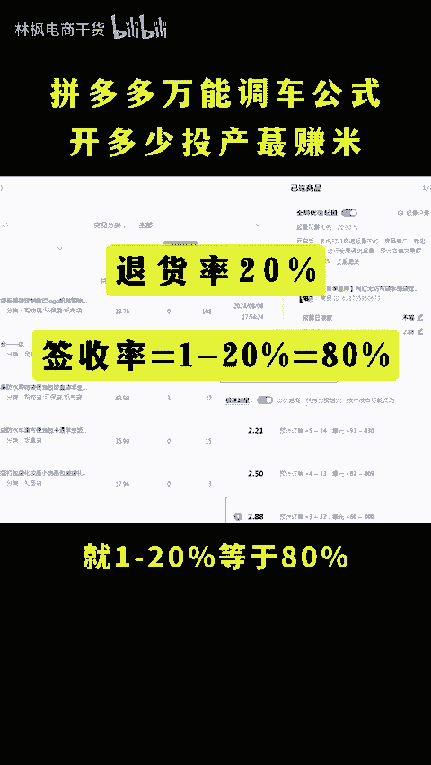
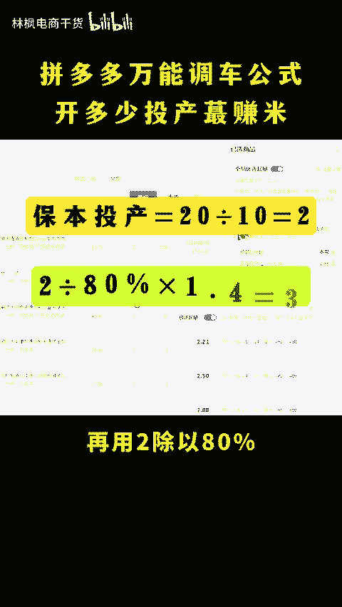
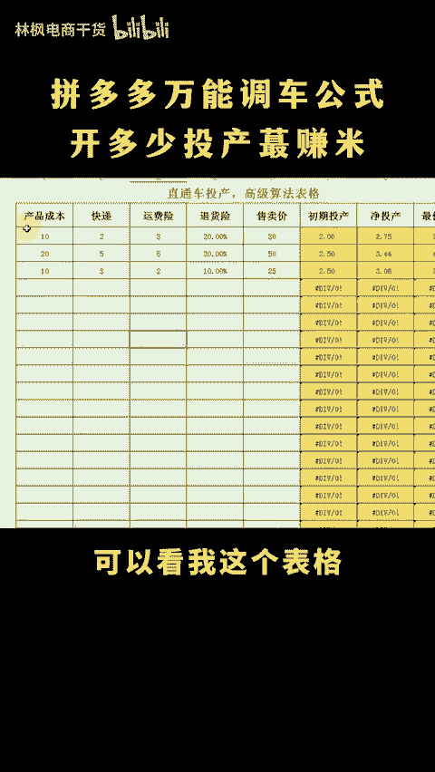

# 拼多多万能调车公式投产开多少最赚钱！ - P1 - 林枫电商干货 - BV1besUe3EeT

拼多多有没有万能开设公式，哪有什么万能公式啊，预算低就低出价，预算多就不限额高出价就是了呗。我信你个鬼，你这个糟老头子话就很，有没有万能公式，开车最赚钱呢。30元教你一声啊，点个关注点个赞，直接看实操。

假设成本10块卖20利润时用收价除以利润除以签收率乘1。4，比如20%的退货率，签收率呢就一减20%等于80%。按照这个公式啊，算出来就是20除以10等于2，再用二除以80%乘以。4等于3。5。

这个头产开车赚钱最多，开车进入这个万能公式啊，曝关高，点击低，主图标题找原因，点击高报关少，出价过低的问题，曝关低转化高，出价拉高，点击报报关不涨花费涨，出价赶紧往下降，调成优化不求人啊，如果不会算的。

可以看我这个表格，数据填进去之后，自动计算结果，需要表格的看这里。😡。

