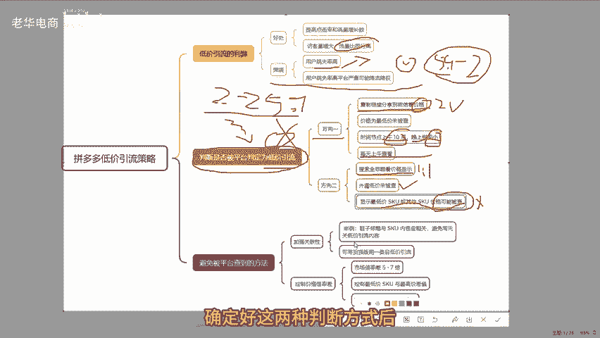
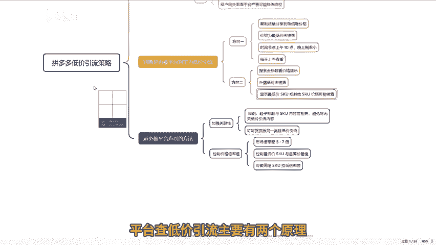
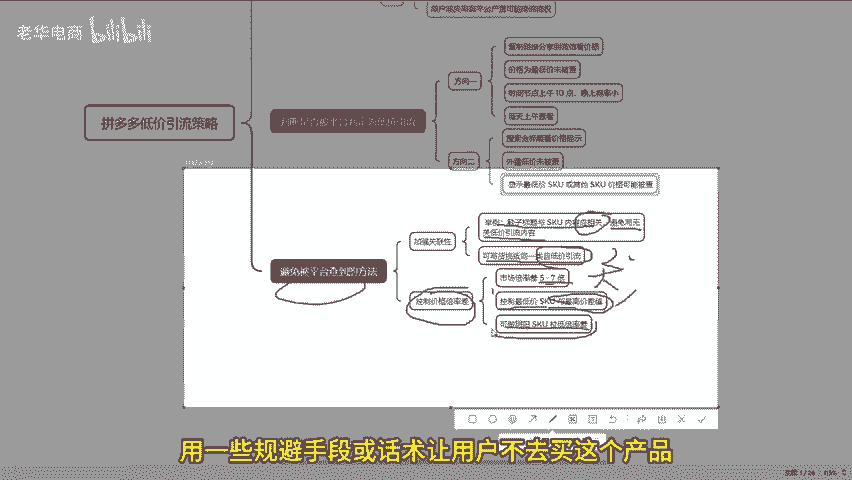
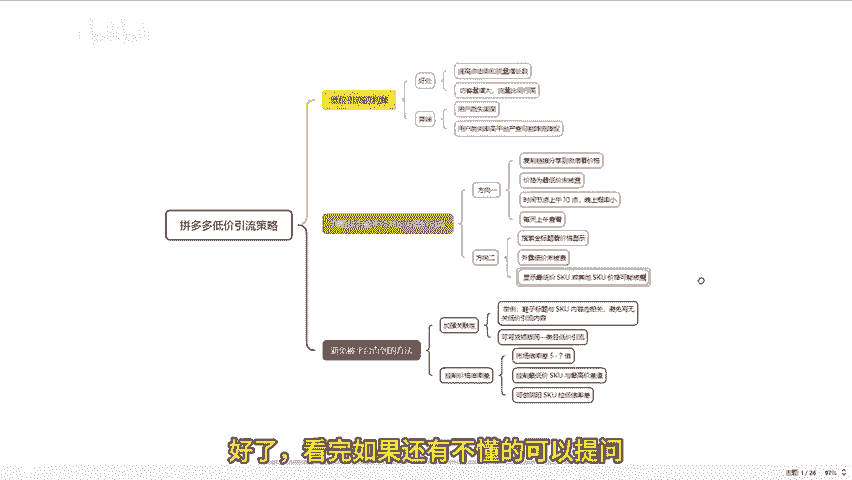

# 拼多多下半年SKU这样设置连接流量直接翻三倍 拼多多运营 拼多多小白 拼多多新手开店 拼多多干货 拼多多商家 拼多多学习 拼多多店铺 拼多多玩法 拼多多黑科技 - P1 - 老华电商 - BV1Y6saeAEXj

在拼多多平台上，低价引流无疑可以说是提高点击率以及流量增长数的一种极为有效的方式。然而，低价引流这种方式呢却有着明显的利弊力，其好处在于能够显著提升各种数值，使得访客量大幅增大。在同等曝光的情况下。

自身店铺的流量完全能够比同行更高。

但不可忽视的是，其缺点是用户进入店铺后跳失率也会相应较高。不过在拼多多这个平台上，这其实并不算太大的问题。因为现在很多人在进行低价引流的时候，比如售卖价格为5。99块的东西。

却搞出一个2块钱的低价引流价格，这样的倍率差，实际上并不会太大。😡，虽然大家可能觉得这样的差价不大，但平台现在对于低价引流有着诸多的考核方法，今天就特意给大家详细说说。

如果想要通过外陆价格显示略低价的这种方式来进行低价引流，从而获取流量。那么第一步要做的事情就是一定要搞清楚如何判断自己的单品不会被平台判定为在做低价引流。因为在拼多多上的用户看到2块钱的价格。

点进去却发现是5。9块的价格。其实他们的抵触情绪并不会很大。毕竟拼多多的用户已经习惯了这种情况。所以现在最大的弊端其实是平台会经常进行检查，一旦被平台检查到做低价引流，就会面临降流、降权等一系列的处理。

😊，这样一来，自己的链接基本上就相当于没救了。为了避免被平台查到呢，这里有几个方向可以去参考。第一个方向就是要搞清楚如何判断平台是否抓到了自己在做引流呢。😊，在以前的时候。判断平台抓低价引流。

很多人的方法是比价活动中看平台是否有提示。但现在主要有两种方式，一种方式呢是把自己的链接复制，然后分享到微信上。😊，分享之后，在那个链接页面会显示一个价格，如果这个价格是目前自己所放的低价2块钱的。

那就证明没有被平台查到。而被查的时间节点呢，一般是上午10点，基本上是拼多多聚焦查低价引流的默认规则。当然也有晚上进行检查的这种情况。但这种是概率问题，所以每天上午一定要看看自己是否被查。

第二种方式是自己去搜索全标题，把自己现在这个链接的全标题进行1比1复制，然后去搜索在搜索结果的手机端。如果看到价格是外路低价，那就说明低价引流没有被查。但如果显示的是低价SKU或者其中某个SKU的价格。

那就有可能被平台查到了在做低价引流了。😊，确定好这两种判断方式后呢，再来说一说如何才能不被平台查到。

平台查低价引流主要有两个原理。第一点是平台会认为自己的SKU与主图内幕产品标题没有关联，比如卖鞋子在标题中写着小白鞋、休闲舒适、新款式等内容。而SKU展示鞋子、尺码、面料等内容是有关联的。😊。

但如果在做低价引流的时候，写个携带2块，这样的关联性呢就不强了。以前拼多多对于这种情况的兼容性很好，但现在低价引流这一块平台的监管变得更严格了，所以不能让两者之间的差距太夸张，可以写一个货损版。

比如在生产鞋子的时候，总会出现一些瑕疵。有些人能接受，有些人不能接受，但这都属于同一内部，然后挂个2块钱的价格，如果有人买了，那就当是帮自己补单了，反正差价也不是特别高，这就需要加强关联性。😊。

第二点是除了关联性之后，还要看价格倍率差，也就是最高价格与最低价格的倍率差。目前市场上的倍率差呢一般是5到7倍。如果差值太大，超过7倍，被抓的概率呢也是非常大的。

当然也有7倍以上能上架或者5倍就上架不了的情况。这种很正常的，所以一定要控制好倍率，不要太大可以做好一个策略，就是对于最低SKU卖家，如果是正常可以发货，正常可以卖的价格，那么在做低价引流的SKU时。

要尽可能控制与高价的差值，如果不好控制，可以做阴阳SKU在最低价SKU里再搞一个同样规格，但价格更低一点的SKU用一些规避手段。😡。

或者话术让用户不去买这个产品，这样就可以拉低倍率差。所以可以通过这些手段尝试去做低价引流，但一定要精细化操作，不能像以前那么笼统，不然很容易被判定，一旦被判定链接就没救了。好了，看完这里。

如果还有不懂的可以提问，也可以评论三个6，领取一份我整理的多多店铺综合运营包。好了，咱们下期再见。😊。

