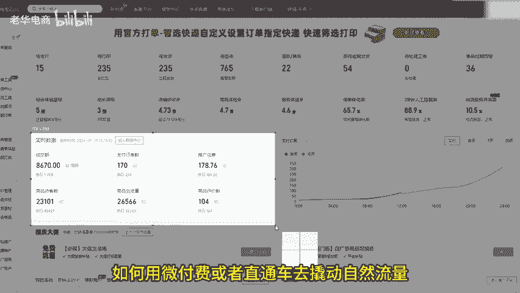
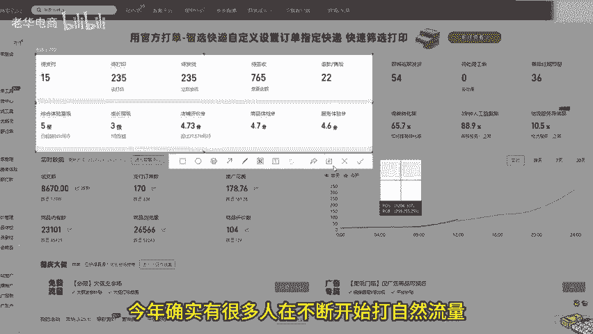
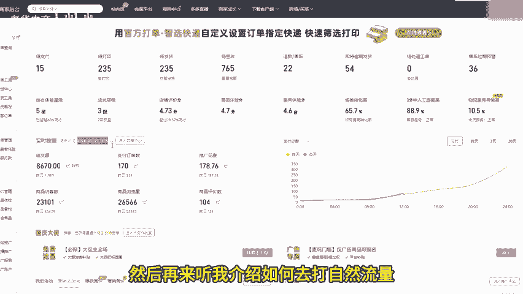
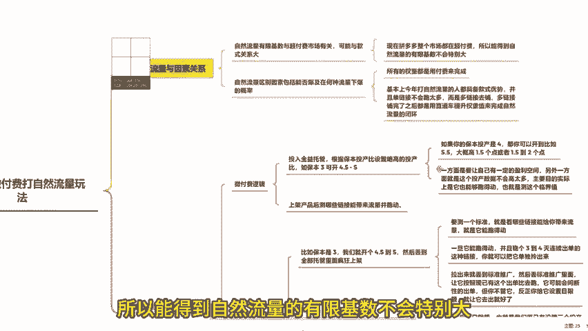
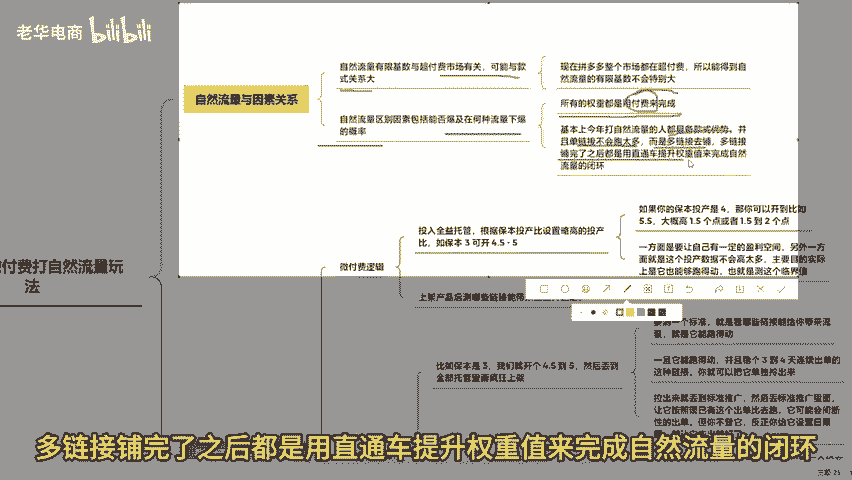
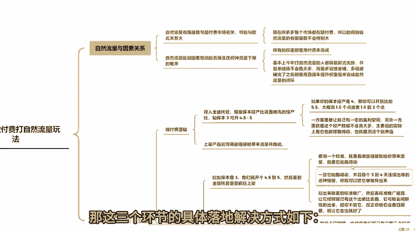
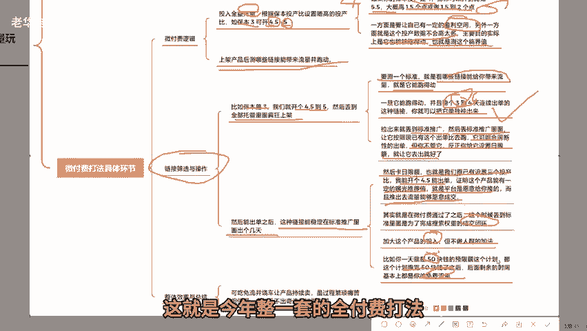
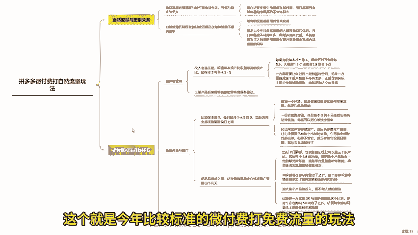
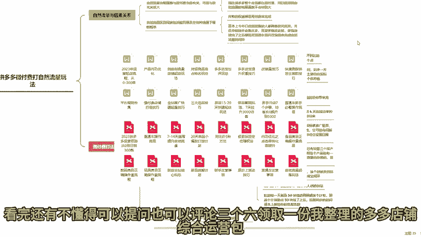

# 拼多多下半年微付费打爆自然流量半个月日销500单 拼多多运营 拼多多小白 拼多多新手开店 拼多多干货 拼多多商家 拼多多学习 拼多多店铺 拼多多玩法 拼多多黑科 - P1 - 老华电商 - BV1Ee1RYMELX

今天这期视频来和各位聊聊在拼多多里如何想要打造自然流量，如何用微付费或者直通车去撬动自然流量。给大家明确一点，今年确实有很多人在不断开始打自然流量。但是很多人打的是基础，都是全报模式。

没有哪个店的单品链接能够持续性的带来自然流量。所以大家要先做好这个心理准备，然后再来听我介绍如何去打自然流量。既然各位要搞清楚一个产品能得到自然流量的情况，那就是可以看到，现在拼多多整个市场都在超付费。

所以能够得到自然流量的有限基本不会太大。而且这很有可能跟款式有很大的关系。所以我们有时候讲自然流量要区别的因素有很多，一是能不能报，二是在什么样流量情况下，能得到它且能报的概率。

这个东西就非常需要很多的讲究了。😊。

因为我们都知道要做权重，但是现在所有的权重都是用付费来完成的。所以说基本上今年打自然流量的人都具备款式优势，并且单链接不会跑太多，而是多链接去铺。多链接铺完了之后。

都是用直通车提升权重来完成自然流量的闭环。所以三个环节都要解决。那这三个环节的具体落地解决方式。

第一，你的第一种打法就是直接维付费微付费。今年的强行逻辑非常简单，就是直接可以把它丢到全店托管里面。我们都知道拼多多里面的托管其实不会有很大的数据变化。比如你今天设置举个例子，你计算过你的产品。

现在实际保本投产是3，那你大概率可以开到4。5到5的样子，如果你保本投产是4，那你可以开到，比如5。5大个都1。5的这个点或者1。5到2个点。😊，差不多我们现在都这么设置，这个设置的讲究是什么呢？

一方面是要我们自己有一定的盈利空间。另一方面就是这个投产数据不会高太多，主要目的实际上是它能够跑得动，也是测试这个临界值。目前大部分的临界值。如果你投产到三才能保本的话，那后面多个一两个点。

你能稍微有一点点利润支撑你去玩儿。当你明白了这个之候，假如你所有的产品大部分都是这个价格。那这个时候我们就按照这个图产比，比如保本13，我们就开个4。5到5，然后丢到全链托管里面疯狂上架。

这个时候上架完成之后呢，只需要测一个标准，就是看哪些链接能够给你带来流量，就是它能跑得动，这么讲给大家能理解吗？就是它能跑得动，一旦它能跑起来。并且吻个3到4天连续出单的这种链接，你就可以把它单拎出来。

这个拎出来不是别的原因。因为如果在保本投产的情况下，它能出单，不管有多少，都证明这个产品是能够完成一定数据的表现。但是。权线托管本身逻辑是全域流量的曝光值，所以它在所有全面方面的体现不够。

所以我们把它拉出来就丢到标准推广，然后丢标准推广里面呢，让他按照现有的这个出单比去跑，他可能会间端性的出单，但你不用管它。反正你给他设日限额，让他出去就好，然后能出单之后。

这种链接能稳定在标准推广里面出个几天。你这个日限额要是卡的好，我们经常说卡日限额，其实就是在微付费通过之后，也就是我们原有已设置三个图产底，我们能开个4。5能出单，证明这个产品能有一定的曝光推荐值。

就是平台是愿意给我们推的。而且推出去流量能够愿意成交。所以这个时候丢到标准里面是为了完成搜索权重的成交闭环。完成之后，我们就加大这个产品的投入，但不做人群的加法，你不用做任何的干涉。

就让他丢到直通里面去跑。跑到什么时候呢？比如你一天就是50块钱的日限额这个计划，那这个计划跑完50块钱之后，后面剩的时间基本上就是你免费流量，这就是今年整一套的全付费打法。

其实里面包含的是款式，可能听起来好像整个完整的链路都做完了。但是大部分的人在跑的时候要上架那么多产品，最终筛选一两款，其实也是很痛苦的。但你又不得不承认，今年流量成本这么高的情况下。

我们肯定要去优先级去选一个有利润的产品去跑，尽量是以这样的方向能够去跑出成交，跑出订单。你至少每一天是有收账在的。但是最怕的就是在现在很多人连着亏连着亏，总感觉可能会亏出一个奇迹。

但拼多多今年的情况就是亏不出奇迹，没有任何的奇迹发生，所以还不如干脆去做利润。虽然它繁琐，虽然它很痛苦，在这个过程中，可能一拉一个周期可能就是半个月，但是我觉得是值得的。如果出来一两个产品丢到标准里面。

它能通过第二阶段，那基本上后面免费流量都能起来。然后这个时候你就可以吃一部分免费流量，烧一部分车，在这个过程当中，不断的让这个产品持续卖就可以了。这个就是今年比较标准的微付费，免费流量的玩法。

看完还有不懂的可以提问，也可以评论3个6，领取一份我整理的多多店铺综合运营包。好了，咱们下期再见。😊。

