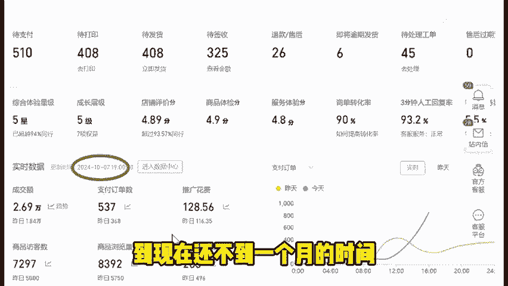
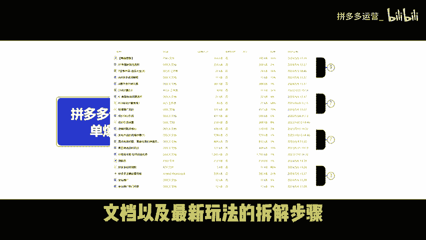
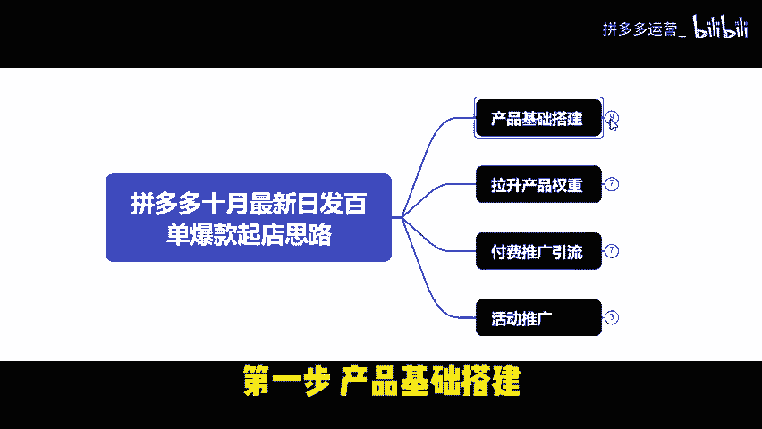
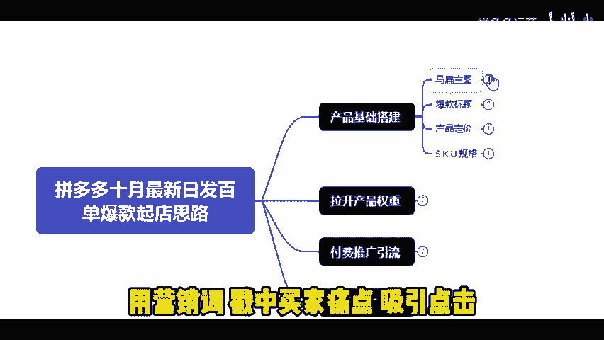
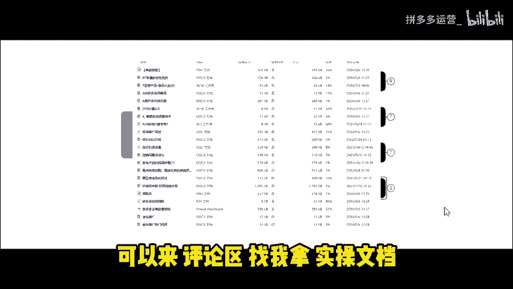
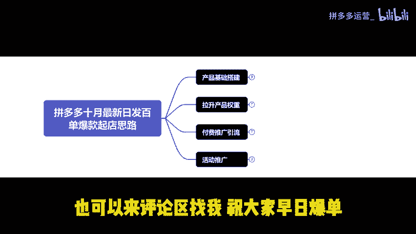

# 拼多多下半年起店步骤，中小卖家打爆7000访客，日发百单冲刺双十一 - P1 - 拼多多运营_ - BV1MB12YYERB

10月份已步入拼多多商家的黄金时期。拼多多商家能不能在过年前赚到钱？拼多多新手商家要想快速气垫考双十一。双十二年货节这些大活动。拼多多新手商家要想做好店铺。是下半年的平台流量与大促订单。

这店铺是我9月中旬注册的。到现在还不到一个月的时间。

就已经能稳定日发300到500单了。用的正是今天要讲的这套日发百单爆款起垫思路。不妨按照下面的步骤备战大促活动。此玩法适用于新老商家打造单爆款。我将从产品上架到如何打造爆款。最后报名大促。

且避免大幅度压价拆解。如果说你看完分享还是不太懂的话。我也准备了所有类目的实操文档以及最新玩法的拆解步骤。😡。

你也可以根据实操文档操作。第一步，产品基础搭建。

马扁主图99%，拼多多消费者都是视觉动物，先看图片，再决定是否点击产品主图，一定要突出产品卖点，用营销词戳重买家痛点，吸引点击。

比如看这个美妆蛋产品主图。就是靠营销词、官方正品、次达品牌职工等等来提升点击率。下面教大家精准引流爆款标题，可以参考头部同行，但不建议抄袭。因为产品是依据词的权重来排序的。一般优质同行会想到好的词。

都是有权重的搜索热词。我们在套用，等于在替他人做嫁衣。在标题前面加括号，突出产品核心卖点。最好是2到4字。比如疯抢中低价清库存等诱惑字眼。根据自己产品核心卖点添加。产品定价先提高拼单价。

后续通过优惠券或者限时限量购降低拼单价，这样既能提升产品权重，又能让买家看到实惠。从而提高转化率。低价SKU设置。拼多多的外漏价是显示产品链接里面价格最低的。比如我们卖蓝牙耳机，看这两款蓝牙耳机。

虽然1。7这款不如23。8这款销量多。但是并不妨碍有买家受低价诱惑点进去。低价SKU定价最好低于市面上的同行均价。像这款蓝牙耳机一样。若有人担心低价，SK又被大量购买。可采用形容词降低被购买的可能性。

产品食物用试用装或者小样代替。例如，蓝牙耳机低价SK又可以写一根数据线。一般消费者买蓝牙耳机不会选数据线。这样还能截留禁品。最后要做好防比价，具体可以参考以前的视频。这里不再多说。😡。

房比价还不会的商家朋友来评论区找我。第二步，拉升产品权重。基础销量评价，销量用改销量改1万。不会改的来评论区领取改销量文档。评价找亲朋好友为主推款。

做100到200条带图评价取优质同行下面挑选优质买家秀。90%的消费者会先看别人的评价，再决定是否下单，人人都是有从众心理的。DS2评分30天内做50条有效好评。DS2评分要保持在行业60%以上。

才能稳定店铺流量。若低于50%，就要面临流量被同行抢占的风险。店铺层级新店前期做到3到4层级。每个层级承接的流量上限不同。点击层级后，能看到店铺到下个层级所需的营业额。用拍大单来突破营业额。第三步。

付费推广引流。开直通车时有两种出价方式，一种是成交出价。另一种是投产比出价。成交出价设置不要按照系统推荐出价。若产品客单价在50以内。按热卖SKU价格设置成交出价。客单价在50以上。

根据利润空间设置出价。例如，客单价137，利润只有34。成交出价最高可设到34。按投产比出价，要先了解投产计算公式。保本投产等于售价除以利润，比如产品成本是20元。卖到40元，利润一单就有20元。

保本投产就是2。前期按照投产比出价，先按保本投产出价。把直通车开起来。有一定成交数据后，得知产品实际退货率。假设退货率是20%，根据保本投产算出净投产。净投产等于保本投产除以一减去退货率再乘以1。1。

有了权重后，要算出最佳投产。假设成本是20卖40，退货率有20%。那么前期推广出价是保本投产3。拉数据后，投产要拉到4。35到5。58之间才是有效数据。下面本节重点来了。

这玩法核心是计入同行同层级优秀数据。打开商家后台，可看到店铺访客数据和成交入V价值。接着会看到三条线，分别是自己店铺访客数据。同行同层级平均数值和同行同层级优秀数值。

运用公式销售额等于访客数乘以成交入B价值。那同行优秀的访客数乘以同行UV价值。得到同行的优秀销售额。再除以客单价得到需要达到的订单量。最后，通过关键词进店成交，可提升店铺自然流量。第四步，活动推广。

新手商家前期适合参加一些要求不高的活动。比如21365或者是21856。活动期间注意店铺整体转化率。这样既能提升店铺权重。又能为未来报名大促奠定良好的基础。报名大促前，要维持好店铺日销额和转化率。

这样平台在活动报名时才不会大幅度压价。避免报名上的活动却血亏。今天分享到这，如果看完分享还不太懂的话。可以来评论区找我拿实操文档。

也可以提问，或者你要我给你做店铺诊断的。😡，也可以来评论区找我，祝大家早日爆单。😡。

