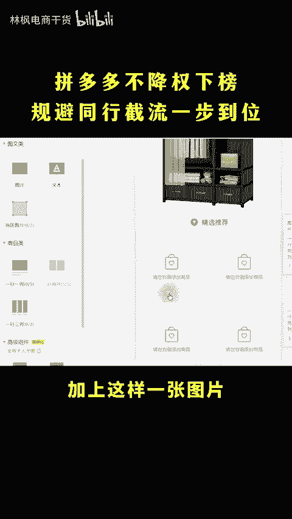
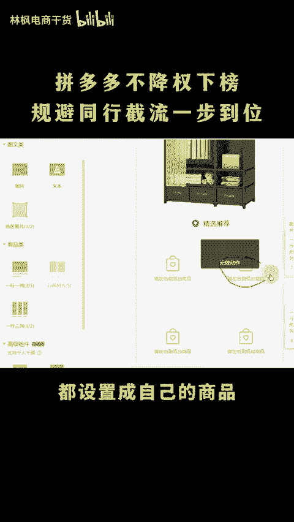
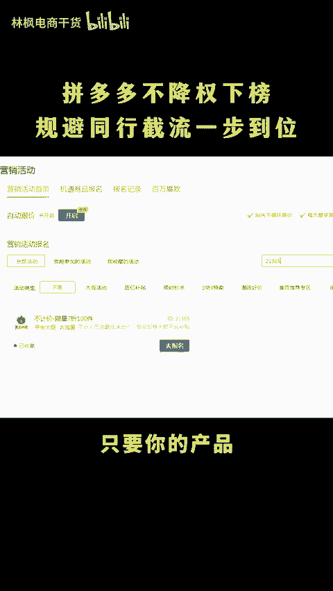

# 拼多多不降权下榜规避同行截流一步到位！ - P1 - 林枫电商干货 - BV1622tYMEs8

拼多多有没有避免同行截流的方法呢？多铺链接啊，只要上的够多，买家看到的都是你的链接，还担心被截流吗？我信你个鬼，你这个糟老头捡坏的哈，怎么有些避免同行截流呢？一个技巧就能够降低同行截流风险。

点赞关注直接实操教你。😡。

把详情页底层的精选推荐都变成我们自己的商品，不管买家怎么点推荐产品，也是跳转到我们自己的店铺。商品再也不怕被截留了，去边辑商品下滑找到专修商场详情页最底部加上这样一张图片。

再添加上商品类标签一行两列添加五行都设置成自己的商品就能搞定了。在报名活动22029，不但会把你的商品展示同款的商场上方，同时还会获得平台的首页千万曝光，再进入智能营销的精品报销助力。

按照系统设置优惠券，最后报名活动21365，这三步走完，只要你的产品有正常的市场需求啊，自然流量就少不了。更多运营技巧左下角。😊。

