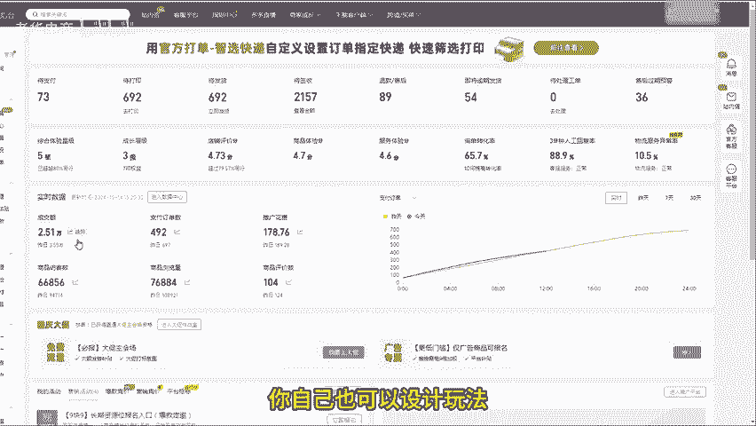
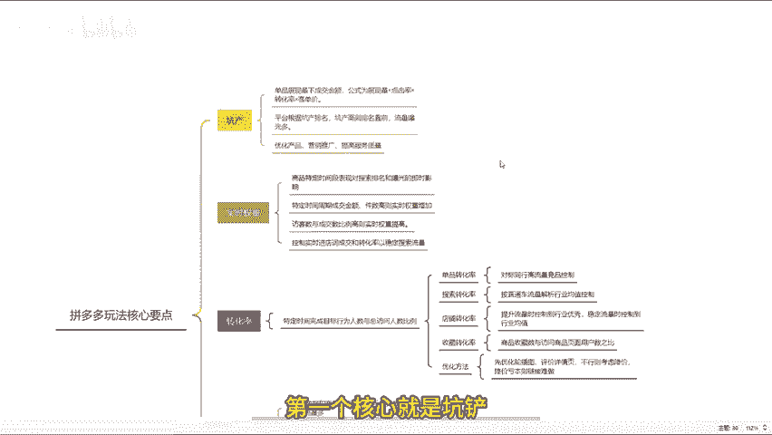
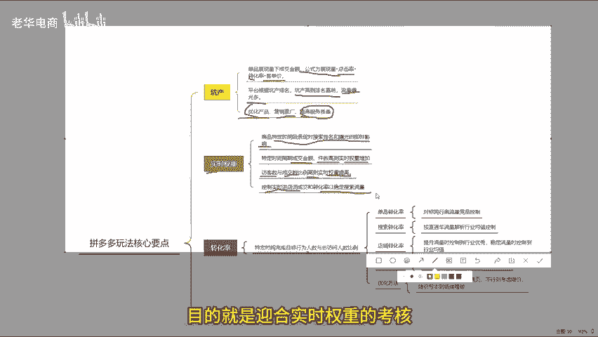
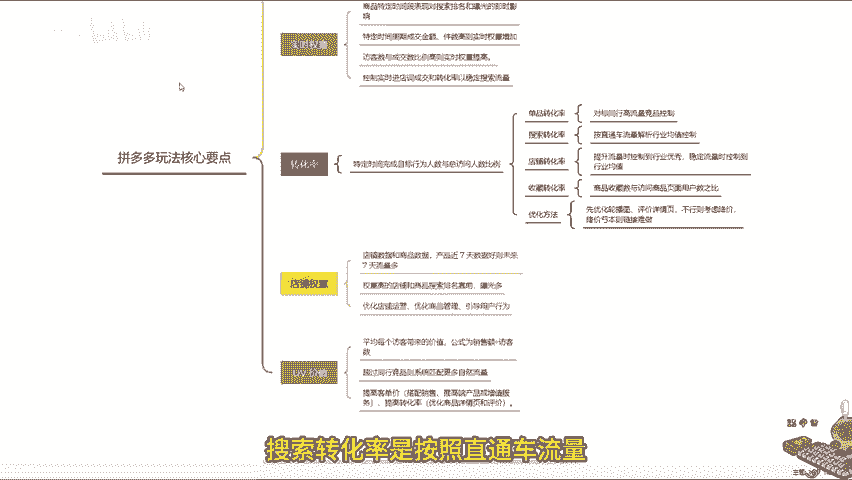
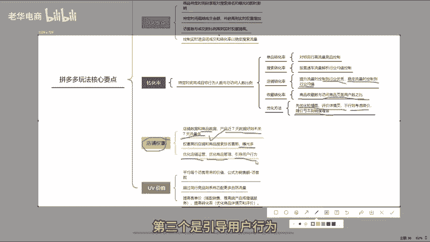
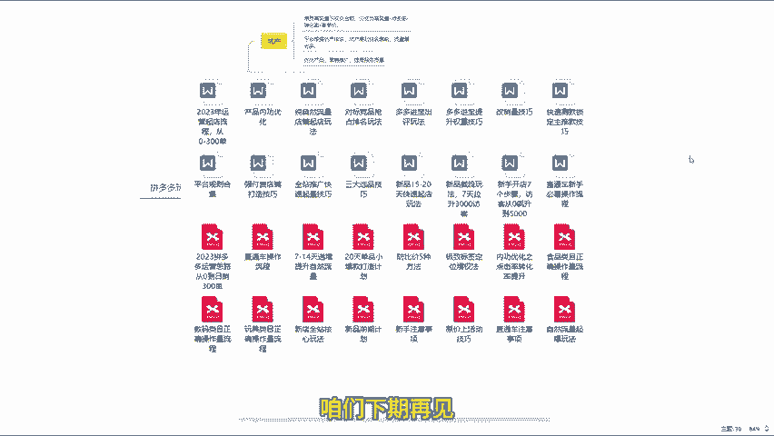

# 拼多多主要五点玩法核心学会自然流量底层逻辑 拼多多运营 拼多多小白 拼多多新手开店 拼多多干货 拼多多商家 拼多多学习 拼多多店铺 拼多多玩法 拼多多教学 - P1 - 老华电商 - BV1VNm5YXEna

不管你是新手还是老手，在拼多多这个平台上，千万不要被市面上五花八门的玩法给忽悠了。其实不管是什么玩法，其核心指标呢就是那么几个。这期视频我会把所有玩法的核心要点整理出来，学清楚了这个内容。

你自己也可以设计玩法。视频有点长，建议大家点个关注，再点个赞，反复观看。

第一个核心就是坑产。

可能许多新手不太理解，坑产就是你的单品展现下的成交金额。其计算公式呢为坑产等于展现量乘以点击率乘以转化率，再乘以客单价。对于平台来说，它是根据产品的坑产来进行排名的。也就是说，坑产越高，排名越靠前。

从而获取的流量和曝光呢就越多。对于商家来说，如果你想要提高坑产的话，就必须增加商品的曝光度。吸引更多流量和潜在客户达成交易。对提高销售额和利润。那么如何提高坑产呢？可以从以下三个方面进行。

第一个是优化产品。第二个呢是营销推广。第三个就是提高服务质量。由于内容比较多啊，这里就不过多的阐述了，需要了解的可以找我拿一个实操文档。第二个核心呢就是实时权重。它是指在电商平台上。

商品在某一个特定时间的表现，对其搜索排名和曝光产生的及时影响。从两个方面来说，在成交数据方面，在特定的时间周期内，如果产品的成交金额成交件数较高，那么该商品在这个时间段，实时权重就会增加。

而在转化率方面，如果在某个时间段，商品的访客数与成交比例较高的话，也就是转化率高。那么实时权重也会相应提高。所以大部分电商玩法中呢都会让你去控制实时进电的词，以成交实时转化率。

目的就是迎合实时权众的考核来稳定搜索流量。第三个核心要点是转化率。它是指在特定的时间范围内完成目标行为的人数与总访问人数的比例。单品转化率是按照同行高流量的对标竞品去控制。

搜索转化率是按照直通车流量解析你的行业均值去控制。

店铺转化率在提升流量的时候，控制到行业优秀，在稳定流量的时候呢，再控制到行业均值即可。收藏转化率是用户将商品收藏的数量与访问商品页面的用户数之比。如果整体转化较低的话。

可以先去优化轮播图详情页这几个方面。如果这些都优化好了，转化率还是上不去，那就是价格的原因可以适当降价，如果降价亏本，那么就代表这个链接做起来可能很难。第四个核心要点是店铺权重。

店铺权重的指标是店铺数和商品数据。产品最近7天的商品和店铺的数据要好，未来7天的流量就越多，权重高的店铺和商品在搜索结果的排名更靠前，就能获得更多的曝光。提高权重的方法可以从三个方面来做。

第一个是优化店铺运营，第二个是优化商品管理。第三个是引导用户行为，不懂的也可以来问我。

第五个核心要点是UV价值，也是平均每个访客带来的价值。其计算公式为UV价值等于销售额除以访客数。如果你的UV价值超过了同行的竞品，那么系统自然会给你匹配更多的自然流量。提高UV价值的方法有两个。

一个是提高客单价，可以搭配销售，也可以推出高端产品或者增值服务。第二个是提高转化，还是得从基础内功优化下功夫。优化商品详情页和评价等，吸引用户进行成交。好了，看完还有不懂的可以提问。或者评论三6。

领取一份我整理的多多店铺综合运营报。咱们下期再见。

