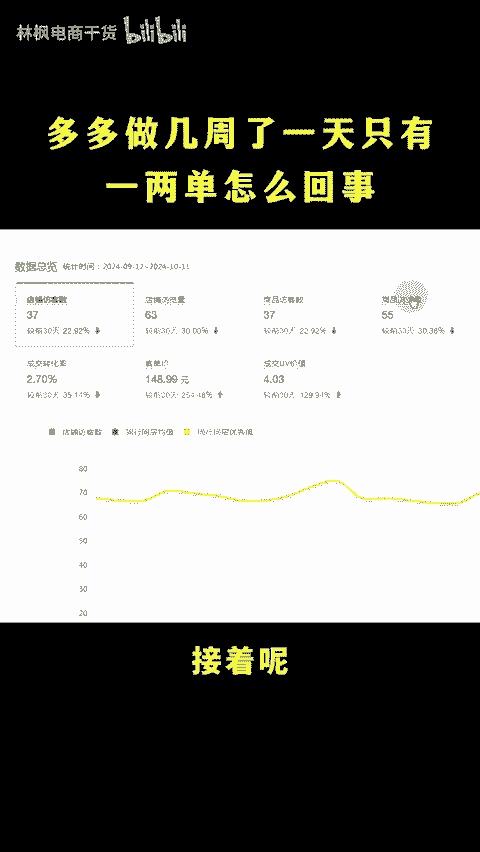
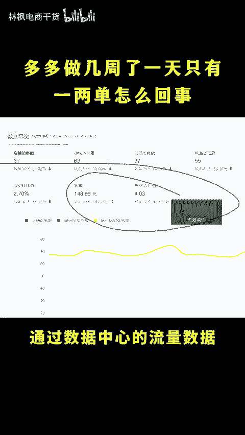
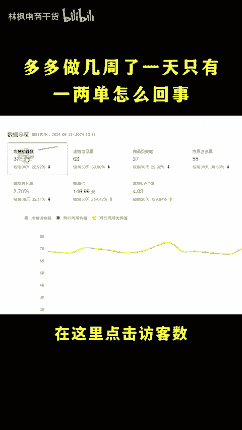
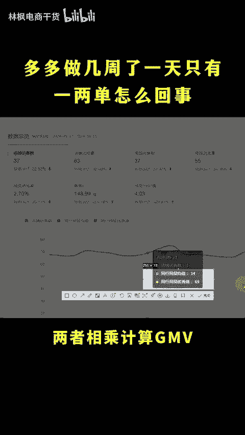
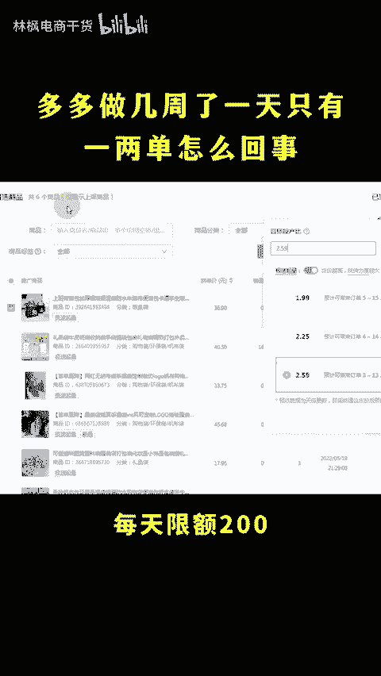

# 拼多多做了几周一天还是只有一两单怎么回事？ - P1 - 林枫电商干货 - BV1S3m5YUEDj

拼多多做了几周了，一天还是只有一两单，怎么回事？那肯定是你没有去开车上活动啊，我现在每天都能给美丽大几百单。😡，god多多一天就有几单怎么办？多端是被平台给限流了，正常原因不可能只有几单。

你可以先把这几个放大流量的操作做好，点赞收藏起来，直接上实操。首先第一个呢就是把店铺的DSR做出来，可以通过进榜的单品推高佣金呢找团长帮你推广出屏低佣金啊就复制短链分享新好友去做好评。

接着呢把店铺的权重拉升起来，一向权重的核心啊就是坑场通过数据中心的流量数据计算同行同城优秀GMV每天超过这个值就能够提升。在这里点击访客数和成交UV价值。下面这里呢计录同行同城优秀数据。

两者相乘计算GMV通过大单或者说递增去做就行了。最后呢就是卡一个高同场，每天限额200别说一天几单呢，一天300单都不是事。😊。

