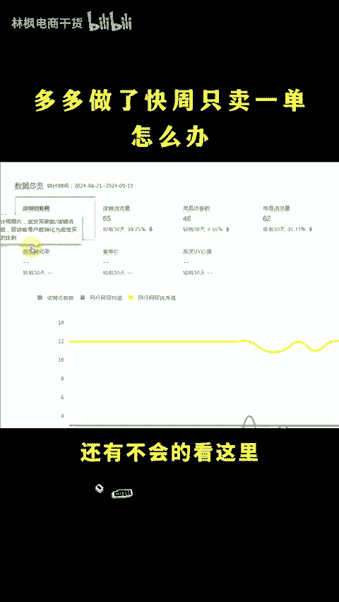

# 拼多多做了快一周了只卖一单怎么办啊？ - P1 - 林枫电商干货 - BV1F2tkeSEAf

拼多多做了快一周了，只卖一单怎么办呀？说明你的价格还不够低，直通车花的还不够，还得加大力度才行。你要逼。😡，你有新品做了一周了就出一单，怎么回事？你只上传了链接，什么都不做，店铺链接都没有权重。

能卖一单都是你运气好了，点个关注点个赞，实时教你快速爆发订单。😡。

首先没有订单，先看产品有没有权重啊，后台找到流量数据，点击搜索流量，看整体3米速度指数的曲线图。如果曲线低于平均水平或者直接躺平了，那就是权重太低了。赶紧去补指数拉高权重啊，指数提升也很简单。

直接在后台找到流量数据，在这里查看同行同城的反客数和UV价值的优秀值。两个数据相乘的就是同行同城优秀三家的交易额，把这个数据再乘以1。5倍。然后呢除以你的客单价就是你需要做的单量。

然后做单的时候用客服定制邀请功能，公通好发货时间和订单数量，这样去下单，持续做一周，指数就会明显的提升啊，指数提升啊，流量和订单才会爆涨，还有不会的。看这里。

