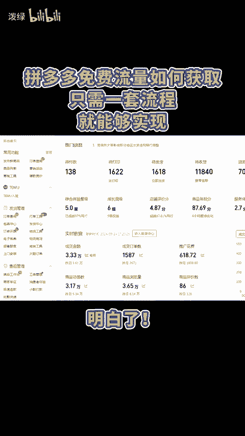
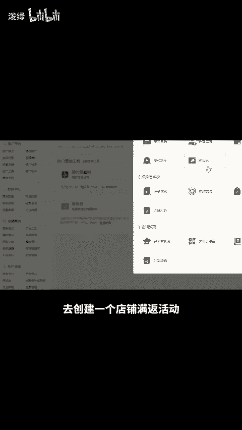
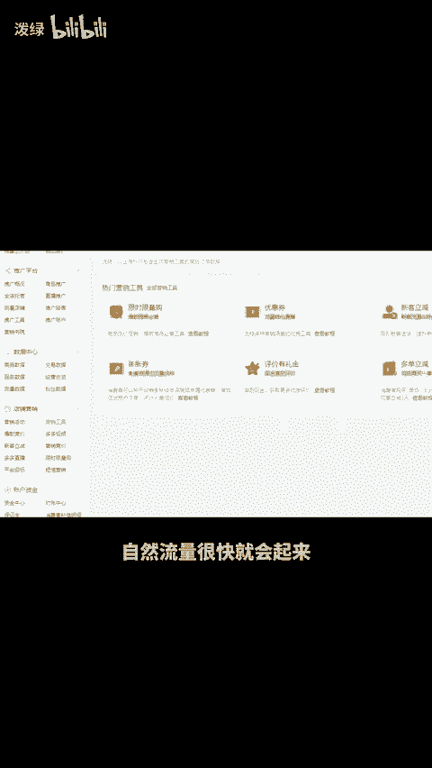

# 拼多多免费流量如何获取？只需一套流程！ - P1 - 泼绿 - BV1JusZeJEmn

拼多多的免费流量如何获取？只需一套流程就能够实现。明白，首先进入后台的营销工具，点击全部营销工具，去创建一个店铺满返活动，接着打开优惠券，创建商品券和店铺优惠券之后，在营销活动中找到15591并报名。

当链接有了一定流量后，利用出屏工具做1200条评价，按照这个方法将销量卡到几千即可。操作完成后链接的点击转化率才能得以提高。最后回到营销工具，开启限时限量购，给链接稍微打个折，需要注意的是。

这个活动与优惠券会叠加，小心出现亏损情况，如此维持到与同行差不多的价格，多个自然流量渠道就都能打开了。自然流量很快就会起来。还有不会的，或想学习更多运营技巧，留言888分享给你。😊。

