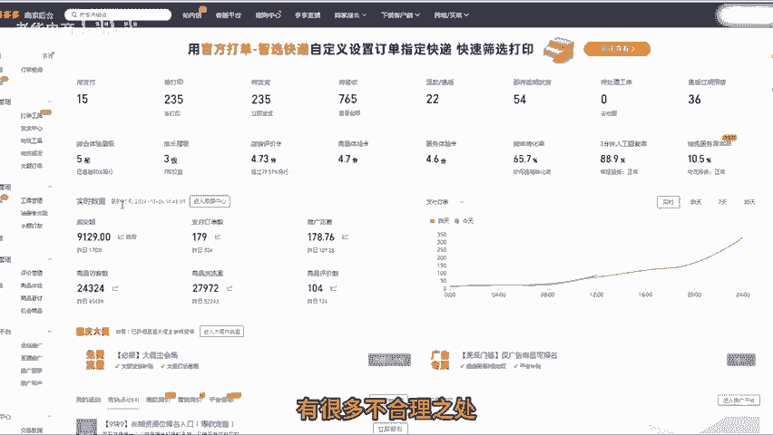
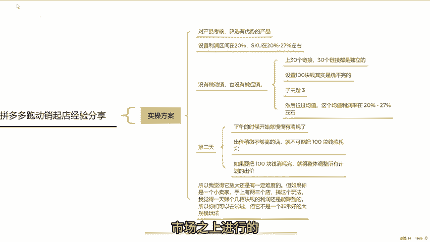
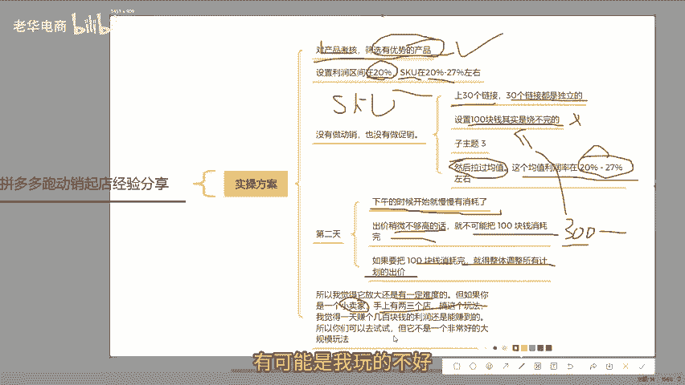

# 拼多多十月份小卖家动销起店热销百单稳赚不赔 拼多多运营 拼多多小白 拼多多新手开店 拼多多干货 拼多多商家 拼多多学习 拼多多店铺 拼多多玩法 拼多多黑科 - P1 - 老华电商 - BV1uH1BYGEHg

今年跑动销企店的人非常多，很多粉丝在后台询问相关问题。在此呢我为大家总结一下关于如何跑动销企店的经验复盘。首先要说的是这个技术出现有一段时间了，78月份的时候呢，就有很多人在玩了。

今天我来给大家讲讲我的经验。其主要原因是我当时呢对这个玩法心存质疑。跑动销的逻辑是什么呢？有人说可以往店铺里面先上架多个链接，然后把这些链接全部丢到直通车里，所有链接不做任何驱逐权重的干预。

包括动销的干预，直接玩，比如促销等操作也不做。开直通车的逻辑很简单，把所有产品垒到一个计划里，让他去跑。在跑的过程中呢，如果一天100块钱的计划，把所有链接都跑完了一遍，能把这100块钱消耗完。

不管出不出单，先让它消耗，只要能消耗完，就不断加日限额，定好时间，比如从早上9点到某个时间点开始跑。这个时间段消完之后。消完就加，直到每天能够加到几百甚至上千块钱的日限额。单品基本上就能出很多单。

我当时心存质疑的是，这种方式乍一看会让人觉得非常有效。从逻辑基础上想，只要在前面做好链接的考核，比如款式好的就上架，不好的就不上架，什么产品好。😊，同行卖的好的就是好产品。那书籍我是零基础开销。

100块钱压力也不大，一切看起来都很合理。但我觉得这切合理的背后有很多不合理之处。所以我决定自己尝试一下，现在说说我的方案，我所做的这些方案都是在设想之上进行的，我会让产品进行考核。

我的优势是自己产品有产品库，所以知道哪些产品稍微好一点。然后我找了一个店铺开始干，我的结论是，前面所有产品我真的用心做了规则，这些产品在市面上都是有人跑出来的。

然后我把利润定价区间没有按照正常打爆款的方向走。我当时定的利润是20%，但有些产品某些SKU也能浮动到26%到27%左右的利润空间，这是我设置的基础。我什么都没有做，基础也没搞把链接上上去。

我当时跑的是30款产品，30个链接都是独立的，没有做多个链接丢进去之后，我在跑的过程中发现100块钱一天都刷我。后来我发现我把所有成交出价都设定在利润空间以内。然后我尝试把自己的利润空间压缩。

具体压缩了多少，没有标准值，我大概是估算的。😊。

我知道自己这款产品的实际卖价大概是多少，然后拉过均值，这个均值利润在20%到27%左右。所以在这个过程中，我知道热销SKU是哪一个，就奔着热销SKU的最低那个20%利润来算。不断突破自己的成交出价。

我不知道改不断调整。我记得第二天在调整的过程中，好像是下午的时候开始就慢慢消耗了。现在。结论是这个方向是有道理的，可以做。但是它实际问题跟我们日常打包款是一样的。你会发现出价稍微不够高的话。

就不可能把100块钱烧完。如果把100块钱烧完的话，就得整体调整所有出价的计划。😡，但因为产品太这是一个偷懒式的打法，现在放大的逻辑我并没有去做，但是现在也确实有了出单，因为利润在那儿摆着的。

所以还是有一定的利润空间。但赚的不多，我不知道这个东西最小可行性有没有跑成功，但是你们可以借鉴一下。如果有人打过，应该也有一种感觉。但我还是特别想说，这种打法最终是一种笼统打法，不能成为主流打法。

因为你会发现这种东西太不可控了，而且不断去持续烧。如果产品烧的出去还好。那如果后面我给他加了300块钱一天的限额，又出现前期烧微100块钱那种烧不动的情况怎么办呢？又得去想办法。

这个过程就会让你陷入无底洞，要么就报活动。那选哪款产品报活动去冲产值呢？就会落到根本上问题，还是存在运营环节，有很多形成不了的。所以我觉得它放大还是有一定难度的。但如果你是一个小卖店铺，搞个这个玩法。

我觉得一天赚个几百块钱的利润还是赚得到的。所以你们可以去试一试，但它保的大规模玩法有可能是我玩的不太好。看完还有不懂的可以提问，也可以评论3个6，领取一份或整理的多多店铺综合营包。好，咱们下期再见。😊。

