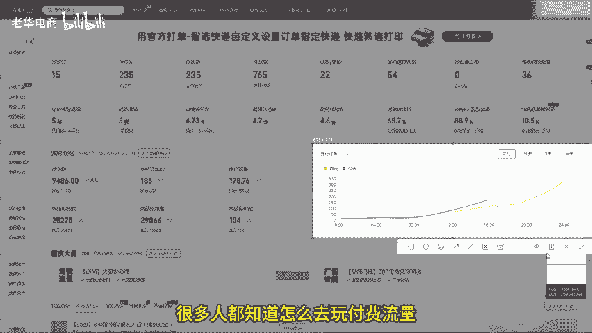
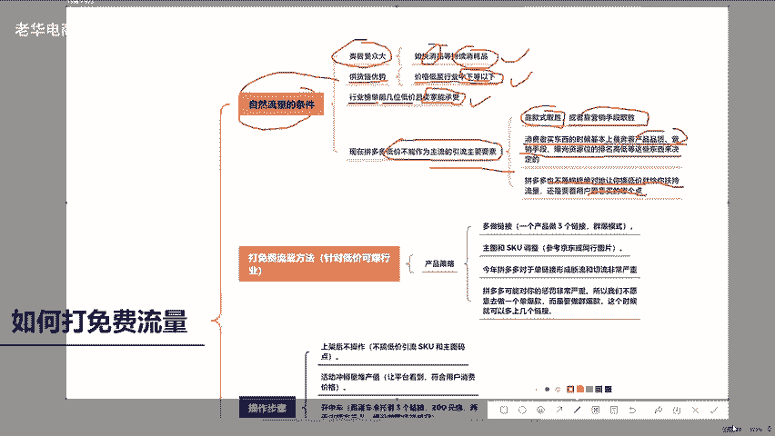
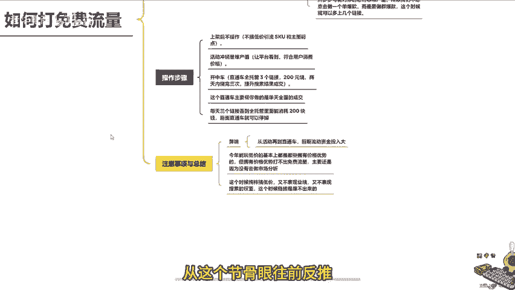
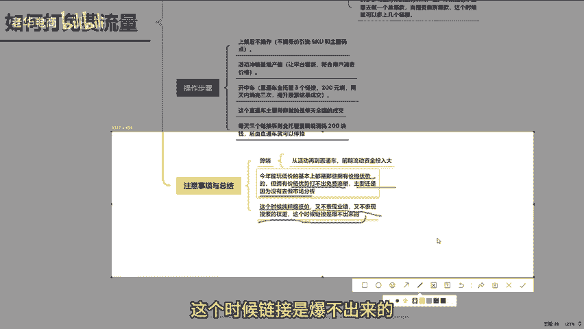
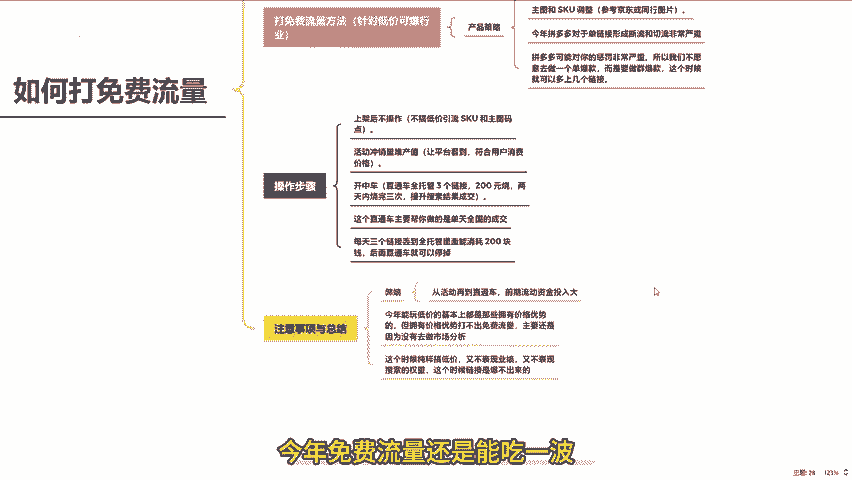
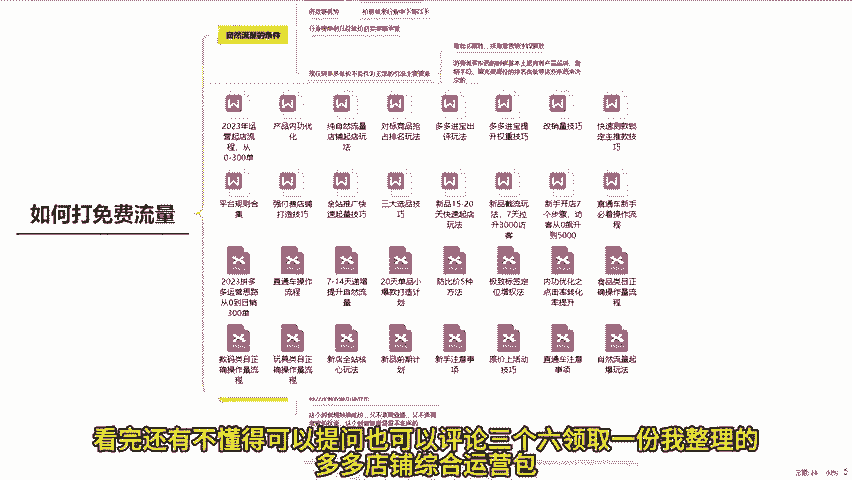

# 拼多多十月份打免费流量玩法理清自然流量底层逻辑 拼多多运营 拼多多小白 拼多多新手开店 拼多多干货 拼多多商家 拼多多学习 拼多多店铺 拼多多玩法 拼多多黑科技 - P1 - 老华电商 - BV1SosfeKEmT

今天这件视频来给各位说一说如何打免费流量。今年很多人都知道怎么去做付费流量，但对于打免费流量，不少人却感到疑惑，因为不确定到底用什么样的方式才能把自己的免费流量打起来。我们都知道在拼多多上免费流量。

通常是低价为王，只要搞低价，似乎就有免费流量。然而，实际上在今年的整体表现中，即使是低价也不一定能够得到免费流量。这是为什么呢？下面我就来好好给大家聊一聊，并且把所有获得高免费流量的方法。

以及具备先天优势，应该如何做的流程全部都给大家说一说。😊。

首先要明确一点，现在打自然流量，也就是免费的自然流量。需要具备三个条件。第一个条件是你的内目受众要非常大。这里的受众指的是在拼多多里这一类产品具有持续性消耗的特点，比如卖纸巾、消耗品、快消品等等。

这类产品本身就是低价商品，天生就具备低价优势。第二个条件是你的产品，目前要有一定的供货链优势。也就是价格要足够低，这个足够低，要尽量参考同行能达到行业中下等以下的价格，这样基本就优势了。

第三个条件是价格足够低的同时，一定要关注同行业。如果看到榜单上面的前几位全部都是低价产品，而且作为卖家，你也能承受。那么这类产品才有可能打得爆，为什么呢？其实今年在很多类目已经出现了这样的情况。

在拼多多的一些品类中，你会发现top排名榜前三、榜单前三或者排名资源位的前三是很多单品，不一定是低价。有些行业可能是中等价格的一些产品上到榜单前列。这就是说在某些行业中。低下不能作为主流的引流主要要素。

因为有些品类本身价格不具备长久的信力，可能靠款式取胜，可能靠营销手段取胜也是很常见的。就像一到夏季卖凉席蚊帐的，有些产品根本不是低价，主要还是以中等价格在卖。因为用户对于这类产品的成本不是很清晰。

所以买东西的时候基本上是奔着产品品质、营销手段、曝光资源位的排名高低等这些东西来决定的。所以在某些品类上，你可能区别于低价优势，但今年也达不动。主要是因为现在拼多多也不是纯粹。

绝对的让你搞低价就给你流量扶持。还是要看用户愿意买哪个点。这就是非常重要的。当我明白这些之后，来说一说怎么打免费流量。😡。

比如你的产品在行业里做调研的时候，发现所有top前三的都是搞低价，而不是中等价格。那么在这样的行业里，低价就是你的优势，再加上你有供应链优势，而且这类品类在某个阶段或者一年四季都能够持续性的消耗。

那这类产品你就可以直接打低价引流了。这个时候打低价一定要清楚。目前打低价的常规套路是一个产品，不要聚集在一个链接上去做，应该是一个产品多做几个链接。我目前见到同行业玩的最好的就是做全报模式。

也就是这个产品先上架三个链接。但其实三个链接就是一款产品，你只需要在主图和SQU的命名上以及主图的外貌上面进行调整。这个调整很简单，做主图可以直接去京东里面找高清图片。拿过来用美头稍微改改就能用了。

参考同行的图片也可以直接用，记住这个准则就好了。为什么要多上架呢？因为今年拼多多对于单链接形成断流和切流非常严重。说白了就是今年如果一旦犯一点点错，拼多多可能对你的惩罚非常严重。

所以我们不愿意做一个单爆款，而是要做全爆款，这个时候就可以多上几个链接。链接上完之后，记住什么操作都不用做SKU也不用刻意去搞低价引流，也不用去做主图码扁。因为都已经是低价了，所以没必要去做。

当这些做完之后，下一步的第二个操作是所有产品上架完成后，直接用活动冲。因为今年的低价产品只有堆销量，堆产值，让平台看到你。而且你这个行业整体价格是用户最普遍消费接受的。也就是用户成交主要盯着价格看。

那这种产品就用活动去拉产值，拉完产值之后，第三步就是开直通车。而今年所有直通车去打量，只有一个操作，就是所有活动跑完之后，你的直通车只负责帮你跑搜索结果的成交。把三个链接丢到直通车全店托管。

然后用200块钱去烧。如果一个链接能够在一天之内，或者最长不超过两天能稳定，烧完200块钱。连续三次，基本上每个链接的流量都能够起来。这个目的不是别的，首先用活动去冲产值。充完之后，技础权重都是有的。

但是这个时候搜索几个月的表现和权重值不高，用直通车去砸这个直通车主要帮你做的是全天全国的成交，只要这些数据都达标了。你的免费流量基本上就进来了，再加上你的价格又是低价。

你这个行业的用户又是聚焦于低价再来成交的。所以你的直通车开个三天时间，每天三个链接丢到全链托管里面能消耗200块钱，后面直通车就可以停掉。但是这个有一个弊端，从这个结构眼往前反推，从活动到直通车。

如果你仔细算，会发现前期投入的流动资金还是比较大的。所以对于有些卖家来讲的话，可能是有点受不了的这就是我们说今年农门低价的基本上都是那些拥有价格优势的。

但拥有价格优势，不打出点废流量，主要还是因为没有去做市场分析。有些行业就是中等价格能够在市场上流通。但这个时候纯粹搞低价，又不表现业绩，又不表现搜索的权重。这个时候链接是爆不出来的。

所以这几个要素抓了之后，只要你有价格优势，今年的免费流量还是能够再吃一波的。看完还有不懂的可以提问，也可以评论三个6，领取一份我整理的多多店铺综合运营包。好了，咱们下期再见。

