# 拼多多十月开店6个步骤新手也能做爆单品！ - P1 - 林枫电商干货 - BV1kJ4ceAEHF

🎼拼多多10月最新起店方式不需要你低价上活动，也不需要你高价开车，只需要做好这几个步骤，什么产品都能推起来。大家可以点赞收藏一下，直接上实操。首先，第一步上架链接，前期店铺只需上架5到10个链接。

每个链接都虚高定价，然后做破零产品多的就正常上架。单品裂变去做多链接的就得做出差异化。主图SK定价都要做出区别，同时做好防比价，防止店内同款比价，第二天继续上架5到10条链接，同样的破零，做好防比价。

然后根据数据挑选出几个最好的链接，去做大几千的销量，做50到100个评价。做的时候不需要做太多容易断流和被关小黑屋现阶段做店一定要认清楚平台的态度。

链接铺完之后做第二步就是做层级和DSR先做DSR看的需要进90天内，店铺有50个有效评价，然后层级的话可以过个几天再通过拍大单的方式，第二天退款就行。而且现在的平台技术服务费退款的时候也会退回。

完全不用担心成本问题，一般搞到3到4级就可以。

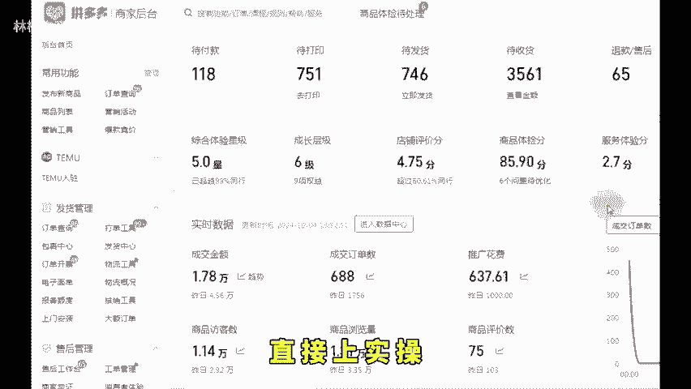

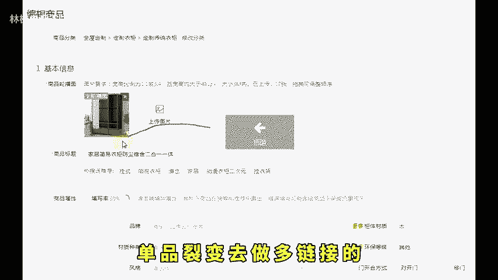

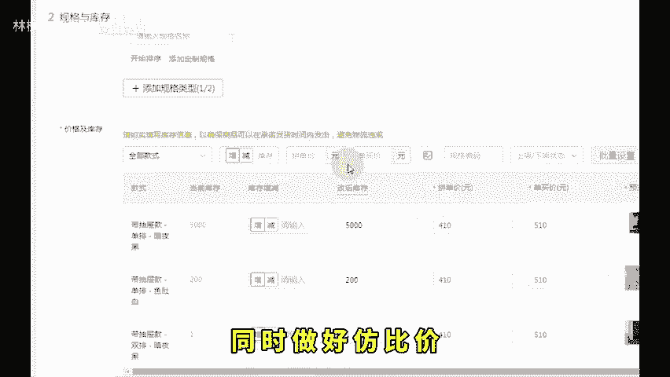

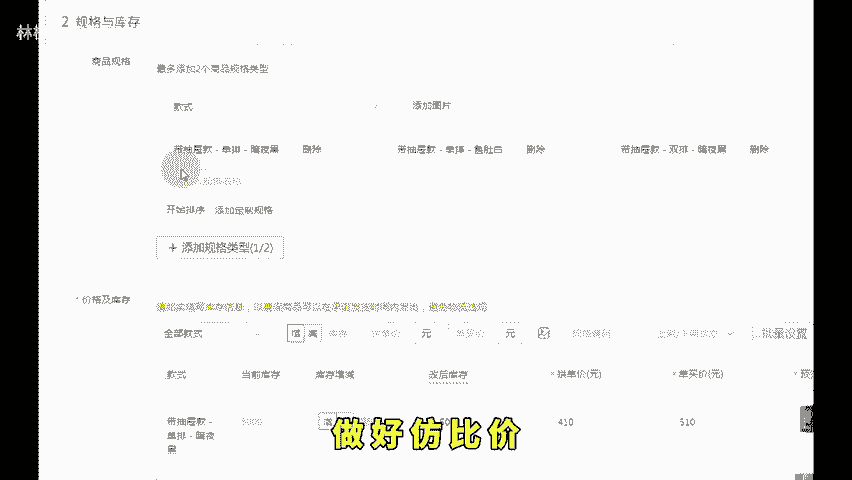

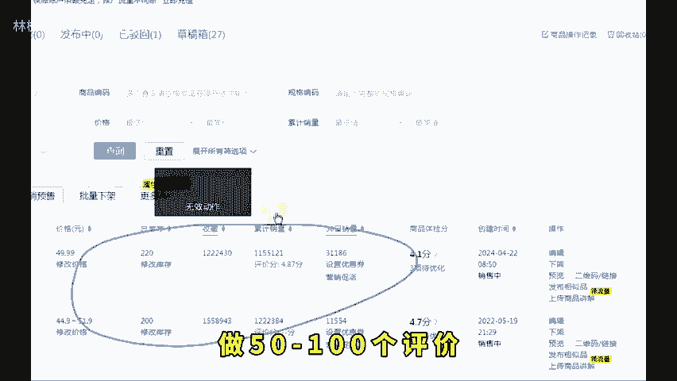

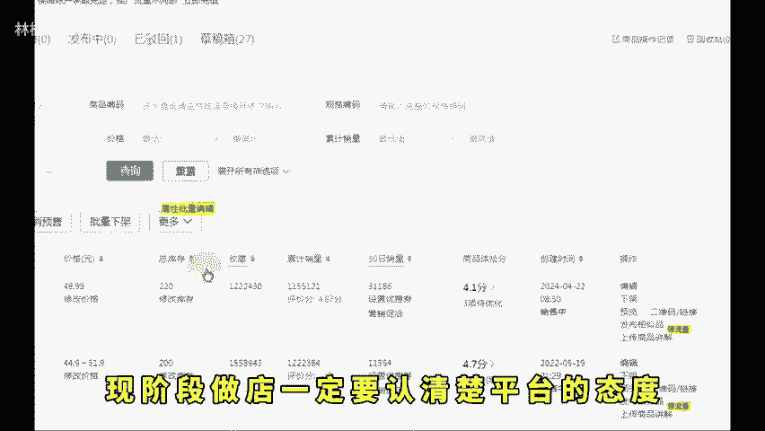

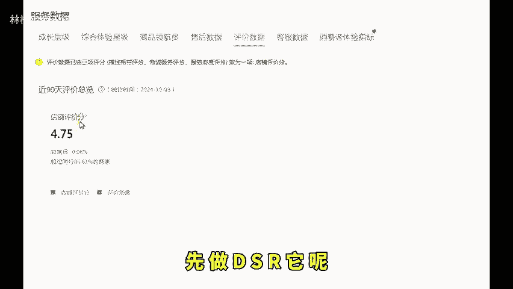

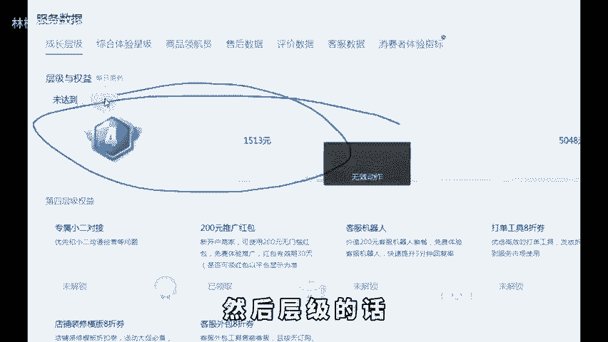

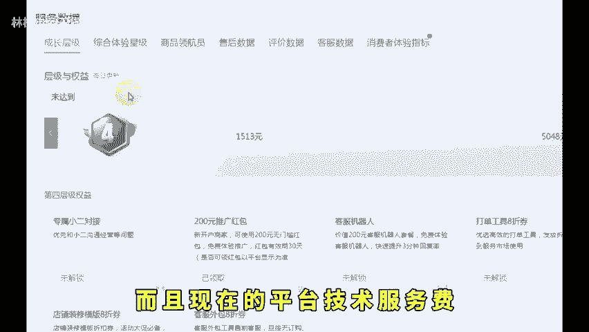

🎼这样对于后续拉车子有好处，跑起来会更容易一些。接着就是第三步了开直通车。开车的话，前期测链接还是以成交出价去测好一点。出价的话就按照利润的90%或者保本就可以。不要看系统建议价，跑个两三天。

因为现在推广合并之后，能启动的时间变得更长了，所以多跑一会没关系。跑了3天之后就看哪条链接看跑得动，假设一天能跑个50，能跑100，而且还是保本或者盈利的，那就增加限额去扩大销售额，增加订单。

要是都跑不动，可以统一加出价，微亏一点去跑微亏超过3块跑不动的就直接放弃。第四步数据优化，那这个时候就要开始去看数据进行调整优化，通过推广车子里的推广诊断去看。如果是转化率很差，那就是价格和内功的问题。

把基础内功再做一点就可以，把营销分为安排到位，商品答疑和详情页的优化或者直接降价。如果是点击率不太行，那就是主图的问题，做好几张主图，然后在推广创意里面本地上传，可以上传4张对不对，测一下主图。

点击率测到合适的主图。

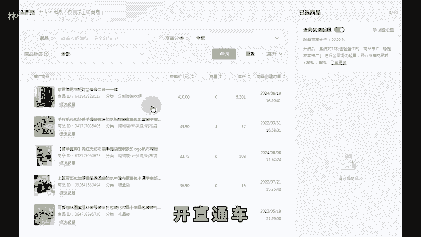

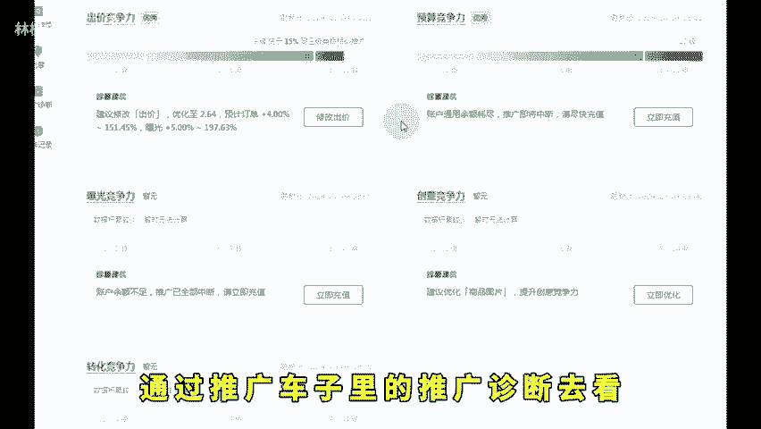

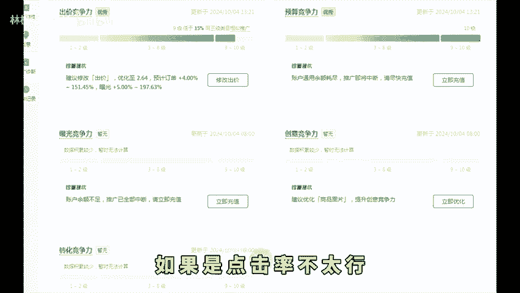

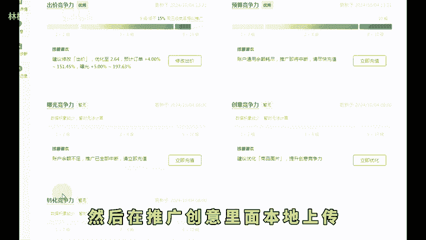

🎼就到商品列表添加到链接里去。如果是转化高，点击率低的，改下码扁文案，继续测。第五步就是选定方向了。要是点击率和转化率都优化好了以后，就要确定方向是选择24小时付费型盈利。

还是选择一天只跑一半的时间或者4到8个小时，这叫半付费半自燃，这个一开始咱们就要定好的。如果是选择24小时付费，就不要想着后续开一半时间停一半时间，所以建议大家如果你一开始就跑8到12小时。

如果没有自然流，后续可以直接优化，链接调整为保本或者盈利模式，24小时去跑全天付费。第六步就是选一个固定的开车时间，因为出单多或者曝光多的时间去把日限额跑起来会事半功倍。比如每天你打算只跑8个小时。

那就8个小时内跑完。如果日限额不够，就加日限额。如果烧不完，那就加出价或者降低投产，切记想跑出自然单，就是要快速烧完，不要让你的付费流量覆盖免费流量，多多链接的权重比重最大的是坑产，你出单越多。

权重越高。所以日限额要尽量。

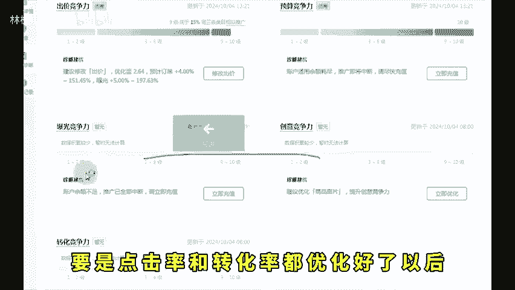

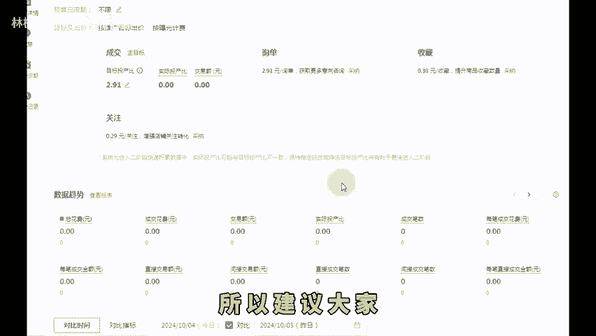

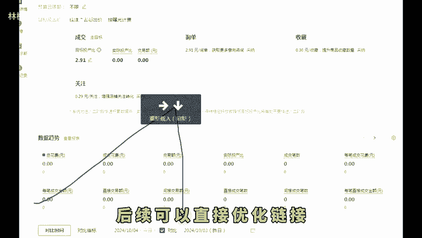

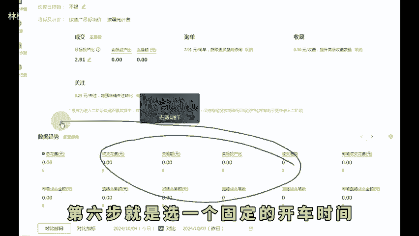

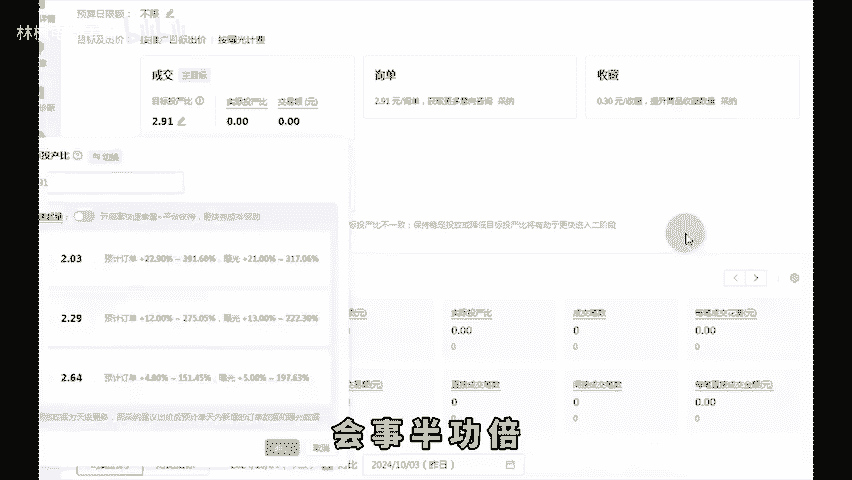

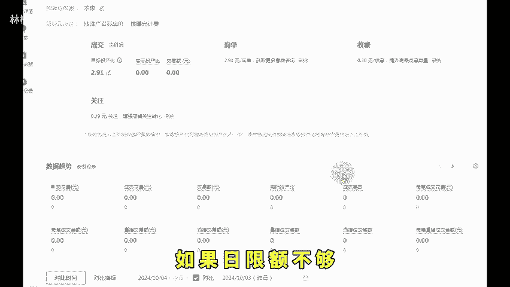

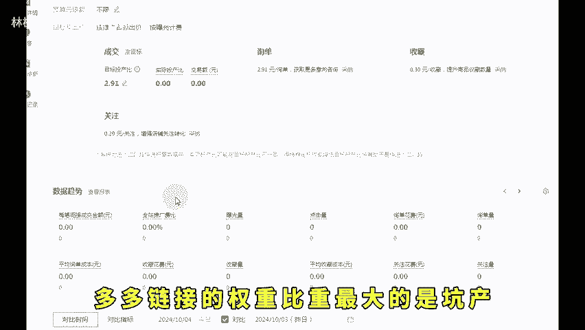

🎼快速的烧完，希望可以帮助到你。