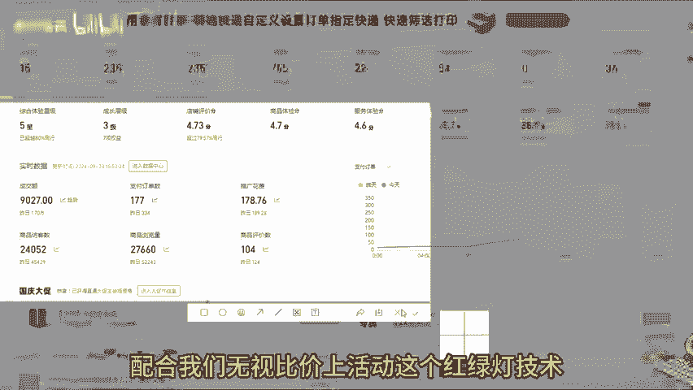
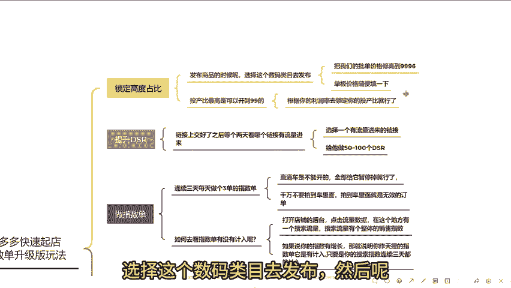
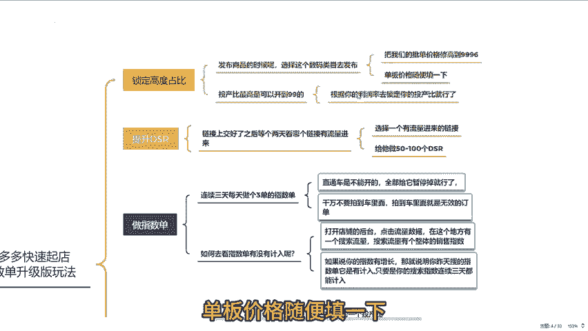
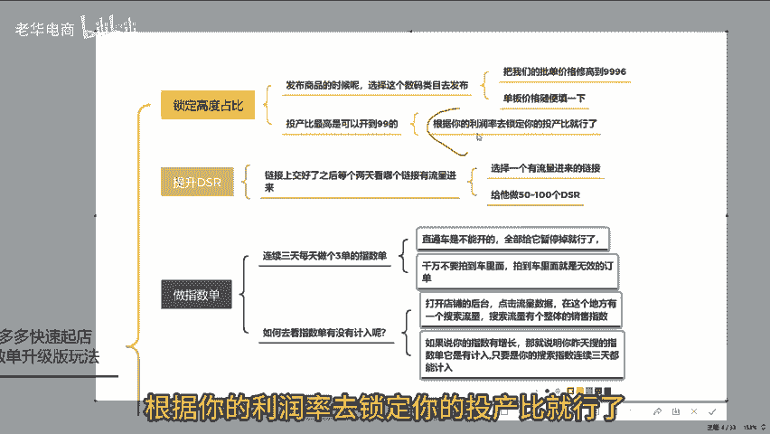
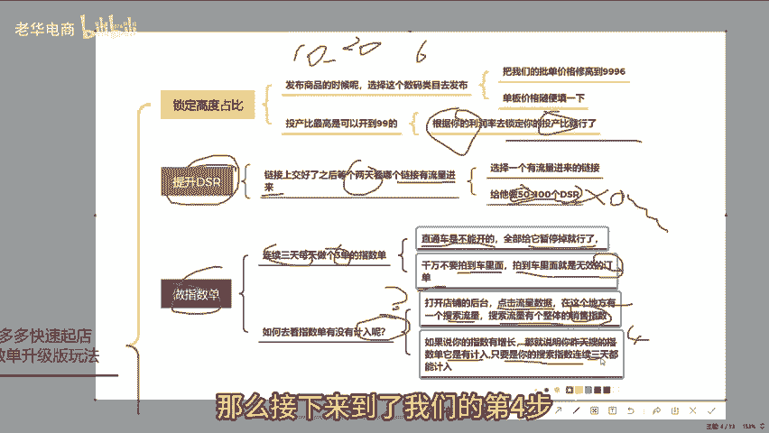
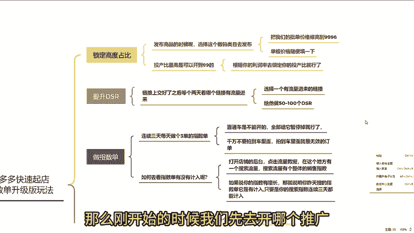
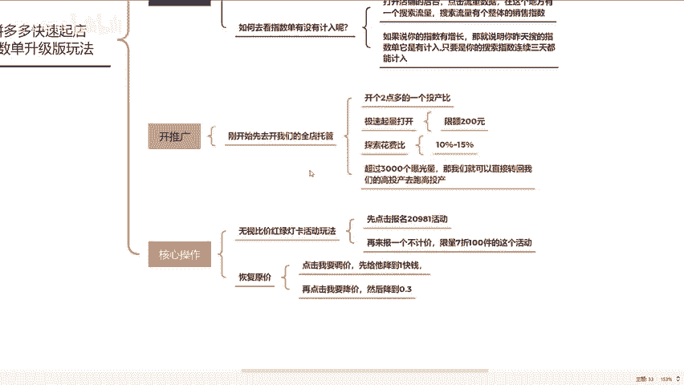
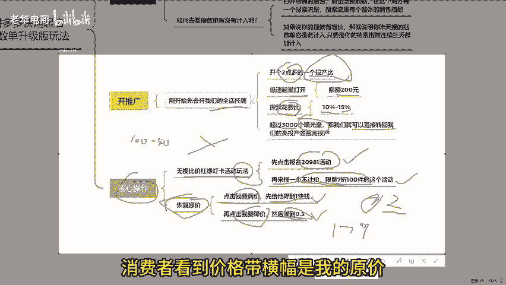
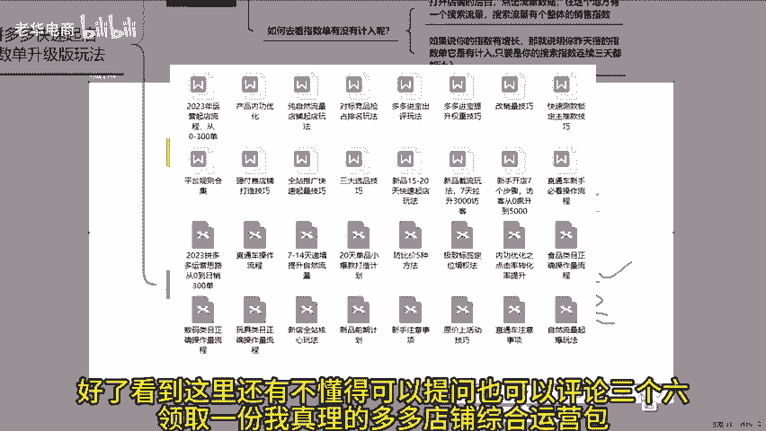

# 拼多多卡高投产原价上活动连个链接5天快速出百单 拼多多运营 拼多多小白 拼多多新手开店 拼多多干货 拼多多商家 拼多多学习 拼多多店铺 拼多多玩法 拼多多黑科技 - P1 - 老华电商 - BV1FpbFecEvw

给大家分享一个拼多多最新快速起店的指数单升级版玩法，配合我们无视比价上活动。这个红绿灯技术一条链接基本上已经投入500左右，5天时间，一条链接做100单没问题。时间内容比较核心。

大家一定要先点关注再点赞，保存起来，慢慢看。😊。

转发给你身边需要的朋友来一起看看。那么我们废话不多说，直接上实操。这一个指数单升级版玩法一共是分为5个步骤，最后一步非常重要，大家一定要好好的用心，跟着我的节奏一步一步的去落实。

只要你严格按照这个方法去落实，保证你15天的时间，能够起一个百单的小保管。😊。

首先第一步，我们先去锁定一个高度占比，锁定高度占比的方案呢，还是之前一样，我们在发布商品的时候，选择这个数码类目部去发布。然后呢。

把我们的批单价价格调高到9996。单板价格随便填一下，这个地方投产比呢最高是可以开到99的那具体你应该设置多少呢？我给大家列了一个公式，大家可以去看一下。😊。

根据你的利润率去锁定你的投产比就行了。打个比方说我的成本是10块，我想卖20块，然后这个表格就自动算出来，你的利润率是多少，你的理论保本投产比就是多少。

我们一般根据利润率去锁定你对应的投产比就行了。这是一个我一直常用的一个算单的表格，非常的精确。如果说你们没有的，可以点个赞，后台扣个6，我可以发给你们。到了第二步，我们所有的链接上交好了之后呢。

我们等个两天看看这个链接有没有流量进来，选择一个有流量进来的链接，先去给他做50到100个DS2。为什么要去做DSR呢？因为我发现很多人的产品评分不行。链接刚刚起来会有几个人给他差评，给了差评之后呢。

这个链接直接断流，直接倒闭。我建议大家先提前做50到100个DSRDS2做好之后，就到了第三步，第三步我们就开始进行去做我们的指数单。指数单没有必要做太多，连续三天每天做个三单的指数单就可以了。

大家需要注意一个细节，我们在做指数单的时候，我们的直通车是不可能开的。😊，全部给他们暂停掉就行了，千万不要拍到车里面，拍到车里面就是无效订单。那我们如何去看指数单有没有记录呢？😡，我们打开店铺的后台。

点击流量数据。这个地方有一个搜索流量，搜索流量有个整体的销售指数。如果说你的指数单有增长。那就说明你昨天搜的指数单它有记录，而且这个指数单呢，它并不是说当天更新，它是每天下午4点钟才会更新这个指数。

所以说在这个地方大家可以注意观察一下，只要是你的指数单，连续三天都能记入。那么接下来到了我们的第四步，就是要去开我们的推广。那么刚开始的时候，我们先去开哪一个推广呢？😊。

那我们刚开始呢先去开我们的全店推广。

这个全电托管就去给他开个两点多的一个投产比就行了。你可以把你的极速请量打开。如果说你不开极速起量的话，前期可能是跑不动的。😡，就给他限额200元就行，打开了极速起量，这个探索花费比例。

我们正常情况下给他控制个10%到15%就可以了，没有必要太高。托管计划一旦打开了之后呢，我们只要看这个曝光量就可以了。当你的托管计划只要能够超过3000曝光量。😊，那我们可以直接转回我们的高投产。

确保高投产就可以了。99%会遇到一个问题。托管100元的限额跑完了之后赚回来50元的高投产，我们的高投产是跑不动怎么办呢？那接下来就要去操作我们的第五步，也是最核心的一步。如果说你不操作这一步。

你的高投产品是不可能跑得出去的。就是说要用到这一个无视比价红绿灯卡活动的那个玩法，我们先点击报名20981活动。点击确认提交报名成功之后，我们再来报一个不计价，限时7折100件的这个活动，点进去报名。

立即报名。刚开始。我讲过，我说过7折是原价报名。但是系统给站内同款的最低价是2块钱。不用管它的价格，然后直接确认报名就可以了。大家注意一下。😊，报名成功了之后呢，我的价格是2块。

那么我们怎样恢复到原价呢？这一步非常重要，大家注意听啊，我们直接点击我要调价，给它降到1块。我们点击确认的提交第二步，我们再点击我要降价，然后降到0。3，点击确认提交，我们再来刷新我们的链接。😊。

我的商品价格原价是179，我的资源位是0。3，消费者看到价格带横幅的就是我的原价。好了，看到这里还有不懂的可以提问，也可以评论三个6，领取一份我整理的多多店铺综合运营包。好，咱们下期再见。😊。

