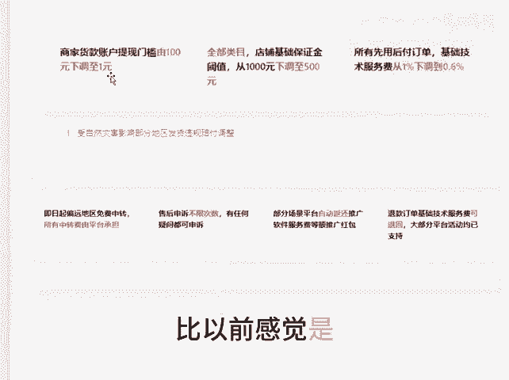

# 拼多多又放大招 - P1 - 千优电商教育 - BV1WExKeLEdj

从9月份开始，拼多多对商家的利好政策不断。原来的政策呢大家看着是没有太多诚意。比如说售后申诉不限次数，还有部分场景退还技术服务费。但是拼多多这次呢它的确我觉得是有点诚意了。

就是从9月24号开始退款订单基础技术服务费自动退回，就所有场景呢都会退还。这个呢拼多多做的还不错，另外呢还下调了提现的金额的门槛，原来是100万，现在下调到一块，你反正拼多多这么做吧。

以前感觉是好了那么一点点，我是讲师大牙，欢迎大家扫码添加我的微信，不方便扫码的朋友可以添加我的微信号，80221430。在这里给大家准备到了一套新手运营入门的大礼包，希望能够帮助大家。😊。

