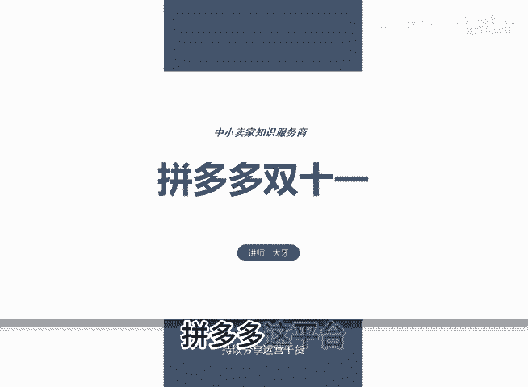
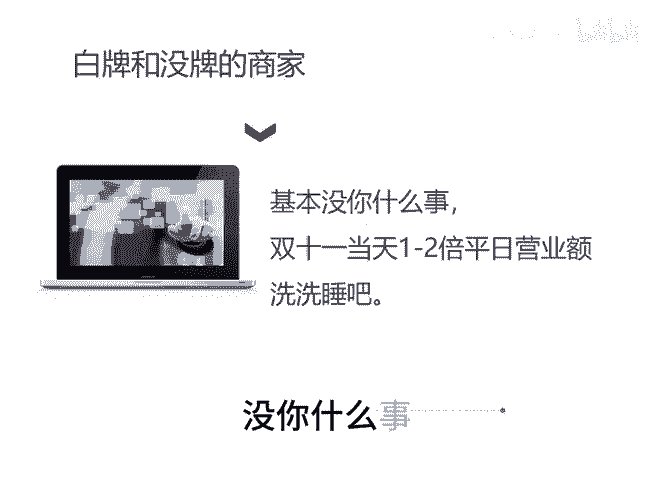

# 拼多多双十一 - P1 - 千优电商教育 - BV11LyAYvEVg

拼多多这平台呢它简直是扯淡。今年双十一的时间是11月14日到11月21日，一个多月的时间。我们知道呢拼多多它的广告词是什么？是拼多多天天都是双十一啊，由于它天天都是双十一真的到双十一的时候，它就不行了。

那么我们看双十一什么产品好卖，一般是高客单的商品好卖，抢品牌的商品好卖。在双十一呢，这样的品牌更容易出单。你看淘宝上有些抢品牌，在双十一当天卖了一两个亿，都是这种类似于高客单抢品牌的产品啊。

因为消费者呢他有期待到处打折吗？对于平时你像打个酱油，买包盐炒菜，这肯定不能等到双十一，而高客单和抢品牌是谁的主战场，是人家天猫和京东嘛？所以说多多上的白牌商家和一些其他的媒牌的商家，你可以洗洗税了。

基本没你什么事。当然在多多上抢品牌，它也会有增量，但是增量不如淘宝和京东。对于我们这些白牌和没牌的商家，你可以报个活动打个标，但是真的。😊。

问你什么事？我是讲师大牙，欢迎大家扫码添加我的微信，不方便扫码的朋友可以添加我的微信号，80221430。在这里给大家准备到了一套新手运营入门的大礼包，希望能够帮助大家。😊。

