# 拼多多双十一快速打造免费流量玩法热销700单3万营业额 多多运营 拼多多小白 拼多多新手开店 拼多多干货 拼多多商家 拼多多学习 拼多多店铺 拼多多玩法 拼多多 - P1 - 老华电商 - BV1pT12Y9EyC

今天我给大家分享一个拼多多双十一活动，打造免费流量的玩法。自从平台产品推广升级以后呢，很多人都知道平台已经进入付费流量的阶段。

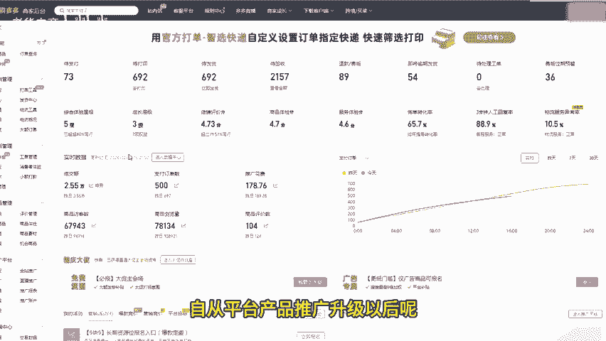

但现在仍然可以玩免费流量。为此，我花了一个月的时间为大家整理出了这套拼多多双十一活动，打造免费流量的玩法。我8月底注册的账号到今天的数据已经非常可观，只需要100多就能日发700单，成交额突破3万。

用的正是这套玩法，看完后，如果还有不懂的地方，我这里有详细的拼多多运营拆解不足，以及所有产品的实操文档。小伙伴们可以自己到评论区查找。

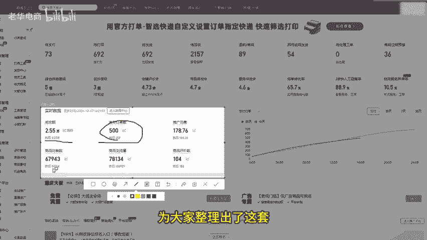

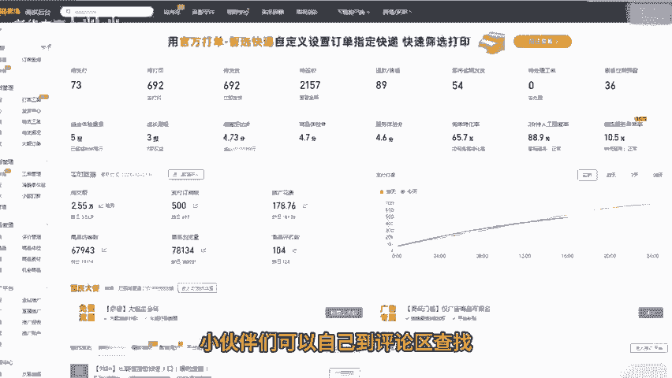

我们都知道，在拼多多上免费流量通常适用于低价为王的产品，只要价格够低，做到同款低价。系统就会给你分配更多的免费流量。然后实际上呢，很多拼多多今年在整体数据展示来看，即使是低价，也不一定能够得到免费流量。

这是为什么呢？下面我就来好好给大家聊一聊，并且把所有免费流量的玩法以及拼多多双十一打造免费流量的玩法呢分享给大家。😊。

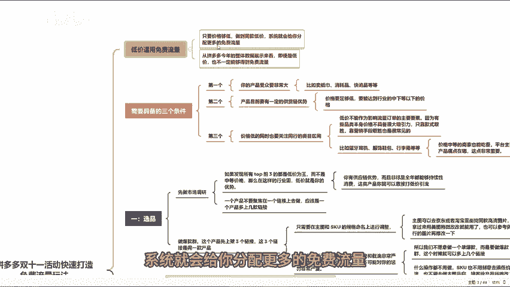

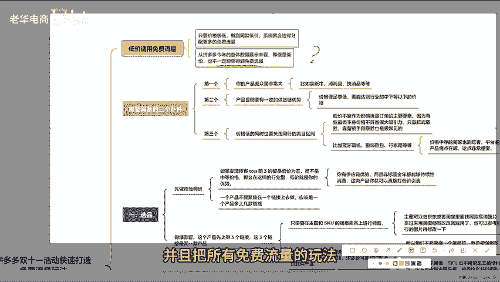

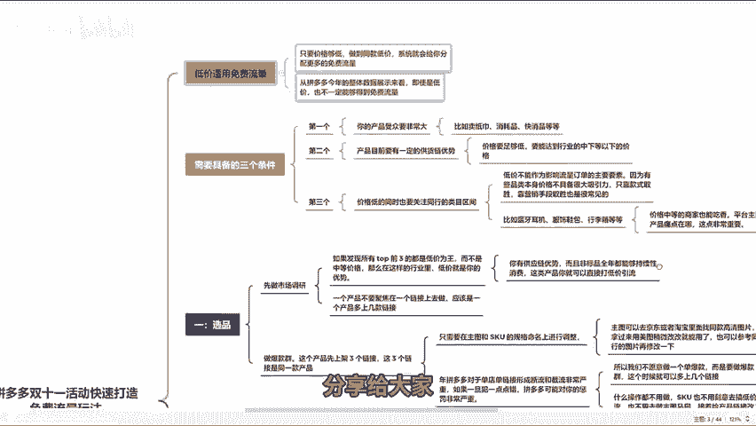

现在想要打造拼多多免费流量的店铺，需要具备三个条件。第一，你的产品受众要非常大。这里的受众指的是在拼多多里，这一类产品具有持续性消耗的特点。比如卖纸巾消耗品、快消品等等。这类产品本身就是低价商品。

天生就具备低价优势。第二个呢，你的产品目前要有一定的供应链优势，也就是价格要足够低，这个足够低，要尽量参考同行能达到行业中下以下的价格。这样基本就有了优势。第三，价格足够低的同时，一定要关注同行。

关注内部榜单的前五区间。看你能不能做到把他们的价格打下来。今年在很多类目已经出现了这样的情况。在拼多多的一些类目中呢，你会发现top排名榜前三的资源位排名前三的，很多单品不一定是低价。在某些行业中。

低价不能作为影响流量订单的主要因素。因为有些产品本身价格不具备很大的吸引力，只靠款式取胜，靠营销手段取胜也是很常见的。有些行业榜单前五是一些中等价格的产品。比如蓝牙耳机服饰鞋包、行李箱等等。

这些都是非标品。款式为王的产品在这里，价格中等的商家也能吃香平台主要看重用户的产品痛点在哪里？这点是非常重要的那下面呢给大家分享拼多多双十一活动，打造免费流量的玩法。那第一个就是选品。

当你去产品调研时呢，如果发现所有top前三十都是低价为王。而且不是中等价格。那么在这样的行业里，低价就是你的优势。再加上你有供应链的优势。而且非标品全年都能持续性消费。

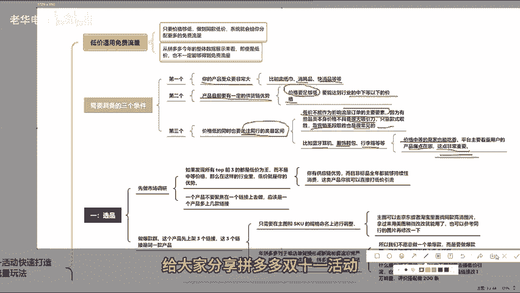

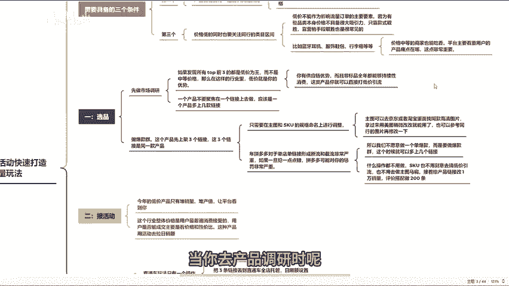

这类产品你就可以直接打低价引流。目前打低价的常规套路呢是一个产品，不要聚集在一个链接上去做，应该是一个产品多上几条链接。我目前见到同行玩的最好的就是做爆款群。这个产品先上三个链接。

这三个链接是同一款产品，你只需要在主图和SKU的规格命名上进行调整。主图可以去东京或者淘宝里面找同款高清图片，拿过来用美图稍微改一改就能用了，也可以参考同行的图片再修改一下。

今年拼多多对于单店单链接形成的断流和截流非常严重。如果一旦犯一点错，拼多多可能对你的惩罚是非常严重的，所以我们不愿意做一个单爆款，这样做爆款群呢。这个时候就可以多上几个链接，上链接之后呢。

记住什么操作都不用做SKU也不用刻意去搞低价引流，也不用去做主图码匾。接着给产品链接改1万销量。评价搭配做200条，已经是低价产品，没必要去做多余的操作。

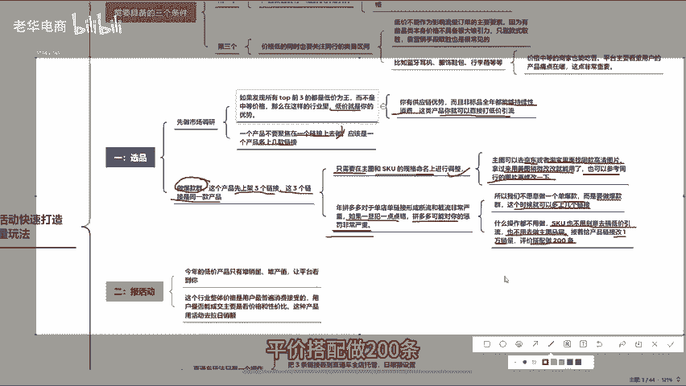

因为今年的低价产品只有推销量，推产值，让平台看到你。而且你这个行业整体价格是用户最普遍消费接受的用户是否能成交，主要看价格和性价比。

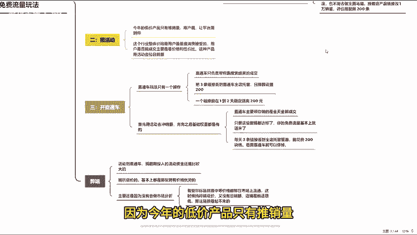

这种产品用活动去拿日小额。三就是开直通车。今年的所有直通车玩法只有一个操作，所有活动跑完之后，你的直通车只负责帮你跑搜索结果的成交，把三条链接丢到直通车全店托管。日限额设置200。

如果一个链接能在1到2天稳定烧完200元。三条链接都能上完的话，基本上每个链接的流量都能够起来。首先用活动区冲销额。充完之后，基础权重都是有的。但这个时候搜索的表现和权重值不高。

用直通车去砸直通车主要帮你做的是全天全部成交。只要这些数据都达标了，你的免费流量基本上就进来了。再加上你的价格就是低价。你这行业的用户又是聚焦于低价再来成交的。所以你的直通车开两天时间。

每三条链接丢到直通车里面，能花费200块钱，后面直通车就可以停掉。这个玩法有弊端，从活动到直通车，如果你仔细算一算，会发现前期投入的流动资金还是比较大的。所以对于这些卖家来说呢，可能有点受不了。

这就是我们今年所说的玩低价的，基本上都是。那些拥有价格优势的，拥有价格优势却打不出免费流量，主要还是因为没有去做市场分析，有些标品就是中等价格能够在市场上流通。这个时候纯粹搞低价，又没有日销额。

店铺成绩还很低。

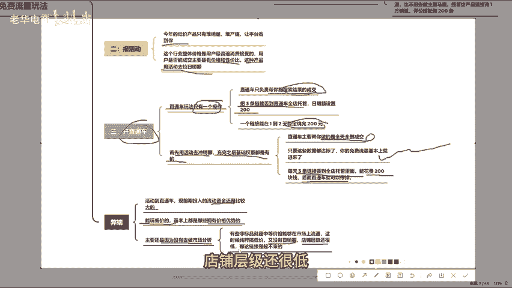

那这个链接是起不来的，所以这三点抓住之后，只要你有价格优势，今年拼多多免费流量还是能再吃一波的。好了，看完还有不懂的可以提问，也可以评论三个6领取一份我整理的多多店铺综合运营包，咱们下期再见。

