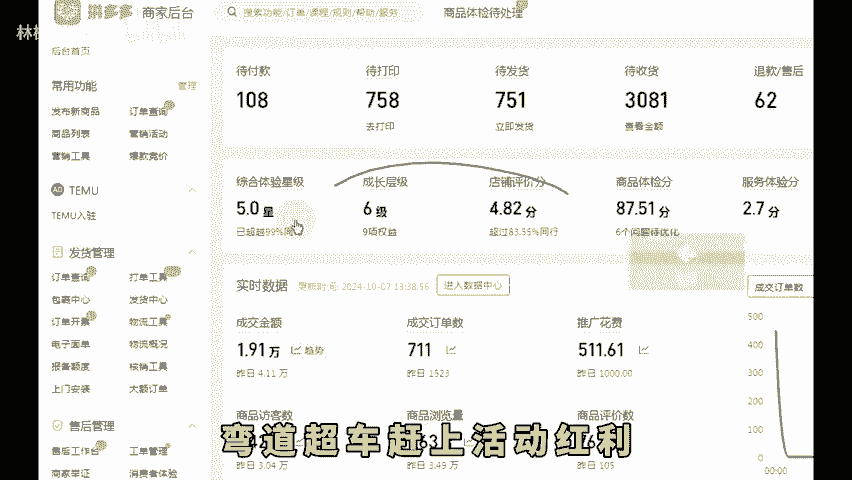
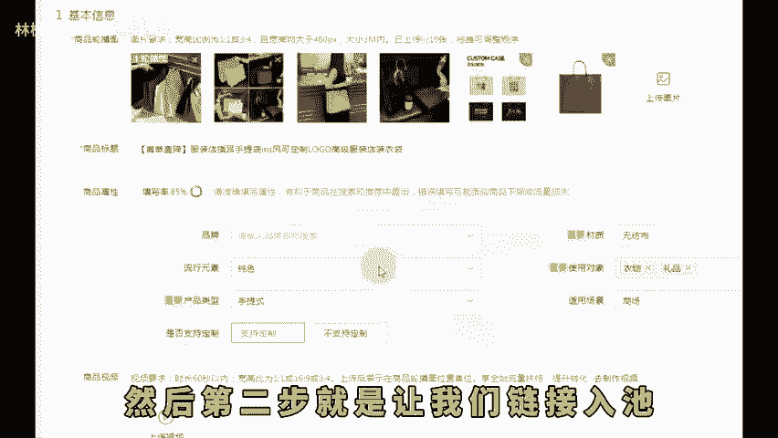
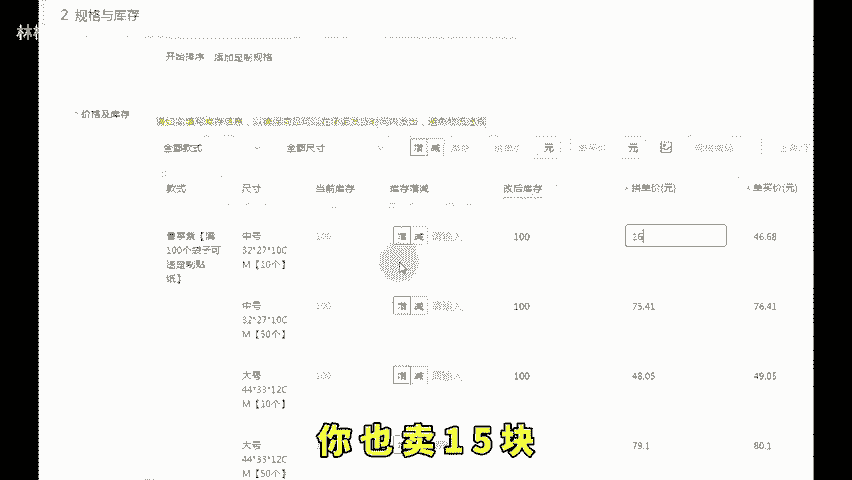
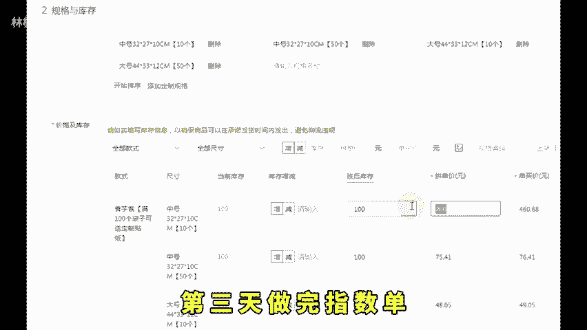
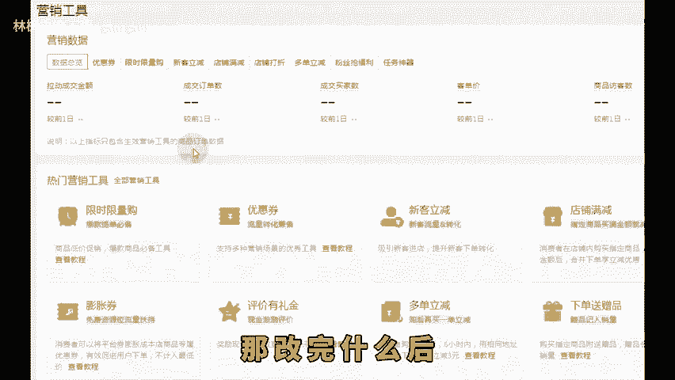
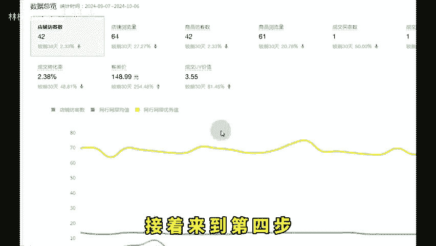
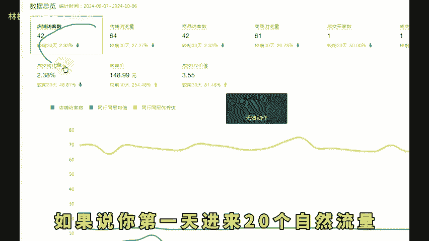
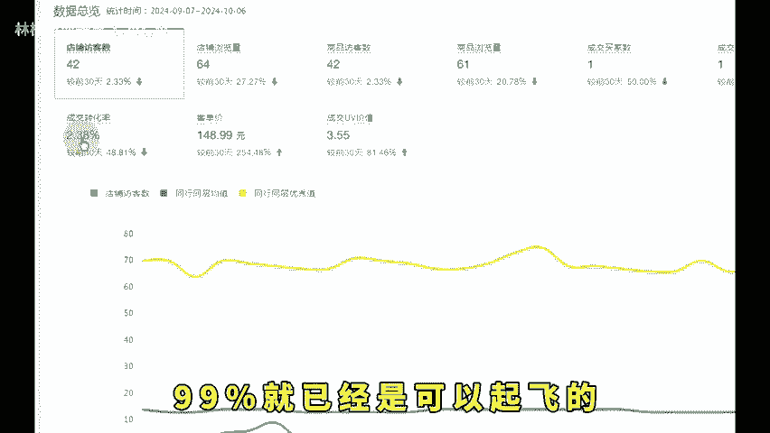

# 拼多多双十一怎么起链接赶上红利期实现弯道超车！ - P1 - 林枫电商干货 - BV12L11YbEhQ

🎼拼多多双十一马上就要来了。现在刚做店铺的这套起店，思路一定要学会弯道超车赶上活动红利。今天免费分享给大家。我教大家如何去做。首先第一步你就得会选对标啊，直接去买家版搜索一个一个看就看那种拼单人数多的。

但评价数量少的。这种就是最近新起的链接，直接参考他的链接去做对标就是了。然后第二步就是让我们链接入池去截到同行的流量，以前是我们是需要开车的，现在找到我们的对标之后呢，参考它的价格，它的价格能做。

比如他卖十5，我们卖十5有利润。那这个产品就可以做。那如果别人卖15，那你的成本价已经是十6了，那就不用做，你肯定是没用了，做了也是起不来，起得来也是没利润的，这也是第二个核心点。

第三个核心点就是上架价格能做，你就照搬他的链接，他卖15块，你也卖15块，不需要比他高也不需要比他低，跟他一样的价格，然后就到第三步了，就是上架的时候一定得虚高。假设我们要卖15。

那么我们上架的时候先上3004500都行，我们先做三天的一个订单啊，就是一个指数单，先做3天。

🎼定价300，然后第一天做指数单后降到200，第二天做完指数单降到100。第三天做完指数单，改为我们想要售卖的价格15元啊。那改价格得用什么改，当然不是让你直接改，我们得利用我们限时限量工具去改。

而且限时限量是有加权的。那改完什么后，指数单也完了之后呢就去开车。开100限额就O了。这里就一次性操作十条链接啊，十条链接全部加起来只开100，接着来到第四步就是看数据，看什么数据呢？

就看我们链接的流量有没有进来。如果说你第一天进来20个自然流量，第二天进来40个自然流量，那么你这条链接99%就已经是可以起飞的。如果说连续7天，你自然流量没有持续上涨，完全是平稳的。

那我们可以去优化一下主图，或者是优化一下SKU布局，整个玩法也是比较简单，而且也是这种红利期比较好用的，希望可以帮助到。

