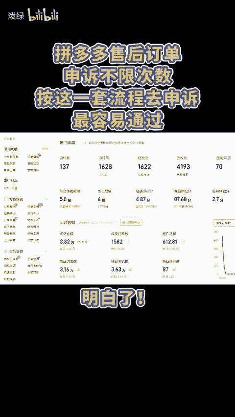
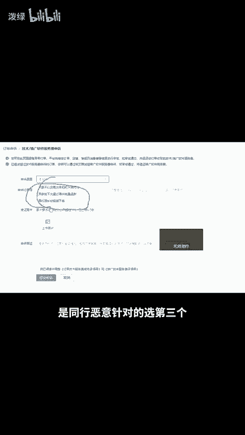

# 拼多多售后订单申诉不限次数，按这套流程去申诉最容易通过！ - P1 - 泼绿 - BV1MatkeFE48

拼多多售后订单申诉不限次数，按这一套流程去申诉最容易通过。明白，首先是有异常的订单到异常单申诉，买家故意填错地址或者地址不明确的原因，选择买家使用错误收货地址，影响发货。

凭证需要上传买家的错误地址和客服联系不回复的截图，有同行恶意拍下大量订单，看情况选择第一，第二和第四条凭证上传聊天记录和订单就行。过没开退货包运费，但是被平台扣运费给买家了，点击售后申诉。

找到订单点发起申诉。原因，这里一般是消费者反馈商品存在质量问题。但凭证不足，理由写上，买家没有提供产品有质量问题的凭证，请平台返还扣除的运费。如果秒拍秒退被扣推广费了，可以点推广软件服务费申诉。

买家拍了秒退的选第一个批量下单退款的选第二个，有证据证明是同行恶意针对的，选第三个，还有不会的点左下角。😊。

