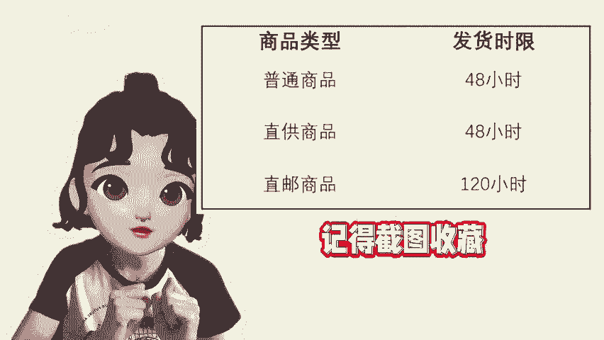

# 拼多多商品延迟发货，对店铺有哪些处罚？ - P1 - 尘牛电商 - BV1PjmGYqE9a

🎼家如果没有在规定的发货时间内完成发货，也就是没有在规定的时间内上传成交订单的物流单号到拼多多的后台。那么这些订单就会被识别为延迟发货的订单，各类商品发货时间如下，记得截图收藏。对于这些超时发货的订单。

平台给出了三种处罚的方法，第一种，发货时间在48小时之内的平台会扣除对应的赔付金，并向买家赔付该商品实际成交额的1%。第二种，发货时间在48小时以上的，向买家赔付该商品实际成交额的5%。

第三种就是比较严重的缺货处罚，需要向买家赔付该商品实际成交金额的10%以上。商品如果在短时间内实在无法发货的，记得去给商品设置预售，设置预售的方法，可以看我前面的视频哦。😊。

