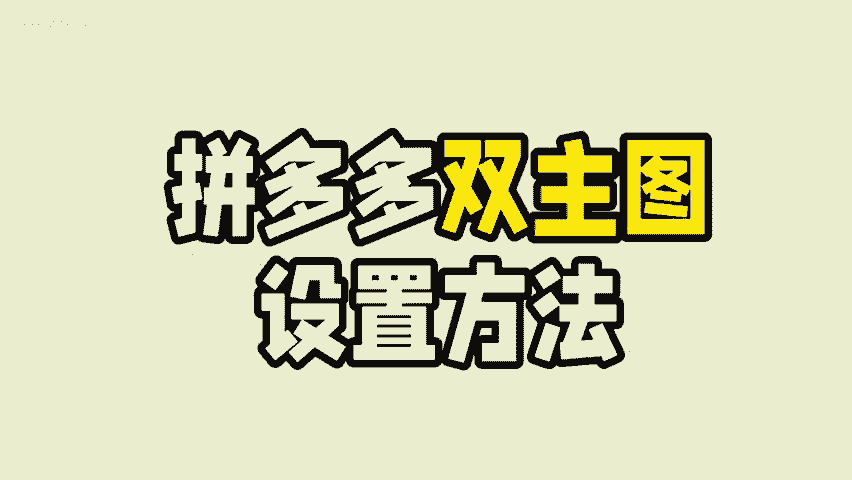
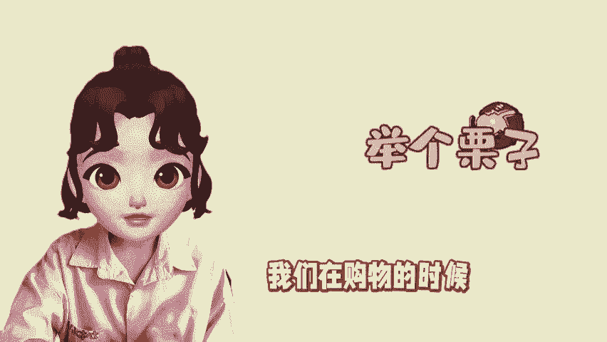
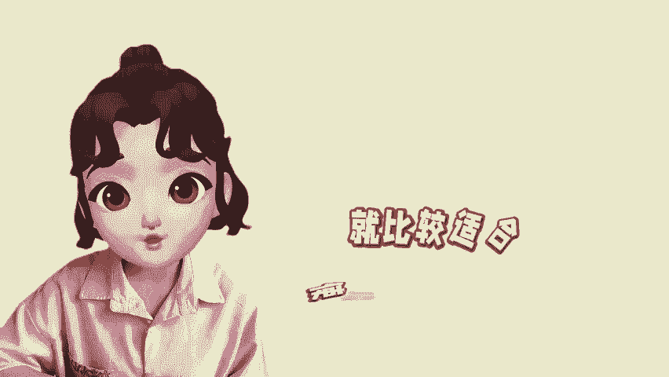
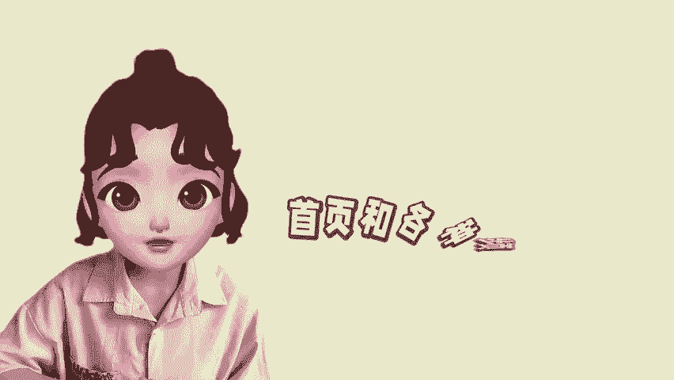
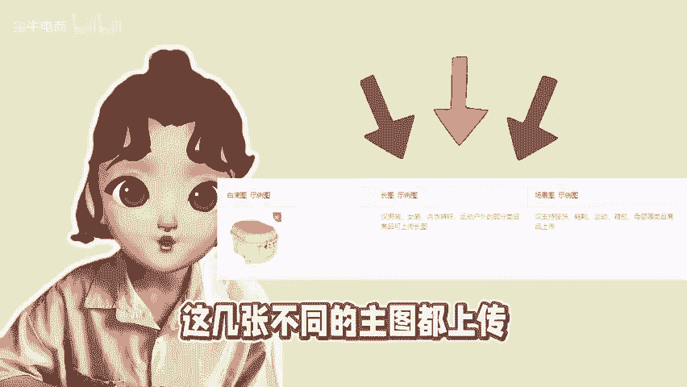

# 拼多多商品的双主图是怎么设置的？ - P1 - 尘牛电商 - BV1eryNYxEgC

🎼拼多多商家都要设置的3张主图，流量不拿百布呢。举个例子，我们在购物的时候，经常会刷到不一样比例的主图，同个页面会出现方形图和长图，这两个就是双主图。那么这两张图是怎么设置的，在商家后台找到商品管理。

点击商品素材，进入图文素材页面分别出现白底图长图和场景图。白底图是每个商品都需要上传的，可以帮助商家获取首页更多的推荐流量。长图所展现的商品内容会更多。像服饰百货箱包类目的商品。

就比较适合使用长图来吸引买家提高主图的点击率。场景图也就是活动图，上传场景图是平台活动报名的必备条件之一，会在首页和各种频道页面等场景展出。所以建议大家这几张不同的主图都上传。

可以分别获取到不同展现位的流量。😊。

