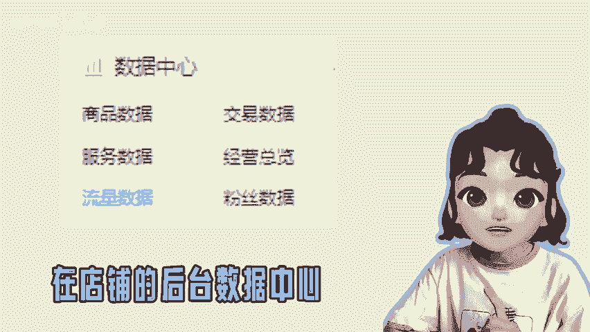
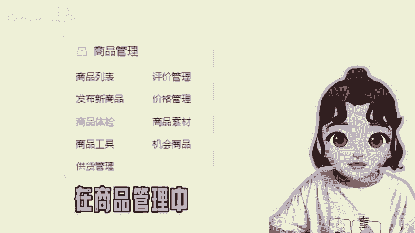
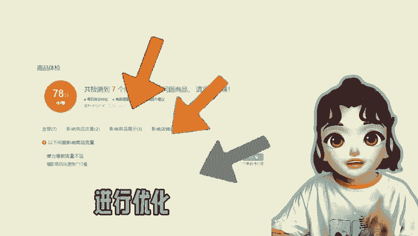
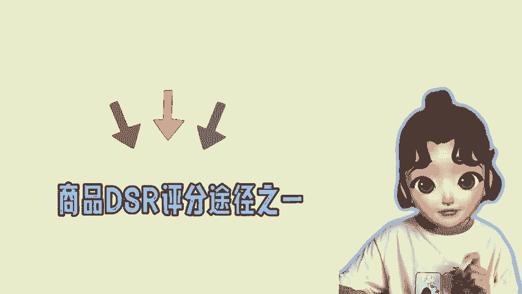

# 拼多多商家怎么提高店铺的搜索权重？ - P1 - 尘牛电商 - BV1Nvsde9ESA

🎼有的商家不知道怎么查看店铺的权重，可以参考这个方法，在店铺的后台数据中心点击流量数据，找到搜索流量，查看整体商品搜索热度的曲线图，比同行均值高的就代表权重高，低的就是权重低。

像这样一条直线就代表没有权重。店铺的权重对应的是店铺的DSR评分，想要优化店铺的搜索流量，可以通过商品体检，在商品管理中点击商品体检，根据检查到影响商品流量的问题进行优化。其实。

参加平台的活动也能够有效提高点击率和商品权重。在店铺营销中打开营销工具，创建两个活动，分别是下单送赠品和评价有礼金。打开这个两个工具之后，店铺就很容易获得优质好评晒图。

商品的评价也是提高商品DSR评分的途径之一哦。😊。

