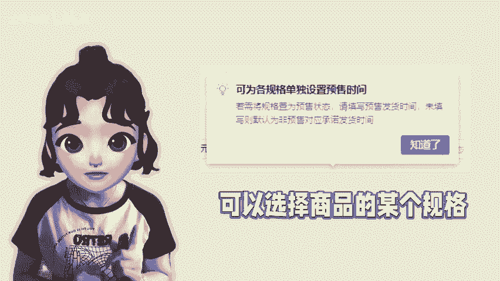
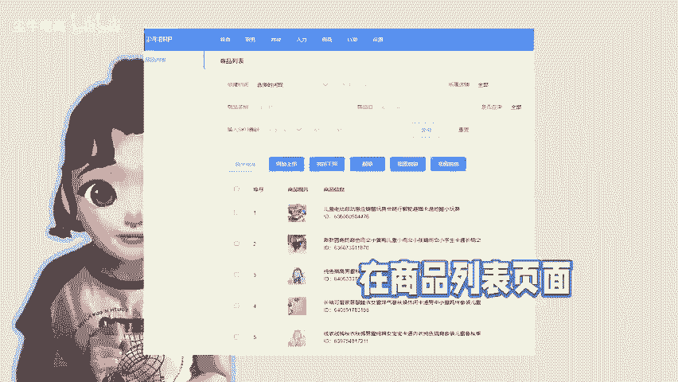

# 拼多多商家怎么给商品设置批量预售？ - P1 - 尘牛电商 - BV1ix21Y1EJt

🎼多多商品设置预售，这个是由商家自行设置的。在后台商品编辑页面，我们可以看到有多个预售名称可以选择非预售指的是按照正常的承诺发货时间发货。定时预售，就是发货时限以商家选择的具体时限来发货。

直接选择预售的时间段就可以了。时段预售就是当买家下单后，你可以选择多少天之后给他发货。这个跟定时预售有点类似。最后规格预售就是我们可以选择商品的某个规格单独设置预售。目前来说，选择比较多的是定时预售。

不过后台没有办法设置批量预售。我们可以用陈牛ERP在商品列表页面找到需要设置预售的商品，批量修改预售时间，选择需要预售的时间段批量修改就可以设置商品预售。

更适合在大促活动以及节假放假、商品缺货等情况下进行，不用担心延迟发货、被平台处罚等问题。😊。

🎼。