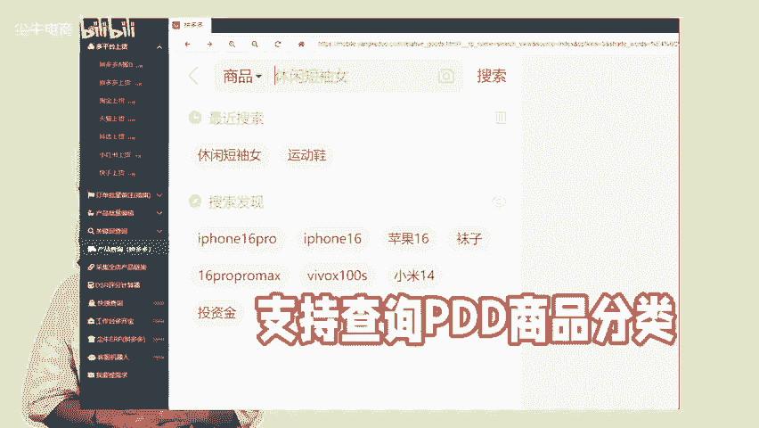

# 拼多多商家找商品类目，可以试试这两个方法！ - P1 - 尘牛电商 - BV1xQ2mYqEhJ

🎼店铺上架商品的时候呢，选择正确的商品类目对商家来说非常重要。找商品类目有两种方法。第一种方法就是在后台上货的时候，在商品发布页面输入商品关键词，下拉列表中会显示商品分类，直接在里面选择合适的商品分类。

这个是常见的方法，如果不确定是不是这个类目，可以用另外一个方法，就是查看同行的商品类目，用陈留里面的产品查询功能，支持查询拼多多商品分类，首页输入商品关键词，这里会出现一系列相关的产品。

看产品排名和相似主图，找到跟自己商品相关的进入主页，右边会显示这个产品的类目。然后商家可以按照这个分类，去后台发布产品，上货的时候需要确保类目选择的准确性。买家也能通过关键词，快速找到店铺的产品。😊。

