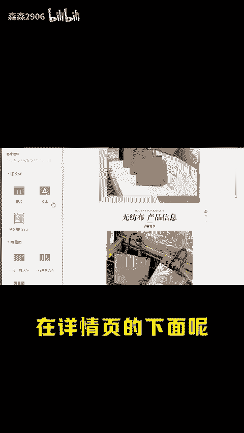
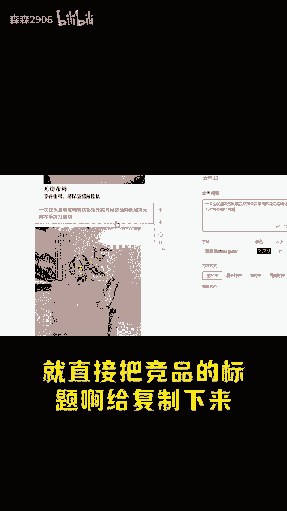
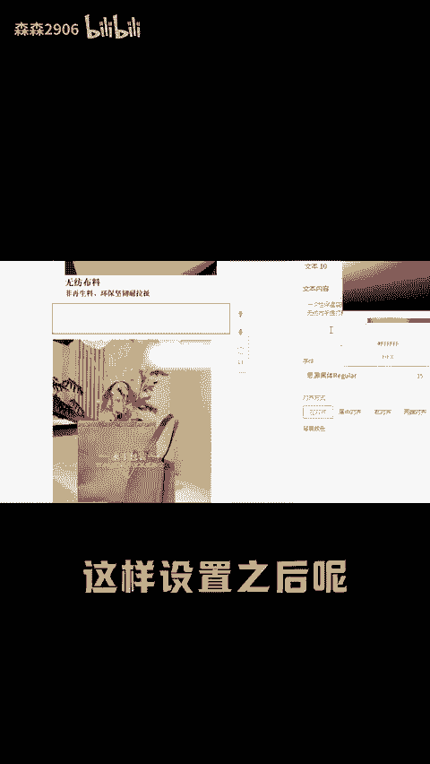
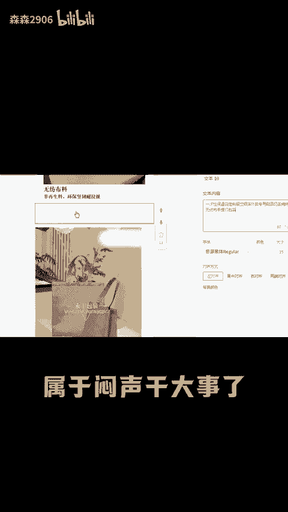
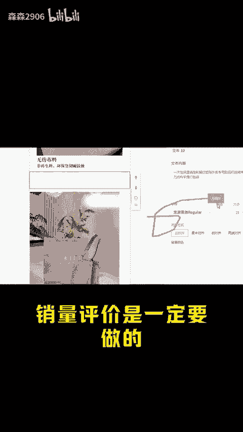
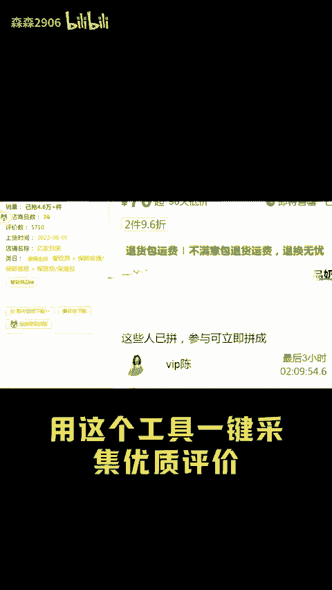
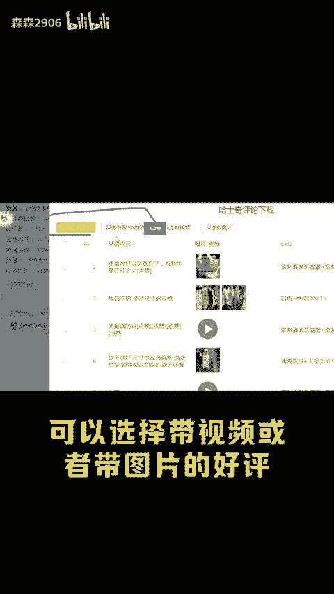
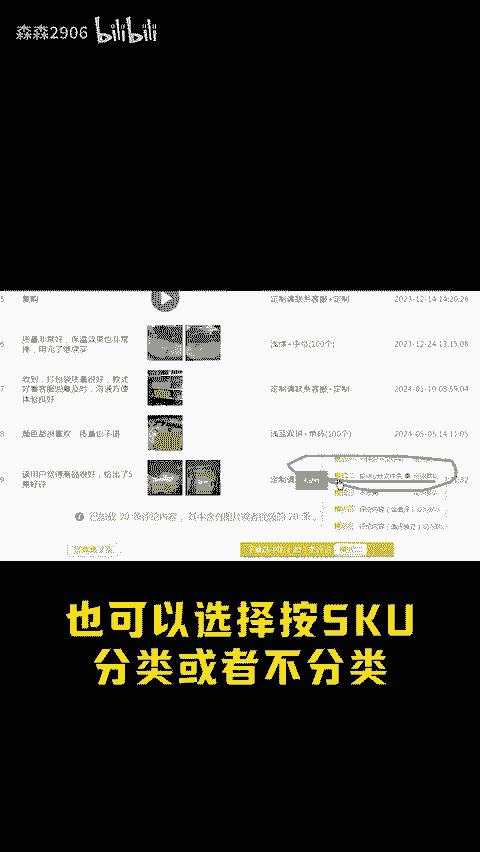
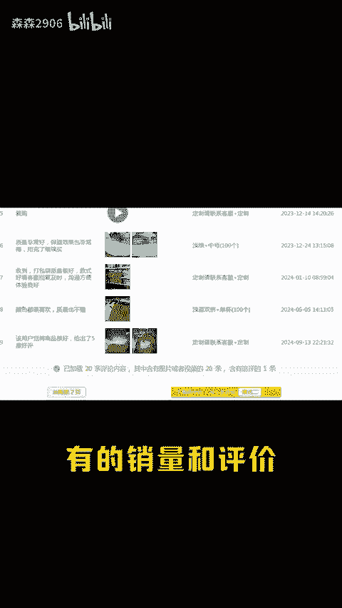
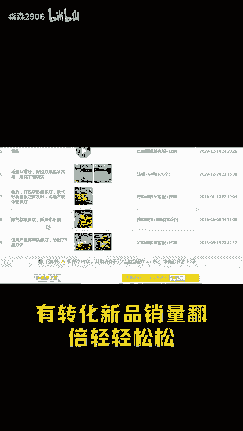

# 拼多多如何一招让新品流量爆发？ - P1 - 森森2906 - BV1hzsXeWEZ2

每天一个运营想一想，拼多多有没有让新品爆发流量的方法呢？教你一招新品上架直接设入几百上千个引流关键词，而同行呢只能设置30个，曝光比他高几十倍，流量想不涨都来。这么厉害，怎么设置个呀。

看这里后台找到商品列表点编辑，下滑找到装修商小，在详情页的下面呢添加一张文本类标签，再把你的竞品引流关键词和相关性高的热搜词全部添加进来，觉得麻烦的，就直接把竞品的标题啊给复制下来。

再把颜色改成井号6个F，这样设置之后呢，同行都不知道你在截流。第二天流量就会暴增，属于闷声干大事了。

流量进来之后呢，就要思考如何提高转化了。销量评价时一定要做的，先客服催促改一个销量，再找到同行的竞品，用这个工具一键采集优质评价上好评，可以选择带视频或者带图片的好评，一键打包下载。

这里有多种分类模式可以一个评论，一个文件也可以选择按SQU分类或者不分类，非常方便好管理，有了销量和评价转化率啊直线上升，有流量有转化，新品销量翻倍，轻轻松松。今天的分享就到这里了。还有什么不懂的。

或者找不到工具的后台扣1。

