# 拼多多如何快速从零起一条新链接？ - P1 - 森森2906 - BV1411UYiEhq

拼多多，如果你想要在短时间几条新链接，那么我接下来讲的几个步骤，你一定要做好视频比较长，建议点赞收藏起来，慢慢看，全程都是干货，相信一定对你有帮助。首先，第一个就是主图，不会做图的可以用美图设计师。

一键抠图以秒换背景，分分钟就能量产上百张原创图片，免费而且高效强调一下，主图第一张要做高点击的码扁图，这是搜索坑位展示图，还可以搭配三主图做多渠道引流，后台打开商品素材，第一张是白底图。

这个可以打通搜索页和分类页的流量渠道。第二张是长图可以提高搜索页和店铺页等场景的曝光，第三张场景图，在客户端首页，频道页等位置获得展示资格。这些不做流量就白白浪费了。

第二个就是标题看这三个万能的组合公式，我报单的链接标题都是这样写的，不想自己做标题的，可以用这个EI工具，就找到这种销量高的同行标题复制下来进行拆词倒入主标题了，就能一次性生成几十个标题供你选择。😡。

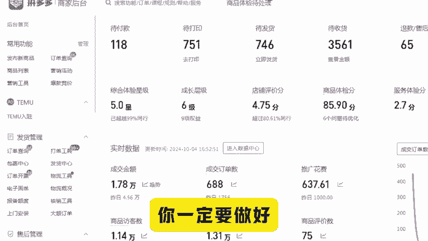

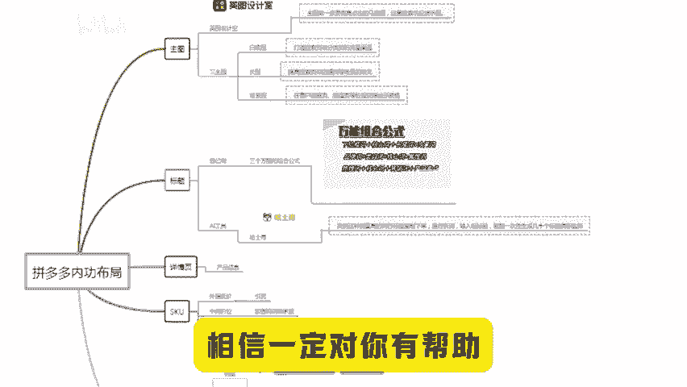

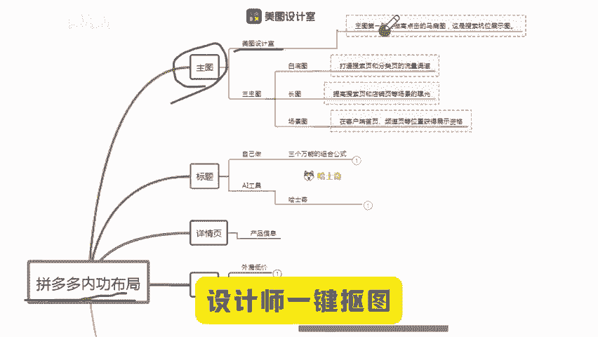

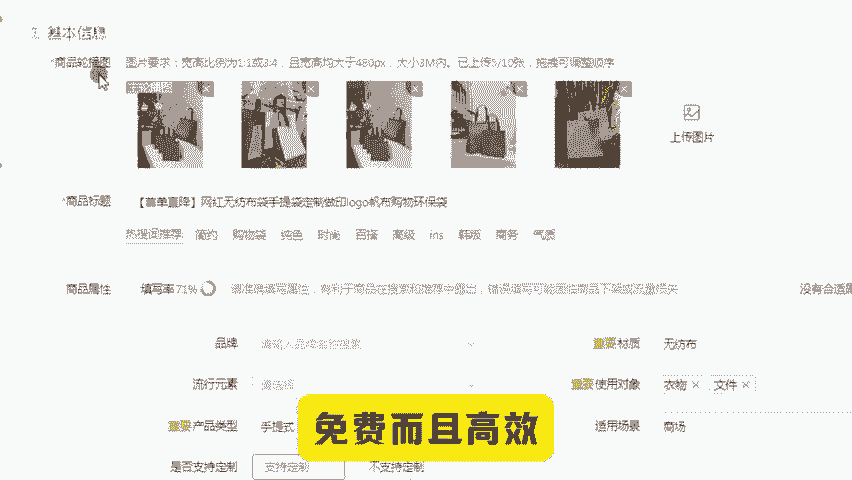

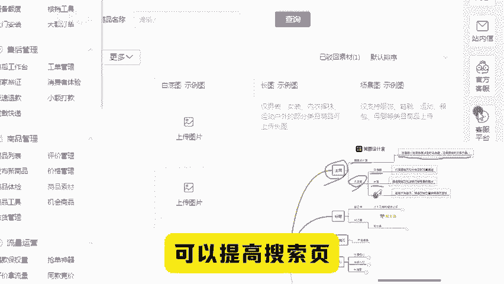

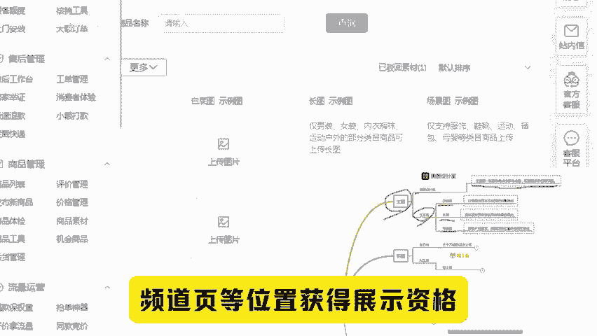

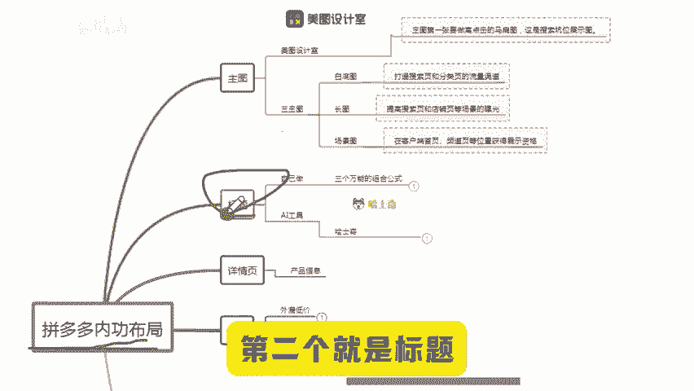

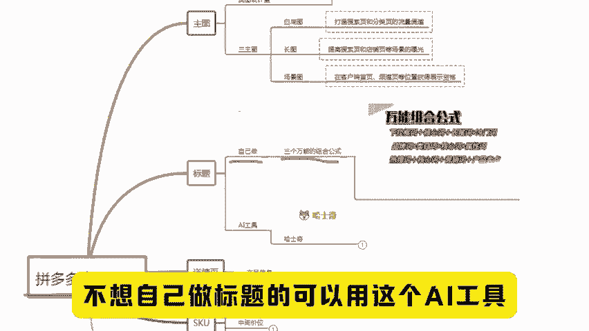

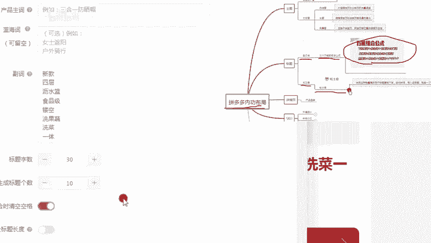

详情页就不用多说了，把自己的产品信息传上去就行。第三就是SKUSKU不要做太多，外漏低价做引流中间价位加营销词做承接，利润大的规则，打上小火苗做对比拉转化，环环相扣，转化非常高。第四个就是销量评价。

可以用这个工具改一个销量，再用这个工具，意键采集优质评价上好评。要想做出一个小报的链接，以上的每一步都不能省略链接流量起来以后，就在链接的基础上做矩阵裂变，裂变个十条20条。

现在做拼多多的思路一定是多店多链接，一条链接出个几十单，几十条链接就是几百单，收入还是客观的。还有什么不懂的或找不到工具的后台扣1，下期给大家讲讲那工作号之后，怎么开直通车。😡。

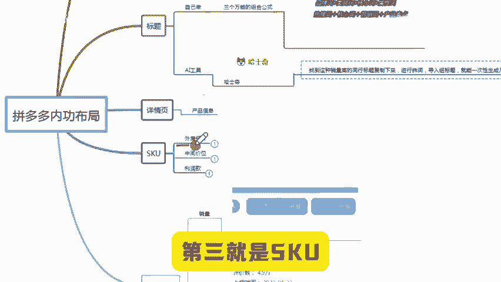

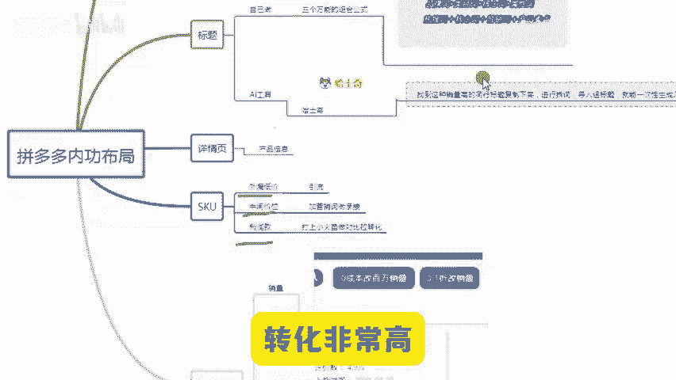

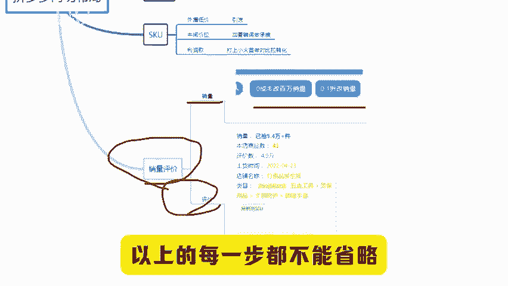

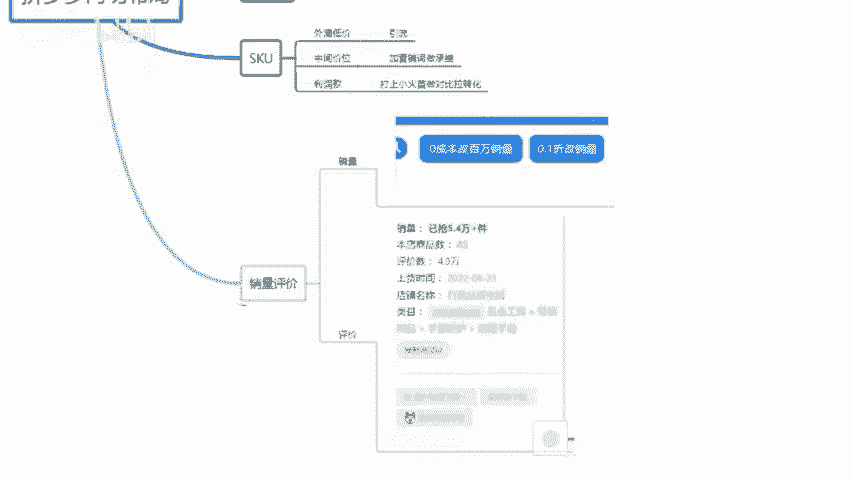

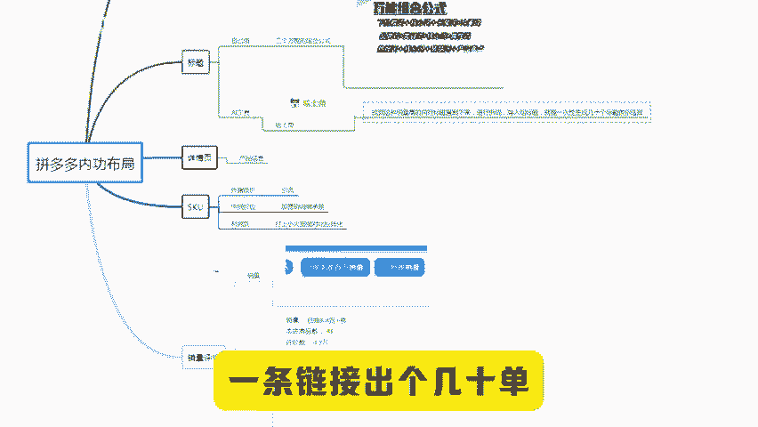

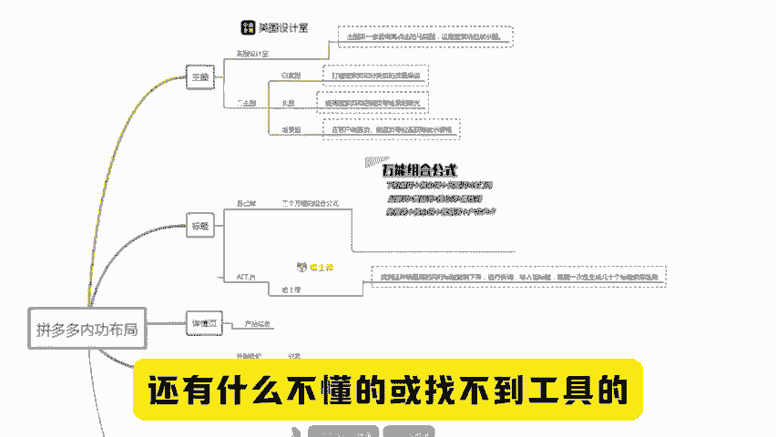

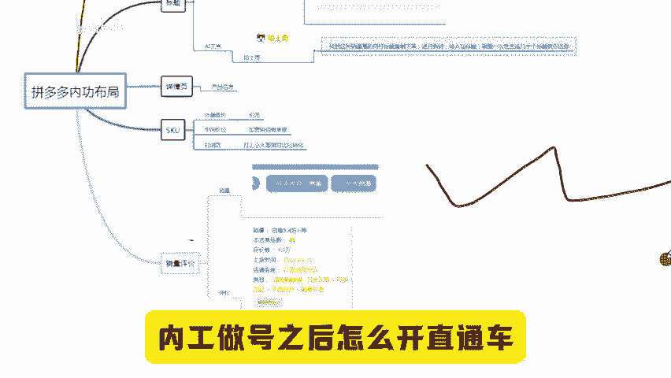