# 拼多多如何拉升权重放大单量 - P1 - 森森2906 - BV1QgxgeTEib

每天一个越点力小就拼多多怎么获取权重呢？多多这个平台，它的权重规则比较简单，所以呢做拼多多一定要简单，它越复杂呢就越做不好。那怎么做呢？它的平台权重规则啊，无非就5条，第一个是付费推广，第二个是价格。

第三个是活动，第四个是持续坑产，最后就是服务数据了。这些权重了解了，可是店铺还是做不起来怎么办？看这边，首先我们先来了解提升店铺权重的5个点。第一个就是付费推广，付费推广的权重大于其他一切权重。

然后第二个是价格，做拼多多它是极致的性价比，只要你价格低，然后开上车，那么你就一定可以获取流量，第三就是活动，第四就是持续的坑产。所谓持续的坑产，就是你要有持续的销量，它是获得权重的一个很重要的数据。

最后就是服务数据，比如后台的DSR评分，消费者服务体验分等等。我。

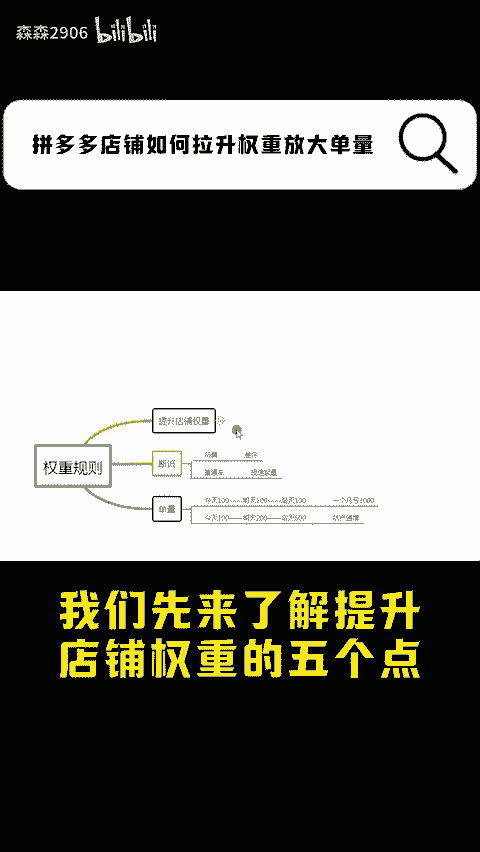

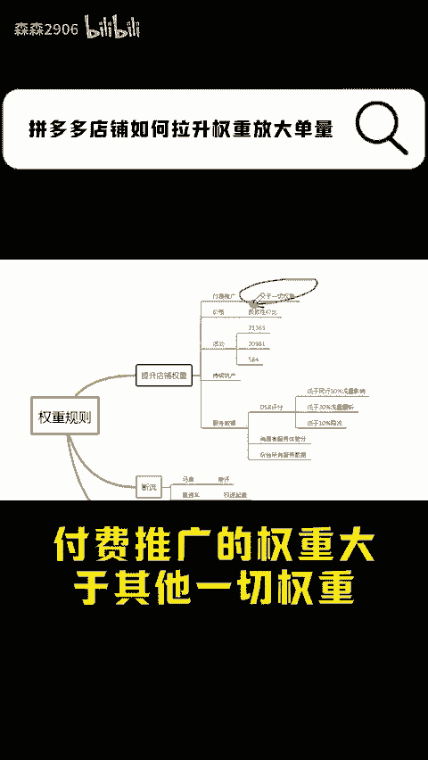

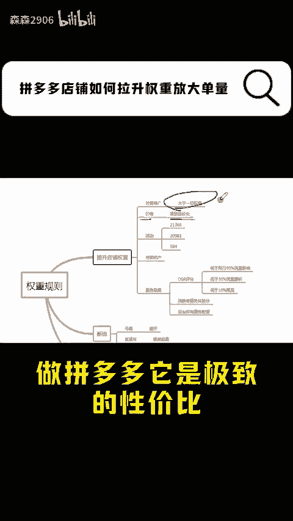

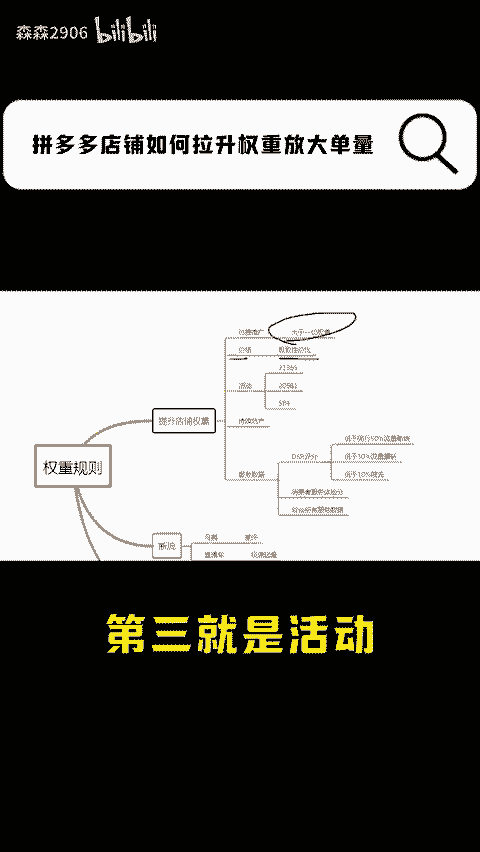

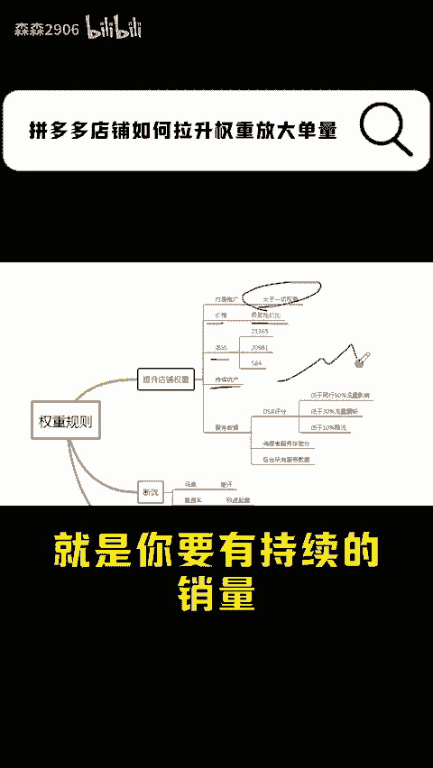

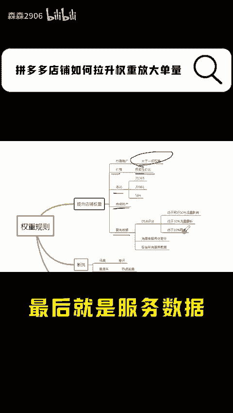

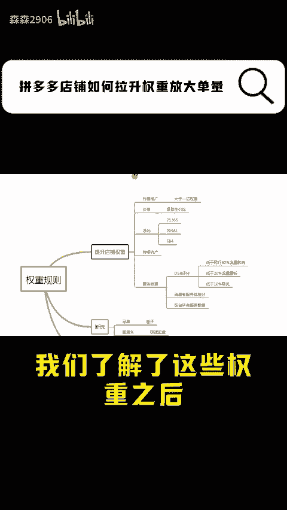

了解了这些权重之后，可是还是有很多商家朋友还是做不起来店铺。那问题出在哪里呢？第一个就是你的直通车啊经常断流，为什么呢？第一个就是麻扁，你的产品是什么样？就是什么样？如果你麻扁的话，可以出单。

但消费者收到货之后给了你差评。那么即使你的流量再起来，它也会下滑，这是导致断流的一个原因。第二个就是直通车的原因，很多商家朋友一上来就开急速起量，开急速起量也是导致断流的一个重要的原因。还有很多朋友问。

为什么它的单量不能放大，这位朋友是怎么开直通车的呢？今天烧100，明天烧100，后天又烧100开了一个月啊亏了3000，为什么呢？因为在拼多多上做生意啊，你必须要有持续的坑产，但是在新品阶段。

你的坑产是要做递增的？就是你的坑产幅度决定了你后期的单量，什么叫幅度呢？比如你今天卖100，明天卖200，后天卖500。总之你第一周要做一个增长，要有销售额的增长，而且增长了。

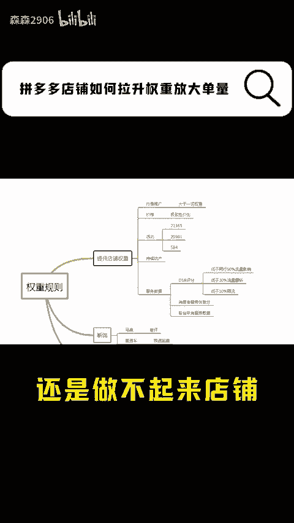

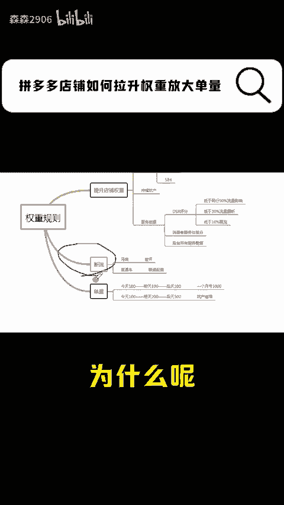

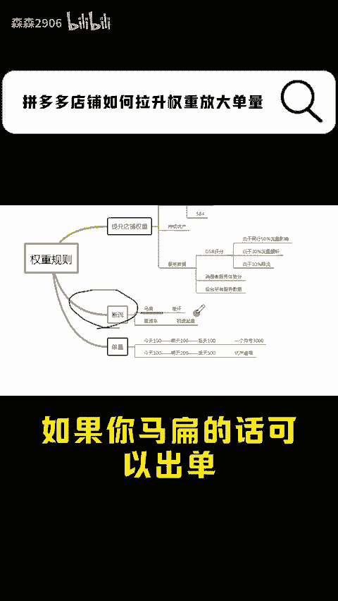

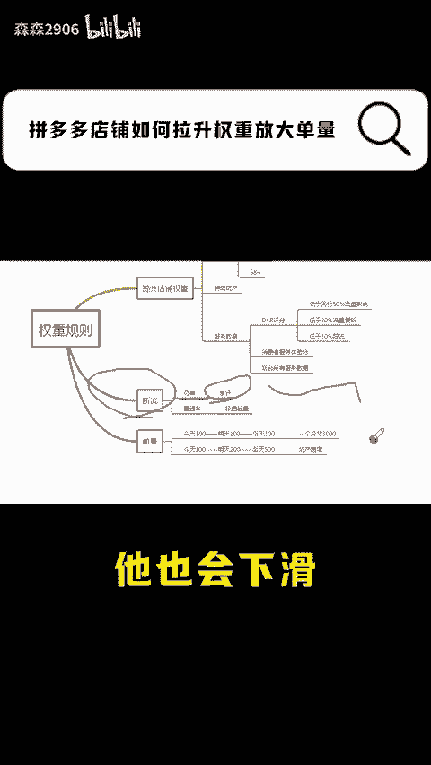

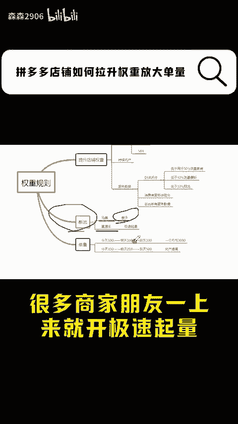

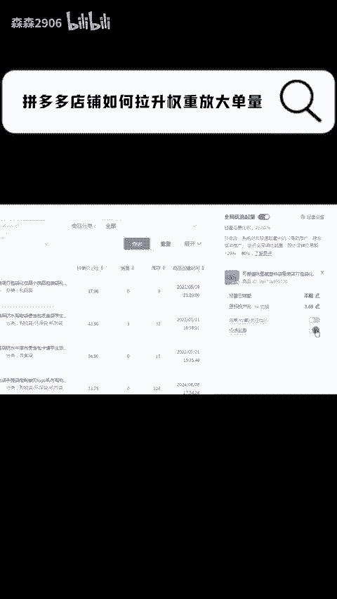

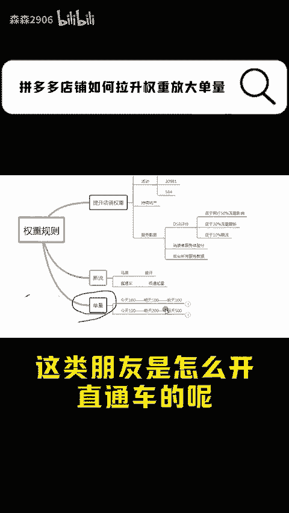

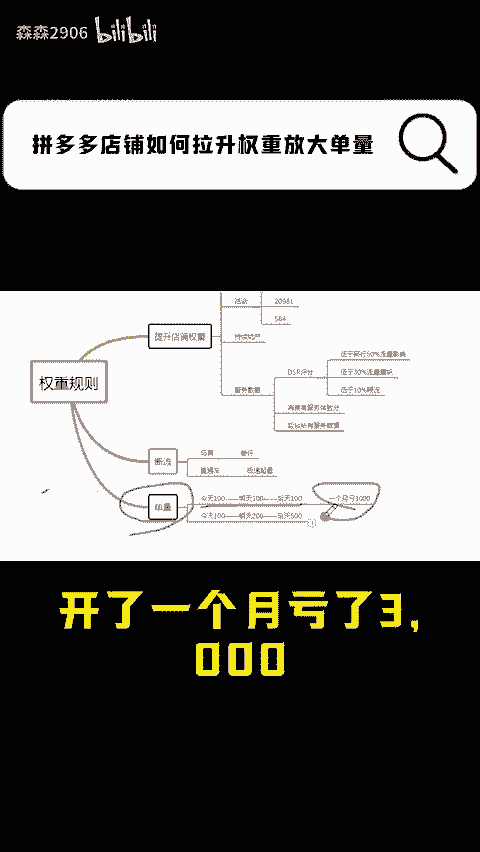

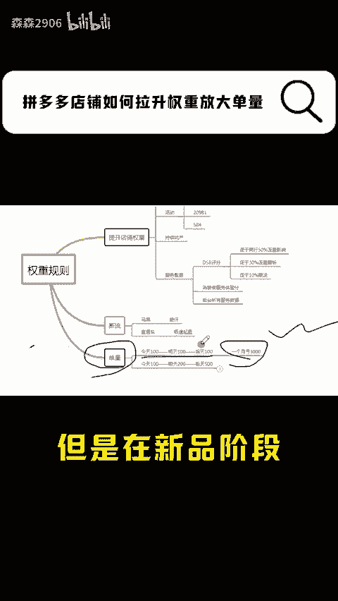

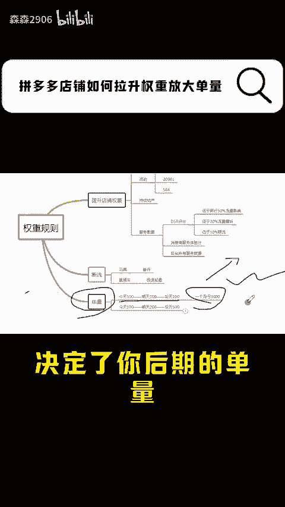

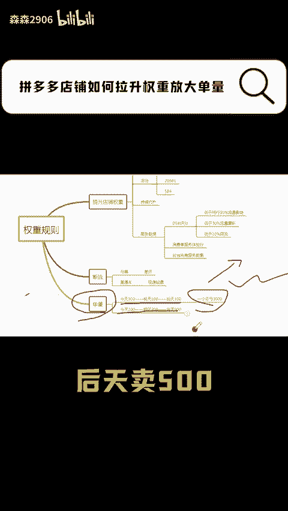

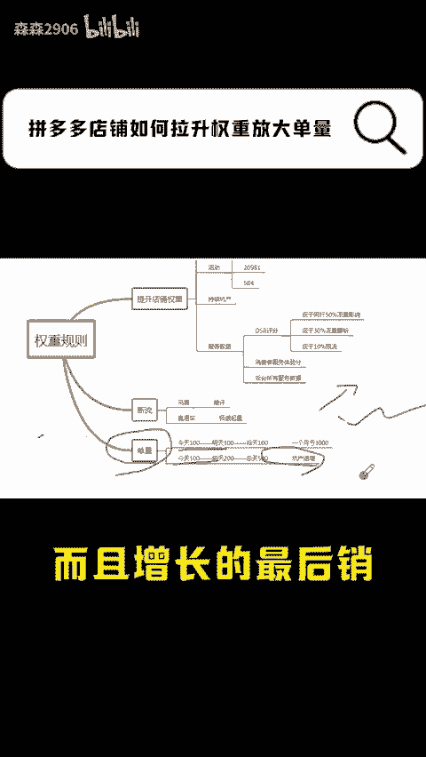

最后，销售额和单量决定了你后期的单量。做拼多多呢就是这么简单，坑产做递增，其他的不要麻扁，好好规划你的产品。今天的分享就到这里了，点赞关注，等你爆单。

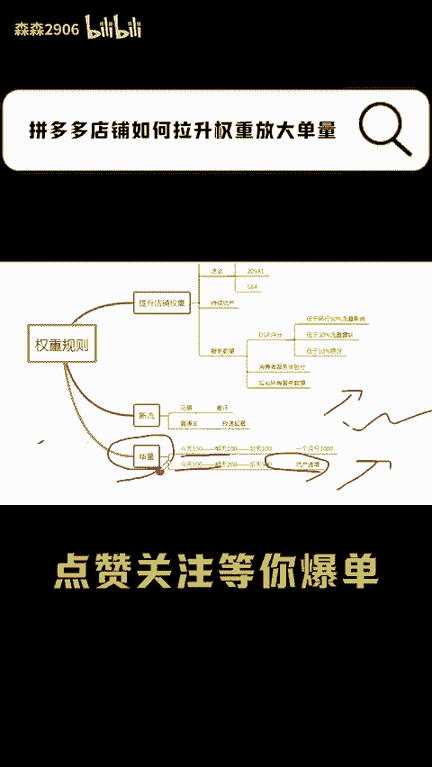