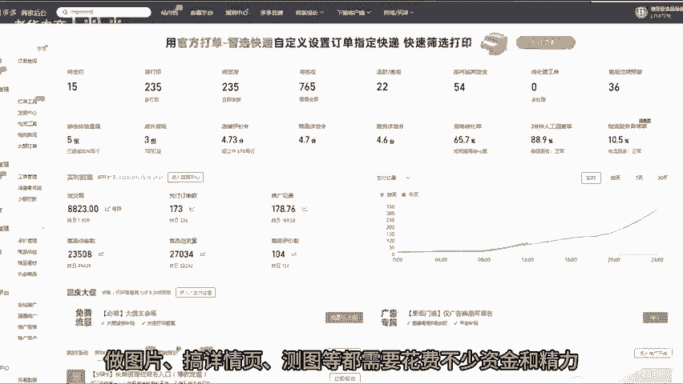
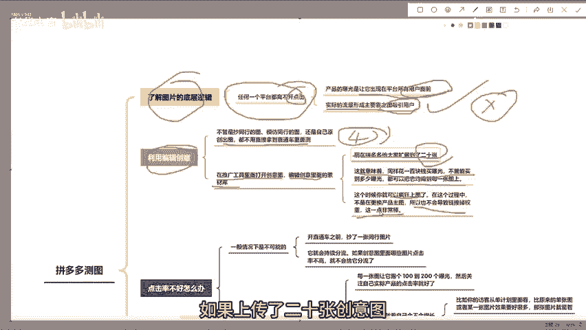
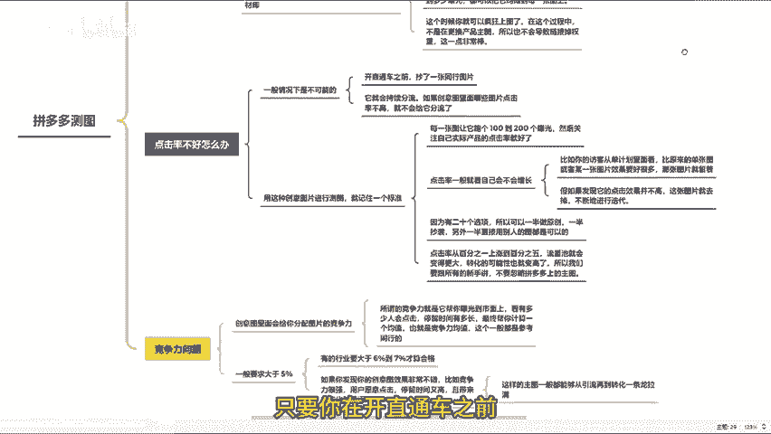
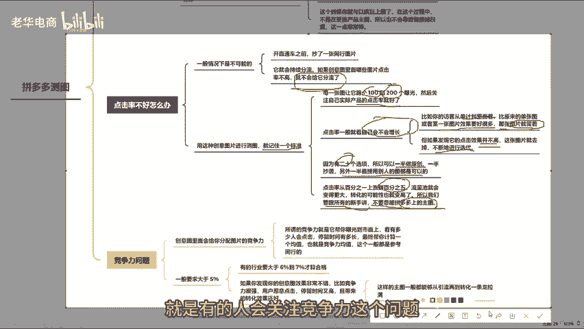
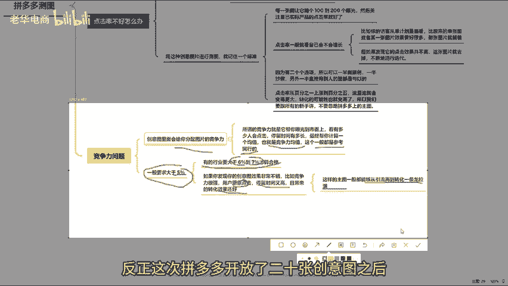
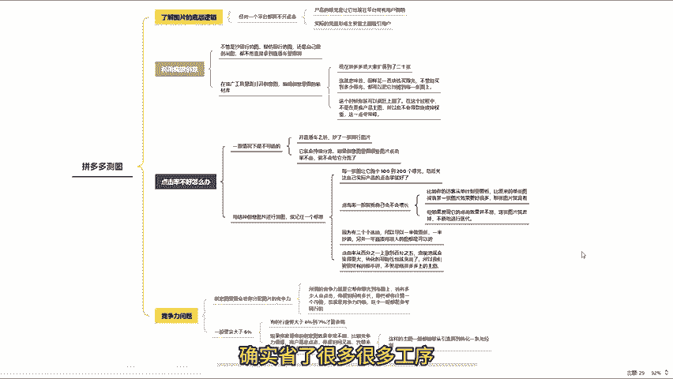
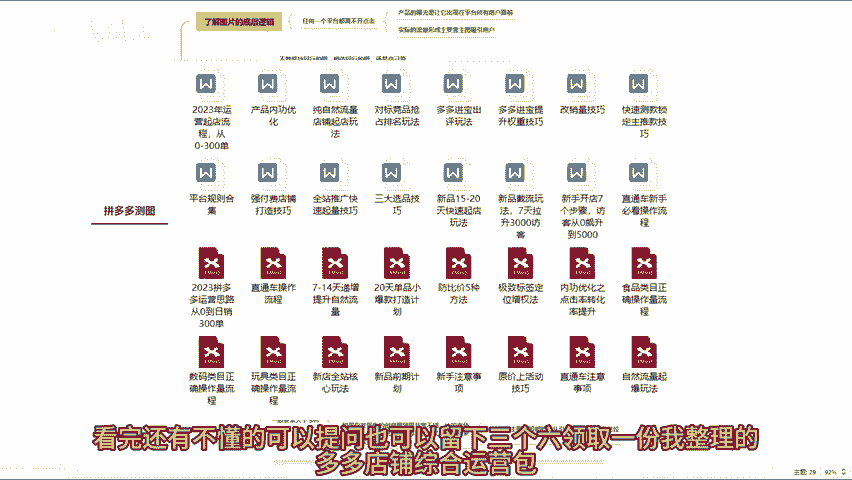

# 拼多多小白开店巨省钱测图方法快速提高点击率 拼多多运营 拼多多小白 拼多多新手开店 拼多多干货 拼多多商家 拼多多学习 拼多多店铺 拼多多玩法 拼多多黑科技 - P1 - 老华电商 - BV1WCxEe2EHx

今天这个视频来给各位说一说，在拼多多里面有一种测图方式，非常省钱。😊，而且现在拼多多已经完全将这个方式开放了。虽然拼多多在某些方面可能会让人觉得不太满意。但不得不说。

他给出的一些方式还是比较适于小卖家的。与其他平台相比。拼多多在前期的运营成本相对较低，在其他平台上做图、搞详情页、测图等，都需要花费不少资金和精力。

而在拼多多里面。这些前期准备工作的成本呢要低很多。因为在拼多多，你可以直接使用同行的图片。不过我们都知道，任何平台都离不开点击产品的曝光，只是让它出现在平台所有用户面前。😊。

但实际流量的形成还是主要靠图片来吸引用户，平台不可能直接把你的产品丢给用户，让用户一打开拼多多就直接跳职成你的产品。这种情况是不存在的。明白了这一点之后呢，我们就会明白拼多多上的卖家。

正因为前期投入的成本低，所以要学会利用平台里的一些免费工具去做测试。比如如果你的主图点击率很低，那么访客量就会特别少。现在大部分运营人员都用一招来测试自己的主图。那就是不管你今天是抄同行的图。

模仿同行的图，还是自己原创出图，都不用直接拿到直通车里面去测。记住，直接在推广工具里面打开创意图，也就是编辑创意里面的素材库。😊，原来拼多多的创意图一直是卡好的4张图，这与早期淘系的逻辑一样。

淘宝当年也是4张主图。没有更多的，反正创意主图就是4张。但是现在拼多多给大家扩展到了20张，这也就意味着同样花100块钱买曝光，不管能买到多少曝光，都可以把它均摊到每一张图片。这个时候你就可以疯狂上图。

在这个过程中不是在更换产品主图，所以也不会导致链接调选中，这点非常棒。但是也会有人担心，如果上传了20张创意图，发现点击率不好怎么办呢？记住，一般情况下是不可能的。只要你在开直通车之前抄了一张同行图片。

这张图片点击率好的话，它就会持续分流。如果创意图里面那些图片点击率不高就不会给他分流了。所以如果要用这种创意图片进行测图，就记住一个标准，每一张图片，让他跑个100到200个曝光。

然后关注自己实际产品的点击率就好。😊。

这个点击率一般就看自己会不会增长。比如你的访客从单计划里面看，比原来的单张图片或者某一张图片效果要好很多，那张图片就保留着。但如果发现它的点击效果并不高，这张图片就去掉，不断进行迭代。因为有20个选项。

所以可以一半做到原创，一半抄袭，另一半直接用别人的图片是可以的。反正那张图片点击率高就留着，万一瞎猫碰到死耗子呢，点击率从1%上涨到5%。流量池就会变得更大，转化的可能性呢也会变得更高。

所以我们要跟所有的新手讲，不要忽视拼多多上的主处，这是第一点。第二点呢。😊，就是有人会关注竞争力这个问题，因为创意图里面会给你分配图片的竞争力。所谓的竞争力就是他帮你曝光到市面上。

看有多少人会点击停留时间有多长，最终帮你计算一个均值，也就是竞争力均值。这个一般都是参考同行的。所以建议大家多看一看哪个竞争力的比例，现在在多少呢？一般要求大于5%。😊。

有的行业要大于6%到7%才合格。所以如果你发现你的创意图效果非常不错，比如竞争力很强，用户愿意点击停留时间又高，且带来的转化效果还好。那么这样的主图一般都能够从引流再到转化一条龙纳么。

这种竞争力的主图一般很难遇到。但是如果要拿一个均值的话，差不多也就是5%以上，有些个别行业呢是6%到7%，记住这个数值就可以了。😊，其他的就没什么了，反正这次拼多多开放了20张创意主图之后呢。

我觉得所有的小卖家在初期运营成本就会降很低了。所以拼多多还是比较清楚的，不希望小卖家天天想着降价倒低价。其他的所有运营成本呢，其实平台对于其他平台来说。😊。

确实省了很多很多工序，包括资金和精力都省了很多。好了，看我还有不懂的，可以提问，也可以评论3个6，领取一份我整理的多多店铺综合运营包。好，咱们下期再见。😊。

