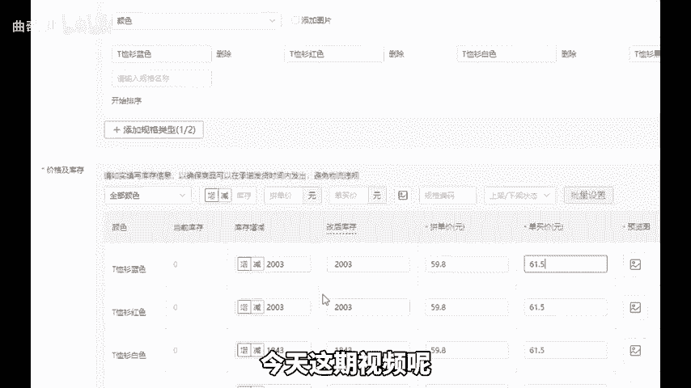
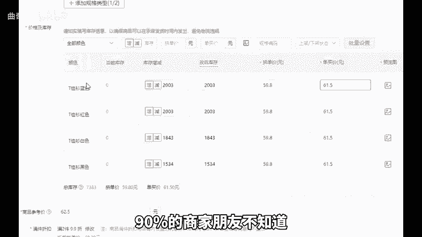
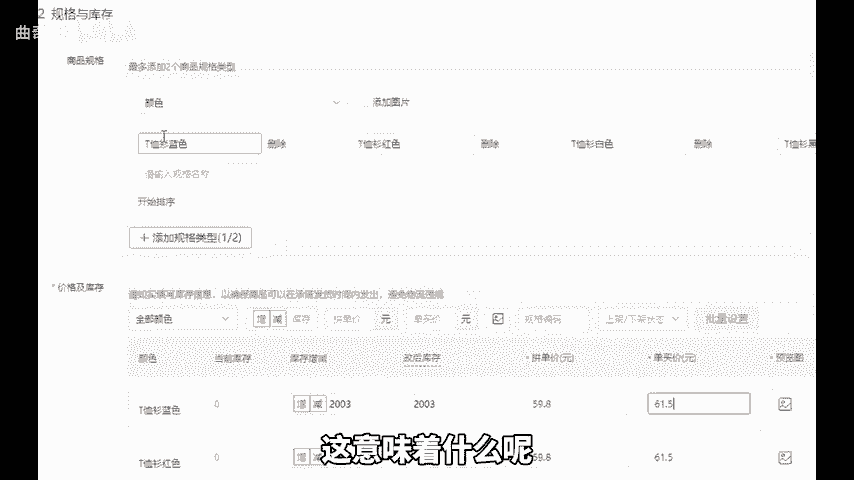
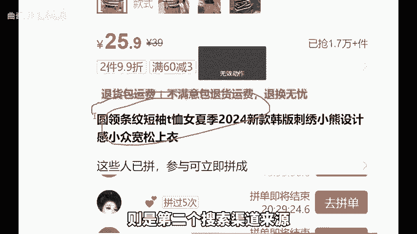
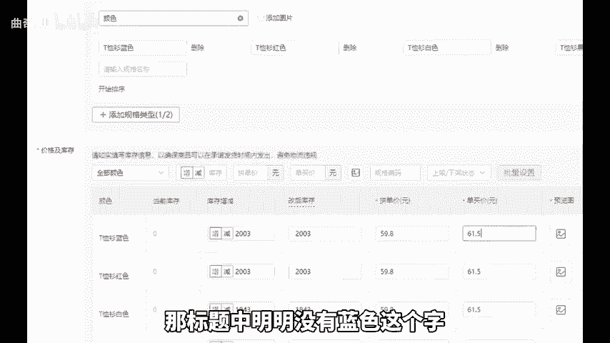
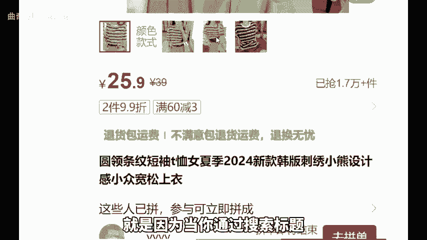
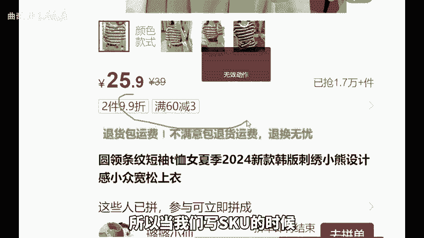
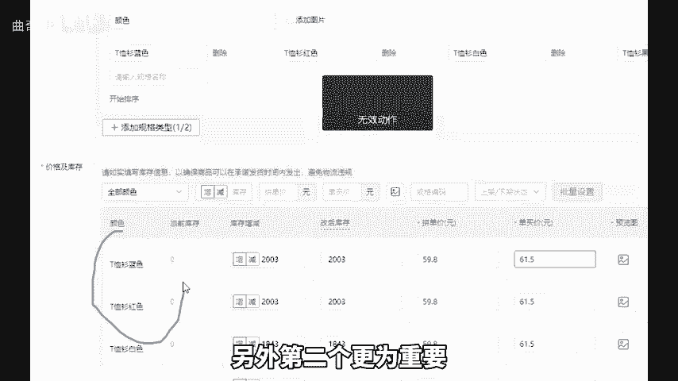
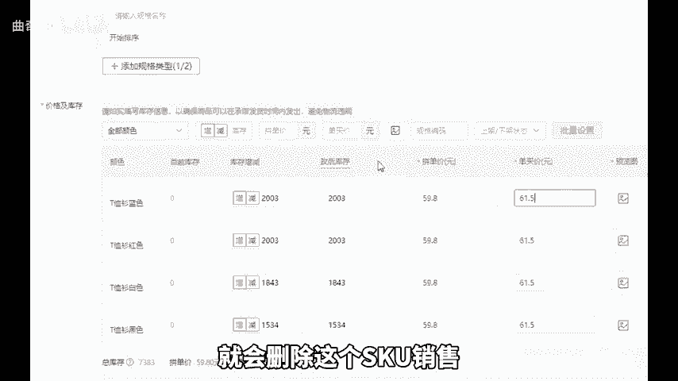
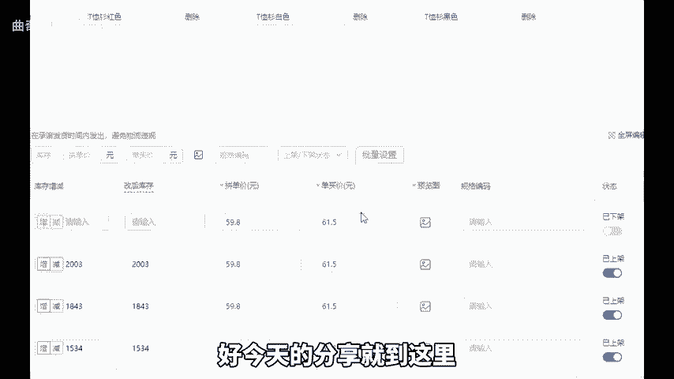

# 拼多多店铺SKU鲜为人知的两条规则！能加权的同时避免降流！ - P1 - 曲奇All - BV1XDsfegEzL

我们都清楚，拼多多的SQU常常是最容易出现问题的地方。很多商家朋友在更改SQU后断流，被比较后不知道如何倾斜SkuU也断流。今天这期视频呢我来分享两条关于Sku的规则。

能够及时的挽救你的店铺90%的商家朋友不知道。首先第一个SQ的文字会被纳入搜索范围。这意味着什么呢？我们都知道标题是最大的搜索渠道来源。而SQ的文字则是第二个搜索渠道来源。比如你搜索T恤衫蓝色。

那标题中明明没有蓝色这个字却依然能够显示结果，为什么会这样呢？就是因为当你通过搜索标题无法找到关键词的时候，系统会抓取你的Sku所以当我们写SQ的时候，如果你的行业热搜词叫托，也可以将其写入其中。

另外第二个更为重要SQ的权重是单独计算的。很多人在删除一个SQ后会发现链接突然不出单了。这是因为你删除SQ就会删除这个SQ销售所产生的权重，所以S不能去删除。如果因为一些。

特殊必要原因，一定要删除SQU可以把它下架，然后重新上架一个。这样一来这个SQU的权重才会得以保留，整个链接也不会降权。好，今天的分享就到这里，还有不懂的可以后台找我，或者为你解答。

还给你分享一份我整理的店铺综合运营包。

