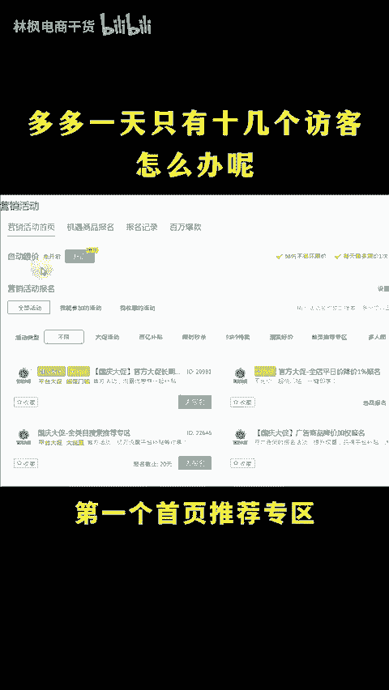
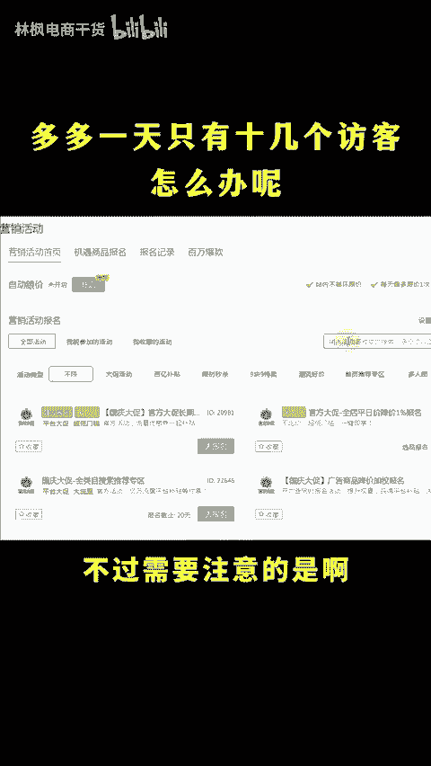

# 拼多多店铺一周只有几百访客新手怎么破局！ - P1 - 林枫电商干货 - BV1F4xQeqETt

做多多一天就只十几个访客怎么办呢？想要流量还不简单，做一下单，提升权重，然后开直通车去拉就是了，你有逼。😡，你有别怎么做店铺流量能快速起爆呢？30秒时间教会你点个关注，点个赞，实操教学。

🎼要知道，靠低价引来的访客，最后的结果就是亏本，坐店根本行不通。我们要去打开首页的这些免费的自然流量入口，开了就能够白拿流量。我现在新开的店铺啊，每天都有好几线的访客。

第一个首页推荐专区上首页流量续航活动，不需要比价也不需审核，原价就能上。不过需要注意的是，首页推荐活动，我们在活动这里直接搜是搜狐到的，必须要打开任意一个活动的详情页。

然后呢把这里的ID改成21967才会跳转的活动报名。但是除了这个还有智能营销新客立减爆款进价和多多视频，这些呢都是没有门槛就有爆关的入口。但然流量提升起来啊，你必须得承接住，不然流量爆发也只会昙花一现。

而影响转化的因素也就那么几个产品内功销量评价，先把产品内功做好新品内功没有做的话，转化D就很正常。先用这个工具零成本改个销量再输入同竞品的ID一键采集优质评价，然后呢上一波好评。

这样转化就能够提升呢工具没有的，看这里。😊。

