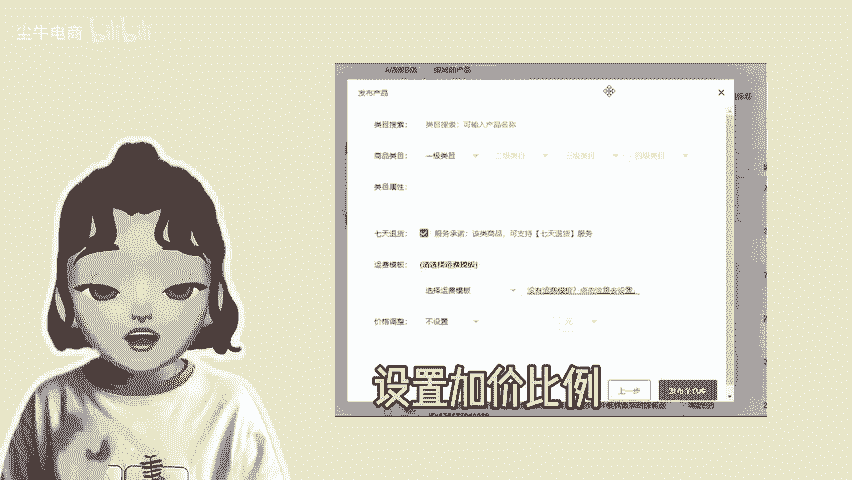

# 拼多多店铺上货，上传商品有哪些模式？ - P1 - 尘牛电商 - BV1KTsre2EzS

🎼多商家现在是怎么铺货的，有哪些可以参考的模式？首先第一个搬自己店铺的产品到另外一个店铺，直接在陈牛点击多平台上货，找到拼多多A般B这个页面就可以同步拼多多店铺的产品，并且将同步完成的产品，直接上货。

到另外一个店铺。第二个是上传其他平台的产品。也就是跨平台店铺上货，先登录其他平台的店铺，并且同步产品，接着在拼多多上货页面筛选需要上货的平台。最后一件铺货这些平台的产品，到拼多多店铺。

最后一种是无货源上货。这个需要商家先在阿里巴巴平台选好产品，并获取到这些产品的链接，然后在拼多多上货页面，同步添加阿里的产品，就可以完成上货。以上就是目前拼多多店铺上货，可以参考的模式。

店铺上货的配置页面都支持商家自行设置商品信息，设置加价比例，适合新手卖家铺货选择。😊。

