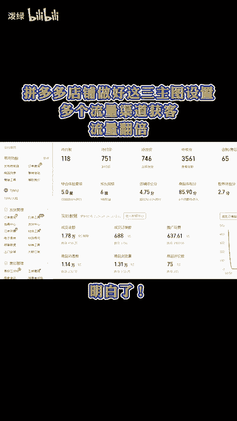
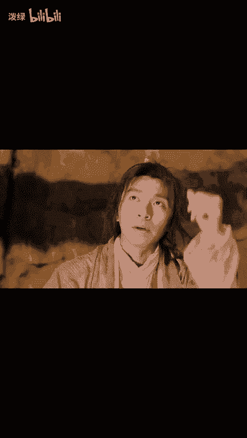
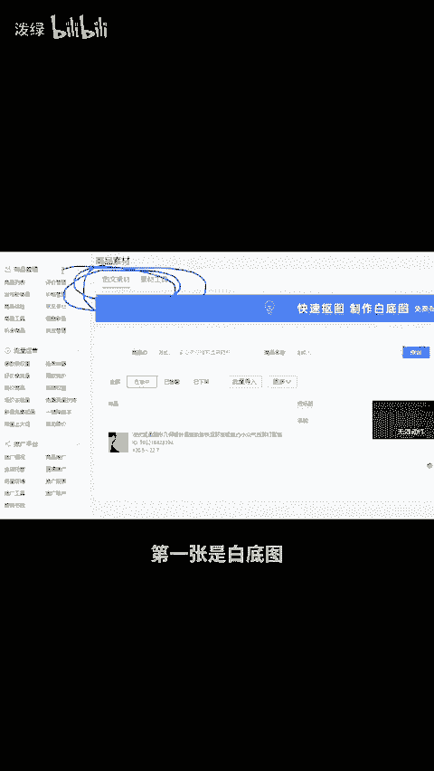
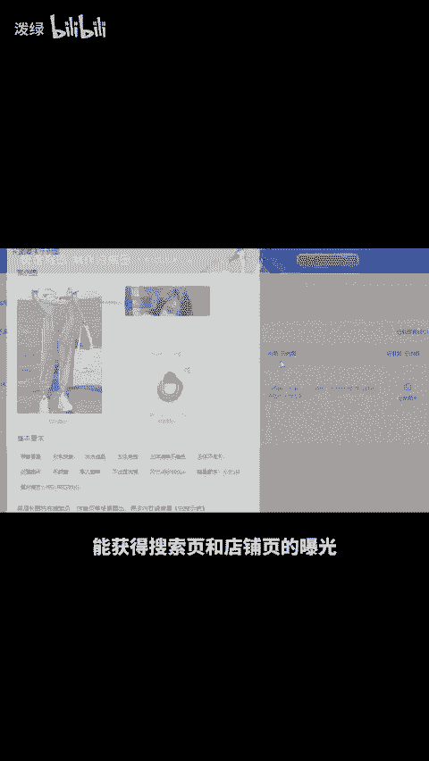
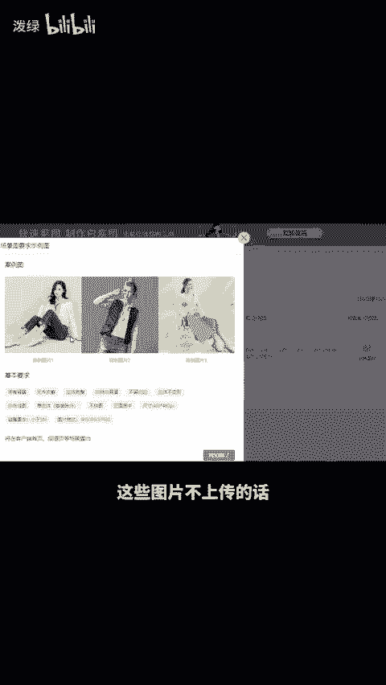
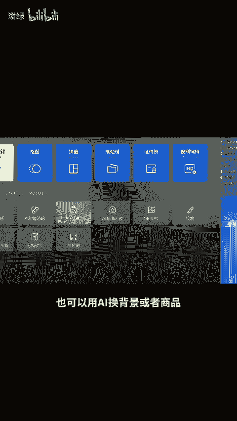
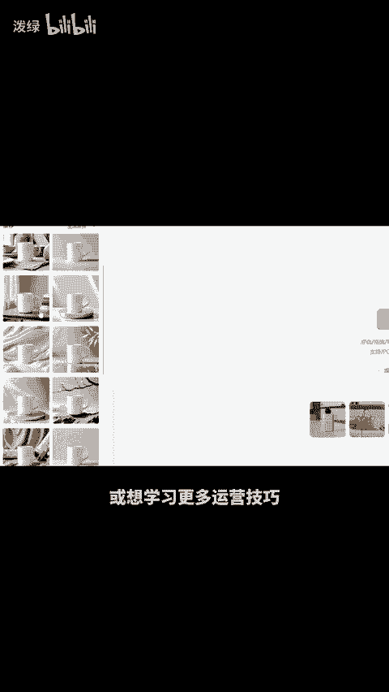

# 拼多多店铺做好这三主图设置，多个流量渠道获客！流量翻倍！ - P1 - 泼绿 - BV14N2wY3EZs

拼多多店铺做好这三主图设置，多个流量渠道获客，流量翻倍。明白，首先在后台找到商品素材，在图文素材这里可以看到，第一张是白底图，可以获得搜索分类页入口的流量。第二张是长图，能获得搜索页和店铺页的曝光。

第三张场景图能获得首页和频道页的流量。这些图片不上传的话，很多白底的流量，你就都浪费掉了。不会做图的也可以用切换背景或者商品AI扩图，花式生成模特图都可以，还有不会的，或想学习更多运营技巧。

留言888分享给你。😊。

