# 拼多多店铺商品推广开通的三大作用以及调试方式！ - P1 - 曲奇All - BV1pEsae7EBo

作为拼多多一定不要盲目开车，毫无目的的开车，纯属浪费。因此，我们在开车之前务必明确自己的目的。不同目的下，直通车的调试方式也各不相同。今天呢我来给大家分析清楚商品推广的三大作用。

也就是你开商品推广会考虑到的三大目的。第一个就是测试，包括测款测图测价格以及测试SkuU目的呢是找到数据良好的链接作为主推。如果是非标品可以多上链接，确保商品风格统一，价格段相对统一。

上车时统一出价以保本或微盈利的投产比为准。哪个链接统一限额，例如100块测试的数据判断也很简单，只需要观察投产比，哪个链接到二阶段没有断流，且投产比比较满意，就可以将它作为主推。

那如果是测试标品同样也很简单。我们可以设置不同的SKU和价格段，将主图设置的各不相同，统一上车，采用保本或微盈利的投产比统一限额100块，数据判断也是看投产比。很多朋友总认为低价一定好卖。实则不然。

所以对于标。

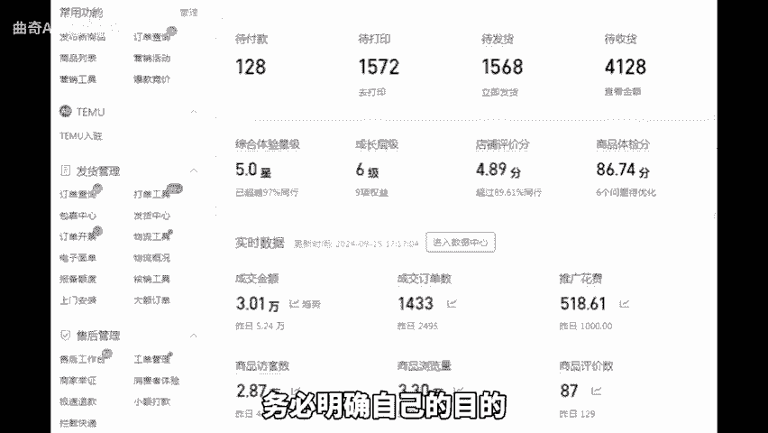

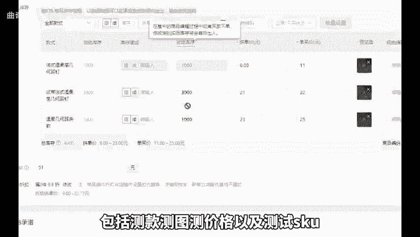

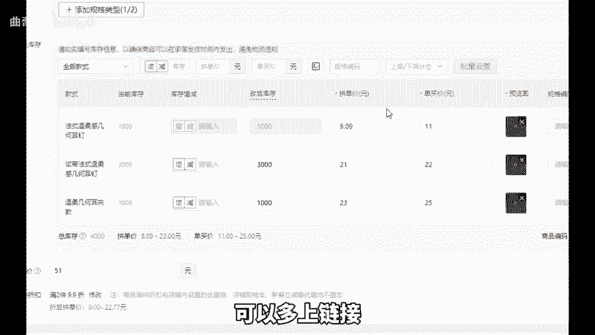

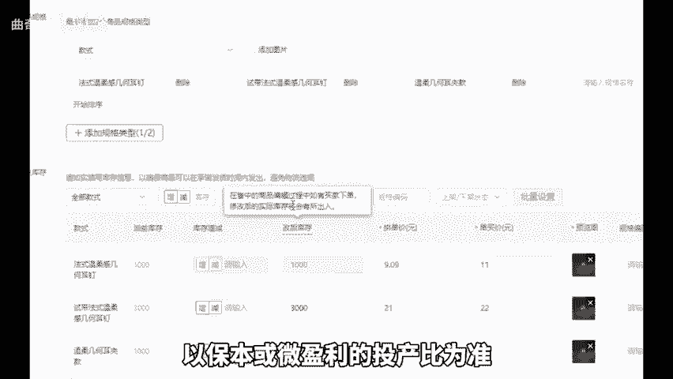

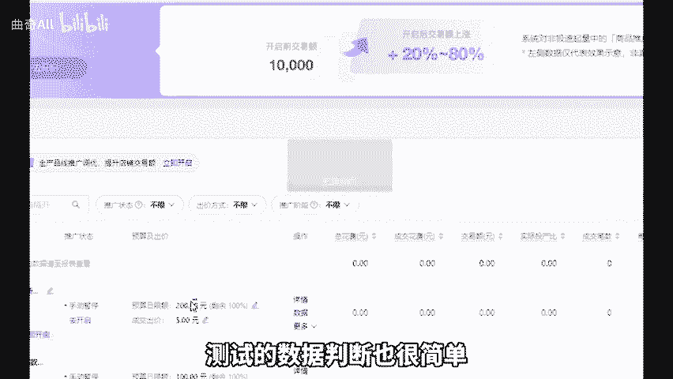

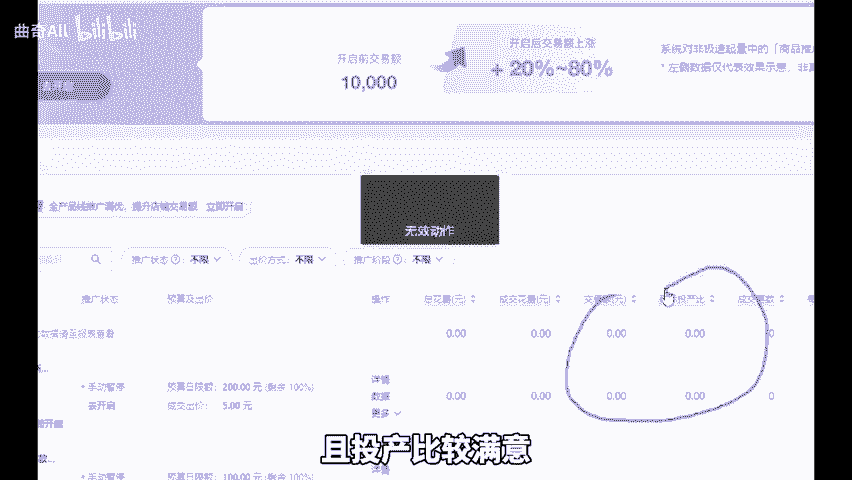

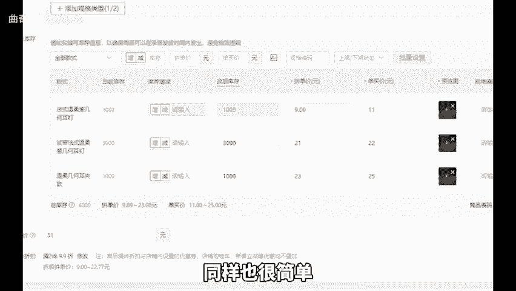

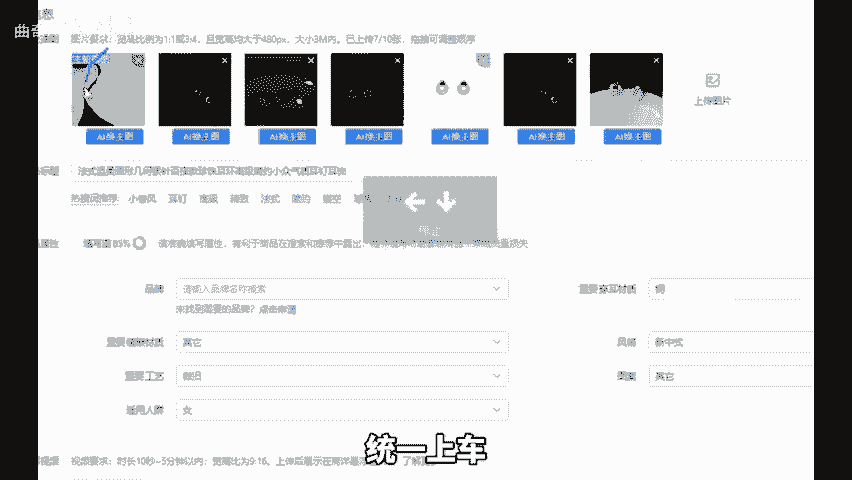

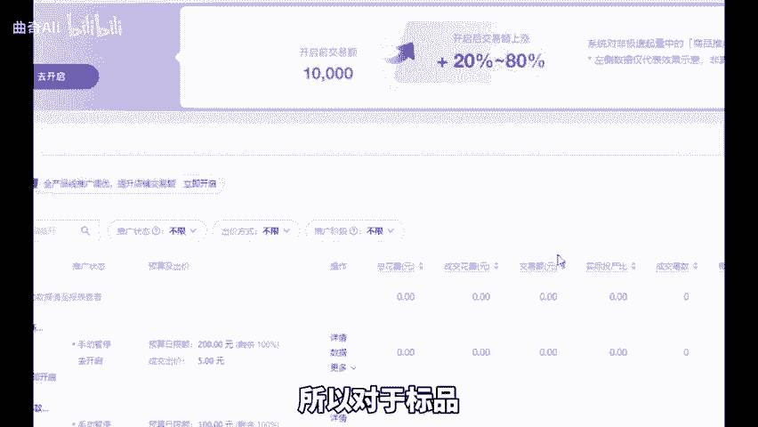

品可以设置多个价格段的相同链接去进行测试等测试完链接后，这个时候就需要去冲销量。我们知道对于新品而言，系统会考核点击率、转化率、坑产和增长率，所以在新品阶段，整体数据趋势应该要呈上升趋势，支付金额上升。

直通车的投入也应该整体去做递增，最少7天。因为如果数据还没稳定，就急于托价，很容易导致链接断流。其实托价很简单，等车子数据稳定后，提高投产比目的呢是降低单笔成交话费，而不是降低整体话费。

一定要把这件事情搞清楚。好，今天的分享就到这里，希望对你有帮助，还有不懂的可以后台找我。

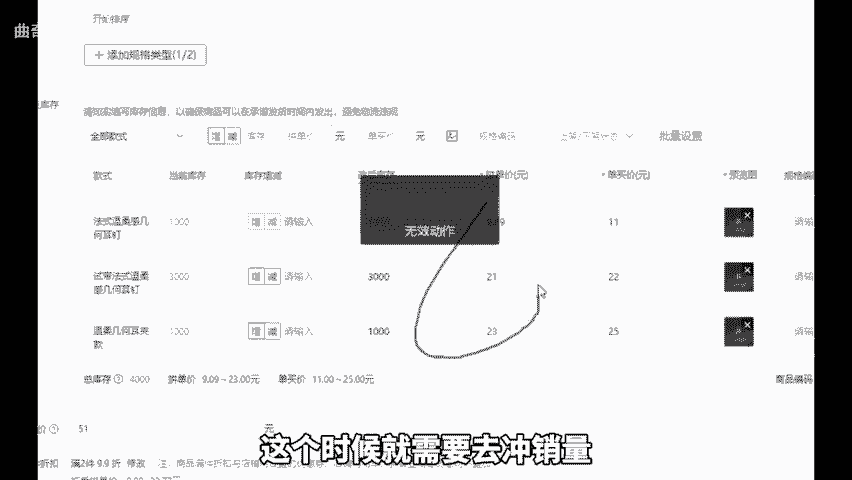

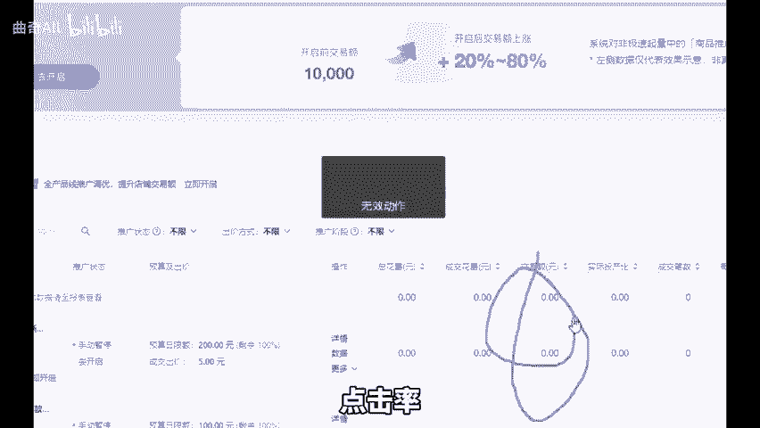

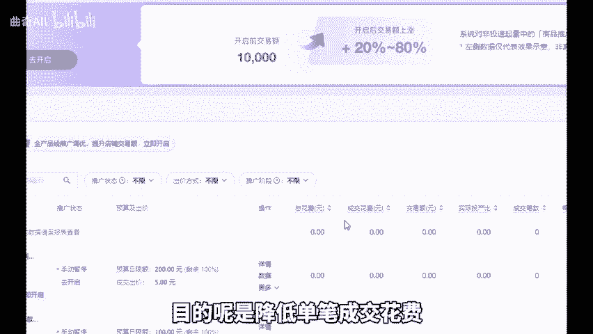

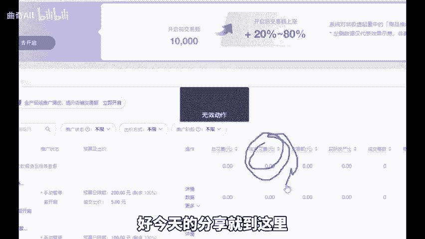