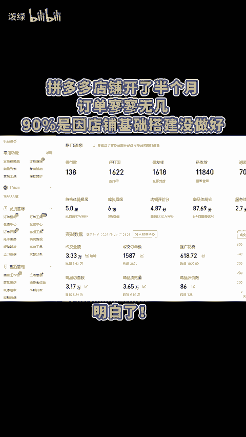
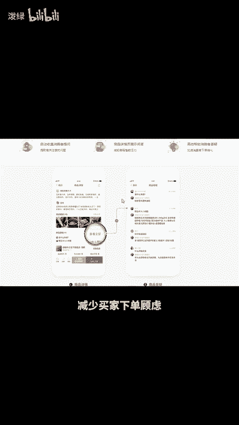
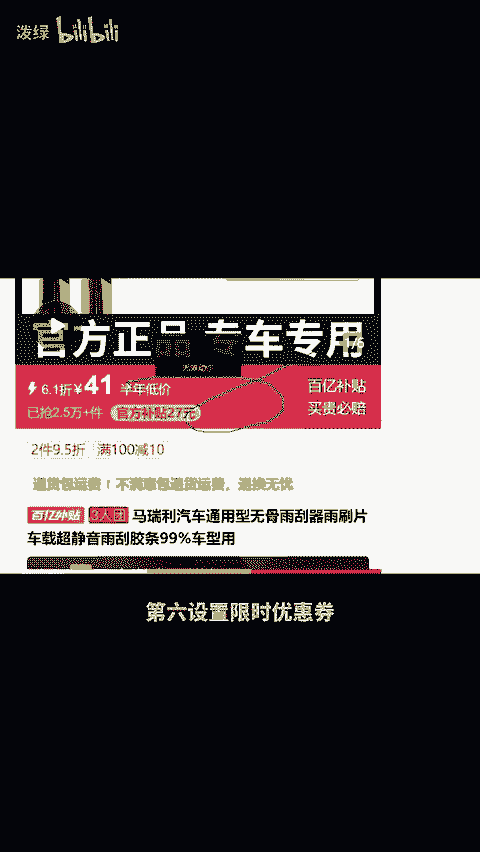
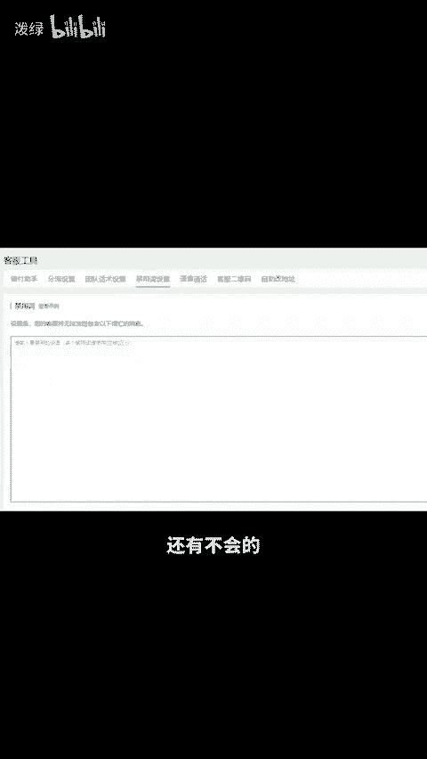

# 拼多多店铺开了半个月订单寥寥无几，90%是因为店铺基础搭建没做好！ - P1 - 泼绿 - BV1Y7xjedEHP

拼多多店铺开了半个月，订单寥寥无几，90%是因为店铺基础搭建没做好。明白首先打开店铺后台找到流量数据中的搜索流量，在次能看到整体商品搜索指数的区线图，若区线低于同行均值，就表明权重不足，需做好基础搭建。

以提高店铺权重。那么如何去做基础搭建的。首先，将店铺层级提升至三层，亦获取更多平台分流，其次，设置防跳出超链接，防止买家点击进入后看到更便宜的链接，降低被截流的风险。第三，设置矩阵关键词，扩大曝光渠道。

第四，设置商品答疑，减少买家下单顾虑。第五，设置行价心得，有效提升转化率。第六，设置限时优惠券，打上活动横幅。第七领取200元推广红包，打开直通车，扩大付费流量存量。第八，导入客服为禁词，避免高额罚款。

还有不会的，或想学习更多运营技巧，留言888分享给你。😡。

