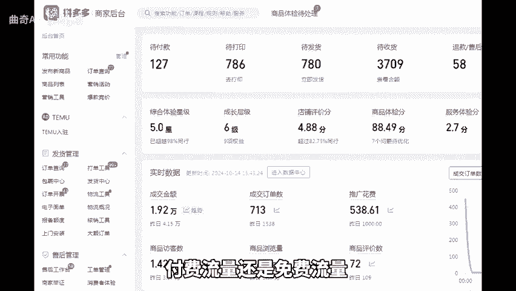
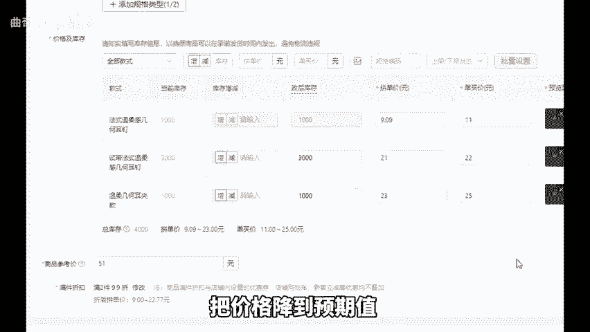
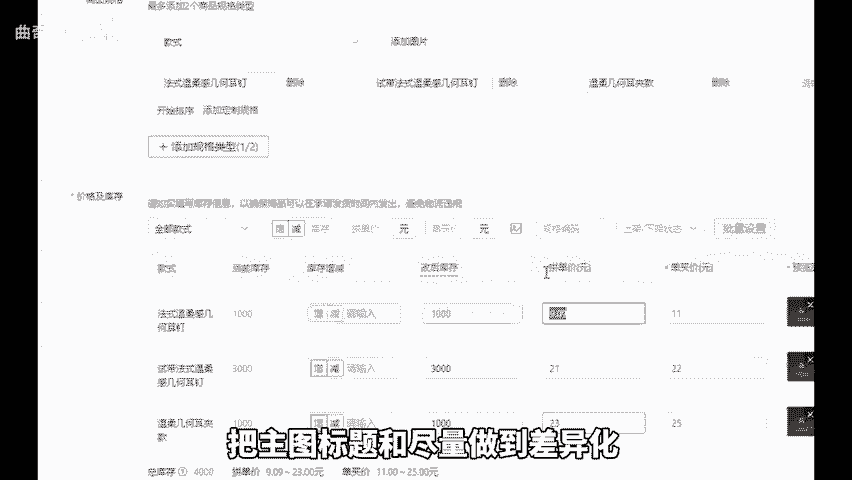
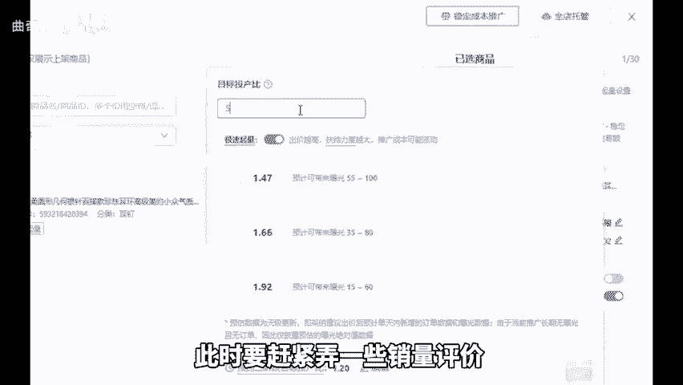
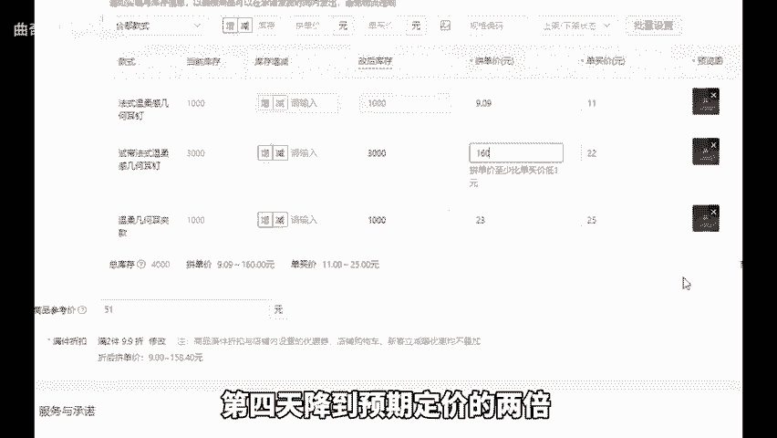
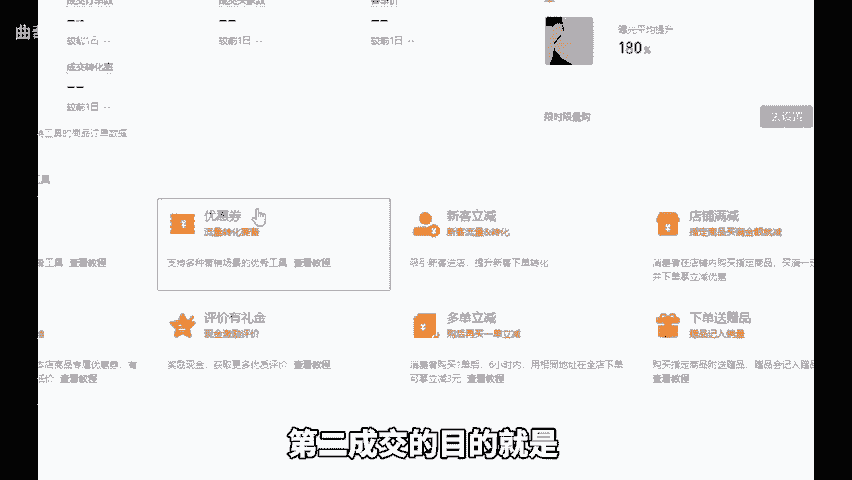
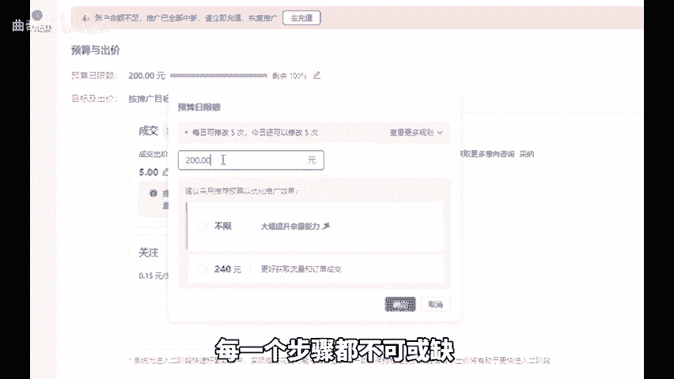

# 拼多多店铺新链接起爆付飞和免飞流亮的区别！ - P1 - 曲奇All - BV1goC2YYE46

当我们在拼多多想起一个新链接时，首先你要明确是要做付费流量还是免费流量。要知道具备正确的思路和方向，远比盲目虾操作要有效。在付费起新链接定价方面，要先将价格虚高，接着通过优惠券和限时限量购。

把价格降到预期值，同时上架5到10条链接，精心做好房比价，把主图标题和SKU尽量做到差异化，然后把这些链接全部投入直通车，设定一个十的投产之后找个买家号进行区下单，每个链接仅拍一件，第二天找两个账号。

按照这样的方式递增拍3天，把投产降到5，此时要赶紧弄一些销量评价，再重新去开直通车。这样直通车会更容易开起来。那对于自然起新链接，首先要定价2900拍一单。第二天降到1900再拍一单。

第三天定价900拍两单。第四天降到预期定价的2倍，再利用优惠券和限时限量购，把价格降到正常售价。下面来讲一下原理，第一，拼多多每次主动进行降价都会提升权重。第二，成交的目。

目的就是让平台记录价格。第三，连续进行5天的成交和降价操作，链接的权重和坑产会迅速累积起来。在这个时候去做一些销量评价，然后每天限额100到200来控制开车时间，获取自然流。要是一个链接效果不佳。

就换一个，因为总会有一些链接，运气不太好，这也是今年一直大力提倡裂变和矩阵思路的原因。在整个起链接的过程中，不管是付费还是自然。从定价到防比价，再到SQU规划以及创建链接，每一个步骤都不可或缺。好。

今天的分享就到这里，还有不懂的，可以后台找我。

