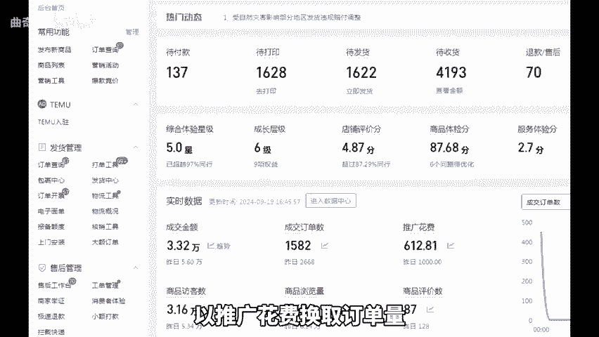
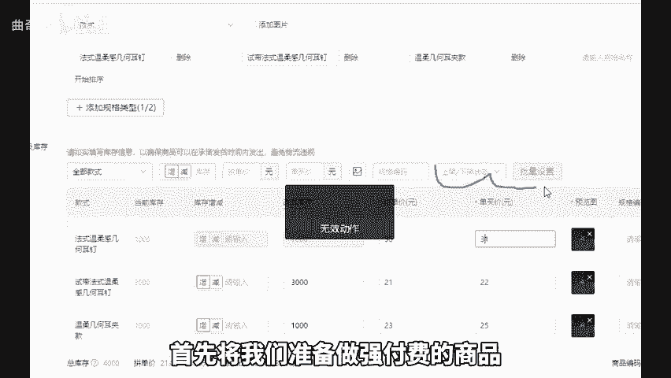
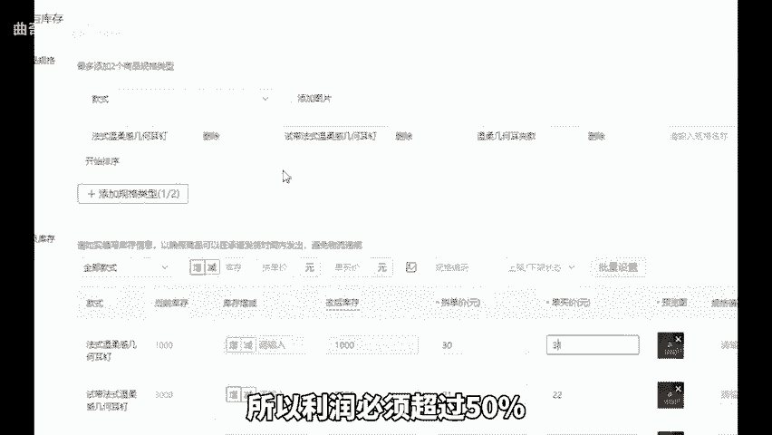
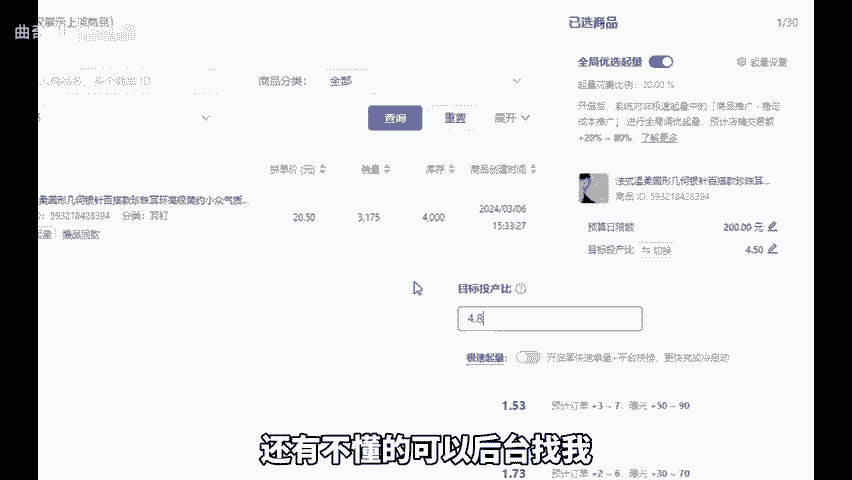

# 拼多多店铺最新强付费玩法！深度解说！ - P1 - 曲奇All - BV1oRxjehEEZ

今天呢给各位拼多多商家朋友们深入剖析一下拼多多最新的强付费玩法。我们都知道这套玩法有利有弊，好处在于强付费容易出单，以推广花费换取订单量，想要多少订单就有多少，但也会有推广花不出去的情况。

可以从产品本身找原因。如果不会也可以问我，坏处呢就是下单秒退的情况很多，比如一天20单却有12到15单秒退，且广告费照扣。如果这种情况持续3到5天以上了。那这个链接基本可以放弃，无需再拉伸。

毕竟推广成本不低，还有强付费后期的托价问题，前期可能保本，每天花费一两千0甚至3000的推广费，等托价的时候可能就花不出推广费或者直接断流。加上售后服务费扣点，基本就亏损的。

今天呢我将给大家分享一套全新的强付费玩法，点个关注点个赞，直接上实操。首先强付费的核心是高利润高推广费。比如成本15块。那售价至少要做到30左右才有50%的利润空间和操作空间。如果你能。

利润只有20%到30%，那更适合微付费或自然流。首先将我们准备做强付费的商品分成3个或5个链接。所以利润必须超过50%，然后全部上架破零，做100到200个销量。每个产品做20个左右评价。

完成后开启商品推广投产比模式，目标投产统一设置为4。5左右，打开急速起量。只要在7天内达到18单左右时就关闭极速起量。将投产比设为我们极速起量的值，并设置好日线额。另外，进入第二阶段没有断流的商品。

只要每天能正常上完日线额，就可以提高投产比。具体来说就是假设我们昨天下午两点前花完了200的日限额。今天下午4点前也花完了200的日线额，且能持续每天在晚上11点前烧完，就可以提高0。1或0。

2的投产比，一直操作到既能花完日线额又能盈利的零界值。最后就是放量，上完日限额后，第二天增加日线额，实现放量目的，强付费的思路就是这么简单。

花费较低，大家都可以去实操下。好，今天的分享就到这里，还有不懂的，可以后台找我，不是为你解答，还给你分享一份我整理的店铺综合运营包。

