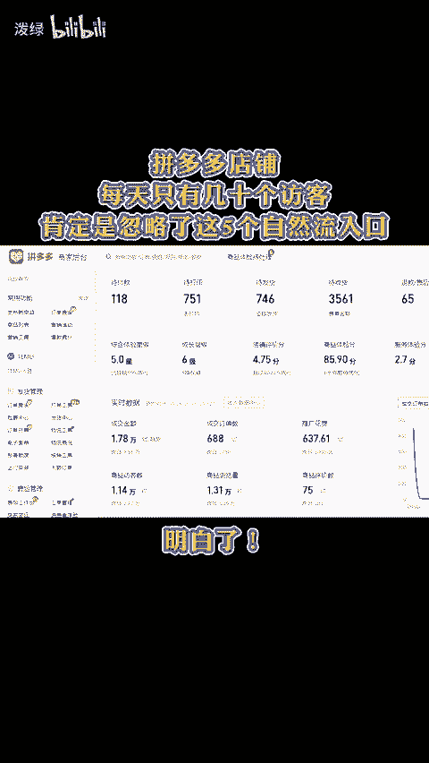
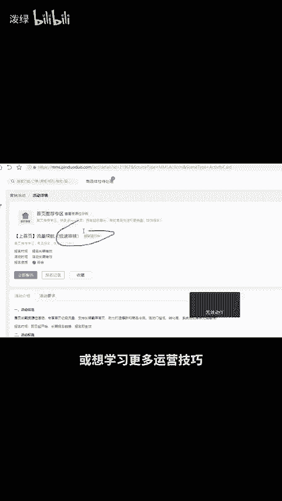

# 拼多多店铺每天只有几十个访客肯定是忽略了这五个自然流入口！ - P1 - 泼绿 - BV1eb23Y1Ee4

拼多多店铺每天只有几十个访客，肯定是忽略了这5个自然流量入口。明白首先我们到营销活动界面搜索21824这个超级满减活动，近期流量很高。第二个是省钱月卡，除了有自然流外。

低科呆想快速拉销量上评价也非常好用。黑5还能去用。第三个是店铺营销里的新课粒减，也是最常用的控制价格还能拉流量的工具。第四个是多多视频，流量超大，但是建议在买家端发布，不会的可以扣6，找我要实操流程。

最后一个活动是21967。这个活动必须用网页版后台找一个活动点进去，把活动的ID改掉才能报名。还有不会的或想学习更多运营技巧，留言888分享给你。😊。

