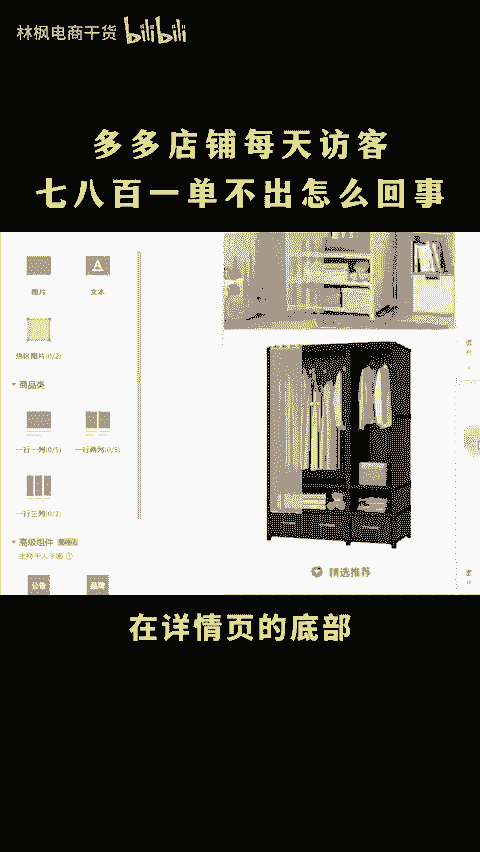
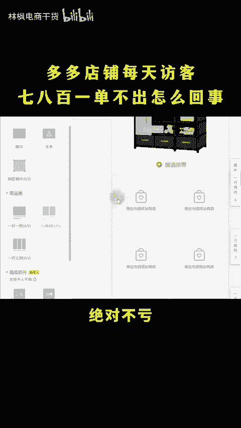
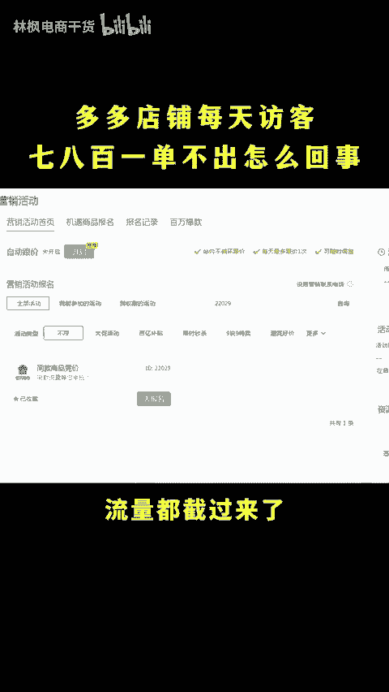

# 拼多多店铺每天进访客不出单怎么回事？ - P1 - 林枫电商干货 - BV1RY2PYfEW2

做多多店铺每天访客七八百，一单不出，怎么回事？那肯定是你定价太高了，没人愿意当冤大头就出现了，只看不买了，烦死了。😡，店铺每天几百的访客不转化怎么办？内功没有问题的话，多半就是被同行截走了。

只需要做好这两个操作，轻松截回来，直接上实操。

后台打开商品列表，找到链接，点编辑，下滑打开桌求上详，在详情页的底部添加一个精选推荐的图片，添加商品类标签，一行两列多加几行，然后把自己的产品和图片都给它放上去。

这样买家看起来详情页下方推荐的同款价格也都一样，就不会跳走的。即便点击这些商品也都是我们自己的链接绝对不亏。设置好之后再去营销活动，报名活动2。29报名这个活动就可以把你的产品啊展示在同行商详上方。

同时呢打上同款低价。这样主头再弄的高端一点，就能够截走同行的流量。只要你做好销量评价，流量都截过来了，就能够转化。更多运营技巧，看这里。😊。

