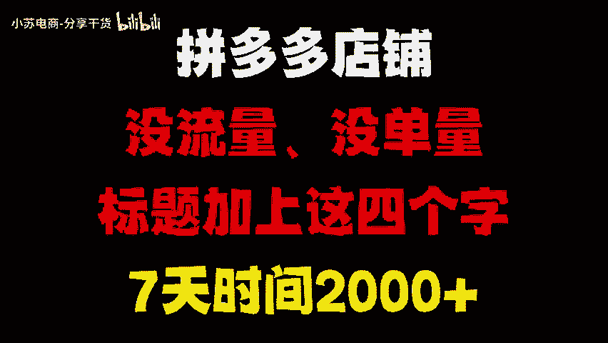
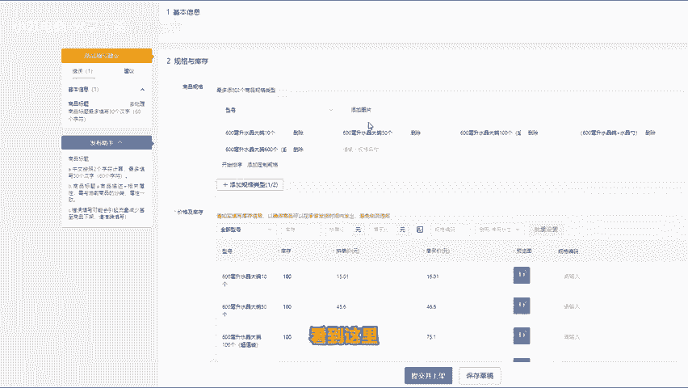

# 拼多多店铺没流量，没单量，标题加上这四个字，七天时间2000+，拼多多运营，拼多多运营思路，拼多多运营实操教程，拼多多开店，拼多多新店如何快速做起来 - P1 - 小苏电商-分享干货 - BV18LmjY9Eng

拼多多店铺没流量，没单量，教你一招，你只要在标题前面加上4个字，店铺就能快速获取流量和提升单量，链接也能直接起飞。这个技巧只要你的标题搭配好营销手段，就能够获得平台的免费推流。那么接下来的操作。

一定要仔细听认真学。如果说你看完这个视频还是不太懂的话，我也准备了各个类目的实操文档评论区自取，你也可以根据实操文档来操作。接下来我们开始操作。首先第一步打开我们的商家后台在发布商品的时候。

千万不要直接点击发布新商品这里去发布，我们要先找到商品列表，然后从机会商品入口这里去发布同款商品进来之后，我们点击消费者正在搜这个入口，选择好你的二级类目，然后排序这里按热度去排序，再发布同款。

这里我们要选择热度高的产品去发布，就能够获得新品标以及机会商品标。那么在上传同款的时候，一定要手动编辑修改你的主图标题SKU这三个地方。首先主图我们点进来之后，看到这里只有一张图片。

那我们自己可以做几张码柄图片上去。因为商品默认的图片呢，我们只需要留一张就可以了。然后进行第二步操作。这一步非常关键，做好这一步，你的自然流量才能。

拉开差距，就是在我们标题前面加上新客立减或者首单直降这四个字，我们把这四个字配合接下来的操作，在店铺营销里面找到营销工具，然后点击新客立减。我们看到这里有一个自定义创建，点进来之后。

选择你刚才上架的产品，然后优惠券设置2块钱，点击创建完成就可以了。创建完成之后，这个链接有三重加实机会，机会商品标营销文案，新客立减券就有群重还能提高转化。当然了，到这里还没有结束。

最后一步反比价SKU反比价，大家可以直接利用AI反比价工具，把这道SKU全部导入进来，系统会自动给你生成反比价的规格，然后我们再搬运到店铺里面的SKU里面去就行了。看到这里，如果说还有什么不懂的。

可以拿实操文档。

