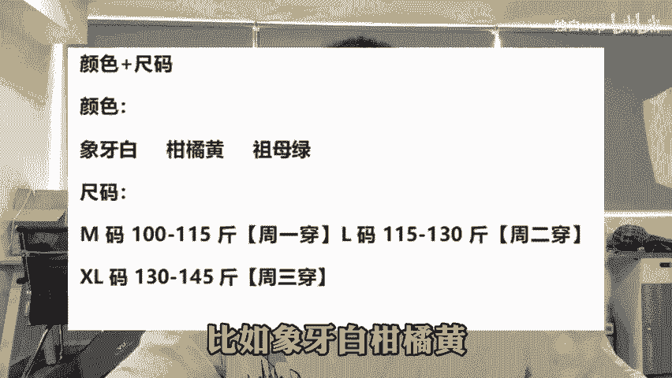
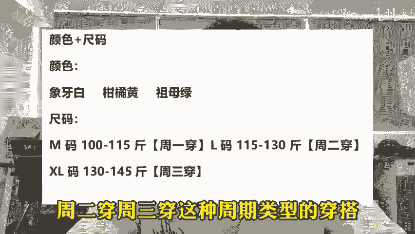

# 拼多多店铺被卡在十单如何破局？ - P1 - 独白uup - BV1V5xjefEDN

🎼最近有不少商家向我反馈啊，店铺被锁投产了，或者是订单呢卡在实单上不去了。其实遇到这种情况，大概率就是店铺被比价了。那么这个时候呢咱们也千万不要盲目的去提投产，或者说呢增加日线额。

到最后说不定啊不但没有解决比价问题，反而呢单量还会下调。正确的做法呢一定要先去洗一下SQ首先我们在商品列表呢可以看到商品的最右边有一个下架按钮，然后再去编辑商品找到商品规格。

把规格的款式里面的量词和形容词啊替换一下规格图片也要换新的，最好就是一个规格对应一个图片，这样呢很大程度上啊避免同行比价，具体的操作方法其实也很简单，比如做百货的黄本架模板。因为客单价比较低。

我们就用活动倒计时加件数，加送赠品的格式去改做服装的防架模板呢，因为颜色款式都大差不差。大家都是用通用的颜色，找到白色黄色绿色等等，我们就换一个形容词。

比如象牙白柑橘黄祖母绿之类的款式的话就不用什么大麻。😊。

🎼女装公主裙这种通俗的文字，换成周一穿周二穿、周三穿这种周期类型的穿搭。这样呢我们既能够防美假，还能够紧跟时代潮流，更适用于年轻人。

